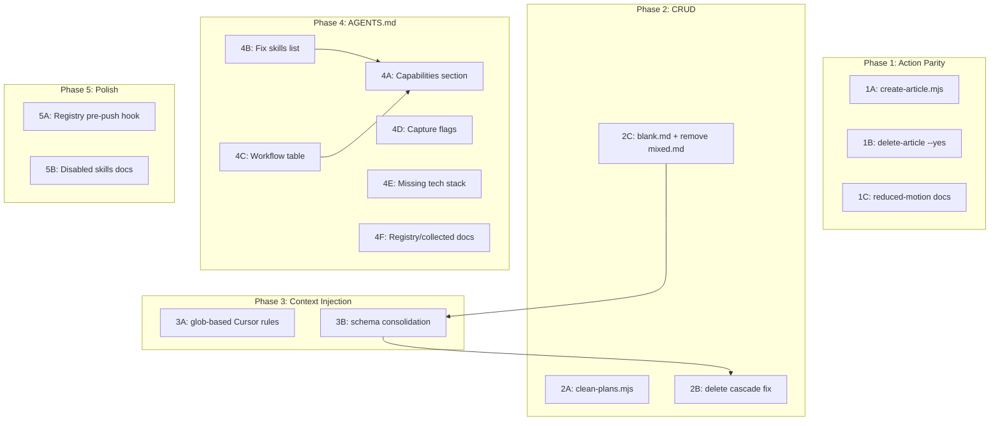

# Agent-Native Architecture Audit Remediation Plan

Based on the full 8-principle audit (81% overall score), this plan addresses every actionable finding, organized by impact and dependency order.

---

## Phase 1: Action Parity Fixes (Score: 89% -> ~98%)

### 1A. Non-interactive article scaffolding

**Gap**: `npm run new:article` is interactive-only (plop). Agents can't scaffold articles.

**Create** `scripts/create-article.mjs` following the exact `[scripts/create-experiment.mjs](scripts/create-experiment.mjs)` pattern:

- Accept `--name <slug>` (required) and `--description "text"` (optional, defaults to empty)
- Validate: experiment directory `src/app/experiments/(<slug>)` must exist
- Validate: `article/page.tsx` must NOT already exist in the experiment route
- Import `node-plop`, get the `"article"` generator from `[plopfile.js](plopfile.js)` (lines 145-175)
- Call `generator.runActions({ name, description })` bypassing interactive prompts
- The generator creates 8 files + modifies `experiment.json` to add `content.article: true`

**Add npm script** to `[package.json](package.json)`:

```json
"new:article:auto": "node scripts/create-article.mjs"
```

### 1B. Article deletion --yes flag

**Gap**: `[scripts/delete-article.mjs](scripts/delete-article.mjs)` has no `--yes` flag, always prompts interactively.

**3 changes** to `delete-article.mjs`, copying the pattern from `[scripts/delete-experiment.mjs](scripts/delete-experiment.mjs)` lines 9-11 and 89-109:

1. Replace line 9 (`const experimentName = process.argv[2]`) with args parsing + `forceFlag`
2. Extract the deletion logic (lines 71-131) into a `doDelete()` function
3. Wrap readline in `if (forceFlag) { doDelete(); } else { /* existing readline */ }`

### 1C. Document reduced-motion testing procedure

**Gap**: Visual QA skill has `prefers-reduced-motion respected` as a checklist item with no testing method.

**Add a "Reduced Motion Testing" section** to `[.agents/skills/visual-qa/SKILL.md](.agents/skills/visual-qa/SKILL.md)` explaining how to use browser-devtools execute tool:

```js
await page.emulateMedia({ reducedMotion: 'reduce' });
// Then take screenshot to verify all content is visible without animation
await page.emulateMedia({ reducedMotion: 'no-preference' }); // reset
```

---

## Phase 2: CRUD Completeness Fixes (Score: 23% -> ~50%)

### 2A. Plans cleanup script

**Gap**: 52 plan files in `.cursor/plans/` with no cleanup mechanism. Stale plans accumulate.

**Create** `scripts/clean-plans.mjs`:

- Scan `.cursor/plans/*.plan.md`
- Parse YAML frontmatter to extract `todos[].status`
- Classify each plan: all-completed, has-in-progress, all-pending, mixed
- In interactive mode: list plans with age, completion %, and prompt for deletion
- With `--yes`: auto-delete plans where all todos are `completed` or `cancelled`
- With `--older-than <days>`: additionally delete plans older than N days regardless of status
- Print summary: deleted count, remaining count, freed size

**Add npm script**: `"clean:plans": "node scripts/clean-plans.mjs"`

### 2B. Delete-experiment cascade fix

**Gap**: After `delete:experiment`, registry indices (`index.json`, `index-slim.json`), `llms.txt`, and `llms-full.txt` remain stale.

**Modify** `[scripts/delete-experiment.mjs](scripts/delete-experiment.mjs)` to auto-run regeneration after deletion:

- After the 4 directory deletions, run `generate:registry` and `generate:llms-txt` automatically
- Or at minimum, run the index-regeneration step only (faster than full pipeline)
- This closes the cascade gap diagram where 4 of 8 artifacts go stale after deletion

### 2C. Agent knowledge scaffolding

**Gap**: 50+ files in `.agents/` with no create/delete tooling. No `blank.md` profile. Orphaned `mixed.md`.

**Create** `.agents/profiles/blank.md` -- minimal profile doc:

```markdown
# Blank Profile

No specialized guidance. Use AGENTS.md defaults and general code style rules.
Experiments with this profile have no toolkit integration, no scroll setup, no 3D scene.
```

**Delete** `.agents/profiles/mixed.md` -- orphan file. The `mixed` value is not in `VALID_PROFILES` in any of the 3 validation sources (`validate-experiments.mjs`, `create-experiment.mjs`, `experiments.ts`). It can never be assigned.

**Defer**: Full `new:agent-doc` scaffolder is lower priority. The bigger wins are the profile fix and AGENTS.md documentation updates.

---

## Phase 3: Context Injection Fixes (Score: 78% -> ~90%)

### 3A. Create glob-based Cursor rules

**Gap**: Zero `.cursor/rules/*.mdc` files exist. Domain rules require manual reads.

**Create 6 rule files** in `.cursor/rules/`:


| File              | Globs                                                                                            | Content                                                                                                                                                                              |
| ----------------- | ------------------------------------------------------------------------------------------------ | ------------------------------------------------------------------------------------------------------------------------------------------------------------------------------------ |
| `experiments.mdc` | `src/app/experiments/`**, `src/components/experiments/`**, `public/experiments/**`               | Read `.agents/rules/experiments.md` before editing. Check `experiment.json` profile and read matching `.agents/profiles/<profile>.md`.                                               |
| `animations.mdc`  | `src/components/experiments/**/*.tsx`                                                            | Read `.agents/rules/animations.md`. Check for GSAP imports and read `.agents/skills/gsap-modern/SKILL.md`. Check for Motion imports and read `.agents/skills/motion-react/SKILL.md`. |
| `r3f.mdc`         | `**/*Canvas*`, `**/*Scene*`, `**/r3f.tsx`, `**/@react-three/**`                                  | Read `.agents/rules/r3f.md` and `.agents/skills/r3f-core/SKILL.md`.                                                                                                                  |
| `shaders.mdc`     | `**/*.glsl`, `**/*.frag`, `**/*.vert`, `**/shaders/**`, `**/Shader*`                             | Read `.agents/rules/shaders.md` and `.agents/skills/shader-authoring/SKILL.md`.                                                                                                      |
| `scroll.mdc`      | `**/toolkit/scroll*`, `**/Scroll*`, `**/useLenis*`, `**/useScroll*`                              | Read `.agents/rules/scroll.md` and `.agents/skills/lenis-scroll/SKILL.md`.                                                                                                           |
| `registry.mdc`    | `src/components/collected/**`, `public/registry/**`, `scripts/*registry*`, `content/registry/**` | Registry pipeline context. Note the 4-step generation pipeline. Reference `memory.md` registry facts.                                                                                |


Each file uses the format from the audit's investigation:

```yaml
---
globs: ["pattern1", "pattern2"]
alwaysApply: false
description: "One-line trigger description"
---
(markdown content with read instructions)
```

### 3B. Consolidate schema enums into single source of truth

**Gap**: `VALID_PROFILES`, `VALID_STATUSES`, `VALID_COMPLEXITIES` are duplicated in 4 files.

**Create** `src/lib/experiment-schema.mjs` (ESM for Node script compatibility):

```javascript
export const VALID_STATUSES = ["wip", "shipped", "archived"];
export const VALID_PROFILES = ["r3f-scene", "r3f-shader", "scrollytelling", "interaction", "dom-effect", "web-audio", "blank"];
export const VALID_COMPLEXITIES = ["beginner", "intermediate", "advanced"];
export const REQUIRED_FIELDS = ["title", "description", "slug"];
```

**Update 3 consumers**:

- `[scripts/validate-experiments.mjs](scripts/validate-experiments.mjs)` -- import from `../src/lib/experiment-schema.mjs`
- `[scripts/create-experiment.mjs](scripts/create-experiment.mjs)` -- import from `../src/lib/experiment-schema.mjs`
- `[src/lib/experiments.ts](src/lib/experiments.ts)` -- import and derive types: `export type ExperimentProfile = typeof VALID_PROFILES[number]`

---

## Phase 4: AGENTS.md Documentation Overhaul

### 4A. Add Capabilities section

**Gap**: No "what can I do?" self-description mechanism. Discovery score 80%.

**Add `## Capabilities` section** after the intro (line 3 of AGENTS.md), before Commands:

```markdown
## Capabilities

| Category | What I can do |
|----------|---------------|
| Experiments | Scaffold, develop, port external demos, delete, visual QA |
| Content | Write articles, generate docs, publish multi-format content |
| Generation | Registry JSON/MDX, poster images, llms.txt, screenshots |
| Quality | Typecheck, lint, test, validate schemas, 8-category visual QA |
| Domain expertise | GSAP, Lenis scroll, Motion, R3F, shaders, Tempus RAF |
| Meta | Learn from past sessions, manage backlog, parallel orchestration |
```

### 4B. Fix skills list (3 missing)

**Gap**: AGENTS.md lists 8 skills. 11 active skills exist on disk.

**Update line ~223** to add the 3 missing skills:

```
- gsap-modern, lenis-scroll, motion-react, r3f-core, shader-authoring, tempus-raf, visual-qa, porting-demos, continual-learning, quick-component, vercel-react-best-practices
```

### 4C. Convert workflow list to table with descriptions

**Gap**: Workflows listed as comma-separated names with no descriptions.

**Replace lines ~226-227** with a table using descriptions extracted from each workflow's YAML frontmatter:


| Workflow                 | Description                                                    |
| ------------------------ | -------------------------------------------------------------- |
| new-experiment           | Create a new isolated experiment with all required scaffolding |
| develop-experiment       | Work on an existing experiment following isolation rules       |
| publish-experiment       | Multi-format content generation for publishable experiments    |
| add-experiment-component | Create a new component within an existing experiment           |
| add-experiment-assets    | Add images, 3D models, fonts, or other static assets           |
| cleanup-experiment       | Remove an experiment and all its associated files safely       |
| visual-qa                | Systematic visual validation process for AI agents             |


### 4D. Document capture script flags

**Gap**: `npm run capture <slug>` has 5 undocumented flags.

**Update the Generation section** in AGENTS.md to show:

```bash
npm run capture <slug>         # Playwright screenshot
# Flags: --delay <ms>, --scroll <percent>, --viewport <WxH>,
#   --full-page, --og (generates OG image 1200x630)
```

### 4E. Add missing tech stack entries

**Gap**: 10+ significant dependencies missing from the tech stack table.

**Add entries for** the most impactful omissions:

- `fumadocs-core` / `fumadocs-ui` / `fumadocs-mdx` -- registry docs system
- `leva` ^0.10 -- dev controls via `useDevControls`
- `@react-three/postprocessing` ^3.0 -- R3F post-processing
- `tunnel-rat` ^0.1 -- DOM portals for R3F

### 4F. Document registry pipeline and collected/ pattern

**Gap**: AGENTS.md has no mention of the registry route group or collected components.

**Add to Project Structure section**:

```
src/app/(registry)/           # Registry docs route group (fumadocs)
src/components/collected/     # Ported components (quick-component skill output)
content/registry/             # Generated MDX docs (gitignored, build-time)
```

---

## Phase 5: Remaining Polish

### 5A. Add registry regeneration to pre-commit

**Gap**: Registry JSON goes stale during development.

**Add to `[lefthook.yml](lefthook.yml)`** a post-commit or pre-push hook:

```yaml
pre-push:
  commands:
    regenerate-registry:
      run: npm run generate:registry
```

This ensures registry freshness at push boundaries without slowing down every commit. Alternatively, add it to the existing pre-commit parallel group.

### 5B. Clean up disabled skills folder

**Gap**: `.agents/skills/_disabled/` convention is undocumented.

**Add a note** to the `.agents/` reference section in AGENTS.md:

```markdown
**Disabled skills**: `.agents/skills/_disabled/` -- archived skills no longer auto-discovered
```

---

## Dependency Graph




Phases are largely independent and can be executed in parallel, except:

- Schema consolidation (3B) should happen before delete cascade fix (2B) since both touch validation logic
- Profile fixes (2C: blank.md, remove mixed.md) should happen before schema consolidation (3B)
- AGENTS.md items (4B, 4C) can be batched into a single edit pass

---

## Expected Score Impact


| Principle              | Before  | After    | Change                                                      |
| ---------------------- | ------- | -------- | ----------------------------------------------------------- |
| Action Parity          | 89%     | ~98%     | +9% (close 2 hard gaps, 2 partial)                          |
| Tools as Primitives    | 100%    | 100%     | (already perfect)                                           |
| Context Injection      | 78%     | ~90%     | +12% (glob rules, schema consolidation)                     |
| Shared Workspace       | 91%     | 91%      | (no changes needed)                                         |
| CRUD Completeness      | 23%     | ~50%     | +27% (plans cleanup, cascade fix, profiles)                 |
| UI Integration         | 85%     | ~88%     | +3% (pre-push registry regen)                               |
| Capability Discovery   | 80%     | ~95%     | +15% (capabilities section, missing skills, workflow table) |
| Prompt-Native Features | 100%    | 100%     | (already perfect)                                           |
| **Overall**            | **81%** | **~89%** | **+8%**                                                     |


---

## Investigation Appendix

### File counts and sizes (verified)

- `.cursor/plans/`: 52 files, ~700KB, git-tracked
- `.agents/skills/`: 11 active + 1 disabled folder (6 files)
- `.agents/workflows/`: 7 files
- `.agents/rules/`: 6 files
- `.agents/profiles/`: 7 files (missing `blank.md`, orphan `mixed.md`)
- `.agents/artifacts/`: 32 files from 3 orchestration runs
- `public/registry/`: 69 JSON files
- `scripts/`: 14 `.mjs` files

### Version drift (verified: no meaningful drift)

All AGENTS.md tech stack versions match `package.json` at major.minor level. No urgent version sync needed.

### Schema enum duplication (verified: 4 files)

- `scripts/validate-experiments.mjs` lines 16-27
- `scripts/create-experiment.mjs` lines 27-36
- `src/lib/experiments.ts` lines 5-32
- `AGENTS.md` line 21 (prose, will always be separate)

### Article plop generator (verified: 2 prompts, 9 actions)

- Prompts: `name` (validated: experiment must exist, article must not) and `description` (optional)
- Creates 8 files: `page.tsx`, `content.mdx`, `components.tsx`, `lab-note.md`, `architecture.md`, `snippet.md`, `social.md`, `changelog.md`
- Modifies `experiment.json`: adds `content.article: true`

### Delete cascade gap (verified)

After `delete:experiment`, 4 artifacts go stale: `index.json`, `index-slim.json`, `llms.txt`, `llms-full.txt`. The console prints a reminder but doesn't auto-regenerate.

### Capture script flags (verified: 5 undocumented)

`--delay <ms>`, `--scroll <percent>`, `--viewport <WxH>`, `--full-page`, `--og`