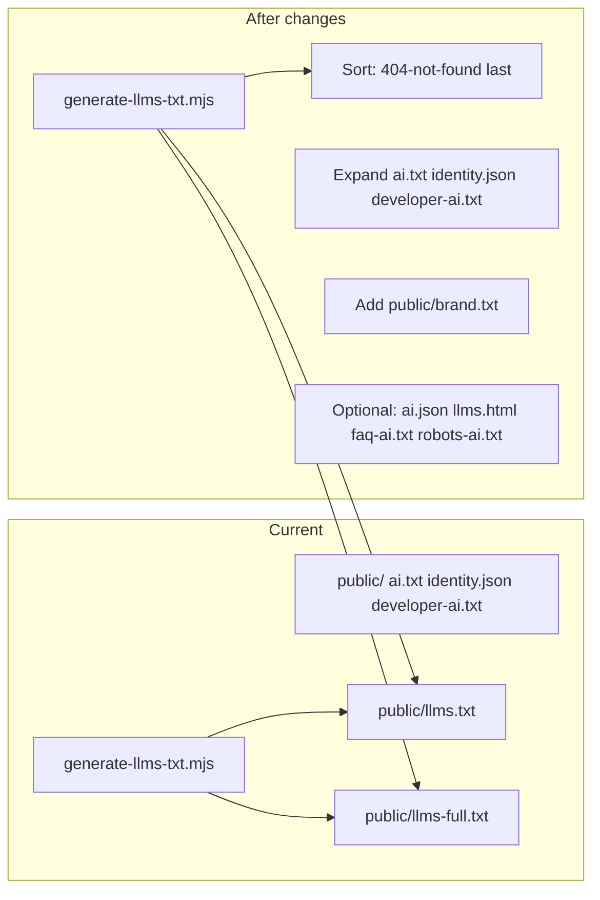

# AI Visibility Check Report — Verification and Improvements

## 1. Report verification: what the checker is seeing

| File                 | Report                                    | Actual in repo                                                                                                                                 | Verdict                                                                                                                                                                                                                                                              |
| -------------------- | ----------------------------------------- | ---------------------------------------------------------------------------------------------------------------------------------------------- | -------------------------------------------------------------------------------------------------------------------------------------------------------------------------------------------------------------------------------------------------------------------- |
| **ai.json**          | 404                                       | Not present                                                                                                                                    | Correct. Optional (Complete tier); we can add.                                                                                                                                                                                                                       |
| **ai.txt**           | 200, too_short (405 chars)                | [public/ai.txt](public/ai.txt) — 12 lines, ~405 chars                                                                                          | **Correct.** Checker expects ≥500 chars.                                                                                                                                                                                                                             |
| **identity.json**    | 200, too_short (378 chars)                | [public/identity.json](public/identity.json) — compact JSON, 378 chars                                                                         | **Correct.** Checker expects ≥500 chars.                                                                                                                                                                                                                             |
| **llm.txt**          | 308, 0 length                             | We redirect `/llm.txt` → `/llms.txt` (301 in [next.config.ts](next.config.ts) L121–126).                                                       | Checker follows redirect; 308 may be Vercel normalization. **OK.**                                                                                                                                                                                                   |
| **llms.html**        | 404                                       | Not present                                                                                                                                    | Correct. Optional; we can add.                                                                                                                                                                                                                                       |
| **llms.txt**         | 200, text/plain, 5923 bytes, **soft_404** | Served from [public/llms.txt](public/llms.txt), generated by [scripts/generate-llms-txt.mjs](scripts/generate-llms-txt.mjs). Content is valid. | **False positive.** Root cause: experiments are sorted by **title** (L84), so "404 Not Found" (experiment + article) appears **first** in Articles and Experiments. Heuristics that look for "404" / "Not Found" in the body will flag this as a generic error page. |
| **robots.txt**       | 200, no issues                            | [src/app/robots.ts](src/app/robots.ts)                                                                                                         | **Correct.**                                                                                                                                                                                                                                                         |
| **brand.txt**        | 404                                       | Not present                                                                                                                                    | Correct. Checker marks HIGH priority; we should add.                                                                                                                                                                                                                 |
| **developer-ai.txt** | 200, placeholder_content                  | [public/developer-ai.txt](public/developer-ai.txt) has real tech stack and API links.                                                          | Checker likely expects explicit **business name + contact** and "who this is" blurb; we have "Razi's Experiments Lab" but no 1–2 sentence identity/contact. **Expand.**                                                                                              |
| **faq-ai.txt**       | 404                                       | Not present                                                                                                                                    | Optional (LOW). We can add.                                                                                                                                                                                                                                          |
| **robots-ai.txt**    | 404                                       | Not present                                                                                                                                    | Optional; checker warns "no control over AI systems". We can add.                                                                                                                                                                                                    |

**Summary:** The checker is seeing the right status codes and content lengths. The only incorrect conclusion is **llms.txt soft_404** — we are serving the real file; the ordering of content triggers a false positive.

---

## 2. Generation pipeline (what we generate vs static)

- **Generated at build:** [scripts/generate-llms-txt.mjs](scripts/generate-llms-txt.mjs) → `public/llms.txt`, `public/llms-full.txt` (run via [scripts/generate-all.mjs](scripts/generate-all.mjs)).
- **Static (hand-maintained):** `public/ai.txt`, `public/identity.json`, `public/developer-ai.txt`. They are **not** produced by any script, so lengths and wording are manual.

To avoid drift and meet length/quality rules, we can either (a) expand static content in place, or (b) add a small generator (e.g. from [scripts/lib/site-config.mjs](scripts/lib/site-config.mjs) + constants) for ai.txt / identity.json / brand.txt. Recommendation: **expand in place** for ai.txt and identity.json; **add** brand.txt and optionally a script later if we want single source of truth.

---

## 3. Recommended changes (by priority)

### HIGH (report recommendations)

- **Fix llms.txt soft_404 (false positive):** In [scripts/generate-llms-txt.mjs](scripts/generate-llms-txt.mjs), change sort so the experiment with slug `404-not-found` (or title "404 Not Found") is **last** in the list. That way the first lines of llms.txt are no longer "404 Not Found". Example: after `experiments.sort((a, b) => a.title.localeCompare(b.title))`, move any experiment with `slug === '404-not-found'` to the end of the array.
- **Add brand.txt:** Create [public/brand.txt](public/brand.txt) per [AI Visibility brand.txt spec](https://www.ai-visibility.org.uk/specifications/brand-txt/): brand name, how to refer to the site/person, preferred wording. Keeps AI summaries consistent (report: "Without brand voice guidance, AI summaries may use inconsistent terminology").
- **Replace “placeholder” in developer-ai.txt:** In [public/developer-ai.txt](public/developer-ai.txt), add a short **Identity** block at the top: who this is (Razi Syed / Razi's Experiments Lab), 1–2 sentences, and contact (e.g. email + llms.txt). Keep existing Tech Stack and Content API sections.

### MEDIUM (length and quality)

- **Expand ai.txt to ≥500 characters:** Add 2–4 sentences: e.g. what the site is (creative coding lab), scope (experiments, articles), and reiterate canonical URL and attribution. Stay within [ai.txt spec](https://www.ai-visibility.org.uk/specifications/ai-txt/) (permissions, attribution, link to llms.txt).
- **Expand identity.json to ≥500 characters:** Add fields that are both valid and useful: e.g. `@type: "Person"`, `givenName`, `familyName`, or a short `knowsAbout` array (e.g. creative coding, WebGL, React). Minimize whitespace so the JSON stays compact but over 500 chars. Align with [identity.json spec](https://www.ai-visibility.org.uk/specifications/identity-json/) and Schema.org.

### LOW (optional files)

- **ai.json:** Add [public/ai.json](public/ai.json) if we want machine-readable AI guidance (spec: [ai-json](https://www.ai-visibility.org.uk/specifications/ai-json/)). Can mirror ai.txt permissions/attribution in JSON form.
- **llms.html:** Add a human-readable HTML page (e.g. [src/app/llms.html/route.ts](src/app/llms.html/route.ts) or static export) that presents the same identity/summary as llms.txt with Schema.org markup. Spec: [llms-html](https://www.ai-visibility.org.uk/specifications/llms-html/).
- **faq-ai.txt:** Add [public/faq-ai.txt](public/faq-ai.txt) with 3–5 Q&As (e.g. "What is this site?", "How to cite?", "How to get experiment list?"). Spec: [faq-ai-txt](https://www.ai-visibility.org.uk/specifications/faq-ai-txt/).
- **robots-ai.txt:** Add [public/robots-ai.txt](public/robots-ai.txt) with AI crawler directives (allow/disallow) in robots.txt syntax. Gives explicit control for AI agents; can align with [src/app/robots.ts](src/app/robots.ts). Spec: [robots-ai-txt](https://www.ai-visibility.org.uk/specifications/robots-ai-txt/).

---

## 4. Docs and pipeline

- **docs/seo.md:** Update the "AI Discovery Files" table (around L147–161) to mark `brand.txt` as implemented once added; add ai.json, llms.html, faq-ai.txt, robots-ai.txt to the table with status "—" or "✓" as we add them. Optionally add a short "AI Visibility Check" subsection noting the checker URL and that llms.txt soft_404 can be a false positive when an experiment title contains "404 Not Found".
- **generate:all:** No change required unless we add a script to generate ai.txt / identity.json / brand.txt; then wire it into [scripts/generate-all.mjs](scripts/generate-all.mjs) and document in [docs/deploy.md](docs/deploy.md) and [docs/scripts.md](docs/scripts.md).

---

## 5. Flow summary

---

## 6. Out of scope / no change

- **llm.txt 308 vs 301:** No code change; behavior is correct (redirect to llms.txt).
- **robots.txt:** No change; already passing.
- **Content quality of experiments/articles:** Report explicitly does not assess page content or SEO effectiveness; no action from this report.

Implementing the HIGH and MEDIUM items will address the report’s recommendations and the false positive; adding LOW items will improve File Coverage and Signal Quality on the next run.