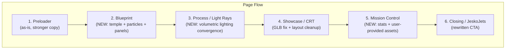

# Announcing V2: Content + Visual Enhancement (v2)

## Architecture

**Removed:** InversaSection, FiddleHoverSection, heroShader.ts, and all associated hooks/CSS/data.

---

## Section Details

### 1. Preloader (keep as-is, update copy)

No visual changes. The counter + clip-path reveal + SplitText animations are strong on their own.

**Content tweaks in `data.ts` (`PRELOADER_CONTENT`):**

- `header`: "Experiments" -> manifesto-level (e.g. "The Lab, Rebuilt")
- `footerItems`: More specific (e.g. ["Creative Coding", "AI-Partnered", "2026"])
- `navLinks`: Update to match final page sections

**Files:** `[data.ts](src/components/experiments/announcing-v2/data.ts)` only

---

### 2. Blueprint (NEW -- replaces Inversa)

Inspired by Sutera.ch's "Blueprint Reality" mode. A dark-themed technical blueprint section with a central 3D element surrounded by data panels.

**Visual layers:**

- **Background:** Dark (`#0a0a0a`) with faint white/gray grid lines + cross markers at intersections. Measurement labels along axes (like Sutera's "0m, 15m, 30m..."). CSS-based.
- **Central R3F Canvas:** The floating temple model (`temple.glb`, 7.2MB, 7.3K triangles) rendered in the center. Subtly rotating. Lit with directional + ambient light.
- **Particle cloud:** Dense point cloud fog (~3000-5000 particles) swirling around the temple in orbital/tendril patterns. Reacts to cursor position (particles are attracted/repelled by mouse). Vertex shader drives motion using FBM noise + time + cursor uniform. Ethereal, wispy, constantly moving.
- **Technical readout panels:** HTML overlays positioned around the R3F canvas, styled as bordered monospace boxes with labels. Mix of stats and philosophy.

**Panel layout (adapted from Sutera's Blueprint mode):**

- **Top-left area:** Section title ("THE PRACTICE") + manifesto line
- **Left panel:** "Why Creative Coding" -- code as creative medium, art meets engineering. Small diagram/icon.
- **Right panel:** Stats readout -- experiment count, shader count, technologies used. Styled as data readout with bordered cells.
- **Bottom-left:** "AI Partnership" -- scaffolded by AI, refined by hand. The process pillars.
- **Bottom-right:** "Ship or It Didn't Happen" -- every experiment to production quality. Brief bio-style box.

**Scroll behavior:** Pinned via ScrollTrigger. Progressive reveal:

1. Grid lines draw in (CSS stroke-dasharray animation triggered by scroll)
2. Temple model fades in + particles begin swirling
3. Panels fade in sequentially (left, right, bottom) as scroll progresses
4. At full reveal, section unpins and natural scroll resumes

**Particle shader uniforms:**

- `time` -- continuous animation
- `mousePosition` -- vec2 from Zustand store (already exists)
- `scrollProgress` -- for intensity/spread changes
- `noiseScale`, `noiseSpeed` -- tunable via dev controls

**New files:**

- `sections/BlueprintSection.tsx` (~150 lines) -- HTML layout + R3F Canvas
- `sections/blueprint-section.css` (~150 lines) -- grid, panels, reveal animations
- `canvas/TempleScene.tsx` (~120 lines) -- R3F: temple model + particle cloud + lighting + camera
- `shaders/particleSwirl.ts` (~60 lines) -- vertex/fragment for cursor-reactive particles

**Assets:** `temple.glb` already at `public/experiments/announcing-v2/temple.glb` (7.2MB, CC Attribution by wawa on Sketchfab)

---

### 3. Process / Volumetric Light Rays (NEW -- replaces Morphogenesis concept)

An R3F scene with volumetric raymarched light beams using techniques from [Maxime Heckel's volumetric lighting article](https://blog.maximeheckel.com/posts/shaping-light-volumetric-lighting-with-post-processing-and-raymarching/). Beams converge as you scroll, revealing content.

**Visual concept:**

- 2-3 cone-shaped volumetric light beams rendered via a custom post-processing Effect
- Abstract procedural geometry in the scene (columns, arches, simple boxes) for the light to interact with and cast shadows through
- Beams start scattered/divergent at scroll 0%, then rotate/reposition to converge on a focal point by scroll 100%
- Content text appears where beams converge -- the light literally illuminates the words

**Technical approach (from Maxime's article):**

- Custom `VolumetricLightingEffect` extending pmndrs `postprocessing` `Effect` class
- Fragment shader performs raymarching from camera through each pixel
- Uses SDF cone shapes for light volume (`sdCone`)
- Shadow mapping via dedicated `lightCamera` + FBO depth texture
- Henyey-Greenstein phase function for realistic scattering
- Beer's Law for transmittance/absorption
- Blue noise dithering for performance (50 steps instead of 250)
- FBM noise for fog/atmosphere density variation

**Scroll interaction:**

- ScrollTrigger pins the section
- `scrollProgress` uniform drives light beam direction vectors (lerp from scattered to converged)
- At convergence (progress ~0.8-1.0), content text fades in via HTML overlay
- Content: 3-phase reveal -- "Scaffolded by AI" / "Refined by Hand" / "Shipped with Intent"

**New files:**

- `sections/ProcessSection.tsx` (~100 lines) -- section wrapper + R3F Canvas + HTML overlay
- `sections/process-section.css` (~80 lines)
- `canvas/VolumetricLightScene.tsx` (~200 lines) -- R3F scene: geometry, light cameras, FBOs, effect
- `shaders/volumetricLight.ts` (~150 lines) -- raymarching fragment shader with shadow mapping
- `data.ts` additions: `PROCESS_CONTENT`

**Dependencies to check:** `postprocessing` and `@react-three/postprocessing` -- verify they're installed.

---

### 4. Showcase / CRT (fix GLB + layout cleanup)

**GLB investigation:**

- `monitor.glb` (41MB) has valid `glTF` magic bytes but throws `JSON content not found`
- `new-monitor.glb` (387KB) also has valid `glTF` magic bytes -- much more reasonable size
- **Plan:** Try `new-monitor.glb` first. If it loads, update the path in `CRTMonitor.tsx` and adjust the screen mesh positioning/scale to match the new model's geometry. Verify the CRT shader screen overlay and hover texture swap still work.
- If the original `monitor.glb` is needed: investigate whether the 41MB size causes Next.js static asset serving issues (check `next.config` for size limits, try `gltf-transform` compression).

**Layout cleanup:**

- Move the inline `<style>` block from `ShowcaseSection.tsx` into a proper `showcase-section.css` file
- Clean up the project list: better spacing, typography, hover states
- Fix wrap behavior on narrower screens

**Files:** `[ShowcaseSection.tsx](src/components/experiments/announcing-v2/sections/ShowcaseSection.tsx)`, `[CRTMonitor.tsx](src/components/experiments/announcing-v2/canvas/CRTMonitor.tsx)`, new `sections/showcase-section.css`

---

### 5. Mission Control (NEW -- user provides assets)

A retro-futuristic instrument panel displaying lab statistics. NASA ground control meets CRT phosphor aesthetic.

**ASSET REQUEST -- items to provide before building this section:**

The visual elements (gauges, oscilloscope, LED displays) are UI/CSS/SVG work, but the overall aesthetic needs grounding in reference material:

1. **Mood/reference images (2-3):** Screenshots or links showing the specific control panel aesthetic you want. Options to search for:
  - NASA Apollo-era mission control photography
  - Retro CRT terminal interfaces (amber or green phosphor)
  - Sci-fi movie control panels (Alien, 2001, Interstellar)
  - Dieter Rams / Braun instrument panel design
2. **Background texture (optional):** A subtle noise/grain texture for the panel background, or a photo of actual control panel surface. If not provided, I'll use CSS noise.
3. **Color direction:** Phosphor green (#33ff33), amber (#ffaa00), cool blue (#4488ff), or mixed? This sets the entire section mood.

**Planned visual elements (once assets/direction confirmed):**

- Analog gauges (SVG + GSAP needle animation)
- Oscilloscope trace (canvas 2D or shader)
- LED segmented digit displays (CSS)
- CRT scan-line overlay (CSS, reusing crtShader concepts)
- Grid lines + technical callouts

**Stats to display:** experiments shipped, custom shaders, technologies used, components built

**New files (after assets received):**

- `sections/MissionControlSection.tsx` (~180 lines)
- `sections/mission-control-section.css` (~150 lines)

---

### 6. Closing / JeskoJets (rewrite content)

Visual mechanics stay (window zoom parallax, sky background). Content gets rewritten.

**Content rewrite in `data.ts` (`JESKOJETS_CONTENT`):**

- `headerLeft.title`: compelling invitation (e.g. "Explore the Lab")
- `headerLeft.description`: what awaits the visitor
- `headerRight`: "razisyed.cv" with direct link
- `copy`: final statement about the ongoing practice -- not a conclusion, an invitation
- `outroText`: resonant closing, not "End of view"

**Files:** `[data.ts](src/components/experiments/announcing-v2/data.ts)`

---

## Removals

| File                                                           | Reason                         |
| -------------------------------------------------------------- | ------------------------------ |
| `sections/InversaSection.tsx` + `inversa-section.css`          | Replaced by Blueprint section  |
| `hooks/useInversaScroll.ts`                                    | No longer needed               |
| `sections/FiddleHoverSection.tsx` + `fiddle-hover-section.css` | Removed from page              |
| `hooks/useFiddleGrid.ts`                                       | No longer needed               |
| `shaders/heroShader.ts`                                        | Broken, user requested removal |
| `INVERSA_CONTENT` in data.ts                                   | Replaced by BLUEPRINT_CONTENT  |
| `FIDDLE_CONTENT` + `GRID_SYMBOLS` in data.ts                   | No longer needed               |

Assets to clean up (optional): `mask.svg`, `grid-overlay.svg`, `inversa-hero-img.jpg`, `fiddle-img.jpg` -- no longer referenced.

---

## Asset Inventory

| Asset                     | Status           | Used by                  |
| ------------------------- | ---------------- | ------------------------ |
| `temple.glb` (7.2MB)      | Provided         | Blueprint section        |
| `new-monitor.glb` (387KB) | Provided         | Showcase/CRT section     |
| `monitor.glb` (41MB)      | Investigate      | Showcase/CRT fallback    |
| `death.jpg`               | Exists           | Preloader hero image     |
| `sky.jpg`                 | Exists           | JeskoJets sky background |
| `window.png`              | Exists           | JeskoJets window frame   |
| `previews/`*              | Exists           | Showcase experiment list |
| Mission Control assets    | **PENDING USER** | Mission Control section  |

---

## Implementation Order

1. **Removals** -- delete old sections, hooks, shaders, data
2. **Content rewrite** -- update data.ts with all new content
3. **GLB fix** -- investigate monitor loading, try new-monitor.glb
4. **Blueprint section** -- temple + particles + panels (heaviest new work)
5. **Process section** -- volumetric light rays (most technically complex)
6. **Showcase cleanup** -- extract CSS, fix layout
7. **Mission Control** -- build after user provides asset direction
8. **Orchestrator update** -- wire new section order in AnnouncingV2.tsx
9. **Verify build** -- tsc + build pass

