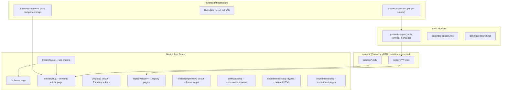

# Experiments Lab Architecture Restructuring

## Current State Diagnosis

The lab has grown organically through v1 (legacy experiments) and v2 (registry, Fumadocs, collected components). The result is solid in many areas but has accumulated structural debt across five key dimensions:

### 1. Two Parallel MDX Systems

The biggest architectural fracture. Two completely independent MDX pipelines that share no infrastructure:

- **Fumadocs MDX** (build-time compiled, `content/registry/`, typed schemas, search integration) -- powers the registry docs
- **next-mdx-remote** (runtime compiled, scattered in experiment route groups, gray-matter parsing) -- powers experiment articles

Each has its own component map, rendering path, frontmatter schema, and discovery mechanism. This means:

- Two sets of MDX component overrides to maintain (`mdx-components.tsx` vs `src/components/mdx/components.tsx`)
- Two content discovery patterns (Fumadocs source loader vs filesystem scanning in `articles.ts`)
- No cross-content search (registry is searchable, articles are not)
- next-mdx-remote bundles the MDX compiler to the server at runtime instead of pre-compiling at build time

### 2. Hand-Written Article Pages

Each of the 3 article pages (`404-not-found`, `basketball-replay-center`, `send-button`) is a bespoke file that:

- Manually imports `experiment.json`
- Manually constructs OG metadata
- Manually wires per-article demo components into MDXRemote
- Manually injects JSON-LD structured data
- Manually calls `getArticleContent()` and `getAdjacentArticles()`

This is ~130 lines of boilerplate per article that varies only in which custom demo components are injected. Scaling to 15+ articles with this pattern is untenable.

### 3. Dead and Conflicting Dependencies

- `**@fumadocs/story`** (^0.0.11) -- its barrel export pulls `node:fs/promises`, breaking Turbopack client bundling. Story files exist but cannot be used in MDX. The CSS import and factory config are dead code.
- `**next-mdx-remote`** + `**gray-matter`** + `**reading-time-estimator**` -- the entire article runtime stack, replaceable by Fumadocs
- `**@theatre/core**` + `**@theatre/r3f**` -- animation authoring tool; unclear if actively used by any shipped experiment
- `**@react-spring/three**` -- overlaps with motion and gsap; check if any experiment depends on it

### 4. CSS Token Duplication (3 Sources of Truth)

The same color palette is defined in three places:

1. `src/app/shared-tokens.css` -- raw HSL CSS variables
2. `src/app/shared-theme.css` -- Tailwind `@theme` mapping
3. `scripts/generate-registry-json.mjs` -- `SHARED_TAILWIND` + `SHARED_CSS_VARS` (~85 lines of hardcoded values)

When a color changes, all three must be updated manually.

### 5. Fragile Build Pipeline

The build runs **7 sequential scripts** before `next build`:

1. `generate-posters` (requires ffmpeg)
2. `generate-registry-json.mjs` (discovery + manifest)
3. `build-registry.mjs` (per-item JSONs)
4. `post-process-registry.mjs` (indexes)
5. `generate-registry-mdx.mjs` (MDX docs)
6. `generate-llms-txt`
7. `next build`

Steps 2-5 are tightly coupled but run as separate processes with no shared state or error propagation. If step 3 fails silently, steps 4-5 read stale data. Plus, the lefthook pre-commit is [silently broken for route group files](lefthook.yml) due to bare `{staged_files}` interpolation with parenthesized paths.

---

## Proposed Architecture

### Principle: Content is Content, Experiments are Apps

All authored content (articles, registry docs, lab notes) belongs in `content/`, managed by one MDX system. Experiments remain isolated creative sandboxes with their own HTML roots. The registry catalogs and distributes everything.

### Change 1: Unify on Fumadocs MDX (eliminate next-mdx-remote)

**Add a `content/articles/` collection** to the existing Fumadocs setup:

```
content/
+-- articles/              <-- NEW Fumadocs collection
|   +-- meta.json          <-- sidebar ordering (if ever needed)
|   +-- basketball-replay-center.mdx
|   +-- 404-not-found.mdx
|   +-- send-button.mdx
+-- registry/              <-- existing, unchanged
    +-- experiments/
    +-- components/
    +-- collected/
    +-- hooks/
    +-- utilities/
```

Update `source.config.ts`:

```typescript
import { defineConfig, defineDocs } from "fumadocs-mdx/config";

export const registryDocs = defineDocs({
  dir: "content/registry",
});

export const articleDocs = defineDocs({
  dir: "content/articles",
});

export default defineConfig({
  mdxOptions: {
    remarkPlugins: [remarkGfm],
    rehypePlugins: [rehypeSlug, [rehypePrettyCode, { theme: ... }]],
  },
});
```

**Benefits:**

- Build-time MDX compilation (faster than runtime)
- Typed frontmatter schemas via Fumadocs
- Single component map for all MDX content
- Articles become searchable via the same Fumadocs search infrastructure
- Eliminates `next-mdx-remote`, `gray-matter`, `reading-time-estimator` dependencies

### Change 2: Dynamic Article Route Under (main) Layout

Replace the 3 bespoke article page files with **one dynamic route**:

```
src/app/(main)/articles/[slug]/page.tsx    <-- single dynamic page
```

This page:

1. Looks up the article from the Fumadocs `articleDocs` collection by slug
2. Resolves per-article demo components from a lazy registry (see below)
3. Renders via Fumadocs `<MDXContent>` with merged component map
4. Generates metadata, JSON-LD, and OG images from frontmatter + experiment.json
5. Computes prev/next navigation from the collection

**Per-article demo components** use a convention-based lazy registry:

```typescript
// src/lib/article-demos.ts
const ARTICLE_DEMO_MAP: Record<string, Record<string, () => Promise<{ default: ComponentType }>>> = {
  'basketball-replay-center': {
    BarrelDistortionDemo: () => import('@/components/experiments/basketball-replay-center/article-demos/BarrelDistortionDemo'),
    CRTEffectDemo: () => import('@/components/experiments/basketball-replay-center/article-demos/CRTEffectDemo'),
  },
  '404-not-found': {
    WaveDeformationDemo: () => import('@/components/experiments/404-not-found/article-demos/WaveDeformationDemo'),
    // ...
  },
};
```

A generic `<ArticleDemo name="BarrelDistortionDemo" />` MDX component does the lazy lookup. This eliminates the need to hand-wire components per article page.

**URL migration:** Add redirects from `/experiments/[slug]/article` to `/articles/[slug]` in `next.config.ts`. Remove the `article/` directories from experiment route groups (content moves to `content/articles/`, demo components move to `src/components/experiments/[slug]/article-demos/`).

**Why under (main)?** Articles are reading experiences, not creative sandboxes. They benefit from the main site's ThemeProvider, CursorProvider, Analytics, and footer. Keeping them under `(main)` means they share the site chrome for free.

### Change 3: Remove @fumadocs/story and Dead Dependencies

- **Remove `@fumadocs/story`** from dependencies
- **Remove `src/lib/story.ts`** (factory config)
- **Remove `@import "@fumadocs/story/css/preset.css"`** from registry.css
- **Keep `.story.tsx` files** as standalone dev artifacts (they're valid React components, useful for isolated testing via Storybook or manual dev)
- **Audit and potentially remove**: `@theatre/core`, `@theatre/r3f`, `@theatre/studio`, `@react-spring/three` -- check if any shipped experiment imports them; if not, remove
- **Remove** `next-mdx-remote`, `gray-matter`, `reading-time-estimator` after migration to Fumadocs

### Change 4: Single-Source CSS Token Pipeline

Replace the 3-copy token system with a **read-from-CSS** approach:

1. `shared-tokens.css` remains the single source of truth
2. `shared-theme.css` continues to map tokens to Tailwind (already works)
3. **The registry pipeline reads tokens from CSS** instead of hardcoding them. `generate-registry-json.mjs` should parse `shared-tokens.css` and `shared-theme.css` at build time to extract the `cssVars` and `tailwind` config for `razi-style.json`

This eliminates the ~85 lines of duplicated `SHARED_TAILWIND` + `SHARED_CSS_VARS` constants and ensures the registry always reflects the actual design tokens.

### Change 5: Consolidated Registry Pipeline

Merge the 4 registry scripts into **one unified script** with internal phases:

```
scripts/generate-registry.mjs (single entry point)
  Phase 1: Discovery (scan dirs, resolve imports, build manifest)
  Phase 2: Build (read sources, rewrite URLs, write per-item JSONs)
  Phase 3: Index (validate, generate index.json, index-slim.json)
  Phase 4: Docs (generate MDX, meta.json, preserve hand-authored)
```

Benefits:

- Shared in-memory state between phases (no re-reading registry.json from disk)
- Proper error propagation (phase 2 failure blocks phase 3)
- Single `console.log` summary at the end
- Can add `--phase=docs` flag to run only a specific phase during development
- Cleaner npm scripts: `"generate:registry": "node scripts/generate-registry.mjs"`

### Change 6: Fix Known Broken Infrastructure

These are quick wins that should ship with or before the restructuring:

- **Lefthook quoting**: Change `{staged_files}` to `"{staged_files}"` in `lefthook.yml` (1-line fix, restores linting for all route group files)
- **Clean stale registry outputs**: Add a cleanup step at the start of the registry pipeline that removes `public/registry/*.json` files not in the current manifest
- **Make `generate:posters` graceful**: Skip with a warning if ffmpeg is not on PATH instead of crashing the build

---

## What Stays the Same (Good Design, Keep It)

- **Per-experiment HTML isolation** -- route groups with their own `<html>/<body>` is the right pattern for creative coding sandboxes. Each experiment may need full DOM control, custom scroll, fullscreen WebGL. The isolation overhead is worth it.
- **Three-location rule** -- `src/app/experiments/(name)/`, `src/components/experiments/name/`, `public/experiments/name/` is clean and well-understood.
- **Collected component system** -- `_map.ts` auto-generation, iframe previews, `meta.json` attribution all work well.
- **The toolkit layer** -- `createUnifiedScroll()`, Tempus RAF, `ExperimentCanvas` are solid infrastructure.
- **shadcn-compatible registry format** -- the `npx shadcn add` install flow is a great distribution mechanism.
- **Plop scaffolding** -- `npm run new:experiment` and friends are well-designed.
- **Registry curation layer** -- `registry.config.json` with featured/hidden/overrides is flexible.

---

## Migration Strategy

### Phase A: Foundation (no user-visible changes)

1. Fix lefthook quoting
2. Remove @fumadocs/story and dead dependencies
3. Consolidate CSS tokens (update registry pipeline to read from CSS)
4. Audit and remove unused deps (@theatre, @react-spring/three if unused)

### Phase B: Content Unification

1. Add `content/articles/` Fumadocs collection in `source.config.ts`
2. Move the 3 existing `content.mdx` files to `content/articles/<slug>.mdx`
3. Build the lazy article demo registry
4. Create the dynamic `(main)/articles/[slug]/page.tsx`
5. Add redirects from old article URLs
6. Remove old article page files from experiment route groups
7. Remove `next-mdx-remote`, `gray-matter`, `reading-time-estimator`
8. Update `getArticles()` in `src/lib/articles.ts` to read from Fumadocs collection

### Phase C: Pipeline Consolidation

1. Merge 4 registry scripts into one
2. Add CSS token parsing to replace hardcoded constants
3. Add graceful ffmpeg detection to poster generation
4. Verify all downstream consumers (home page, RSS feed, llms.txt) still work

### Phase D: Content Expansion (ongoing)

1. Update article scaffolding (`npm run new:article`) to create in `content/articles/`
2. Update content-writer subagent and publish-content skill for new locations
3. Write articles for the 15 experiments that lack them
4. Enable Fumadocs search across articles + registry

---

## Architecture Diagram (Proposed)




---

## Risk Assessment


| Change                      | Risk                                                                           | Mitigation                                                                        |
| --------------------------- | ------------------------------------------------------------------------------ | --------------------------------------------------------------------------------- |
| Fumadocs article collection | Medium -- Fumadocs may handle article rendering differently than registry docs | Prototype with one article first; Fumadocs supports multiple collections natively |
| Removing next-mdx-remote    | Low -- direct replacement with Fumadocs MDX                                    | Keep old article pages until new route is verified                                |
| Lazy demo registry          | Low -- same pattern as collected component `_map.ts`                           | Unit test the registry lookup                                                     |
| CSS token parsing           | Low -- straightforward regex/AST parsing                                       | Verify `razi-style.json` output matches before/after                              |
| Pipeline merge              | Medium -- touching 4 scripts at once                                           | Keep old scripts as backup; compare output diff                                   |
| URL migration               | Low -- redirects handle old URLs                                               | Test redirects, update internal links, check analytics                            |


---

## Dependencies Removed


| Package                                              | Reason                                                                |
| ---------------------------------------------------- | --------------------------------------------------------------------- |
| `@fumadocs/story`                                    | Broken barrel export (node:fs), unused in practice                    |
| `next-mdx-remote`                                    | Replaced by Fumadocs MDX collection                                   |
| `gray-matter`                                        | Was used only by next-mdx-remote article pipeline                     |
| `reading-time-estimator`                             | Can be replicated with a simple word count utility or Fumadocs plugin |
| `@theatre/core` + `@theatre/r3f` + `@theatre/studio` | Audit first -- remove if no shipped experiment uses them              |
| `@react-spring/three`                                | Audit first -- remove if no shipped experiment uses them              |


## Dependencies Unchanged

The core stack (Next.js 16, React 19, Fumadocs, GSAP, Motion, Three.js/R3F, Lenis, Tempus, Tailwind v4) all stay. They're well-integrated and serving their purpose.