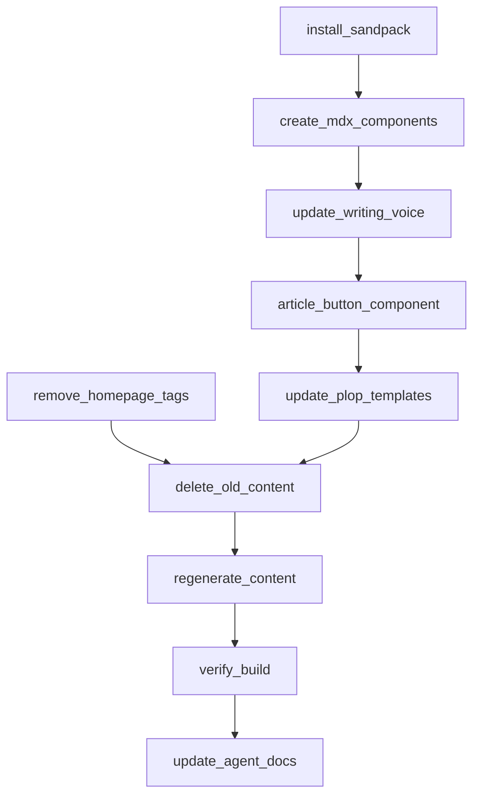

# Article Platform Upgrade

## Research Findings

**Maxime Heckel's blog** uses **Sandpack** (`@codesandbox/sandpack-react` v2.20.0) by CodeSandbox for interactive code playgrounds. Sandpack runs an in-browser bundler with live code editing and preview -- no external iframe to codesandbox.io. His blog is Next.js + MDX (`next-mdx-remote`), React Three Fiber, and his own design system. Each article topic gets a custom `Sandpack.tsx` wrapper with topic-specific files, dependencies, and templates.

The interactive visualizer widgets (like the RGB Shift slider in the screenshot) are **custom React components** embedded in MDX, not Sandpack -- they're bespoke per-article interactive demos with sliders/controls.

**Sylph** (our reference for article styling) is MIT-licensed. We ported Sylph's CSS typography rules (vertical rhythm, code blocks, inline pills, line numbers) but the **ArticleLayout component is fundamentally wrong**. Sylph renders the title as a modest `<p>` tag at 14px font-medium with just dates + reading time below. Our ArticleLayout renders a 48px hero h1, a description paragraph, 8 tag/tech pill badges, and motion spring stagger animations -- a completely different visual hierarchy.

**Specific gaps (Sylph source vs our code):**

- Title: Sylph `<p>` at `text-default` (14px) vs our `text-4xl sm:text-5xl` (36-48px) -- 3.5x too large
- Description: Sylph has none. We show a full paragraph.
- Tags/tech: Sylph has none. We show 8 pill badges.
- Animations: Sylph has none. We have motion spring stagger on every element.
- Breadcrumb: Sylph uses `>`. We use `/`.
- h2/h3 readability: Our CSS forces `color: hsl(var(--muted-foreground))` making section headings dim. Sylph uses `@apply text-muted` (Radix gray-8) which is more legible.
- Article font: Both use 14px/21px, but Sylph applies `text-default` globally at `html` level while we scope it to `article` only -- meaning our header metadata uses the browser default 16px, creating a jarring size mismatch.

---

## Part 0: Rewrite ArticleLayout to Match Sylph

This is the critical fix. The entire header needs to be rebuilt.

**Rewrite `src/components/ui/ArticleLayout.tsx`:**

- Breadcrumb: use `>` separator (Sylph-style), keep hover behavior
- Title: render as small bold text (`font-semibold text-sm`), NOT a giant h1 -- the MDX content h1 provides the visual title
- Metadata line: `Published {date} · Updated {date} · {readingTime}` inline, small text
- Remove: description paragraph, tags/tech pills, all motion animations
- Keep: MobileTOC, two-column layout with sticky TOC, prev/next navigation
- Remove `tags` and `tech` from props interface (no longer displayed)

**Fix `experiments.css` h2/h3 readability:**

- Change `article h2, article h3 { color: hsl(var(--muted-foreground)); }` to use a more legible color -- Sylph uses `text-muted` which maps to gray-8 (mid-range). Our `--muted-foreground` in dark mode is `240 5% 64.9%` which is too dim for headings. Remove the override entirely so h2/h3 inherit `text-foreground` like h1 does, then let the MDX content structure handle visual hierarchy.

---

## Part 1: Install Sandpack + Create MDX Components

**Install:**

```bash
npm install @codesandbox/sandpack-react
```

**Create `src/components/mdx/SandpackDemo.tsx`:**

- A themed Sandpack wrapper that hooks into our CSS design tokens (`--background`, `--foreground`, `--border`, `--muted`, etc.)
- Props: `template` (default "react"), `files`, `dependencies`, `showConsole`, `editorHeight`
- Dark/light theme detection via `next-themes`
- Renders `SandpackProvider` + `SandpackLayout` + `SandpackCodeEditor` + `SandpackPreview`
- Styled to match our article aesthetic (rounded corners, border-border, etc.)
- For R3F/shader articles: support a "react" template with `three` and `@react-three/fiber` as dependencies

**Create `src/components/mdx/InteractiveWidget.tsx`:**

- A container component for custom interactive demos (like Maxime's RGB slider widget)
- Props: `title`, `children`
- Renders a bordered card with a title bar and content area
- Used in MDX like: `<InteractiveWidget title="CRT Effect Visualizer">...</InteractiveWidget>`
- The actual interactive content is authored per-article in `article/components.tsx`

**Register in `src/components/mdx/components.tsx`:**

- Add `SandpackDemo` and `InteractiveWidget` to the `articleComponents` map
- Export from `src/components/mdx/index.ts`

---

## Part 2: Writing Voice + Article Structure Update

**Update `[.agent/contexts/writing-voice.md](.agent/contexts/writing-voice.md)`:**

Add Maxime Heckel's blog as a second reference alongside RNDR Realm. Key additions:

- **Interactive elements**: Articles should include playable code via Sandpack and/or interactive widgets (sliders, visualizers) where the technique benefits from hands-on exploration
- **Widget pattern**: For shader/visual effects, build small interactive demos that let readers tweak parameters. These live in `article/components.tsx` and get embedded via `<InteractiveWidget>`
- **Code playground pattern**: For code-forward techniques, use `<SandpackDemo>` so readers can edit and see results live
- **Maxime-style progressive depth**: Start with the concept visually (diagram or widget), then show the code, then explain
- **Captions and annotations on code**: Use `rehype-pretty-code` features like line highlighting, titles, and annotations

Update the **Article Structure** section to include:

1. Hook (1-2 paragraphs)
2. Visual concept (interactive widget or diagram showing the core idea)
3. Basic version (Sandpack or static code + explanation)
4. Enhancement (layered complexity, more code)
5. Key insight (the non-obvious part)
6. Full thing (LiveDemo iframe or Sandpack with full example)
7. Reflection (what worked, what you'd change)

---

## Part 3: "View Article" Button on Experiment Pages

**Create `src/components/ui/ExperimentArticleButton.tsx`:**

- Client component, similar structure to `ExperimentBackButton`
- Fixed position: `top-4 left-[calc(ExperimentBackButton_width + gap)]` -- positioned to the right of the back button
- Only renders when an `articleHref` prop is provided
- Pill shape with `FileText` icon from lucide-react: "View Article"
- Same backdrop-blur-sm glass style as ExperimentBackButton
- Hides in iframes (same `window.self === window.top` check)

**Update experiment layouts to include it:**

- In legacy layouts like `[src/app/experiments/(basketball-replay-center)/layout.tsx](src/app/experiments/(basketball-replay-center)`/layout.tsx): add `ExperimentArticleButton` with `articleHref` derived from `experiment.content?.article`
- In the plop template `[plop-templates/experiment/route-layout.tsx.hbs](plop-templates/experiment/route-layout.tsx.hbs)`: add conditional rendering based on experiment.json's `content.article` field

**Implementation approach in layouts:**

```tsx
import { ExperimentArticleButton } from "@/components/ui/ExperimentArticleButton";
import experiment from "./experiment.json";

// In the JSX:
<ExperimentBackButton />
{experiment.content?.article && (
  <ExperimentArticleButton href={`/experiments/${experiment.slug}/article`} />
)}
```

This means only layouts for experiments WITH articles show the button. For the plop template, since new experiments start with `content: undefined`, the button won't render until the article is created and experiment.json is updated.

---

## Part 4: Remove Homepage Tag Filters

**Edit `[src/components/ui/experiments/ExperimentFilters.tsx](src/components/ui/experiments/ExperimentFilters.tsx)`:**

- Remove the tag badges section entirely (the `availableTags.length > 0` block)
- Remove `availableTags`, `selectedTags`, `onTagToggle` from the props interface
- Keep only the status filter (All / Shipped / WIP)

**Edit `[src/components/ui/ExperimentDrawerList.tsx](src/components/ui/ExperimentDrawerList.tsx)`:**

- Remove `availableTags` computation, `selectedTags` state, `handleTagToggle` handler
- Remove tag-related props passed to `ExperimentFilters`
- Remove tag-based filtering logic from `filteredExperiments`

---

## Part 5: Delete + Regenerate Basketball Replay Center Content

**Delete all 8 content files:**

- `article/page.tsx`, `article/content.mdx`, `article/components.tsx`
- `docs/lab-note.md`, `docs/architecture.md`, `docs/snippet.md`, `docs/social.md`, `docs/changelog.md`

**Re-scaffold via `npm run new:article`**, then regenerate all content following the updated writing voice with:

- Interactive `article/components.tsx` with real widget demos (CRT parameter sliders, distortion controls)
- Sandpack demo for the CRT shader snippet
- Updated article structure matching the new voice guide
- Re-run all verification (typecheck, lint, build, validate)

---

## Part 6: Update Agent Docs

**Update `[.agent/STATUS.md](.agent/STATUS.md)`:**

- Add Sandpack to toolkit (Section 2 or Section 5)
- Update article count (3 articles: send-button, keyboard-keys, basketball-replay-center)
- Note the writing voice expansion (Maxime Heckel reference added)
- Note tag filter removal from homepage
- Note ExperimentArticleButton addition

**Update `[.agent/running-findings.md](.agent/running-findings.md)`:**

- Add results of the basketball-replay-center content regeneration test
- Document Sandpack integration verification
- Document any bugs found and fixed

**Update `[.agent/contexts/toolkit.md](.agent/contexts/toolkit.md)`:**

- Add `@codesandbox/sandpack-react` to installed packages

---

## Sequencing




Parts 1-3 and Part 4 can be done in parallel. Part 5 depends on Parts 1-3 being complete (needs new components). Part 6 is last.