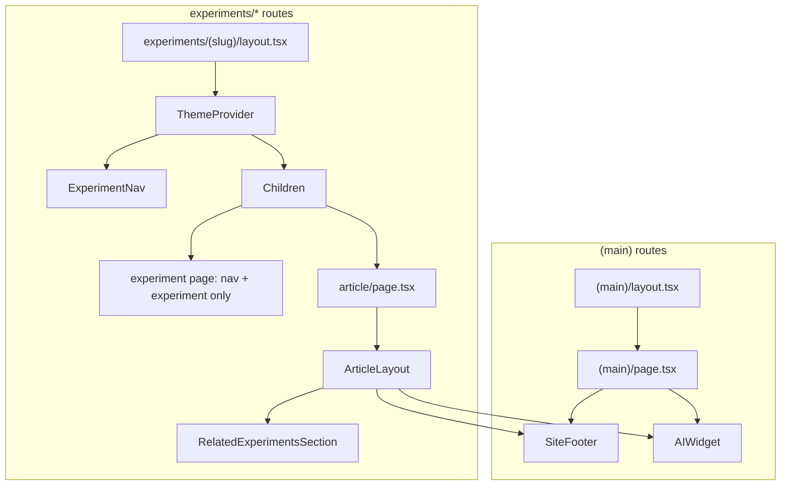

# Articles: Footer, AI Widget, Theming, and Related Experiments Fix

## Design principle

- **Experiment pages** (e.g. `/experiments/basketball-replay-center`): Minimal. Only the top-left nav (Return / Go to article when present) and the experiment itself. No footer, no AI widget, no Related experiments. Experiments should just display experiments.
- **Article pages** (e.g. `/experiments/basketball-replay-center/article`): Full chrome. Article content + Related experiments + SiteFooter + AIWidget + correct theming. Articles have the additional info.

---

## Current state

- **Footer and AI widget**: Rendered only in [src/app/(main)/page.tsx](src/app/(main)/page.tsx) (homepage). Article routes use each experiment’s layout but **no** SiteFooter or AIWidget anywhere under experiments.
- **Theming**: Experiment layouts already wrap with ThemeProvider (`attribute="class"`). In-article inline content (e.g. SandpackDemo) uses `useTheme()` and is fine. **Gaps**: (1) [LiveDemo](src/components/mdx/LiveDemo.tsx) iframes point at `/experiments/${slug}` with no theme; the iframe document does not receive the parent’s theme. (2) [Component preview](src/app/(component-preview)/layout.tsx) iframes use a layout with `<html className="dark">` hardcoded, so they never follow the article’s theme.
- **Duplicate Related experiments**: Each experiment layout renders `RelatedExperimentsSection` for the whole segment. The article page’s [ArticleLayout](src/components/ui/ArticleLayout.tsx) also renders it. So on `/experiments/.../article` you see the section twice. Additionally, experiment pages currently show Related from the layout; per design, experiment pages should show nothing extra.

---

## 1. Add footer and AI widget to **articles only** (ArticleLayout)

**Approach**: Render SiteFooter and AIWidget from **ArticleLayout** only. They will appear when the article page is rendered (as children of the experiment layout). Experiment pages are unchanged: layout only has ExperimentNav + `{children}` (the experiment component), so no footer or widget.

- In [ArticleLayout](src/components/ui/ArticleLayout.tsx), after the prev/next nav block (and after the existing Related section), add:
  - [SiteFooter](src/components/ui/SiteFooter.tsx)
  - [AIWidget](src/components/ui/AIWidget.tsx)
- No changes to any experiment layout for footer/widget. Experiment layout stays: ThemeProvider → ExperimentNav → {children} → (Related block; see §2).

---

## 2. Fix Related experiments: articles only, no duplicate

**Approach**: Remove `RelatedExperimentsSection` from **all experiment layouts**. Keep it only in ArticleLayout. Result:

- **Experiment page**: No Related section (layout no longer renders it). Experiment page stays minimal.
- **Article page**: One Related section (from ArticleLayout only). No duplicate.

**Implementation**: In every experiment layout under `src/app/experiments/(*)/layout.tsx`, remove the block that conditionally renders `RelatedExperimentsSection` (and its Suspense). Do not add a pathname-based wrapper; just delete the Related block from the layout. ArticleLayout already renders Related for articles.

---

## 3. Theming for article demos and experiment previews

**3.1 In-article inline content**

- Already correct: experiment layout provides ThemeProvider; SandpackDemo and other client components in MDX use `useTheme()`. No change.

**3.2 LiveDemo iframes (experiment preview in article)**

- LiveDemo currently uses `src={/experiments/${slug}}` with no theme info. The iframe is a separate document; it has its own ThemeProvider and defaults to system.
- **Option A (recommended)**: Add a query param to the iframe src, e.g. `?embed=1&theme=light|dark`. LiveDemo (client) uses `useTheme().resolvedTheme` and builds the src with `theme=${resolvedTheme}`. When the theme changes, src changes and the iframe reloads with the correct theme. Experiment pages (or a thin client script in the experiment layout) read `theme` from the URL on load and call `setTheme(theme)` so the iframe’s document respects it. Prefer reading from `searchParams` in a client component that runs once on load in experiment layout.
- **Option B**: Use postMessage from parent to iframe to send theme changes; iframe listens and calls setTheme. More code and state sync; Option A is simpler and predictable.

**Implementation**:  

- In [LiveDemo.tsx](src/components/mdx/LiveDemo.tsx): get `resolvedTheme` from `useTheme()`, build `src` as `/experiments/${slug}?embed=1&theme=${resolvedTheme ?? 'light'}` (and key the iframe by theme so it reloads when theme changes).  
- In experiment layout: add a small client component that runs only when `searchParams.get('embed') === '1'` and `searchParams.get('theme')` is set, and calls `setTheme(searchParams.get('theme'))` once on mount so the iframe’s document shows the requested theme. (Experiment pages stay minimal; this only affects how the experiment looks when loaded inside the LiveDemo iframe on an article page.)

**3.3 Component preview iframes (registry / UIComponentPreview)**

- [Component preview layout](src/app/(component-preview)/layout.tsx) uses `<html className="dark">` hardcoded. When ComponentPreview is embedded in an article (e.g. via UIComponentPreview in MDX), the iframe is always dark.
- **Approach**: Make the component-preview route theme-aware. Options: (1) Pass theme in the iframe URL (e.g. `?theme=dark`) and have the component-preview layout (or a client wrapper) set `className` on `<html>` from that param. (2) Or use postMessage from parent to iframe to set theme. Prefer URL param for consistency with LiveDemo.
- ComponentPreview is in [ComponentPreview.tsx](src/components/registry/ComponentPreview.tsx); it builds `previewUrl` and uses it as iframe `src`. Add theme to the URL when the component is used in a theme-aware context (e.g. in articles). So: ComponentPreview uses `useTheme().resolvedTheme` and appends `?theme=...` to `previewUrl`; component-preview layout or a client script reads `theme` and applies it to `<html>` (e.g. via a client wrapper that sets `document.documentElement.className = theme` on mount).

**Scope**:  

- LiveDemo: [src/components/mdx/LiveDemo.tsx](src/components/mdx/LiveDemo.tsx) + one small client “embed theme sync” component used in experiment layout (or in a shared experiment wrapper).  
- Component preview: [src/components/registry/ComponentPreview.tsx](src/components/registry/ComponentPreview.tsx) (add theme to URL) + [src/app/(component-preview)/layout.tsx](src/app/(component-preview)/layout.tsx) (or a client wrapper in the layout) to read `theme` and set `html` class.

---

## 4. Implementation order and file list

1. **Related experiments (articles only, no duplicate)**
  - Remove the `RelatedExperimentsSection` block (and its Suspense) from every experiment layout. ArticleLayout already renders Related; experiment pages will no longer show Related.
2. **Footer + widget on articles only**
  - In [ArticleLayout](src/components/ui/ArticleLayout.tsx), add SiteFooter and AIWidget after the prev/next nav (and after the Related section). No new wrapper component required unless you want one for ordering/styling.
3. **Theming**
  - LiveDemo: add theme to iframe src; add embed-theme-sync client component and use it in experiment layout so embedded experiment iframes respect article theme.  
  - Component preview: add theme to preview URL in ComponentPreview; make component-preview layout (or a client child) apply theme from query.
4. **Docs and tests**
  - **Docs**: If there is an agent or user doc that describes “what appears on article vs experiment pages,” update it: experiment pages = nav + experiment only; article pages = article + Related + footer + widget. [docs/seo.md](docs/seo.md) or article-related docs are good candidates.  
  - **Testing**: Manual: open an experiment page (e.g. basketball), confirm no footer, no widget, no Related; open the article, confirm one Related section, footer and AI widget visible; toggle theme and confirm article content and (if present) LiveDemo/component preview iframes update.

---

## 5. Architecture summary

- **Experiment page**: Layout renders ExperimentNav + `{children}` (experiment component). No Related, no footer, no widget.  
- **Article page**: Same layout; `children` is the article page, which renders ArticleLayout. ArticleLayout renders article content, Related, prev/next nav, then SiteFooter, then AIWidget.  
- **Theme**: ThemeProvider in experiment layout; LiveDemo and ComponentPreview pass theme into iframes via URL and optional embed sync.

---

## 6. Files to add

| File                                                | Purpose                                                                                                                           |
| --------------------------------------------------- | --------------------------------------------------------------------------------------------------------------------------------- |
| `src/components/ui/EmbedThemeSync.tsx` (or similar) | Client component for experiment layout: when `?embed=1&theme=...` in URL, calls setTheme once (for LiveDemo iframes in articles). |

---

## 7. Files to modify

| File / scope                                                                                 | Change                                                                                                                             |
| -------------------------------------------------------------------------------------------- | ---------------------------------------------------------------------------------------------------------------------------------- |
| All `src/app/experiments/(*)/layout.tsx`                                                     | Remove the `RelatedExperimentsSection` block (and its Suspense) entirely. Optionally add EmbedThemeSync for LiveDemo iframe theme. |
| [src/components/ui/ArticleLayout.tsx](src/components/ui/ArticleLayout.tsx)                   | Add SiteFooter and AIWidget after the prev/next nav (after the Related section).                                                   |
| [src/components/mdx/LiveDemo.tsx](src/components/mdx/LiveDemo.tsx)                           | Append `?embed=1&theme=${resolvedTheme}` to iframe src; use useTheme.                                                              |
| [src/components/registry/ComponentPreview.tsx](src/components/registry/ComponentPreview.tsx) | Append `?theme=${resolvedTheme}` to previewUrl when in theme context; use useTheme.                                                |
| [src/app/(component-preview)/layout.tsx](src/app/(component-preview)/layout.tsx)             | Make theme from query param drive `<html>` class (via client wrapper or layout that reads searchParams).                           |
| Docs (e.g. [docs/seo.md](docs/seo.md) or article docs)                                       | Note: experiment pages = nav + experiment only; article pages = article + Related + footer + widget; theming applies to demos.     |

---

## 8. Verification checklist

- Open `/experiments/basketball-replay-center` (experiment page): only ExperimentNav (Return / Go to article) and the experiment; no Related, no footer, no AI widget.  
- Open `/experiments/basketball-replay-center/article`: one “Related experiments” section; footer and AI widget visible; no duplicate Related.  
- Toggle theme on that article: article body and code blocks (rehype theme) update; SandpackDemo (if any) updates; LiveDemo iframe (if any) reloads with new theme; component preview iframe (if any) matches theme.  
- `tsc --noEmit` and build pass.

