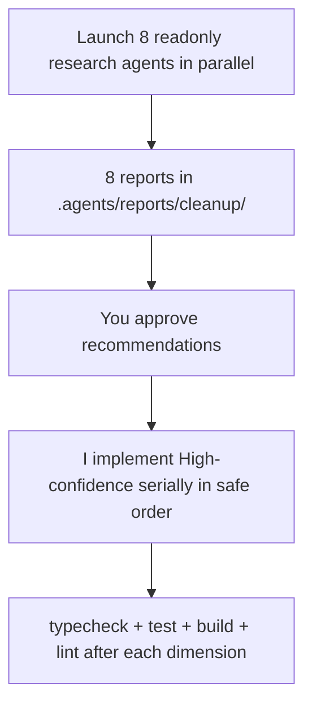

# Codebase Cleanup via 8 Research Subagents

## Approach

Two-phase, conflict-safe model (per your selection):

0. **Phase 0 - Tooling setup:** install the analysis devDependencies (`knip`, `madge`, `dependency-cruiser`, `jscpd`, `type-coverage`) and add minimal config (`knip.json`, dependency-cruiser/jscpd config) so the read-only research agents can run them. Read-only agents cannot install, so this must happen before launch.
1. **Phase 1 - Parallel research (read-only):** Launch all 8 subagents at once with `readonly: true`. Each does deep research on its dimension across the entire codebase (including legacy), writes a `## Critical Assessment` + `## Recommendations` report (each rec tagged High / Medium / Low confidence, with file:line citations) to `.agents/reports/cleanup/<n>-<topic>.md`, and returns a short summary. No edits.
2. **Phase 2 - Serial implementation (after your approval):** You review reports. I implement only High-confidence recommendations, one dimension at a time in the order below, running verification between each.

## Hard constraints (baked into every agent prompt)

- **No cross-experiment imports** (`AGENTS.md`). Dedup/type-consolidation may only hoist into shared `src/lib` / `src/components/ui` / `src/hooks`. Cross-experiment duplication is often intentional and must be reported, not "fixed" by linking experiments.
- **Each experiment owns its `<html>`/`<body>` isolation** - do not merge.
- **Legacy is in-scope (your call)** but treated carefully: every legacy/shipped change must keep `tsc --noEmit`, `npm test`, and `npm run build` green.
- **Tooling deps allowed (your call):** install best-fit analysis tools as `devDependencies`. Planned set: `knip` (unused code/exports/deps), `madge` + `dependency-cruiser` (circular deps + richer cycle rules), `jscpd` (copy/paste detection for dedup), `type-coverage` (measure `any`/`unknown` surface for weak-types agent). No new *runtime* (`dependencies`) packages without asking.
- Reports are the deliverable for Phase 1; large tool output goes to scratch files, not chat (Context Hygiene rule).

## The 8 subagents (each: `explore`, `readonly: true`, run in background)

1. **Dedup / DRY** - find duplicated logic; recommend hoisting shared helpers into `src/lib`/`src/hooks` only. Flag intentional per-experiment duplication explicitly.
2. **Type consolidation** - inventory `interface`/`type` defs; identify ones that should live in a shared types module (e.g. `src/lib` or per-experiment `data.ts`) without creating cross-experiment coupling.
3. **Unused code (knip)** - install + run `knip` (with a `knip.json` tuned for Next.js entry points, registry, MDX, and `scripts/`); cross-verify each finding with `Grep` to confirm zero references (watch for dynamic imports, registry/MDX string references, `scripts/` generators) before recommending deletion. Also run `jscpd` to surface copy/paste clusters feeding agent 1.
4. **Circular deps (madge + dependency-cruiser)** - run `madge --circular --extensions ts,tsx src` and a `dependency-cruiser` no-circular rule; map cycles and recommend break points.
5. **Weak types** - run `type-coverage --detail` to enumerate every weak spot; research correct types from `@types/three`, R3F, drei, GSAP, etc. and recommend strong replacements verified against real signatures.
6. **Defensive programming** - find `try/catch` and fallback patterns; recommend removing those that hide errors / aren't guarding genuinely untrusted input (fetch/JSON parse/user input/WebGL context). Keep legitimate boundaries (Sentry, error.tsx, external I/O).
7. **Legacy / fallback / dead paths** - find deprecated/legacy/fallback branches; recommend collapsing to single clean code paths.
8. **AI slop / comments / stubs** - find narration comments, "replaced X with Y" notes, LARP/stubs; recommend removal or concise rewrite for a new reader.

## Phase 2 implementation order (minimizes rework/conflicts)

`3 unused` -> `7 legacy/dead paths` -> `1 dedup` -> `2 type consolidation` -> `4 circular deps` -> `5 weak types` -> `6 defensive` -> `8 comments`.

Rationale: delete dead/legacy code first so we never refactor code we're about to remove; structural moves (dedup, types) next; then circular-dep fixes; then type-strengthening and defensive-code cleanup on the now-stable surface; comment cleanup last.

## Verification (run after each implemented dimension)

- `npm run typecheck` (note: needs `npx fumadocs-mdx` to have generated `.source/` once)
- `npx vitest --run --project unit`
- `npm run lint`
- `npm run build` once at the end of Phase 2 (full pipeline)

## Visual/spatial honesty

Several targets are shaders/3D/animation. I cannot see rendered output; any type/dedup change touching WebGL/GSAP gets a flagged TODO for you to visually validate.

## Notes / risks

- Including legacy + shipped experiments raises regression risk; the test/build gate is the safety net, but visual regressions in shaders/scenes won't be caught automatically.
- `knip`/`madge` findings frequently include false positives in registry/MDX/dynamic-import-driven code - hence the mandatory `Grep` cross-verification before any deletion.