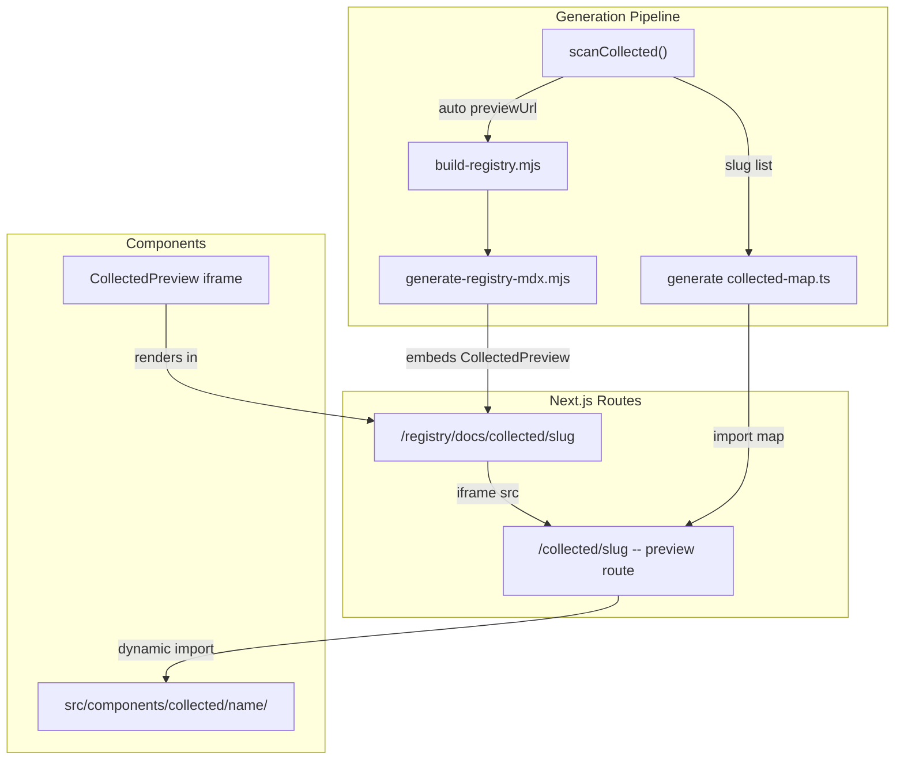

# Collected Components: Infrastructure + Full Review

## The Gap

Experiments are first-class: they have routes (`/experiments/<slug>`), live iframe previews on their registry docs pages, poster images, and a sidebar tab. Collected components are second-class: no routes, no live previews, no sidebar tab. They're invisible unless you know the URL or dig through source code.

The porting session produced 14 components but never visually tested any of them. The backlog (`t2-content-registry.md`) calls this out. We need to fix this at the infrastructure level so every collected component -- current and future -- is previewable.

## Architecture




## Phase 1: Preview Route Infrastructure

Create a permanent catch-all route that renders any collected component full-page, similar to how `/experiments/<slug>` renders experiments.

**Route group:** `src/app/(collected-preview)/`

- `layout.tsx` -- own `<html>/<body>` for iframe isolation (same pattern as experiment route groups). Minimal: dark background, no chrome.
- `collected/[slug]/page.tsx` -- catch-all that imports from a generated component map, renders the component full-viewport with scroll space.

**Generated component map:** `src/components/collected/_map.ts`

- Auto-generated by the pipeline (new step in `generate-registry-json.mjs` or a companion script)
- Exports a `Record<string, { component: () => Promise<...>, css: string }>` mapping slug to dynamic import
- Regenerated on every `npm run generate:registry` -- new components get routes automatically
- `generateStaticParams()` in the page reads slugs from this map for SSG

```typescript
export const COLLECTED_COMPONENTS = {
  'sticky-cards-tilt': {
    component: () => import('./sticky-cards-tilt/StickyCardsTilt'),
    css: './sticky-cards-tilt/styles.css',
  },
  // ... auto-generated for all ported components
} as const;
```

**Special cases to handle:**

- `physics-tag-cloud` needs Matter.js loaded on `window` -- add a Script tag in the preview wrapper
- Components with scroll animation need full scroll space -- the wrapper div should be tall enough (most use 3-7x viewport)
- Components that need placeholder assets (images, video) should use their prop defaults

## Phase 2: Pipeline Integration

Wire collected components into the same preview pipeline that experiments use.

**[scripts/generate-registry-json.mjs](scripts/generate-registry-json.mjs) -- `scanCollected()`:**

- Auto-set `meta.previewUrl: '/collected/<slug>'` for every ported (non-reference) component
- The `build-registry.mjs` passthrough already propagates `meta` untouched

**[scripts/generate-registry-mdx.mjs](scripts/generate-registry-mdx.mjs) -- `buildCollectedPortedMdx()`:**

- Add a `## Preview` section with `<CollectedPreview slug="..." title="..." />` before the Install section
- Import the new `CollectedPreview` component at the top of generated MDX

**New generation step** -- generate `_map.ts`:

- After `scanCollected()` completes, write `src/components/collected/_map.ts`
- Include only ported components (skip `library.json` reference entries)
- Add to the `generate:registry` npm script chain

## Phase 3: Registry UI Integration

**[src/components/registry/CollectedPreview.tsx](src/components/registry/) (new file):**

- Fork of `ExperimentPreview` that points iframe `src` to `/collected/<slug>` instead of `/experiments/<slug>`
- Same viewport switcher (desktop/tablet/mobile), same sandbox attributes, same lazy loading
- Or: generalize `ExperimentPreview` to accept a `basePath` prop (defaults to `/experiments`, collected passes `/collected`)

**[src/app/(registry)/registry/docs/layout.tsx](src/app/(registry)/registry/docs/layout.tsx) -- sidebar:**

- Add `{ title: "Collected", url: "/registry/docs/collected" }` to the `tabs` array
- Position it after "Components" (or after "Experiments" given its nature as curated external ports)

## Phase 4: Visual Review (All 14 Components)

With the infrastructure in place, run a systematic visual review.

**Process per component:**

1. Start the experiments dev server (`npm run dev`)
2. Open the ported preview at `localhost:3000/collected/<slug>`
3. Open the original demo from `~/Downloads/` (install + run on a different port)
4. Use browser tools to screenshot both at matching scroll positions
5. Compare: layout fidelity, animation behavior, typography, colors, scroll feel

**Priority order** (complexity descending):

1. `curved-text-scroll` -- Three.js + GSAP + canvas (most complex, had remediation issues)
2. `fibonacci-image-orb` -- Three.js Fibonacci sphere + OrbitControls
3. `physics-tag-cloud` -- Matter.js with window global dependency
4. `counter-flip-reveal` -- GSAP Flip + SplitText premium plugins
5. `clip-path-reveal` -- SplitText + clipPath mask preloader
6. `scroll-frame-canvas` -- Canvas frame-sequence on scroll
7. `image-explosion` -- Custom physics particle simulation
8. `feature-convergence` -- Progress-based card convergence
9. `split-card-flip` -- 3D card flip with matchMedia
10. `spotlight-image-stack` -- Staggered image scatter
11. `sticky-cards-tilt` -- Pinned cards with alternating tilt
12. `sticky-cards-scale` -- Scale-down + counter-zoom
13. `sticky-cards-fold` -- 3D fold-away
14. `custom-video-player` -- Custom player UI

## Phase 5: Code Quality Audit

Per-component checklist (run alongside visual review):

- `"use client"` directive
- Props interface with defaults (no required external data to render)
- `prefers-reduced-motion` handled (never leaves elements invisible)
- Cleanup: ScrollTrigger killed, Three.js disposed, RAF cancelled, listeners removed
- CSS scoped with component prefix (no global leaks)
- Line count under 300
- `meta.json` complete (source, author, license, tags, tech)
- Zero console errors in dev
- Zero TypeScript errors (`tsc --noEmit`)

## Phase 6: Registry Pipeline End-to-End Verification

1. `npm run generate:registry` -- all 14 in output, 2 files each (TSX + CSS), `meta` populated
2. `_map.ts` generated with all 14 entries
3. MDX files in `content/registry/collected/` include `## Preview` section
4. `/registry/docs/collected/<slug>` renders with live iframe preview
5. "Collected" tab visible in registry sidebar
6. Spot-check `npx shadcn add` install flow for 1-2 components

## Known Issues to Verify

- `feature-convergence` and `curved-text-scroll` dropped custom fonts -- assess visual impact
- `counter-flip-reveal` has a `@ts-ignore` for GSAP Flip import -- still required?
- `physics-tag-cloud` graceful fallback when Matter.js isn't loaded
- Zero test files exist for collected components (note in report, don't block)

