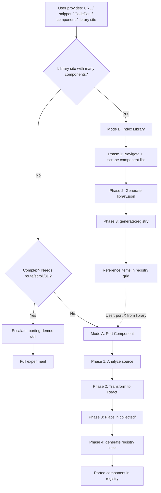

# Collected Components Registry + Quick Port Skill

Three deliverables: (A) registry infrastructure for a "collected" category supporting both ported code and library references, (B) an agent skill that populates it via two modes, and (C) UI updates to render reference items properly.

---

## A. Registry Infrastructure: "collected" category

The collected category supports **two kinds of items** in the same directory:

### 1. Ported components (with code)

Components transformed from external sources into actual React code that lives in the repo.

```
src/components/collected/<kebab-name>/
  ComponentName.tsx          # Main component ("use client" if needed)
  ComponentName.story.tsx    # Optional @fumadocs/story visual test
  meta.json                  # Source attribution + tags
  [helpers.ts, styles.css]   # Co-located files as needed
```

`meta.json` for ported components:

```json
{
  "type": "component",
  "source": "https://github.com/user/repo",
  "author": "Original Author",
  "license": "MIT",
  "tags": ["interaction", "hover"],
  "tech": ["motion/react"]
}
```

### 2. Indexed library references (no code)

Scraped component catalogs from external library sites. Each library gets one folder with a `library.json` that contains the full component index.

```
src/components/collected/<library-name>/
  library.json               # Library metadata + full component index
```

`library.json` schema:

```json
{
  "type": "library",
  "title": "SmoothUI",
  "url": "https://smoothui.dev",
  "description": "Beautiful, animated UI components built with React, Motion, and GSAP",
  "tags": ["animation", "motion", "gsap", "react"],
  "indexed": "2026-03-11T00:00:00Z",
  "components": [
    {
      "name": "magnetic-button",
      "title": "Magnetic Button",
      "description": "Button that magnetically follows cursor on hover",
      "url": "https://smoothui.dev/docs/components/magnetic-button",
      "group": "Button",
      "tags": ["button", "magnetic", "hover"]
    },
    {
      "name": "accordion",
      "title": "Accordion",
      "description": "Animated React accordion with smooth transitions",
      "url": "https://smoothui.dev/docs/components/accordion",
      "group": "Basic UI",
      "tags": ["accordion", "collapse"]
    }
  ]
}
```

When the scanner encounters a `library.json`, it creates **one registry item per component** in the `components` array. Each item has `files: []` (no code) and `meta.reference: true` so the UI knows to render it differently.

### Scanner output for each mode

**Ported component** (has `.tsx` files):

```json
{
  "name": "magnetic-button",
  "type": "registry:component",
  "title": "MagneticButton",
  "description": "Button that magnetically follows cursor on hover",
  "category": "collected",
  "files": [{ "path": "src/components/collected/magnetic-button/MagneticButton.tsx", "type": "registry:component" }],
  "dependencies": ["motion"],
  "registryDependencies": ["razi-style"],
  "meta": {
    "source": "https://github.com/...",
    "author": "...",
    "tags": ["interaction", "hover"]
  }
}
```

**Library reference** (no code):

```json
{
  "name": "smoothui--magnetic-button",
  "type": "registry:component",
  "title": "Magnetic Button",
  "description": "Button that magnetically follows cursor on hover",
  "category": "collected",
  "files": [],
  "dependencies": [],
  "registryDependencies": [],
  "meta": {
    "reference": true,
    "source": "https://smoothui.dev/docs/components/magnetic-button",
    "library": "SmoothUI",
    "libraryUrl": "https://smoothui.dev",
    "group": "Button",
    "tags": ["button", "magnetic", "hover"]
  }
}
```

Name-spacing convention: library references use `<library>--<component>` to avoid collisions with ported components.

### Files to modify

**1. [registry.config.json](registry.config.json)** -- add category + scan toggle

```json
{
  "categories": ["experiments", "components", "collected", "hooks", "utilities", "styles"],
  "scan": {
    "experiments": true,
    "sharedUI": true,
    "collected": true,
    "hooks": true,
    "utilities": ["src/lib/utils.ts", "src/lib/fonts.ts"]
  }
}
```

**2. [scripts/generate-registry-json.mjs](scripts/generate-registry-json.mjs)** -- add `scanCollected()` function

Dual-mode scanner:

```javascript
const COLLECTED_DIR = path.join(ROOT_DIR, "src", "components", "collected");

async function scanCollected() {
  const items = [];
  const entries = await fs.readdir(COLLECTED_DIR, { withFileTypes: true });

  for (const entry of entries) {
    if (!entry.isDirectory()) continue;
    const folderPath = path.join(COLLECTED_DIR, entry.name);

    // Check for library.json first (indexed library mode)
    const libraryJsonPath = path.join(folderPath, "library.json");
    try {
      const libraryData = JSON.parse(await fs.readFile(libraryJsonPath, "utf-8"));
      if (libraryData.type === "library") {
        // Create one registry item per component in the index
        for (const comp of libraryData.components) {
          items.push({
            name: `${entry.name}--${comp.name}`,
            type: "registry:component",
            title: comp.title,
            description: comp.description,
            category: "collected",
            files: [],
            dependencies: [],
            registryDependencies: [],
            meta: {
              reference: true,
              source: comp.url,
              library: libraryData.title,
              libraryUrl: libraryData.url,
              group: comp.group,
              tags: comp.tags || [],
            },
          });
        }
        continue; // done with this folder
      }
    } catch { /* no library.json, try component mode */ }

    // Component mode: find entry .tsx file
    // ... (same pattern as scanSharedUI but folder-scoped)
  }
  return items;
}
```

Wire into `main()`:

```javascript
const scanCollectedEnabled = config?.scan?.collected === true;
let collectedItems = [];
if (scanCollectedEnabled) {
  collectedItems = await scanCollected();
}
let allItems = [...experimentItems, ...uiItems, ...collectedItems, ...hookItems, ...utilItems];
```

**3. [scripts/generate-registry-mdx.mjs](scripts/generate-registry-mdx.mjs)** -- handle collected category in MDX generation

Two rendering paths based on `meta.reference`:

- **Ported components**: source attribution callout with original URL, full source code display
- **Library references**: lightweight page with description, "View Original" button linking to `meta.source`, parent library info, no source code section, no install command

**4. Grid/filter UI** (see Section C below)

### What stays unchanged

- `build-registry.mjs` -- works for items with `files: []` (just writes an empty files array)
- `post-process-registry.mjs` -- builds indexes from all items regardless of files
- `RegistrySourceCode` -- only rendered when files exist (already guarded)
- `InstallCommand` -- only rendered when files exist

---

## B. Agent Skill: `quick-component`

A new skill at `.agents/skills/quick-component/SKILL.md` (~150 lines). Dual-mode: port a component (Mode A) or index a library (Mode B).

### Skill routing

```
User input --> Is this a library/collection site with many components?
  Yes --> Mode B: Index Library
  No  --> Is the source complex enough for a full experiment?
    Yes --> Escalate to porting-demos skill
    No  --> Mode A: Port Component
```

### Mode A: Port Component (4 phases)

For when the user provides a single component, snippet, CodePen, GitHub file, etc.

**Phase 1: Analyze** -- classify source type, read code, identify framework/deps/CSS approach

**Phase 2: Transform** -- convert to React component using this subset of transformations:

- Vanilla JS + DOM --> React refs + useEffect
- Vue SFC / Svelte --> React component + hooks
- Class component --> function component + hooks
- CSS-in-JS --> CSS file or Tailwind
- Global CSS --> scoped CSS file
- External state --> local state or Zustand
- jQuery --> React refs

Keep it simple: `"use client"` if needed, extract hardcoded values into props with defaults. No experiment infrastructure.

**Phase 3: Place** -- create `src/components/collected/<name>/` with component file, `meta.json`, co-located styles/helpers, optional story file

**Phase 4: Verify** -- `npm run generate:registry` + `tsc --noEmit`

### Mode B: Index Library (3 phases)

For when the user provides a library URL like `https://smoothui.dev/docs/components`.

**Phase 1: Navigate and Scrape** -- use browser tools (pinchtab or browser-devtools) to:

- Navigate to the library URL
- Take a snapshot to identify the component list structure
- Extract each component's name, description, URL, and grouping
- Handle pagination or sub-pages if the library spans multiple routes

**Phase 2: Generate library.json** -- create `src/components/collected/<library-name>/library.json` with the full component index following the schema above. Set `indexed` to the current timestamp.

**Phase 3: Verify** -- `npm run generate:registry` to create registry items from the index. Confirm items appear in the output.

### Re-indexing

When the user says "update smoothui" or "re-index smoothui", the skill re-scrapes the library URL and regenerates `library.json`. The scanner picks up changes on the next `generate:registry` run. New components appear, removed components disappear.

### Port from indexed library

When the user says "port magnetic-button from smoothui", the skill:

1. Reads `library.json` to find the component's URL
2. Navigates to that URL, reads the source code
3. Follows Mode A (Port Component) phases 1-4
4. The ported component lives at `src/components/collected/magnetic-button/` (not inside the `smoothui/` folder)
5. The library reference item (`smoothui--magnetic-button`) coexists with the ported item (`magnetic-button`) -- the ported version takes precedence in the UI

### Skill cross-references

- `.agents/skills/gsap-modern/SKILL.md` -- source uses GSAP
- `.agents/skills/motion-react/SKILL.md` -- source uses Motion/Framer Motion
- `.agents/skills/r3f-core/SKILL.md` -- source uses Three.js
- `.agents/skills/porting-demos/SKILL.md` Phase 3 -- full transformation reference
- `.agents/skills/visual-qa/SKILL.md` -- visual verification after porting

### Escalation to porting-demos

If the source requires scroll-driven animation, multi-section composition, its own route/layout, or experiment infrastructure, redirect to `porting-demos` + `new-experiment` workflow.

---

## C. UI Updates for Reference Items

**[src/components/registry/RegistryCard.tsx](src/components/registry/RegistryCard.tsx)**:

- Detect `meta.reference === true` on items
- Render an external link icon and "from {library}" badge
- Card click opens the original URL (or links to the lightweight docs page)

**[src/components/registry/RegistryGrid.tsx](src/components/registry/RegistryGrid.tsx)**:

- Add "Collected" to category filter options
- Within the collected category, support grouping by `meta.library` so indexed libraries cluster together (e.g., "SmoothUI (50)" as a collapsible group)
- Ported components (no `meta.reference`) appear ungrouped at the top

**Registry docs pages** (via MDX generation):

- Ported components: full docs page with source code, install command, source attribution callout
- Reference items: lightweight page with description, tags, "View Original" button, parent library card, no install/source sections

---

## D. Documentation Updates

**[AGENTS.md](AGENTS.md)** -- add skill to reference table:

```
| Quick Component | `.agents/skills/quick-component/SKILL.md` | Porting external code or indexing libraries into collected registry |
```

**[memory.md](memory.md)** -- add workspace facts:

- Collected components directory: `src/components/collected/<name>/` with `meta.json` (ported) or `library.json` (indexed)
- Library reference naming: `<library>--<component>` to avoid collisions
- `scanCollected()` in generate-registry-json.mjs handles both modes

---

## Flow Diagram




