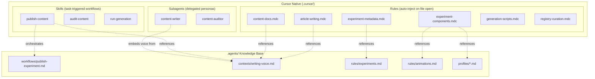

# Content Constellation: Cursor-Native Integration

## Problem

The experiments lab has a rich content system documented in `.agents/` (7 workflows, 13+ skills, 6 rules, 3 contexts), but Cursor's native integration points are completely unused:

- **0 rules** in `.cursor/rules/` -- no automatic context injection when editing content files
- **No skills** in `.cursor/skills/` -- workflows aren't discoverable by Cursor's skill system
- **No subagents** in `.cursor/agents/` -- no specialized writing or auditing personas

The agent currently must: read `CLAUDE.md` -> read `AGENTS.md` -> navigate to the right `.agents/` file -> read it. With Cursor-native systems, relevant context is **injected automatically** when files match glob patterns, workflows are **discoverable** via description matching, and specialized agents can be **delegated to** by the parent agent.

## Design Principles

- **Reference, don't duplicate.** Rules are concise (<50 lines) and point to `.agents/` docs for depth. Skills orchestrate workflows by referencing existing workflow files. Subagents embed persona-critical voice/constraints in their system prompt but reference docs for technical details.
- **Basketball-replay-center is the reference implementation.** All 6 content types, progressive Canvas 2D demos, full publish workflow executed. Rules/skills/subagents should reference it as the gold standard.
- **Complement the agent-native audit plan.** The pending [agent-native audit](../../.cursor/plans/agent-native_audit_fixes_9349af8c.plan.md) (todo `3a`) identifies 6 domain-focused rules (experiments, animations, r3f, shaders, scroll, registry). Our rules are content-focused and don't overlap -- both sets should coexist.

## V2 Context (from investigation)

The content constellation system was built across 9 phases of V2 work:

- **Phase 2** (P2): MDX pipeline built from zero -- `next-mdx-remote/rsc`, 7 MDX components, `ArticleLayout`, `src/lib/articles.ts`, Plop article generator (8 files), writing voice guide, 5-phase publish workflow
- **Phase 3** (Quality Gap): Sylph typography ported to `experiments.css`, shared CSS tokens fixed, article discovery wired (badges, drawer, sitemap)
- **Phase 4** (Audit): `delete:article` script, `content: {}` backfilled on 16 experiments, validator cross-checks content flags vs disk
- **Phase 7** (Article Platform Upgrade): Sandpack + InteractiveWidget added, writing voice updated (added Maxime Heckel reference), basketball-replay-center fully generated as test case
- **Phase 8** (Homepage): WritingSection server component, ArticleLayout converted to server component

**Critical technical patterns discovered:**

- `next-mdx-remote` does NOT support `import` in MDX -- components must be passed via `components` prop in `page.tsx`
- Article demos should use Canvas 2D or CSS, NOT R3F/WebGL (avoids loading Three.js in article context)
- Typography is CSS-first via `experiments.css` (Sylph port) -- MDX component map intentionally does NOT override styles
- `publishable` is the OUTPUT of the publish workflow, not an input gate (prerequisite is `status: "shipped"`)
- The Plop scaffold (`npm run new:article`) creates 8 files and auto-sets `content.article: true`
- Only 2/18 experiments have articles -- 16 have `content: {}` (the audit-content skill is immediately actionable)

---

## Part 1: Rules (`.cursor/rules/*.mdc`)

Auto-triggered context injection based on file patterns. Each rule is a concise (<50 line) `.mdc` file.

### 1.1 `experiment-metadata.mdc`

- **Glob:** `**/experiment.json`
- **Purpose:** When editing experiment metadata, inject schema reference, status lifecycle (`wip` -> `shipped` -> `publishable`), required fields, and validation rules
- **Key content:** Field enum values (status, profile, complexity), `content` object cross-check behavior, `publishable` is OUTPUT of publish workflow, `wip` causes generation scripts to skip
- **References:** `.agents/rules/experiments.md`

### 1.2 `article-writing.mdc`

- **Glob:** `**/article/content.mdx`
- **Purpose:** When writing articles, inject the writing voice highlights, article structure, interactive component usage, and anti-patterns
- **Key content:**
  - Voice: first-person, code-forward, no AI fingerprints, no filler, no hedging
  - Structure: hook -> basic + demo -> enhancement + demo -> key insight -> full thing (`<LiveDemo>`) -> reflection
  - Component rules: `<InteractiveWidget>` (primary, for custom demos), `<SandpackDemo>` (editable code), `<LiveDemo>` (full experiment embed, once at end)
  - **CRITICAL**: No `import` in MDX -- `next-mdx-remote` doesn't support it. Components wired via `page.tsx` `components` prop merge
  - Demo strategy: Use Canvas 2D or CSS for article demos, NOT R3F/WebGL (avoids loading Three.js)
  - Typography: CSS-first via `experiments.css` -- do NOT add Tailwind typography overrides to MDX component map
  - Reference implementation: `basketball-replay-center` article (progressive Canvas 2D demos for CRT + barrel distortion)
- **References:** `.agents/contexts/writing-voice.md`, `src/app/experiments/(basketball-replay-center)/basketball-replay-center/article/`

### 1.3 `experiment-components.mdc`

- **Glob:** `src/components/experiments/**/*.tsx`
- **Purpose:** When editing experiment components, inject size discipline (200 target, 300 hard limit), decomposition pattern, animation standards, and profile-based guidance
- **Key content:** Decomposition triggers and pattern (data.ts, sections/, hooks/), `prefers-reduced-motion` requirement, motion vocabulary diversity rule, read the experiment's `experiment.json` `"profile"` field to find the right `.agents/profiles/` doc
- **References:** `.agents/rules/animations.md`, `.agents/profiles/`

### 1.4 `content-docs.mdc`

- **Glob:** `src/app/experiments/**/docs/*.md`
- **Purpose:** When writing experiment documentation (lab-note, architecture, snippet, social, changelog), inject the correct template structure for that format
- **Key content:** Format-specific templates from `[.agents/contexts/writing-voice.md](.agents/contexts/writing-voice.md)` lines 73-87 (lab note = Context/What I Tried/What Worked/Reflection/Open Questions; architecture = Overview/Component Tree/Key Patterns/Data Flow/Dependencies/Perf; snippet = Install/Usage/API/Notes; social = 5-8 tweet thread structure; changelog = Origin/Iterations/Current State/Related)
- **References:** `.agents/contexts/writing-voice.md`, `.agents/workflows/publish-experiment.md`

### 1.5 `generation-scripts.mdc`

- **Glob:** `scripts/generate-*.mjs`
- **Purpose:** When editing generation scripts, inject pipeline architecture, dependency chain, and output artifacts
- **Key content:** 4-step registry pipeline order (`generate-registry-json` -> `build-registry` -> `post-process-registry` -> `generate-registry-mdx`), skip logic for `wip`/`archived`, output artifacts map (`registry.json` -> `public/registry/{name}.json` -> `index.json`/`index-slim.json` -> `content/registry/**/*.mdx`), `registry.config.json` role (featured, hidden, overrides, scan toggles), clean stale outputs before building
- **References:** `registry.config.json`

### 1.6 `registry-curation.mdc`

- **Glob:** `**/registry.config.json`
- **Purpose:** When editing registry curation, inject config schema and downstream impact
- **Key content:** `featured` sorts to top of grid, `hidden` excludes from all outputs, `overrides` patches descriptions/categories, scan toggles control which directories are crawled, changes require re-running `npm run generate:registry`

---

## Part 2: Skills (`.cursor/skills/*/SKILL.md`)

Discoverable, task-triggered workflows with proper YAML frontmatter.

### 2.1 `publish-content/SKILL.md`

- **Description:** "Generate a content constellation (article, lab note, architecture doc, snippet, social content, changelog) for a shipped experiment. Use when publishing an experiment, writing an article, creating experiment documentation, or when the user mentions 'content constellation', 'publish', or 'write article for'."
- **Adapted from:** `[.agents/workflows/publish-experiment.md](.agents/workflows/publish-experiment.md)` -- the 18-step, 5-phase workflow
- **Key additions over the raw workflow:**
  - Explicit trigger terms for Cursor skill discovery
  - Structured checklist pattern for tracking progress across 5 phases
  - Scaffold entry point: `npm run new:article` creates 8 files (3 article + 5 docs) and auto-sets `content.article: true`
  - Quality gates between phases (article renders? demos interactive? docs populated?)
  - Content coverage verification at the end (all 6 content flags match disk)
  - Demo planning guidance: Canvas 2D or CSS over R3F for article demos
  - MDX wiring instructions: build in `components.tsx`, import in `page.tsx`, spread into `components` prop
  - Reference: basketball-replay-center as the completed example of all 5 phases
- **References:** `.agents/contexts/writing-voice.md`, `.agents/workflows/publish-experiment.md`

### 2.2 `audit-content/SKILL.md`

- **Description:** "Audit content coverage across all experiments. Scan experiment.json files, check content flags against files on disk, identify missing content formats, report schema gaps (empty updated/inspiration/related fields), and prioritize which experiments to write content for next. Use when the user asks about content status, coverage gaps, or 'what needs writing'."
- **New skill** -- no equivalent exists in `.agents/`
- **Key capabilities:** Read all experiment.json files, cross-check `content` object against actual files, report missing content by format type, identify empty schema fields, generate a prioritized content roadmap, output a markdown status table

### 2.3 `run-generation/SKILL.md`

- **Description:** "Run, debug, and verify the content generation pipeline (registry, posters, llms-txt). Use when the user asks to generate registry, build the site, run generation scripts, or when generation output seems wrong."
- **New skill** -- codifies tribal knowledge about the pipeline
- **Key content:** Command reference (`npm run generate:registry`, `npm run generate:posters`, `npm run generate:llms-txt`), pipeline dependency order, common failure modes (stale outputs, missing ffmpeg, wip experiments), verification steps (check index-slim.json item count, spot-check MDX pages, verify poster.jpg generation), clean build procedure

---

## Part 3: Subagents (`.cursor/agents/*.md`)

Specialized agents with focused system prompts for delegation.

### 3.1 `content-writer.md`

- **Name:** `content-writer`
- **Description:** "Expert technical writer for experiment articles and documentation. Writes in the RNDR Realm + Maxime Heckel voice with code-forward, process-oriented narrative. Plans progressive interactive demos. Use proactively when writing articles, content.mdx files, or experiment documentation."
- **System prompt MUST embed** (subagents have isolated context -- can't reference external files):
  - Full voice characteristics from `writing-voice.md`: first-person, code-forward, process-oriented, casual confidence, short paragraphs, progressive disclosure, no AI fingerprints
  - Anti-patterns: no "let's dive in", no over-explaining, no hedging, no walls of text between code
  - Article structure: hook -> basic + demo -> enhancement + demo -> key insight -> full thing -> reflection
  - Progressive demo pattern: one demo per major technique, each builds on the previous
  - Technical constraints: no `import` in MDX, use Canvas 2D/CSS for demos (not R3F), typography is CSS-first
  - First step: always read experiment source code first, identify 2-3 novel techniques before writing
  - Reference: basketball-replay-center article as the gold standard
- **Does NOT embed:** Experiment system architecture, generation scripts, infrastructure -- just writing craft

### 3.2 `content-auditor.md`

- **Name:** `content-auditor`
- **Description:** "Content health auditor for the experiments lab. Proactively scans content coverage, validates generated output, identifies schema gaps, and produces status reports. Use when reviewing content status, after running generation scripts, or when preparing to publish."
- **System prompt contains:** How to scan experiment.json files, what to check (content flags, schema field completeness, file existence), how to evaluate generated registry output quality (MDX pages, JSON files, install commands), output format (markdown status tables with actionable items)

---

## File Tree (what gets created)

```
.cursor/
  rules/
    experiment-metadata.mdc
    article-writing.mdc
    experiment-components.mdc
    content-docs.mdc
    generation-scripts.mdc
    registry-curation.mdc
  skills/
    publish-content/
      SKILL.md
    audit-content/
      SKILL.md
    run-generation/
      SKILL.md
  agents/
    content-writer.md
    content-auditor.md
```

## Relationship to `.agents/`




Rules **reference** `.agents/` docs (concise pointers). Skills **orchestrate** `.agents/` workflows (add discoverability + trigger terms). Subagents **embed** critical persona content (voice must be in system prompt for isolated context).