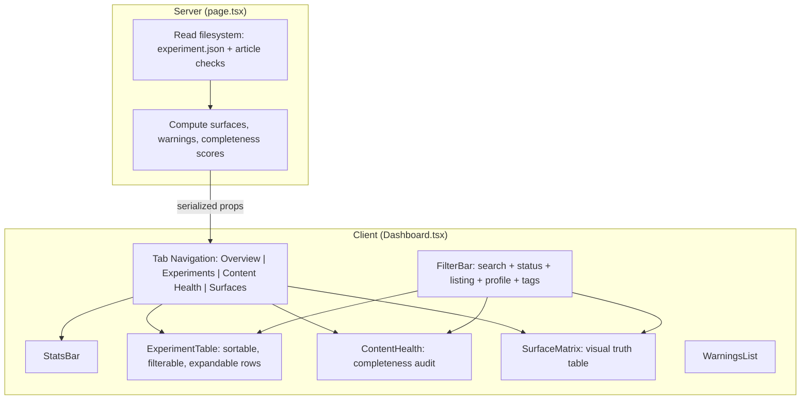

# Dev Dashboard Overhaul

## Current State

`[src/app/(main)/dev/page.tsx](src/app/(main)`/dev/page.tsx) is a single 362-line async Server Component. It renders:

- 6 stat cards (total, shipped, wip, legacy, articles, video)
- A flat warnings list (3 rules)
- A static HTML table (7 columns: name, status, listing, legacy, video, article, surfaces)

No interactivity. No search, no filtering, no sorting. Missing columns for profile, complexity, tags, tech, dates. No content completeness scoring. No way to prioritize what needs attention.

## Architecture

Split into a **server data loader** + **client interactive shell**, following the project's RSC-first pattern:

```
src/app/(main)/dev/
  page.tsx                    # Server Component: loads ALL data, passes to Dashboard
  _components/
    Dashboard.tsx             # "use client" -- tabs, URL state, orchestrator
    StatsBar.tsx              # Stat cards + profile distribution mini-bars
    FilterBar.tsx             # Search input + multi-select filter chips
    ExperimentTable.tsx       # Sortable, filterable table with expandable rows
    ContentHealth.tsx         # Per-experiment completeness scoring + aggregate
    SurfaceMatrix.tsx         # Visual truth table grid
    WarningsList.tsx          # Grouped warnings (extracted from current inline code)
    badges.tsx                # StatusBadge, ListingBadge, ProfileBadge, etc.
    types.ts                  # Shared types for the dashboard
```

10 files, each well under 200 lines. `page.tsx` becomes a thin ~50-line server loader.




## Key Features

### 1. Tabbed Navigation

Four tabs, each answering a different question:

- **Overview** -- "What's the state of the lab?" Stats bar + warnings + quick summary
- **Experiments** -- "Show me everything." Full table with all columns and filters
- **Content Health** -- "What needs work?" Completeness scoring, prioritized action items
- **Surfaces** -- "Where does each experiment appear?" Visual truth table matrix

Active tab stored in URL search params (`?tab=experiments`) so it's shareable/refreshable.

### 2. Search + Filter Bar (FilterBar.tsx)

- **Text search**: real-time filter across title, slug, description, tags, tech
- **Filter chips**: status (wip/shipped), listing (public/dev/registry), profile (8 values), legacy (yes/no), has video, has article
- **Sort control**: created date (default), title A-Z, completeness score, status
- Active filters shown as dismissible chips; "Clear all" button
- Filter state drives all tabs simultaneously (filtered experiments flow through to every panel)

### 3. Enhanced Stats Bar (StatsBar.tsx)

Keep the 6 current stat cards, add:

- **Profile distribution**: horizontal mini-bar chart below the cards showing counts per profile type (r3f-scene: 4, scrollytelling: 3, etc.)
- **Content coverage**: "3/21 have articles (14%)", "12/21 have video (57%)" with progress bars
- **Needs attention**: count of experiments with errors/warnings, clickable to jump to warnings

### 4. Experiment Table (ExperimentTable.tsx)

Upgrade from 7 columns to a richer view:


| Column       | New?     | Details                                                   |
| ------------ | -------- | --------------------------------------------------------- |
| Name         | existing | Title (linked) + slug + description excerpt on hover      |
| Status       | existing | Badge                                                     |
| Listing      | existing | Badge with implicit marker                                |
| Profile      | **new**  | Color-coded badge                                         |
| Complexity   | **new**  | beginner/intermediate/advanced badge                      |
| Tags         | **new**  | Truncated pill list, expand on hover                      |
| Tech         | **new**  | Truncated pill list, expand on hover                      |
| Created      | **new**  | Relative date ("3 months ago") with absolute tooltip      |
| Content      | **new**  | Combines legacy/video/article into icon row with tooltips |
| Completeness | **new**  | Visual bar (%) showing metadata fill rate                 |
| Surfaces     | existing | Colored pill badges                                       |
| Actions      | **new**  | Quick links: view, article (if exists), registry          |


Clickable column headers for sorting. Rows highlight on hover. Optional: expandable row detail showing full description, inspiration links, related experiments, and raw JSON.

### 5. Content Health Panel (ContentHealth.tsx)

The most useful new addition. Per-experiment **completeness scoring**:

- **Scoring model** (weighted):
  - Required present (title, description, slug, created) -- baseline
  - Status explicitly set (not defaulted) -- 5pts
  - Listing explicitly set -- 5pts
  - Profile set -- 10pts
  - Complexity set -- 5pts
  - Tags non-empty -- 10pts
  - Tech non-empty -- 10pts
  - Video present -- 15pts
  - Article exists -- 20pts
  - Updated date set -- 5pts
  - Inspiration links -- 5pts
  - Related experiments -- 5pts
  - Legacy flag intentionally set -- 5pts
- **Aggregate dashboard**: Overall lab health score, histogram of completeness distribution
- **Sorted list**: Experiments ranked by completeness, lowest first = "needs the most work"
- **Actionable suggestions**: Per experiment, list exactly which fields are missing -- "Add video", "Write article", "Set tags", "Add tech stack"
- **"Almost publishable"** highlight: experiments that are >80% complete but missing one thing

### 6. Surface Matrix (SurfaceMatrix.tsx)

Visual grid making the truth table from AGENTS.md scannable at a glance:

- **Rows**: Each experiment (sorted by status then listing)
- **Columns**: Homepage, Dev Homepage, Registry, llms.txt, Posters, Articles, Sitemap, RSS
- **Cells**: Filled/colored dot if the experiment appears on that surface, empty if not
- **Column totals** at the bottom: "12 on Homepage, 15 in Registry, 3 with Articles"
- Hovering a cell shows the rule that determined it ("shipped + public = visible")

### 7. Visual Design

- Use existing shadcn/ui primitives: `Badge` for status/listing/profile pills, `Card` for stat cards
- Dark theme (inherits from `(main)` layout): zinc-900 backgrounds, zinc-100 text
- New profile badge colors (one per profile type -- 8 distinct colors)
- Responsive: stat cards reflow, table scrolls horizontally on mobile
- Sticky filter bar at top when scrolling

## Data Flow

`page.tsx` (server) computes everything and serializes to the client:

```typescript
interface DashboardData {
  experiments: ExperimentRow[]   // all 21, with computed fields
  warnings: Warning[]
  stats: Stats                   // pre-computed counts
  profileDistribution: Record<string, number>
  contentCoverage: { articles: number; videos: number; total: number }
}
```

`ExperimentRow` extended from current type:

```typescript
interface ExperimentRow {
  // from experiment.json
  title: string
  slug: string
  description: string
  created: string
  status: ExperimentStatus
  listing: ExperimentListing
  profile?: string
  complexity?: string
  tags: string[]
  tech: string[]
  video?: string
  legacy?: boolean
  updated?: string
  inspiration?: { title: string; url: string }[]
  related?: string[]
  // computed
  hasArticle: boolean
  surfaces: Surface[]
  completenessScore: number      // 0-100
  missingFields: string[]        // actionable list
}
```

All filtering/sorting happens client-side (21 experiments is trivially small). No need for server round-trips.

## What Gets Deleted/Replaced

- The entire current 362 lines of `page.tsx` get replaced by the new server loader (~50 lines)
- `StatusBadge` and `ListingBadge` inline components move to `_components/badges.tsx` (expanded with `ProfileBadge`, `ComplexityBadge`)
- `getSurfaces()`, `getWarnings()`, types, and color maps move to `_components/types.ts`
- `loadAllExperiments()` stays in `page.tsx` but gains completeness scoring

## No New Dependencies

Everything uses React state, URL searchParams, and Tailwind. No new npm packages needed. The existing `class-variance-authority` (already installed) can be used for badge variants if desired.