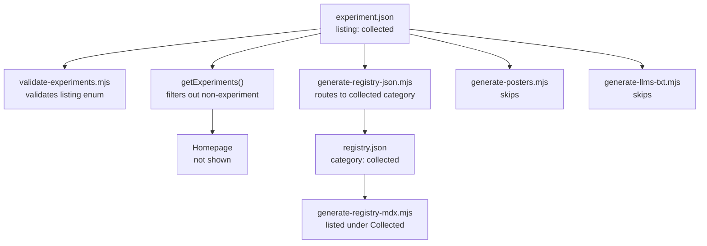

# Add `listing` Field to experiment.json

## The Problem

Today visibility is binary: `status: "wip"` excludes from everything, `status: "shipped"` publishes everywhere. There's no way to say "this is a finished experiment that I want in my registry as a reference, but not on the public site."

## Recommendation: `listing` Field

Add a new `listing` field to experiment.json, orthogonal to `status`:

```json
{
  "status": "shipped",
  "listing": "collected"
}
```

Three values:

- `**"experiment"**` (default): current behavior -- homepage, registry experiments section, posters, llms.txt
- `**"collected"**`: appears only in the registry's collected section (which has no homepage link). Excluded from homepage listing, posters, llms.txt. The route still technically exists (Next.js App Router requires the files), but nothing links to it.
- `**"unlisted"**`: excluded from all generated output entirely. Route exists but invisible to every surface.

### Why this over alternatives


| Approach                              | Problem                                                                                                                                                                                |
| ------------------------------------- | -------------------------------------------------------------------------------------------------------------------------------------------------------------------------------------- |
| Move to `src/components/collected/`   | Loses full experiment infrastructure (own route, layout, R3F canvas, scroll, error boundary). A multi-section 3D scroll experience doesn't fit the collected "single component" model. |
| `status: "wip"` forever               | Semantically wrong -- the experiment is finished. Also blocks future generation if you want it in the registry.                                                                        |
| `registry.config.json` overrides      | Only affects registry -- doesn't handle homepage, posters, llms.txt. Scatters metadata across two files.                                                                               |
| New `status` value like `"reference"` | Conflates lifecycle (wip/shipped/archived) with visibility. An experiment can be shipped AND be a reference.                                                                           |


`listing` is clean because it's a single new field, orthogonal to lifecycle, and the semantics are obvious: "where should this be listed?"

## Changes Required

### 1. Schema and Validation

`**[scripts/validate-experiments.mjs](scripts/validate-experiments.mjs)**` -- add `listing` to valid enums:

```js
const VALID_LISTINGS = ["experiment", "collected", "unlisted"];
```

Add validation block (same pattern as status/profile/complexity).

`**[src/lib/experiments.ts](src/lib/experiments.ts)**` -- add `listing` to the `Experiment` interface and `ExperimentFilter`:

```ts
export type ExperimentListing = "experiment" | "collected" | "unlisted";

export interface Experiment {
  listing?: ExperimentListing;
  // ... existing fields
}
```

### 2. Homepage Filtering

`**[src/lib/experiments.ts](src/lib/experiments.ts)**` -- `getExperiments()` already filters archived. Add one line to also filter non-experiment listings:

```ts
results = results.filter((exp) => (exp.listing ?? "experiment") === "experiment");
```

This keeps the homepage showing only experiments that opt into public listing.

### 3. Generation Scripts (5 files, same pattern)

Each script already has a `status === "wip"` gate. Add a `listing` gate right after it. The pattern is identical in all scripts:

`**[scripts/generate-registry-json.mjs](scripts/generate-registry-json.mjs)**` (line ~441):

- For `listing: "collected"`: change `category` from `"experiments"` to `"collected"` and include it
- For `listing: "unlisted"`: skip entirely
- For `listing: "experiment"` or undefined: current behavior

`**[scripts/generate-registry.mjs](scripts/generate-registry.mjs)**` (line ~410):

- Same logic as above

`**[scripts/generate-posters.mjs](scripts/generate-posters.mjs)**` (line ~27):

- Skip if `listing` is `"collected"` or `"unlisted"`

`**[scripts/generate-llms-txt.mjs](scripts/generate-llms-txt.mjs)**` (line ~38):

- Skip if `listing` is `"collected"` or `"unlisted"`

`**[scripts/generate-registry-mdx.mjs](scripts/generate-registry-mdx.mjs)**` (line ~75):

- The MDX generator reads from `registry.json`, so it inherits the category change automatically

### 4. Airplanes Experiment

`**[src/app/experiments/(airplanes)/experiment.json](src/app/experiments/(airplanes)`/experiment.json)**:

```json
{
  "status": "shipped",
  "listing": "collected"
}
```

This keeps its full experiment infrastructure (R3F scene, scroll, own layout) but routes it into the collected section of the registry and hides it from everything else.

### 5. Documentation

- `**[AGENTS.md](AGENTS.md)**`: Add `listing` to the experiment.json schema table
- `**[.agents/rules/experiments.md](.agents/rules/experiments.md)**`: Document the field and when to use each value
- **Scaffold scripts**: Default new experiments to `"listing": "experiment"` (or omit, since undefined defaults to experiment)

## Data Flow




## Future Use

This pattern naturally extends to other cases:

- Porting a demo that's study material, not a portfolio piece: `listing: "collected"`
- An experiment you want to share the code for but not showcase: `listing: "unlisted"`
- The porting skill can ask "is this a portfolio experiment or a reference?" and set `listing` accordingly

