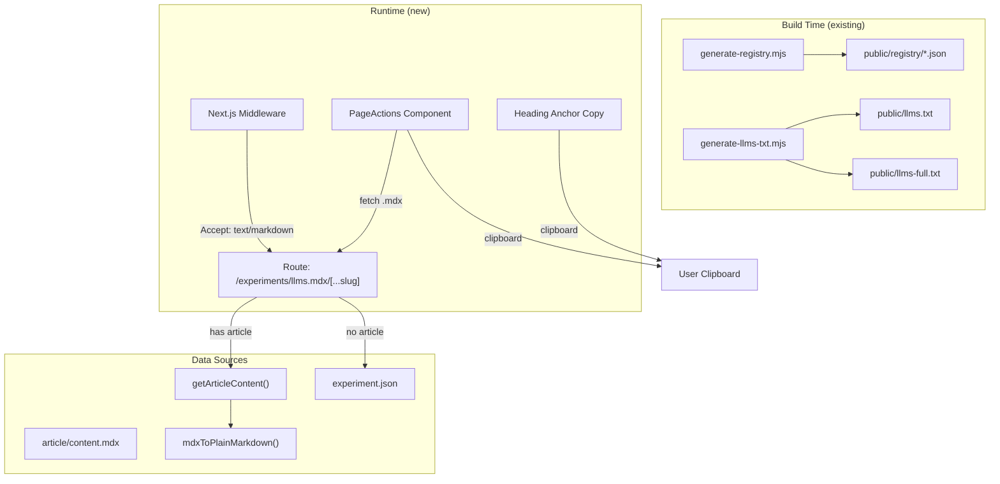

# Fumadocs-Inspired Content Export System

## Current State

You already have strong foundations:

- **Registry JSON**: `public/registry/<name>.json` with inline source code per experiment (shadcn-compatible)
- **llms.txt / llms-full.txt**: spec-compliant LLM discovery files at build time
- `**mdxToPlainMarkdown()`** in `src/lib/feed-utils.ts`: strips MDX syntax, preserves standard markdown -- used for RSS but **not exposed in UI**
- `**CodeBlock` copy button**: the only clipboard feature today
- `**rehype-slug`**: headings already get `id` attributes, but no UI to copy anchor links

## What to Add (Ranked by Impact)

### 1. Per-Page `.mdx` Endpoints (highest impact for AI agents)

Serve any article as raw processed Markdown by appending `.mdx` to its URL. This is the single most impactful Fumadocs pattern -- it makes your content directly consumable by AI agents, MCP tools, and LLM pipelines.

**Implementation:**

- Add a catch-all route handler at `src/app/experiments/llms.mdx/[...slug]/route.ts`
- Uses `getArticleContent(slug)` + `mdxToPlainMarkdown()` to serve `Content-Type: text/markdown`
- Add a Next.js rewrite in `next.config.ts`: `/experiments/<slug>/article.mdx` -> `/experiments/llms.mdx/<slug>`
- For experiments without articles, generate a metadata-only markdown summary from `experiment.json` (title, description, tags, tech, complexity, links)
- Set `revalidate = false` for static caching

**Output example** (`/experiments/basketball-replay-center/article.mdx`):

```markdown
# Basketball Replay Center (/experiments/basketball-replay-center)

Building a sports control room preloader with CRT shaders...

## The Concept
...full article content as clean markdown...
```

### 2. Article Page Actions (Copy as Markdown + View Options)

Add a small action bar to `ArticleLayout` with:

- **"Copy as Markdown"** button -- fetches the `.mdx` endpoint from (1) and copies to clipboard
- **"View Markdown"** link -- opens the `.mdx` URL in a new tab
- **"View Source"** link -- links to the experiment's registry JSON (`/registry/<slug>.json`)

**Implementation:**

- Create `src/components/mdx/PageActions.tsx` (client component)
- Add to [ArticleLayout](src/components/ui/ArticleLayout.tsx) below the header, above the article content
- Reuse the clipboard pattern from `CodeBlock.tsx` (with success/error feedback animation)

### 3. Copy Link to Heading

Every heading already has an `id` via `rehype-slug`. Add a hover-visible link icon that copies the anchor URL to clipboard.

**Implementation:**

- Modify the `h2` (and add `h3`) override in [components.tsx](src/components/mdx/components.tsx) `articleComponents`
- On hover: show a link icon (e.g. `#` or chain link) to the left of the heading
- On click: copy `window.location.origin + pathname + #heading-id` to clipboard, show brief toast/checkmark

### 4. Accept-Header Content Negotiation (middleware)

When an AI agent sends `Accept: text/markdown` to any article URL, serve the markdown version instead of the HTML page. Zero friction for AI consumers.

**Implementation:**

- Add logic to Next.js middleware (`src/middleware.ts` or create one)
- Use `fumadocs-core/negotiation`'s `isMarkdownPreferred()` pattern (or reimplement the simple header check: `accept.includes('text/markdown')` and `!accept.includes('text/html')`)
- Rewrite matching `/experiments/<slug>/article` requests to the `.mdx` endpoint from (1)
- Only applies to article routes, not experiment demo pages

### 5. Experiment Summary Markdown Endpoint

For experiments **without** articles, serve a structured markdown summary at `/experiments/<slug>.mdx`:

```markdown
# Experiment: Send Button

> Animated send button with particle burst and state transitions

- **Status**: shipped
- **Profile**: interaction
- **Complexity**: intermediate
- **Tags**: animation, button, micro-interaction
- **Tech**: motion, css
- **Created**: 2025-12-15
- **Demo**: https://www.razisyed.cv/experiments/send-button

## Source Files
- SendButton.tsx (registry:component)
- particles.ts (registry:lib)

## Install
\`\`\`bash
npx shadcn add https://www.razisyed.cv/registry/send-button.json
\`\`\`
```

**Implementation:**

- Extend the route handler from (1) to also handle experiment slugs without articles
- Pull metadata from `experiment.json`, file list from registry JSON
- Falls back gracefully: if an article exists, serves the article; if not, serves the summary

### 6. Enhanced llms.txt with Article Links

Currently `llms-full.txt` includes metadata per experiment but not article content. Enhance it to include:

- Links to `.mdx` endpoints for each experiment that has an article
- A `## Content Endpoints` section documenting the `.mdx` URL pattern

**Implementation:**

- Small addition to [generate-llms-txt.mjs](scripts/generate-llms-txt.mjs)
- Add `Article (Markdown): /experiments/<slug>/article.mdx` line to experiments that have articles
- Add a new section at the bottom documenting the content API

## Architecture




## Files to Create/Modify


| Action | File                                              | Purpose                               |
| ------ | ------------------------------------------------- | ------------------------------------- |
| Create | `src/app/experiments/llms.mdx/[...slug]/route.ts` | Per-page markdown endpoint            |
| Create | `src/components/mdx/PageActions.tsx`              | Copy-as-markdown + view options bar   |
| Create | `src/components/mdx/HeadingLink.tsx`              | Copyable heading anchor component     |
| Modify | `src/components/ui/ArticleLayout.tsx`             | Add PageActions to article chrome     |
| Modify | `src/components/mdx/components.tsx`               | Wire HeadingLink into h2/h3 overrides |
| Create | `src/middleware.ts` (or modify if exists)         | Accept-header content negotiation     |
| Modify | `next.config.ts`                                  | Add `.mdx` rewrite rule               |
| Modify | `scripts/generate-llms-txt.mjs`                   | Add `.mdx` endpoint references        |


## What We Explicitly Skip

- **fumadocs-registry package**: Your custom registry scripts are more powerful and tailored -- no reason to replace them
- **EPUB export**: Low priority for a creative coding lab; markdown covers the use cases
- **Ask AI chat dialog**: Out of scope, not aligned with the lab's purpose
- **fumadocs CLI component installer**: You have your own scaffolding system

