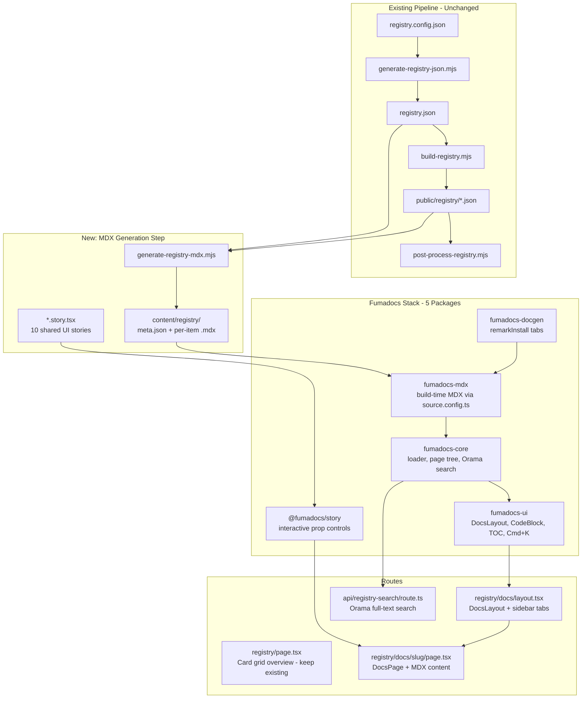

# Registry V2: Full Fumadocs Implementation

## What Exists (Built by Agents 1-3)

Three prior orchestrations shipped a lean foundation:

- **Data layer**: 3-step pipeline (`generate-registry-json.mjs` -> `build-registry.mjs` -> `post-process-registry.mjs`) producing 58 items across 4 categories as shadcn-compatible JSON
- **Curation**: [registry.config.json](registry.config.json) with featured/hidden/overrides/scan scope
- **UI layer**: `(registry)` route group with own `<html>/<body>`, responsive grid with category tabs + debounced search, detail page with Shiki highlighting, 5 custom components
- **Infrastructure**: noindex headers, CSP, OG images, GrainOverlay, analytics, "Browse Registry" link on homepage

**What's missing**: sidebar navigation, Cmd+K search, breadcrumbs, TOC with scroll spy, MDX prose authoring, code blocks with copy buttons, interactive component previews with prop controls, install command tabs (npm/pnpm/yarn/bun), dependency linking, related items.

---

## MDX Dual-Compilation: Non-Issue

The prior plan's "HIGH" risk assessment was wrong. The systems operate at completely different layers:

- **Articles** use `next-mdx-remote/rsc` -- **runtime** compilation from MDX strings inside server components. Lives in experiment route groups. No webpack/vite MDX loader.
- **fumadocs-mdx** uses a **build-time** Vite plugin in `source.config.ts`, scoped to `content/registry/` via `defineDocs({ dir: 'content/registry' })`. Does not touch any files outside that directory.

No conflict. Use the full stack.

---

## Architecture




---

## Phase 1: Dependencies + next.config.ts

**Install all 5 packages:**

```bash
npm i fumadocs-core fumadocs-ui fumadocs-mdx @fumadocs/story fumadocs-docgen
```

**Update [next.config.ts](next.config.ts):**

```typescript
import { createMDX } from 'fumadocs-mdx/next';

const nextConfig: NextConfig = {
  experimental: {
    optimizePackageImports: [
      // existing entries...
      'fumadocs-core', 'fumadocs-ui',
    ],
  },
  // ...existing config unchanged
};

export default createMDX()(nextConfig);
```

`createMDX()` adds the fumadocs-mdx Vite plugin that processes files in `content/registry/` (defined by `source.config.ts`). It does NOT touch `next-mdx-remote` runtime compilation.

---

## Phase 2: Source Configuration + MDX Components

**New file: `source.config.ts`** (project root):

```typescript
import { defineDocs, defineConfig } from 'fumadocs-mdx/config';
import { remarkInstall } from 'fumadocs-docgen';

export const registryDocs = defineDocs({
  dir: 'content/registry',
});

export default defineConfig({
  mdxOptions: {
    remarkPlugins: [remarkInstall],
  },
});
```

**New file: `src/lib/registry-source.ts`**:

```typescript
import { loader } from 'fumadocs-core/source';
import { createMDXSource } from 'fumadocs-mdx';
import { registryDocs } from '@/.source';

export const registrySource = loader({
  baseUrl: '/registry/docs',
  source: createMDXSource(registryDocs),
});
```

**New file: `mdx-components.tsx`** (project root -- required by fumadocs-mdx):

```tsx
import defaultComponents from 'fumadocs-ui/mdx';
import { CodeBlock, Pre } from 'fumadocs-ui/components/codeblock';
import { Tab, Tabs } from 'fumadocs-ui/components/tabs';
import { InstallCommand } from '@/components/registry/InstallCommand';
import { ExperimentPreview } from '@/components/registry/ExperimentPreview';
import { RegistryMeta } from '@/components/registry/RegistryMeta';
import type { MDXComponents } from 'mdx/types';

export function getMDXComponents(components?: MDXComponents): MDXComponents {
  return {
    ...defaultComponents,
    pre: ({ ref: _ref, ...props }) => (
      <CodeBlock {...props}>
        <Pre>{props.children}</Pre>
      </CodeBlock>
    ),
    Tab, Tabs,
    InstallCommand,
    ExperimentPreview,
    RegistryMeta,
    ...components,
  };
}
```

This registers all custom registry components as MDX components so they can be used in auto-generated MDX files.

---

## Phase 3: MDX Auto-Generation Pipeline

**New script: `scripts/generate-registry-mdx.mjs`**

This is the fourth pipeline step. Reads `registry.json` manifest + `public/registry/*.json` per-item data, outputs auto-generated MDX files to `content/registry/`.

**Output structure:**

```
content/registry/
  meta.json                      -- Root nav: category folders + separator
  experiments/
    meta.json                    -- "Experiments", pages: ["send-button", "..."]
    send-button.mdx              -- Auto-generated MDX stub
    404-not-found.mdx
    ...
  components/
    meta.json                    -- "Components", pages: ["button", "..."]
    button.mdx                   -- Auto-generated, references Button.story.tsx
    badge.mdx
    grain-overlay.mdx
    ...
  hooks/
    meta.json                    -- "Hooks", pages: ["use-mounted", "..."]
    use-mounted.mdx
    ...
  utilities/
    meta.json
    utils.mdx
    ...
```

**Auto-generated MDX template for experiments:**

```mdx
---
title: Send Button
description: A cool animated send button animation
---

<RegistryMeta
  type="registry:block"
  category="experiments"
  dependencies={["motion", "lucide-react", "@radix-ui/react-switch"]}
  registryDependencies={["razi-style"]}
  tags={["animation", "ui", "button"]}
  tech={["motion"]}
  fileCount={5}
/>

## Preview

<ExperimentPreview slug="send-button" title="Send Button" />

## Install

<InstallCommand slug="send-button" />

```package-install
motion lucide-react @radix-ui/react-switch
```

## Source

{/* Auto-generated fenced code blocks per file with language detection */}

```tsx title="SendButton.tsx"
// full source inlined from per-item JSON
```

```tsx title="AnimatedPlaceholder.tsx"
// ...
```

```

**Auto-generated MDX template for shared UI (with story):**

```mdx
---
title: Button
description: shadcn Button with variant/size CVA props
---

<RegistryMeta type="registry:component" category="components" ... />

## Preview

<story.WithControl />

## Install

<InstallCommand slug="button" />

## Source

```tsx title="button.tsx"
// source code
```

```

**Key behaviors:**
- Script checks if MDX file already exists with a `.generated` marker comment at the top. If the marker is absent, it's hand-authored -- **skip, do not overwrite**.
- If the marker is present, regenerate (it was auto-generated last time).
- `meta.json` files list pages in featured-first order (matching `registry.config.json`).
- `content/registry/.generated` directory marker added to `.gitignore` comment explaining these are build artifacts.

**Updated npm script:**

```json
{
  "generate:registry": "node scripts/generate-registry-json.mjs && node scripts/build-registry.mjs && node scripts/post-process-registry.mjs && node scripts/generate-registry-mdx.mjs"
}
```

---

## Phase 4: Route Structure

**New route hierarchy:**

```
src/app/(registry)/
  layout.tsx                      -- MODIFY: add RootProvider, keep own <html>/<body>
  registry.css                    -- MODIFY: add Fumadocs CSS imports
  registry/
    page.tsx                      -- KEEP: grid overview (outside DocsLayout)
    docs/
      layout.tsx                  -- NEW: DocsLayout wrapper with sidebar tabs
      [[...slug]]/
        page.tsx                  -- NEW: Fumadocs DocsPage
    [slug]/
      opengraph-image.tsx         -- KEEP/MOVE: adapt for both grid links and doc links
```

**Modify: [layout.tsx](src/app/(registry)**/layout.tsx)

Add `RootProvider` from `fumadocs-ui/provider` wrapping the body. Configure search API endpoint and dark theme. Keep the existing `<html>/<body>` root, custom fonts, analytics, GrainOverlay.

```tsx
import { RootProvider } from 'fumadocs-ui/provider';

export default function RegistryLayout({ children }: { children: React.ReactNode }) {
  return (
    <html lang="en" className="dark" suppressHydrationWarning>
      <body className={cn(fonts, 'min-h-screen bg-background text-foreground antialiased')}>
        <RootProvider
          search={{ enabled: true, options: { api: '/api/registry-search' } }}
          theme={{ defaultTheme: 'dark', enabled: false }}
        >
          {/* existing header */}
          <main>{children}</main>
          {/* existing footer */}
          <GrainOverlay />
        </RootProvider>
        {/* analytics scripts */}
      </body>
    </html>
  );
}
```

**New: `registry/docs/layout.tsx`**

DocsLayout wrapper for all doc pages. The grid overview page at `registry/page.tsx` sits outside this -- no sidebar on the overview.

```tsx
import { DocsLayout } from 'fumadocs-ui/layouts/docs';
import { registrySource } from '@/lib/registry-source';
import type { ReactNode } from 'react';

export default function DocsLayoutWrapper({ children }: { children: ReactNode }) {
  return (
    <DocsLayout
      tree={registrySource.getPageTree()}
      nav={{ title: "razi's registry", url: '/registry' }}
      sidebar={{
        defaultOpenLevel: 1,
        tabs: [
          { title: 'Experiments', url: '/registry/docs/experiments' },
          { title: 'Components', url: '/registry/docs/components' },
          { title: 'Hooks', url: '/registry/docs/hooks' },
          { title: 'Utilities', url: '/registry/docs/utilities' },
        ],
      }}
      links={[
        { text: 'Grid View', url: '/registry' },
      ]}
    >
      {children}
    </DocsLayout>
  );
}
```

**New: `registry/docs/[[...slug]]/page.tsx`**

```tsx
import { DocsPage, DocsBody, DocsTitle, DocsDescription } from 'fumadocs-ui/layouts/docs/page';
import { registrySource } from '@/lib/registry-source';
import { getMDXComponents } from '@/mdx-components';
import { notFound } from 'next/navigation';

export default async function Page({ params }: { params: Promise<{ slug?: string[] }> }) {
  const { slug } = await params;
  const page = registrySource.getPage(slug);
  if (!page) notFound();

  const MDXContent = page.data.body;

  return (
    <DocsPage
      toc={page.data.toc}
      lastUpdate={page.data.lastModified}
    >
      <DocsTitle>{page.data.title}</DocsTitle>
      <DocsDescription>{page.data.description}</DocsDescription>
      <DocsBody>
        <MDXContent components={getMDXComponents()} />
      </DocsBody>
    </DocsPage>
  );
}

export function generateStaticParams() {
  return registrySource.generateParams();
}

export async function generateMetadata({ params }: { params: Promise<{ slug?: string[] }> }) {
  const { slug } = await params;
  const page = registrySource.getPage(slug);
  if (!page) return {};
  return {
    title: page.data.title,
    description: page.data.description,
  };
}
```

**Update grid card links**: `RegistryCard.tsx` links should point to `/registry/docs/{category}/{slug}` instead of `/registry/{slug}` for the docs view. Keep the grid page as the landing, but cards navigate into the Fumadocs docs layout.

---

## Phase 5: Search API

**New file: `src/app/api/registry-search/route.ts`**

```typescript
import { registrySource } from '@/lib/registry-source';
import { createSearchAPI } from 'fumadocs-core/search/server';

export const { GET } = createSearchAPI('advanced', {
  indexes: registrySource.getPages().map((page) => ({
    title: page.data.title,
    description: page.data.description,
    url: page.url,
    id: page.url,
    structuredData: page.data.structuredData,
  })),
});
```

This gives Cmd+K full-text search across all 58 registry items for free. The search dialog is provided by `fumadocs-ui` and wired via `RootProvider`.

---

## Phase 6: CSS Theme Integration

**Update [registry.css](src/app/(registry)/registry.css):**

```css
@import '../../shared-tokens.css' layer(base);

@import 'tailwindcss';
@import 'fumadocs-ui/css/neutral.css';
@import 'fumadocs-ui/css/preset.css';
@import '@fumadocs/story/css/preset.css';
@import '../../shared-theme.css';

@source '../../../node_modules/fumadocs-ui/dist/**/*.js';

@custom-variant dark (&:is(.dark *));

@theme {
  /* Complete --color-fd-* mapping to site zinc palette */
  --color-fd-background: hsl(var(--background));
  --color-fd-foreground: hsl(var(--foreground));
  --color-fd-muted: hsl(var(--muted));
  --color-fd-muted-foreground: hsl(var(--muted-foreground));
  --color-fd-popover: hsl(var(--popover));
  --color-fd-popover-foreground: hsl(var(--popover-foreground));
  --color-fd-card: hsl(var(--card));
  --color-fd-card-foreground: hsl(var(--card-foreground));
  --color-fd-border: hsl(var(--border));
  --color-fd-primary: hsl(var(--primary));
  --color-fd-primary-foreground: hsl(var(--primary-foreground));
  --color-fd-secondary: hsl(var(--secondary));
  --color-fd-secondary-foreground: hsl(var(--secondary-foreground));
  --color-fd-accent: hsl(var(--accent));
  --color-fd-accent-foreground: hsl(var(--accent-foreground));
  --color-fd-ring: hsl(var(--ring));
}

/* Existing registry styles: scrollbar, selection, fade-in, Shiki overrides */
/* GrainOverlay: lower z-index to z-40 (below Fumadocs search dialog z-50) */
```

---

## Phase 7: @fumadocs/story

**New file: `src/lib/story.ts`** -- Story factory:

```typescript
import { createFileSystemCache, defineStoryFactory } from '@fumadocs/story';

export const { defineStory } = defineStoryFactory({
  cache: process.env.NODE_ENV === 'production'
    ? createFileSystemCache('.next/fumadocs-story')
    : undefined,
});
```

**10 story files to create** (alongside their components in `src/components/ui/`):


| Story File                    | Component         | Key Props for Controls                                                     |
| ----------------------------- | ----------------- | -------------------------------------------------------------------------- |
| `button.story.tsx`            | Button            | `variant` (6), `size` (4), `disabled`, `children`                          |
| `badge.story.tsx`             | Badge             | `variant` (4), `children`                                                  |
| `card.story.tsx`              | Card              | Compound composition with Header/Title/Description/Content/Footer          |
| `separator.story.tsx`         | Separator         | `orientation`, `decorative`                                                |
| `GrainOverlay.story.tsx`      | GrainOverlay      | `className` (opacity)                                                      |
| `ScrambleTicker.story.tsx`    | ScrambleTicker    | `text`, `align`, scramble params                                           |
| `LiquidGlassFilter.story.tsx` | LiquidGlassFilter | `width`, `height`, `radius`, `border`, `blockOutBlur`, `displacementScale` |
| `wave-background.story.tsx`   | Waves             | `strokeColor`, `backgroundColor`, `pointerSize`                            |
| `ViewModeToggle.story.tsx`    | ViewModeToggle    | `viewMode`                                                                 |
| `LottieWeatherIcon.story.tsx` | LottieWeatherIcon | `code`, `isNight`                                                          |


Each story file follows this pattern:

```tsx
import { defineStory } from '@/lib/story';
import { Button } from './button';

export const story = defineStory(import.meta.url, {
  Component: Button,
  args: [
    { variant: 'Default', initial: { variant: 'default', size: 'default', children: 'Click me' } },
    { variant: 'Destructive', initial: { variant: 'destructive', children: 'Delete' } },
    { variant: 'Outline', initial: { variant: 'outline', children: 'Outline' } },
    { variant: 'Ghost', initial: { variant: 'ghost', children: 'Ghost' } },
  ],
});
```

Story files are referenced in auto-generated MDX via `<story.WithControl />` for components that have stories.

---

## Phase 8: Rich Detail Pages

The MDX content rendered inside `DocsPage` already gets:

- **Sidebar navigation** (from DocsLayout)
- **Breadcrumbs** (`Registry > Components > Button`)
- **TOC with scroll spy** (from `page.data.toc`)
- **Code blocks with copy buttons** (from Fumadocs `CodeBlock`/`Pre` in `mdx-components.tsx`)
- **Install command tabs** (from `remarkInstall` generating npm/pnpm/yarn/bun tabs)

Additional enhancements for the detail page MDX template:

1. **Dependency linking**: In `RegistryMeta`, `registryDependencies` items link to their docs page (`/registry/docs/styles/razi-style`). npm dependencies link to npmjs.com.
2. **Related items section**: Auto-generate a "Related" section at the bottom of each MDX stub showing items in the same category or with overlapping tags. Render as a mini card grid.
3. **Viewport toggle for experiments**: Keep the existing `ExperimentPreview` viewport switcher (desktop/tablet/mobile) -- it's already well-built.
4. **Per-file code sections**: Each source file gets its own fenced code block with the filename as `title`, language auto-detected from extension. Files grouped under a `## Source` heading that appears in the TOC.

---

## Phase 9: Polish

**OG images**: Move `opengraph-image.tsx` to work with the `[[...slug]]` catch-all route. Update to extract category from the slug path.

**Analytics**: Add Umami `data-umami-event` attributes to:

- Search dialog interactions
- Sidebar navigation clicks
- Code block copy buttons
- Install command copy
- Story prop control changes
- "Open Full Page" on experiment previews

**View transitions**: Install `next-view-transitions` and wrap the registry layout with `<ViewTransitions>`. Add `transition-`* CSS classes to page content for smooth cross-page animations within the registry.

---

## Phase 10: Verification

- `tsc --noEmit` -- 0 type errors
- `npm run build` -- successful build, all registry pages generate
- `npm run generate:registry` -- full pipeline including new MDX step
- All `/registry/docs/`* pages return 200
- Grid overview page still works at `/registry`
- Sidebar navigation works with category tabs
- Cmd+K search returns results and navigates correctly
- Breadcrumbs render `Registry > Category > Item`
- TOC scroll spy highlights active heading
- Code blocks have working copy buttons
- `@fumadocs/story` previews render with interactive controls for all 10 components
- Install command tabs show npm/pnpm/yarn/bun variants
- GrainOverlay doesn't block search dialog or mobile sidebar
- First Load JS for registry pages < 150KB gzip
- Responsive: sidebar collapses to sheet on mobile, grid adapts

**Post-ship updates:**

- Update [AGENTS.md](AGENTS.md) to document `content/registry/` convention and Fumadocs integration
- Update [backlog t2-content-registry.md](.agents/backlog/t2-content-registry.md) to check off Registry V2
- Update [memory.md](memory.md) with new workspace facts

---

## Files Summary

**New files (~25):**


| File                                                     | Purpose                                                         |
| -------------------------------------------------------- | --------------------------------------------------------------- |
| `source.config.ts`                                       | Fumadocs MDX content source config                              |
| `mdx-components.tsx`                                     | MDX component overrides (CodeBlock, custom registry components) |
| `src/lib/registry-source.ts`                             | Fumadocs source loader                                          |
| `src/lib/story.ts`                                       | @fumadocs/story factory with filesystem cache                   |
| `src/lib/layout.shared.tsx`                              | Shared DocsLayout configuration                                 |
| `scripts/generate-registry-mdx.mjs`                      | MDX auto-generation from registry JSON                          |
| `src/app/(registry)/registry/docs/layout.tsx`            | DocsLayout wrapper                                              |
| `src/app/(registry)/registry/docs/[[...slug]]/page.tsx`  | Fumadocs doc page                                               |
| `src/app/api/registry-search/route.ts`                   | Orama search endpoint                                           |
| `content/registry/meta.json`                             | Root navigation structure                                       |
| `content/registry/experiments/meta.json`                 | Experiments nav                                                 |
| `content/registry/components/meta.json`                  | Components nav                                                  |
| `content/registry/hooks/meta.json`                       | Hooks nav                                                       |
| `content/registry/utilities/meta.json`                   | Utilities nav                                                   |
| `content/registry/**/*.mdx`                              | ~58 auto-generated MDX stubs                                    |
| `src/components/ui/button.story.tsx`                     | Button story                                                    |
| `src/components/ui/badge.story.tsx`                      | Badge story                                                     |
| `src/components/ui/card.story.tsx`                       | Card story                                                      |
| `src/components/ui/separator.story.tsx`                  | Separator story                                                 |
| `src/components/ui/GrainOverlay.story.tsx`               | GrainOverlay story                                              |
| `src/components/ui/ScrambleTicker.story.tsx`             | ScrambleTicker story                                            |
| `src/components/ui/LiquidGlassFilter.story.tsx`          | LiquidGlassFilter story                                         |
| `src/components/ui/wave-background.story.tsx`            | Waves story                                                     |
| `src/components/ui/experiments/ViewModeToggle.story.tsx` | ViewModeToggle story                                            |
| `src/components/ui/LottieWeatherIcon.story.tsx`          | LottieWeatherIcon story                                         |


**Modified files (~6):**


| File                                       | Change                                                                       |
| ------------------------------------------ | ---------------------------------------------------------------------------- |
| `package.json`                             | Add 5 fumadocs deps + next-view-transitions, update generate:registry script |
| `next.config.ts`                           | Wrap with `createMDX()`, add fumadocs to optimizePackageImports              |
| `src/app/(registry)/layout.tsx`            | Add RootProvider with search + theme config                                  |
| `src/app/(registry)/registry.css`          | Fumadocs CSS imports, @source directive, --color-fd-* theme mapping          |
| `src/components/registry/RegistryCard.tsx` | Update links to point to `/registry/docs/{category}/{slug}`                  |
| `src/components/registry/RegistryMeta.tsx` | Add dependency linking (registry deps -> doc pages, npm deps -> npmjs)       |


**Deleted/replaced:**


| File                                          | Replaced by                                              |
| --------------------------------------------- | -------------------------------------------------------- |
| `src/app/(registry)/registry/[slug]/page.tsx` | `registry/docs/[[...slug]]/page.tsx` (Fumadocs DocsPage) |


**Kept unchanged:**


| File                                                     | Why                                                |
| -------------------------------------------------------- | -------------------------------------------------- |
| `src/app/(registry)/registry/page.tsx`                   | Grid overview stays as-is, outside DocsLayout      |
| `src/components/registry/RegistryGrid.tsx`               | Working well, keeps its own search + category tabs |
| `src/components/registry/InstallCommand.tsx`             | Reused as MDX component                            |
| `src/components/registry/ExperimentPreview.tsx`          | Reused as MDX component                            |
| `src/app/(registry)/registry/[slug]/opengraph-image.tsx` | May need path adaptation for docs routes           |
| All 3 pipeline scripts                                   | Unchanged; 4th script added                        |
| `registry.config.json`                                   | Unchanged                                          |


---

## Execution Strategy

This is a large implementation (~25 new files, ~6 modified). Recommended execution via parallel-orchestration:

**Batch 1 (Foundation -- sequential, must be first):**

- Domain 1: Dependencies + next.config.ts + source.config.ts + mdx-components.tsx + registry-source.ts + story.ts
- Domain 2: CSS theme integration (registry.css full rewrite with Fumadocs imports)

**Batch 2 (Content + Routes -- parallel after Batch 1):**

- Domain 3: MDX generation script + content/registry/ output
- Domain 4: Route structure (docs/layout.tsx, docs/[[...slug]]/page.tsx, layout.tsx RootProvider)
- Domain 5: Search API route

**Batch 3 (Features -- parallel after Batch 2):**

- Domain 6: 10 story files for shared UI components
- Domain 7: Detail page enhancements (RegistryMeta linking, RegistryCard link updates, related items)
- Domain 8: OG images, analytics, view transitions

**Batch 4 (Verification):**

- Domain 9: Full QA pass, build verification, documentation updates

