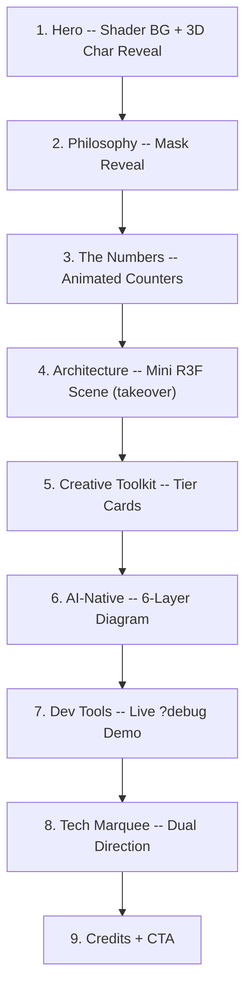

# Transform kinetic-typography-scroll into "Introducing V2"

## What This Is

Repurpose the existing `kinetic-typography-scroll` experiment into an interactive "Introducing V2 of Razi's Experiments" showcase. It becomes both a portfolio piece and a technical demo, weaving real platform stats and features into a scroll-driven narrative with 3D, shaders, and the full creative toolkit on display.

Debug tools (`?debug`: leva, GSDevTools, device info) are **intentionally kept in production** so visitors can try them out.

---

## Section Architecture (9 Sections)

### Section 1: Hero (full viewport, shader background)

- Title: "RAZI'S EXPERIMENTS" with subtitle "V2" -- char-by-char 3D rotateX reveal scrubbed to scroll
- **Shader element**: A live noise/gradient WebGL background behind the text using a small `<canvas>` with a custom GLSL fragment shader (simplex noise + time uniform, subtle scroll-reactive color shift). Not R3F -- standalone WebGL for minimal overhead.
- "Scroll to explore" prompt fades on scroll
- Technique: 3D char reveal + parallax + live GLSL shader

### Section 2: Philosophy (mask reveal)

- "Tooling enables creativity, never limits it. Fight entropy."
- "Every experiment should be close to publishable -- as an article, a package, or a client deliverable."
- Line-by-line `yPercent: 100 -> 0` mask reveal from `overflow-hidden` wrappers
- Medium copy: 2-3 sentences about the design philosophy

### Section 3: The Numbers (staggered counters)

- Animated stat counters that tick up as you scroll into view:
  - **19** experiments / **7** profiles / **18** technologies / **33** agent configs / **28** plans / **6** config layers
- Each stat has a label below it. Grid layout.
- Technique: `gsap.to` with `snap: { textContent: 1 }` for counter animation + stagger

### Section 4: Architecture (R3F scene, full viewport takeover)

- **R3F element**: A mini Three.js scene showing the route group isolation concept -- 3-4 floating translucent cubes/cards, each labeled with an experiment name, orbiting slowly. On scroll, they spread apart to visualize "isolation."
- Medium copy overlay: brief explanation of route group isolation (`<html>`/`<body>` per experiment)
- Uses `@react-three/fiber` + `@react-three/drei` (Text, Float, MeshTransmissionMaterial or simple glass)
- Pinned section with scroll-driven animation of the cubes spreading

### Section 5: Creative Toolkit (scrolling tier cards)

- Three tiers displayed as card groups:
  - **Tier 1 (Core)**: Lenis, Tempus, Hamo, GSAP, Motion, R3F, Drei
  - **Tier 2 (Domain)**: leva, postprocessing, rapier, Theatre.js, etc.
  - **Tier 3 (UI)**: motion-primitives, animate-ui, Cambio
- Cards stagger-reveal on scroll entry (ScrollTrigger.batch pattern)
- Medium copy: 1-2 sentences per tier explaining when each is used

### Section 6: AI-Native Config (6-layer progressive reveal)

- Pinned section showing the 6 config layers loading in sequence:
  1. AGENTS.md (always on)
  2. Rules (6, path-conditioned)
  3. Profiles (6, per experiment type)
  4. Skills (8, on-demand)
  5. Workflows (7, step-by-step)
  6. Contexts (3, background reference)
- Each layer animates in with a clip-path wipe + label, stacked vertically
- Medium copy: 1 sentence per layer

### Section 7: Dev Tools Demo (interactive, breaks fourth wall)

- Header: "Try It Yourself" with subtext "Add `?debug` to the URL"
- Explains what the debug tools do (leva panel, GSDevTools, device info overlay)
- If `?debug` IS active, a callout says "You're already in debug mode -- see the panel?"
- If NOT active, a callout invites the user to add `?debug`
- Detect via `useSearchParams` or `window.location.search`
- This is the section where leva controls are explicitly shown and explained

### Section 8: Tech Marquee (dual-direction)

- Two rows scrolling opposite directions with tech names from the platform
- Row 1: library names (GSAP, Lenis, Three.js, Motion, Tempus...)
- Row 2: technique names (ScrollTrigger, Shaders, R3F, Kinetic Type...)
- Velocity-based skew effect

### Section 9: Credits + CTA

- "Built by Razi Syed" + year + tech stack
- Link to GitHub repo / portfolio
- "FIN" outro fade
- Staggered credit rows

---

## Foundational Fixes (from audit)

These fixes are applied during the rewrite, not as separate steps.

### Critical

- **Hero trigger geometry**: Change to `start: "top top"` / `end: "20% top"` so the reveal actually plays during initial scroll
- **FOUC prevention**: Add `opacity-0` class in JSX to all elements that `gsap.set`/`gsap.from` will animate (hero chars, manifesto lines, credit rows, outro text)

### High

- **Remove `clipPath` animation**: Replace manifesto clip-path wipe with `overflow-hidden` + `translateX` mask pattern (compositor-friendly)
- **Scramble -> ref-based mutation**: Replace `useState`/`setScrambleDisplay` with a ref that mutates `textContent` directly (no React re-renders during scroll)
- **Leva intentionally in production**: Per the user's request, leva stays in the production bundle. Add a code comment documenting this is intentional for this experiment's "try the debug tools" feature. Still needs SSR safety (`typeof window` guard or dynamic import with `ssr: false`).

### Medium

- **Effect ordering**: Move Lenis creation to `useLayoutEffect` so it runs before/alongside `useGSAP`
- **Color contrast**: Use `text-neutral-400` instead of `text-neutral-600` for helper text (passes AA 4.5:1 on `#050505`)
- `**quickTo` cleanup**: Store handler reference, explicitly unbind Lenis listener and kill quickTo tween

### Not fixing (intentional for this experiment)

- Static GSAP imports -- acceptable for a route-isolated experiment that uses GSAP in every section
- Dynamic import adds complexity for no real benefit here since GSAP is needed immediately

---

## File Changes

### Primary: `[src/components/experiments/kinetic-typography-scroll/KineticTypographyScroll.tsx](src/components/experiments/kinetic-typography-scroll/KineticTypographyScroll.tsx)`

- Full rewrite with 9 sections, new content, all fixes applied
- Extract into sub-components for the R3F scene and shader canvas

### New: `src/components/experiments/kinetic-typography-scroll/HeroShaderCanvas.tsx`

- Standalone WebGL canvas with a simplex noise fragment shader
- Responds to scroll position (uniform) for color shift
- `requestAnimationFrame` loop with proper cleanup

### New: `src/components/experiments/kinetic-typography-scroll/ArchitectureScene.tsx`

- R3F `<Canvas>` with floating cubes/cards
- Scroll-driven spread animation via `useFrame` + scroll progress ref
- Uses Drei helpers (Text, Float, RoundedBox)

### Update: `[src/components/experiments/kinetic-typography-scroll/KineticTypographyScroll.test.tsx](src/components/experiments/kinetic-typography-scroll/KineticTypographyScroll.test.tsx)`

- Update assertions to match new "Introducing V2" content
- Add matchMedia mock
- Keep smoke-test approach (rendering, not animation logic)

### Update: `[src/app/experiments/(kinetic-typography-scroll)/experiment.json](src/app/experiments/(kinetic-typography-scroll)`/experiment.json)

- Title: "Introducing V2" (or "Razi's Experiments V2")
- Description: updated to reflect the showcase nature
- Tags: add "showcase", "3d", "shader"
- Tech: add "r3f", "three.js", "glsl" alongside existing gsap/lenis/tempus
- Keep `status: "wip"` until user visually validates

### Template fixes: `[plop-templates/experiment/profiles/scrollytelling/component.tsx.hbs](plop-templates/experiment/profiles/scrollytelling/component.tsx.hbs)`

- Add `opacity-0` class to elements that will be GSAP-animated (prevents FOUC for future experiments)
- This is the only template fix worth doing now; static GSAP imports and leva guards are broader decisions

---

## Agent Docs: Video Generation Cleanup

The search found that **actual agent config files are already aligned with the manual video approach**. The only two references to "automated short video captures" are in old plan files (historical records):

1. `[.cursor/plans/experiments_platform_v2_d73b9769.plan.md` line 364](`.cursor/plans/experiments_platform_v2_d73b9769.plan.md`) -- "short video captures" in Social Assets vision
2. `[.cursor/plans/pending_items_inventory_bd3e2842.plan.md` line 83](`.cursor/plans/pending_items_inventory_bd3e2842.plan.md`) -- repeats the same

**Recommendation**: These are completed plan files documenting historical aspirations. Editing them retroactively would alter the build history record. Instead, add a note to `STATUS.md` in the Known Gaps section clarifying that preview video recording is intentionally manual (not a gap to automate). The "MCP capture server" references in STATUS.md and plans are about screenshots, not video, and are accurate.

---

## Visual Honesty Note

The R3F scene (Section 4) and GLSL shader (Section 1) involve 3D rendering and visual effects that cannot be verified by an AI agent. The implementation follows patterns from the r3f-best-practices skill and awwwards-animations skill. After implementation, visually validate:

- Shader renders and responds to scroll (no black canvas, no WebGL errors)
- R3F scene shows floating elements that spread on scroll
- All 9 sections animate correctly during scroll-through
- `?debug` mode activates leva/GSDevTools as expected
- FPS stays >55 in `[DevMetrics]` console output

