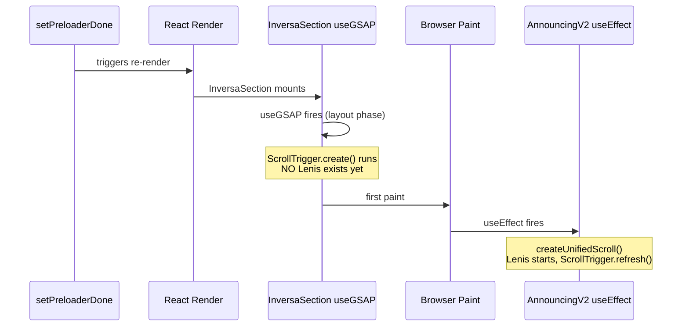
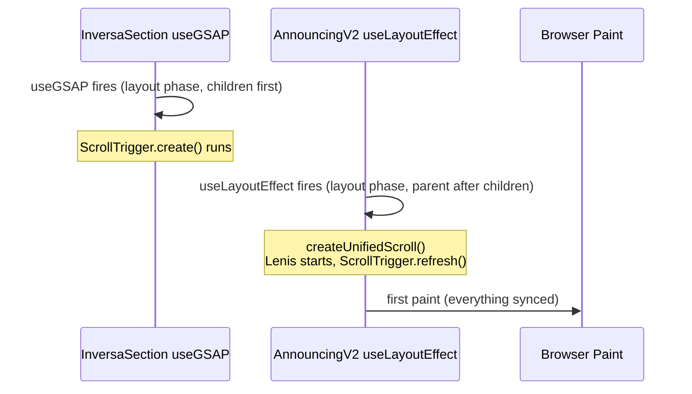

# Inversa Section Bug Analysis

Sources consulted:

- Porting skill: `.agents/skills/porting-demos/SKILL.md` (Phase 4 CSS Fidelity, Phase 5 Common Pitfalls)
- Scroll rules: `.agents/rules/scroll.md` (`useLayoutEffect` for `createUnifiedScroll`)
- Animation rules: `.agents/rules/animations.md` (ScrollTrigger patterns, timing)
- Lenis skill: `.agents/skills/lenis-scroll/SKILL.md` (Tempus integration, ScrollTrigger.refresh)
- Transformation reference: `.agents/skills/porting-demos/transformations.md`

---

## Bug 1: Block Count Mismatch (Critical -- Root Cause)

Per the porting skill Phase 0 ("Trace execution order... Map the timeline of events"), the original's animation phases were precision-choreographed for exactly 4 scroll-pages. The port broke this by adding a 5th content block.

**Original** ([page.js](codegrid-inversa-scroll-animation-nextjs/src/app/page.js)):

- 4 `hero-content-block` elements: title, "Coordinate Mapping", "Active Locations", "Spatial Center"
- CSS: `height: 400svh` (4 blocks x 100svh)
- ScrollTrigger: `end: window.innerHeight * 4`
- Content blocks align at progress 0%, 25%, 50%, 75%

**Port** ([data.ts](src/components/experiments/announcing-v2/data.ts) lines 103-121):

- `INVERSA_CONTENT.blocks` has **4 items** + 1 title block = **5 total**
- `BLOCK_COUNT = 1 + 4 = 5`
- JSX: `height: 500svh`, ScrollTrigger: `end: window.innerHeight * 5`
- Content blocks align at progress 0%, 20%, 40%, 60%, 80%

The extra block (`"Final State"` at data.ts line 118) stretches the scroll range by 25%.

### Why this breaks every animation channel

All 6 animation channels in [useInversaScroll.ts](src/components/experiments/announcing-v2/hooks/useInversaScroll.ts) use hardcoded progress breakpoints calibrated for 4-page scroll:

**Original block-to-progress alignment (4x scroll):**

- Block 1 (title): progress 0-0.25
- Block 2 (Coordinate Mapping): progress 0.25-0.50
- Block 3 (Active Locations): progress 0.50-0.75 -- **analysis phase aligns here**
- Block 4 (Spatial Center): progress 0.75-1.00

**Port block-to-progress alignment (5x scroll):**

- Block 1 (title): progress 0-0.20
- Block 2 (Coordinate Mapping): progress 0.20-0.40
- Block 3 (Active Locations): progress 0.40-0.60
- Block 4 (Spatial Center): progress 0.60-0.80
- Block 5 (Final State): progress 0.80-1.00 -- **no animation coverage here**

The desaturation (0.4-0.5) now fires during block 3 instead of at the block 2-3 transition. The analysis phase (0.5-0.75) spans the middle of block 3 through block 4 instead of covering blocks 3-4 exactly. The "Final State" block scrolls through with nothing happening -- no mask change, no saturation change, no markers.

### Fix

**Option A (recommended):** Remove the "Final State" block from `INVERSA_CONTENT.blocks` in [data.ts](src/components/experiments/announcing-v2/data.ts). This restores the original 4-block structure with zero changes to animation code. If the "Final State" content is important, fold it into the outro section text instead.

**Option B (complex):** Keep 5 blocks and recalibrate ALL breakpoints:

- `useInversaScroll.ts`: image pan breakpoints (0.45, 0.75), grid/marker `phaseValue` calls
- `useDevControls` defaults: desatStart/desatEnd/resatStart/resatEnd
- Would need to decide what visual treatment block 5 gets

Option A preserves the original's proven choreography. Option B is a full re-choreography.

---

## Bug 2: Lenis Initialization Timing (Secondary)

The porting skill Phase 5 (Common Pitfalls) flags this exact pattern:

> "Animation never runs: Refs null when `useGSAP` callback runs"

The scroll rules (`.agents/rules/scroll.md`) specify `useLayoutEffect` as the canonical pattern for `createUnifiedScroll`. The port uses `useEffect`.

React effects fire **children-first**. Current mount sequence:




**Original** ([page.js](codegrid-inversa-scroll-animation-nextjs/src/app/page.js)):

- `<ReactLenis root />` rendered directly in JSX -- Lenis is always present in the component tree when `useGSAP` fires

**Port** ([AnnouncingV2.tsx](src/components/experiments/announcing-v2/AnnouncingV2.tsx) lines 28-44):

- Lenis created in parent's `useEffect` (fires AFTER paint, after all children's layout effects)
- ScrollTrigger created and measured without Lenis active
- `ScrollTrigger.refresh()` called afterward to re-sync, but there's a frame gap

### Fix

**Change `useEffect` to `useLayoutEffect`** in [AnnouncingV2.tsx](src/components/experiments/announcing-v2/AnnouncingV2.tsx) line 28. This matches the scroll rules canonical pattern:

```tsx
// scroll.md canonical pattern:
// In useLayoutEffect:
const handle = createUnifiedScroll({ debug: isDebug });
```

With `useLayoutEffect`, the sequence becomes:




Lenis still initializes after the child's ScrollTrigger, but `ScrollTrigger.refresh()` runs before paint -- no visual flash. This is the best we can do with the orchestrator + sections architecture from the porting skill's multi-demo showcase pattern.

---

## Bug 3: CSS Fidelity Gap (Minor)

Per porting skill Phase 4 ("Do not add properties the original does not have. Diff every selector"):

**Original** ([globals.css](codegrid-inversa-scroll-animation-nextjs/src/app/globals.css) line 227-228):

```css
.hero-content .hero-content-block:nth-child(3) {
  align-items: center;
}
```

Block 3 has `align-items: center` only (no `justify-content`).

**Port** ([inversa-section.css](src/components/experiments/announcing-v2/sections/inversa-section.css) lines 184-187):

```css
.inversa-hero-content-block:nth-child(3),
.inversa-hero-content-block:nth-child(5) {
  align-items: center;
}
```

This is correct for block 3 (matches original). Block 5 doesn't exist in the original. If block 5 is removed (Bug 1 fix), this selector becomes dead CSS -- harmless but should be cleaned up.

However, the original's block 4 selector also differs subtly:

**Original**: `.hero-content .hero-content-block:nth-child(4)` is grouped with `:nth-child(2)` and gets `justify-content: flex-end; align-items: center`

**Port**: `.inversa-hero-content-block:nth-child(4)` is grouped with `:nth-child(2)` and gets `align-items: center; justify-content: flex-end` -- same properties, just different order. This is a non-issue (CSS property order doesn't matter).

### Fix

After fixing Bug 1 (removing block 5), remove the `:nth-child(5)` selector from [inversa-section.css](src/components/experiments/announcing-v2/sections/inversa-section.css) lines 185-186.

---

## Non-Issues (Correctly Ported)

CSS fidelity audit (porting skill Phase 4) confirms these match the original:

- `smoothEase` function -- identical smoothstep `x * x * (3 - 2 * x)`
- `phaseValue` utility -- correct fade-in/hold/fade-out envelope matching original's if/else chains
- CSS mask technique (`mask-composite: subtract`, `-webkit-mask-composite: subtract`) -- identical
- CSS class prefixing (`inversa-` namespace) -- correct isolation per porting skill Phase 4
- Dev controls default values (2.5, 1, 0.4, 0.5, 0.75, 0.85) match original hardcoded values
- Layer stacking order (image -> mask -> grid overlay -> markers -> content -> progress bar) -- correct
- Image pan 3-phase logic (0-0.45 ease up, 0.45-0.75 hold, 0.75-1.0 resume) -- correct math
- Marker positioning (`top: 50svh/35svh`, `left: 50vw/60vw`) -- matches original
- Progress bar CSS variable pattern (`--progress` driving `scaleY`) -- identical
- Responsive breakpoint at 800px -- matches original
- Reduced motion handling -- correctly uses `gsap.set` to reveal content (per animation rules)

