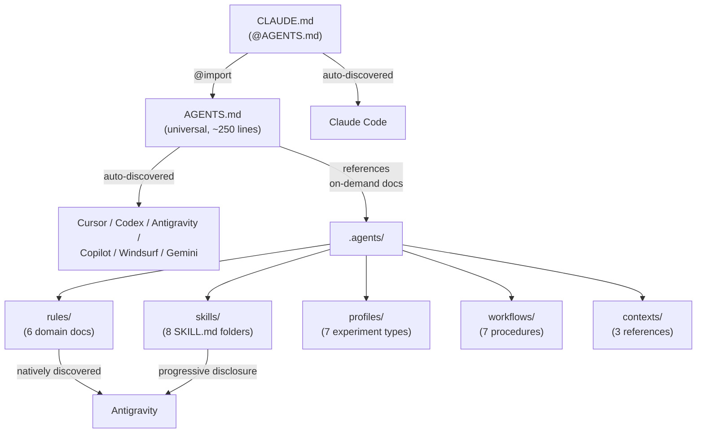

# KISS Agent Configuration (steipete-inspired)

## Philosophy

> "Whatever I wanna build, it starts as CLI. Agents can call it directly and verify output -- closing the loop." -- [Peter Steinberger](https://steipete.me/posts/2025/shipping-at-inference-speed)

One file works everywhere. Add complexity only when you feel the pain, not before. [steipete/agent-scripts](https://github.com/steipete/agent-scripts) (2.2K stars) proves this: a single AGENTS.MD + skills/ + docs/ covers Codex, Cursor, Antigravity, and everything else.

## Final File Layout

```
experiments/
  AGENTS.md                    # Universal source of truth (~200-300 lines)
  CLAUDE.md                    # @AGENTS.md import (trivial, ~5 lines)
  .agents/                     # Reference library (renamed from .agent/)
    rules/                     # Domain docs -- plain markdown, no tool frontmatter
      animations.md            # Read when editing animation components
      r3f.md                   # Read when editing R3F/3D components
      shaders.md               # Read when editing shaders
      scroll.md                # Read when editing scroll experiments
      performance.md           # Read when editing performance-critical code
      experiments.md           # Read always -- experiment isolation rules
    skills/                    # SKILL.md folder format (Antigravity + standard)
      gsap-modern/SKILL.md
      lenis-scroll/SKILL.md
      motion-react/SKILL.md
      r3f-core/SKILL.md
      shader-authoring/SKILL.md
      tempus-raf/SKILL.md
      vercel-react-best-practices/SKILL.md
      visual-qa/SKILL.md
    profiles/                  # Unchanged (7 files)
    workflows/                 # Unchanged (7 files)
    contexts/                  # Unchanged (3 files)
```

**No `.cursor/rules/`.** No `.claude/rules/`. No `.agents/rules/` frontmatter. Just content.

## How Each Tool Gets What It Needs

- **Cursor**: Reads root `AGENTS.md` automatically. AGENTS.md references `.agents/` docs. When editing shaders, the model reads `.agents/rules/shaders.md` because AGENTS.md tells it to.
- **Codex**: Reads root `AGENTS.md`. Same reference pattern.
- **Antigravity**: Reads root `AGENTS.md` (priority 1). Natively discovers `.agents/rules/` (activation configured via UI: Glob, Model Decision, Always On). Natively discovers `.agents/skills/*/SKILL.md` (progressive disclosure).
- **Claude Code**: Reads `CLAUDE.md` which `@`-imports `AGENTS.md`. Reads `.agents/` docs when directed.
- **Copilot, Windsurf, Gemini/Jules**: Read `AGENTS.md`. Same reference pattern.




## Root AGENTS.md Design (~250 lines)

Self-contained. Any tool that only reads this one file can work effectively. Follows [GitHub's 6-area framework](https://github.blog/ai-and-ml/github-copilot/how-to-write-a-great-agents-md-lessons-from-over-2500-repositories/) with commands early, code examples, specific versions, clear boundaries.

### Section outline

1. **Identity + philosophy** (3 lines) -- creative coding lab, URL, "fight entropy"
2. **Commands** (~30 lines) -- every npm script with flags, starting with dev/build/test
3. **Tech stack** (~15 lines) -- specific versions from package.json
4. **Project structure** (~25 lines) -- three-location rule, route group isolation, experiment.json schema, file naming. Include the core isolation guarantees from `.agent/rules/experiments.md` (no cross-experiment imports, no global state pollution, shared UI read-only, always scaffold with `npm run new:experiment`) since these are foundational enough to live in AGENTS.md directly.
5. **Code style** (~25 lines) -- TypeScript, React, imports, component size discipline (200 target / 300 hard limit), decomposition pattern (orchestrator + sections + data.ts), dynamic imports
6. **Animation + creative standards** (~20 lines) -- timing, easing, reduced motion, vocabulary diversity
7. **UX standards** (~10 lines) -- Laws of UX distilled: Fitts's Law (generous hit areas), Hick's Law (progressive disclosure), Miller's Law (chunk data), Doherty Threshold (<400ms), Postel's Law (accept messy input, output clean)
8. **Testing** (~10 lines) -- Vitest, testing-library, JSDOM, colocation
9. **Git workflow** (~15 lines) -- conventional commits, lefthook, stealth mode
10. **Guardrails** (~20 lines) -- 2-iteration limit, visual honesty, pre-commit, bug fix scope, context hygiene
11. **Boundaries** (~15 lines) -- always / ask first / never (three-tier)
12. **Constraints** (~15 lines) -- legacy experiments untouchable, no cross-experiment imports, wip filtering, Biome deliberately permissive. Include known deferred items so agents don't try to fix them: Cursor.tsx perf bug, Biome strictness tightening, useExhaustiveDependencies enforcement, ArticleLayout TOC.
13. **Reference docs** (~30 lines) -- `.agents/` directory map with `read when` hints

### The "read when" pattern (steipete's docs/ approach)

Instead of tool-specific frontmatter, AGENTS.md maps domain docs with plain English hints. From [steipete's workflow](https://steipete.me/posts/2025/shipping-at-inference-speed): "I use a script + some instructions in my global AGENTS file to force the model to read docs on certain topics."

Example section in AGENTS.md:

```markdown
## Reference Docs (.agents/)

Read the relevant doc BEFORE working in that domain:

| Domain | File | Read when |
|--------|------|-----------|
| Animation | .agents/rules/animations.md | Editing components with GSAP, Motion, or scroll-driven animation |
| R3F / 3D | .agents/rules/r3f.md | Editing R3F scenes, Canvas, useFrame, drei components |
| Shaders | .agents/rules/shaders.md | Editing .glsl/.frag/.vert files or ShaderMaterial |
| Scroll | .agents/rules/scroll.md | Using Lenis, ScrollTrigger, or createUnifiedScroll |
| Performance | .agents/rules/performance.md | Optimizing render, bundle, or runtime performance |
| Experiments | .agents/rules/experiments.md | Creating or modifying any experiment (always read) |

Profile-specific guidance: read experiment.json "profile" field, then .agents/profiles/<profile>.md
Skills: .agents/skills/<name>/SKILL.md for library-specific patterns
Workflows: .agents/workflows/<name>.md for step-by-step procedures
Architecture: .agents/contexts/architecture.md
Toolkit inventory: .agents/contexts/toolkit.md
```

## CLAUDE.md Design (~5 lines)

```md
@AGENTS.md

# Claude Code
Deep context in .agents/ -- profiles, skills, workflows, contexts.
Read experiment.json "profile" field to find the right .agents/profiles/ doc.
```

## Changes from Current State

### Rename: `.agent/` -> `.agents/`

Aligns with [Antigravity's default convention](https://antigravity.google/docs/rules-workflows) (`.agents/rules/`, `.agents/skills/`). Requires updating all internal cross-references in profiles, workflows, and contexts.

### Rules: strip tool-specific frontmatter, promote foundational content

Current `.agent/rules/*.md` files have Cursor-style frontmatter (`trigger: file_match`, `file_patterns:`). Strip this -- replace with a simple `read_when` hint at the top for human/agent readability. Antigravity handles activation via its UI.

Special case: `experiments.md` (currently `trigger: always_on`). Its core isolation rules (three-location rule, no cross-experiment imports, scaffold-first) are foundational enough to live directly in AGENTS.md sections 4-5. The `.agents/rules/experiments.md` file keeps the supplementary detail: Section/Orchestrator patterns, file budget table, cleanup discipline checklist, profile detection chain.

### Skills: flat -> SKILL.md folders

Restructure 8 flat `.md` files into `<name>/SKILL.md` folders with YAML frontmatter (`name`, `description`). This matches [Antigravity's skill spec](https://antigravity.google/docs/skills), [steipete's pattern](https://github.com/steipete/agent-scripts/tree/main/skills), and the [open standard](https://agentskills.io/home).

### Delete operational files

- `.agent/AGENTS.md` -- absorbed into root AGENTS.md
- `.agent/STATUS.md` -- constraints and known gaps absorbed into root AGENTS.md sections 12; config layer explanation no longer needed (new structure is self-evident); current state info is operational and doesn't belong in agent config
- `.agent/running-findings.md` -- served its purpose
- `.agent/temp-agent-handoff.md` -- ephemeral

### Cross-reference update scope

The `.agent/` -> `.agents/` rename affects internal cross-references in ~25 files: 7 profiles, 7 workflows, 3 contexts, plus cross-references within rules and skills. All use paths like `.agent/profiles/scrollytelling.md` or `.agent/skills/lenis-scroll.md` that must become `.agents/profiles/scrollytelling.md` and `.agents/skills/lenis-scroll/SKILL.md`. The `copy-update-refs` todo handles this mechanically. Workflow description frontmatter (plain `description:` field) is preserved as-is -- it's not tool-specific.

## Future: Add Scoped Rules If Needed

If you later find models aren't reading the right docs automatically:

- Add `.cursor/rules/*.mdc` (6 thin wrappers: frontmatter + `@.agents/rules/file.md`)
- Add `.claude/rules/*.md` (6 thin wrappers: `paths:` frontmatter + `@.agents/rules/file.md`)
- The canonical content stays in `.agents/rules/` -- wrappers just add tool-native auto-loading

But start without them. Add only when you feel the pain.

## WIP Staging

All work staged in `.wip/agent-restructure/` for side-by-side review before swapping:

```
.wip/agent-restructure/
  AGENTS.md              # Draft
  CLAUDE.md              # Draft
  agents/                # Draft .agents/ (renamed, restructured)
    rules/               # Canonical content, no tool frontmatter
    skills/              # SKILL.md folder format
    profiles/            # Copied + updated refs
    workflows/           # Copied + updated refs
    contexts/            # Copied + updated refs
```

