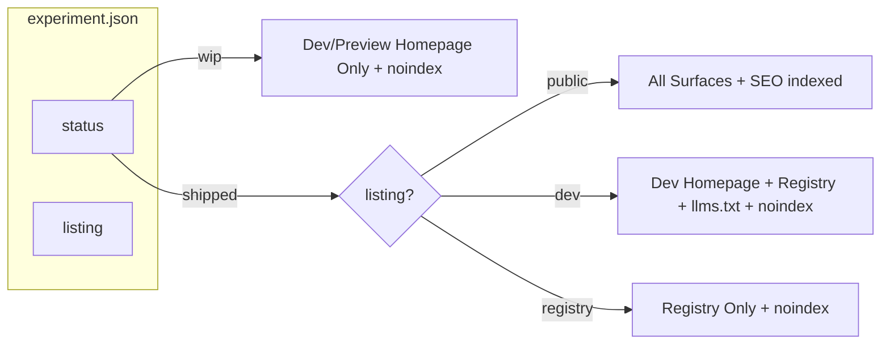
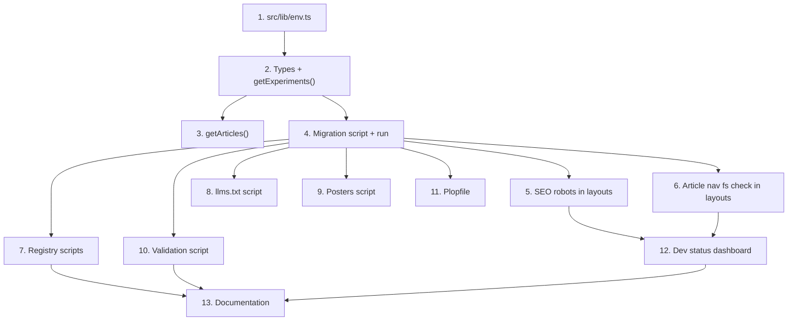

# Metadata System Redesign

## New Schema

Three fields. No ambiguity. Every consumer follows one truth table.

```typescript
type ExperimentStatus = "wip" | "shipped";
type ExperimentListing = "public" | "dev" | "registry";
// legacy: boolean -- agent policy, zero runtime effect
```

**Removed**: `publishable`, `content`, `archived` status, old listing values (`experiment`, `collected`, `unlisted`).

### Field Definitions

- `**status`** -- lifecycle stage
  - `"wip"`: under active development. Invisible to all production surfaces. Dev/preview homepage only.
  - `"shipped"`: complete. Eligible for all surfaces based on `listing`.
- `**listing`** -- visibility tier (defaults to `"public"`, only matters when `status === "shipped"`)
  - `"public"`: full public visibility everywhere. Indexed by search engines.
  - `"dev"`: dev/preview homepage only. Still in registry and llms.txt. Articles exist but hidden from public Writing tab. `noindex` in production.
  - `"registry"`: registry only. No homepage, no llms.txt, no posters, no articles, no sitemap. `noindex` in production.
- `**legacy`** -- agent policy flag (boolean, default `false`)
  - Marks pre-announcing-v2 experiments as "ask before touching". Zero runtime effect. Fully visible everywhere.

---

## Truth Table

Every consumer surface reads this ONE table. No exceptions, no per-script ad-hoc logic.

```
                  | Homepage  | Homepage   | Registry | llms.txt | Posters     | Articles | Sitemap  | RSS Feed | SEO     |
                  | (prod)    | (dev/prev) |          |          |             | (prod)   |          |          |         |
------------------+-----------+------------+----------+----------+-------------+----------+----------+----------+---------|
wip + any         | --        | YES        | --       | --       | --          | --       | --       | --       | noindex |
shipped + public  | YES       | YES        | YES      | YES      | YES (if vid)| YES      | YES      | YES      | index   |
shipped + dev     | --        | YES        | YES      | YES      | --          | --       | --       | --       | noindex |
shipped + registry| --        | --         | YES      | --       | --          | --       | --       | --       | noindex |
```




---

## Design Decisions and Rationale

### 1. WIP safety on production pushes

**Problem**: You push a branch with a WIP experiment to main. Vercel builds it. What happens?

**Solution -- defense in depth, three layers**:

- **Layer 1 -- Data filtering**: `getExperiments()` and `getArticles()` filter out WIP/non-public in production. WIP never appears in homepage, article listing, sitemap, feeds, or JSON-LD.
- **Layer 2 -- SEO protection**: WIP/dev experiment layouts emit `robots: { index: false, follow: false }` via `generateMetadata()`. Even if a crawler discovers the URL, it won't index the page.
- **Layer 3 -- Build scripts**: Registry, llms.txt, and poster scripts independently skip WIP. No build artifact references WIP experiments.

**What we intentionally do NOT block**: Direct URL access to `/experiments/wip-name`. The Next.js route still exists. This is acceptable for a personal site -- you can share a direct link with someone, but it won't be discoverable through any public surface or search engine. Blocking it would require middleware complexity that isn't worth it.

### 2. Preview deploy behavior (VERCEL_ENV)

Vercel provides `VERCEL_ENV` as a system env var: `"production"`, `"preview"`, or `"development"`.

The plan introduces a centralized `src/lib/env.ts`:

```typescript
export const isDev = process.env.NODE_ENV === "development";
export const isPreview = process.env.VERCEL_ENV === "preview";
export const showDevContent = isDev || isPreview;
```

Preview deploys (`VERCEL_ENV === "preview"`) will show dev-listing experiments and WIP experiments on the homepage, letting you visually verify work before merging. Production deploys only show `shipped + public`.

### 3. Removing `content` field -- impact on layouts

Every experiment layout currently reads `content?.article` to decide whether `ExperimentNav` shows an article link:

```typescript
// CURRENT -- every layout.tsx
const content = (experiment as Record<string, unknown>).content as
  | Record<string, boolean> | undefined;
// ...
<ExperimentNav articleSlug={content?.article ? experiment.slug : undefined} />
```

**Replacement**: Check if the `article/content.mdx` file exists at build time. Since layouts are server components, `fs.existsSync` works:

```typescript
// NEW -- every layout.tsx
import { existsSync } from "node:fs";
import path from "node:path";

const hasArticle = existsSync(
  path.join(process.cwd(), `src/app/experiments/(${experiment.slug})/${experiment.slug}/article/content.mdx`)
);
// ...
<ExperimentNav articleSlug={hasArticle ? experiment.slug : undefined} />
```

This is more reliable than a flag anyway -- it's always in sync with reality. All 21 layouts need this update. The plop template also needs updating.

### 4. Removing `publishable` -- what replaces it?

`publishable` was the output of the publish workflow. Nothing consumed it at runtime. The publish workflow's real outputs are the article and documentation files themselves. The presence of `article/content.mdx` is the signal that content exists. No replacement field needed.

The validation script currently warns about publishable coherence. These warnings are removed. The new validator instead checks:

- If `listing === "public"` and no video, warn (public experiments should have previews)
- If article file exists on disk, experiment should be `shipped` (warn if wip has article)

### 5. The `poster` field redundancy

Currently `poster` is stored in `experiment.json` by the scaffold template, but `getExperiments()` overrides it at runtime based on `video` existence. The stored value is never used.

**Decision**: Remove `poster` from the scaffold template. Keep the field in the TypeScript interface since it's computed at read time. The runtime computation in `getExperiments()` remains the source of truth.

### 6. Admin dashboard -- dev status page

A full admin CRUD dashboard is overkill for a solo lab. What's genuinely useful: a **read-only dev status page** at `/dev` that gives you instant visibility into the system state.

Route: `src/app/(main)/dev/page.tsx`

Shows:

- Table of all experiments with status, listing, legacy columns
- Color-coded badges for each visibility surface (homepage, registry, llms, etc.) derived from the truth table
- Warnings section: public experiments missing video, WIP experiments with articles, etc.
- Quick links to each experiment, its article (if exists), and its registry entry

Production behavior: Returns 404 (page only renders when `showDevContent` is true, otherwise `notFound()`).

This is ~150-200 lines and replaces manually reading experiment.json files to understand state.

### 7. Sitemap and RSS feeds -- currently unprotected

**Sitemap** ([src/app/sitemap.ts](src/app/sitemap.ts)): Currently calls `getExperiments()` with no filter. After this change, `getExperiments()` in production will only return `shipped + public`, so the sitemap automatically becomes safe. No code changes needed in sitemap.ts itself.

**RSS/Atom feeds** ([src/app/feed.xml/route.ts](src/app/feed.xml/route.ts)): Currently calls `getArticles()` with no filter. After the `getArticles()` change, feeds will only include articles for `shipped + public` experiments in production. No code changes needed in feed routes themselves.

**JSON-LD structured data**: Homepage calls `getExperiments()` then passes results to `generateExperimentListJsonLd()`. Same fix propagates automatically.

All three surfaces are fixed by the core `getExperiments()` / `getArticles()` changes. No per-surface patches needed.

---

## Migration Map

Current inventory of all 21 experiments and their target state:

**Legacy experiments** (16 currently with `legacy: true`, all `shipped`):


| Experiment                                | Current listing | Target                   |
| ----------------------------------------- | --------------- | ------------------------ |
| 404-not-found                             | -- (default)    | `public`, `legacy: true` |
| basketball-replay-center                  | --              | `public`, `legacy: true` |
| bugged-out-game-of-life-shader-experiment | --              | `public`, `legacy: true` |
| cursor-depth-explorer                     | --              | `public`, `legacy: true` |
| game-of-life-shader                       | --              | `public`, `legacy: true` |
| gravity-physics-ui-layout                 | --              | `public`, `legacy: true` |
| keyboard-keys                             | --              | `public`, `legacy: true` |
| life-3d                                   | --              | `public`, `legacy: true` |
| mountain-transition                       | --              | `public`, `legacy: true` |
| non-euclidean-hyperbolic-workspace        | --              | `public`, `legacy: true` |
| rabbithole-chat-gallery-explore           | --              | `public`, `legacy: true` |
| rabbithole-chat-preloader                 | --              | `public`, `legacy: true` |
| send-button                               | --              | `public`, `legacy: true` |
| shader-landing                            | --              | `public`, `legacy: true` |
| terminal-cat                              | --              | `public`, `legacy: true` |
| transit-airport-split-flap-display        | --              | `public`, `legacy: true` |


`**test` experiment** (currently `archived`, `legacy: true`):

- Target: `status: "shipped"`, `listing: "registry"`, `legacy: true`

**Post-legacy experiments**:


| Experiment                 | Current state       | Target              |
| -------------------------- | ------------------- | ------------------- |
| velocity-responsive-design | shipped, no listing | `shipped`, `public` |
| airplanes                  | shipped, unlisted   | `shipped`, `dev`    |
| announcing-v2              | wip, unlisted       | `wip`, `dev`        |
| 3d-crt-display             | wip, unlisted       | `wip`, `dev`        |


**Fields removed from ALL experiments**: `publishable`, `content`, `poster` (from JSON; still computed at runtime).

---

## Implementation Detail

### 1. Environment utility -- `src/lib/env.ts` (NEW)

```typescript
export const isDev = process.env.NODE_ENV === "development";
export const isPreview = process.env.VERCEL_ENV === "preview";
export const showDevContent = isDev || isPreview;
```

Single import everywhere. No scattered `process.env` checks.

### 2. Types -- `src/lib/experiments.ts`

- Change `ExperimentStatus` to `"wip" | "shipped"`
- Change `ExperimentListing` to `"public" | "dev" | "registry"`
- Remove `publishable`, `content` from `Experiment` interface
- Remove `includeArchived` from `ExperimentFilter`
- Update `VALID_STATUSES` and `VALID_LISTINGS` arrays
- Rewrite `getExperiments()` filter cascade using `showDevContent`

### 3. Articles -- `src/lib/articles.ts`

- Add `status?: string` and `listing?: string` to `Article` interface
- Read these from parent `experiment.json` (code already reads `tech` and `poster`)
- After collecting articles, filter: skip `wip` always; in prod, skip non-`public`

### 4. SEO hardening -- experiment layouts

Each experiment layout's `generateMetadata()` (or static `metadata` export) needs conditional robots:

```typescript
import experiment from "./experiment.json";

const isPublic = experiment.status === "shipped" &&
  (!experiment.listing || experiment.listing === "public");

export const metadata = {
  // ...existing metadata...
  robots: isPublic ? { index: true, follow: true } : { index: false, follow: false },
};
```

This is a change across all 21 layouts + the plop template. The plop template should generate the conditional version by default.

### 5. Article nav -- replace `content?.article` in layouts

All 21 layouts + plop template: replace `content?.article` flag check with `fs.existsSync` for article/content.mdx. See "Removing `content` field" section above.

### 6. Generation scripts

**Registry** (`generate-registry.mjs` + `generate-registry-json.mjs`):

- Gate: `status === "shipped"` (only gate needed)
- Categorization: `listing === "public"` or `listing === "dev"` -> category `"experiments"`, `listing === "registry"` -> category `"collected"`
- Add new scan target for `src/components/mdx/` (article system components)

**llms.txt** (`generate-llms-txt.mjs`):

- Gate: `status === "shipped"` AND `listing !== "registry"`
- Remove secondary archived filter (no more archived status)

**Posters** (`generate-posters.mjs`):

- Gate: `status === "shipped"` AND `listing === "public"` AND has video

### 7. Validation -- `validate-experiments.mjs`

- Update enum values: statuses `["wip", "shipped"]`, listings `["public", "dev", "registry"]`
- Remove all `publishable` and `content` cross-checks
- New warnings:
  - `listing === "public"` but no video -> warn (public experiments should have previews)
  - `status === "wip"` but article exists on disk -> warn (article for unfinished experiment)
  - Missing explicit `listing` field -> warn (should be explicit, not rely on default)

### 8. Scaffold -- `plopfile.js`

- Remove `publishable: false` from experiment template
- Remove `poster` from experiment template (computed at runtime)
- Update listing choices: `public` (default), `dev`, `registry`
- Article generator: remove the `content.article = true` modification step (field no longer exists)
- Layout template: include conditional robots metadata and fs-based article detection

### 9. Migration script

Write a one-time Node.js script (`scripts/migrate-experiment-schema.mjs`) that:

1. Reads all experiment.json files
2. Remaps `listing`: `"experiment"` / missing -> `"public"`, `"collected"` -> `"registry"`, `"unlisted"` -> `"dev"` or `"registry"` per experiment
3. Remaps `status`: `"archived"` -> `"shipped"` (with appropriate listing)
4. Removes: `publishable`, `content`, `poster` fields
5. Ensures every experiment has an explicit `listing` value
6. Writes back formatted JSON
7. Prints a summary of changes

### 10. Dev status dashboard -- `src/app/(main)/dev/page.tsx`

Server component, ~150-200 lines:

- Calls `getExperiments({ listing: ["public", "dev", "registry"] })` to get all experiments regardless of listing (or reads experiment.json directly to include WIP)
- Renders a table with columns: name, status, listing, legacy, video, article
- Derives truth-table badges: which surfaces each experiment appears on
- Warnings section at top for inconsistencies
- `notFound()` in production

### 11. Documentation updates

- **AGENTS.md**: Rewrite listing/status section. Remove `publishable`, `content`, `archived` references. Document new truth table. Update "Constraints" section.
- **.cursor/rules/experiment-metadata.mdc**: Rewrite status lifecycle. New field docs. New enum values.
- **.agents/contexts/content-constellation.md**: Remove publishable references. Simplify to "articles exist when content.mdx is on disk."
- **.agents/workflows/publish-experiment.md**: Remove publishable finalization step. The workflow's final step becomes "verify article renders correctly."
- **.cursor/skills/publish-content/SKILL.md**: Same publishable removal.

---

## Execution Order

Dependencies flow downward. Items at the same level can be parallelized.




Steps 5-11 can all run in parallel after migration. Step 12 (dev dashboard) depends on SEO + article nav being done. Step 13 (docs) is last since it documents the final state.