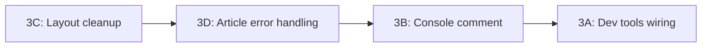

# P0: Fix Critical Issues (Section 3)

4 items from the V2 Comprehensive Review. Items 3C, 3D, 3B are quick isolated fixes. Item 3A is the most significant -- it fulfills the original V2 promise of auto-injected dev tools.

---

## Background: What the Toolkit and Dev Tools Are

Before the fixes, context on what we're wiring in and why it matters.

### Origins: darkroom.engineering Ecosystem

The V2 vision was to "stand on giants" -- specifically the open-source libraries from [darkroom.engineering](https://github.com/darkroomengineering) (the studio behind Lenis, Tempus, Hamo). These are the same tools powering Awwwards-winning sites. The V2 plan adopted their approach of a unified animation loop with deterministic execution ordering:

- **[Lenis](https://github.com/darkroomengineering/lenis)** (`^1.3.18`) -- Smooth scroll library. Replaces native scroll with a virtual scroll that can be driven by an external RAF loop. Bridges to GSAP ScrollTrigger via `lenis.on("scroll", ScrollTrigger.update)`.
- **[Tempus](https://github.com/darkroomengineering/tempus)** (`^1.0.0-dev.17`) -- Unified `requestAnimationFrame` manager with a priority queue. One RAF loop drives everything in deterministic order: scroll (-1) -> animation (0) -> rendering (1).
- **[Hamo](https://github.com/darkroomengineering/hamo)** (`^1.0.0-dev.10`) -- React hooks library (useRect, useWindowSize, useMediaQuery, useDebounce, useIntersectionObserver). Replaced custom hooks in the codebase.

### The Integration Layer: `src/lib/toolkit/`

These are **thin wiring files**, not abstractions. Experiments still import directly from libraries. The toolkit just handles the coordination patterns that are error-prone to repeat:


| File                                     | What It Does                                                                                                             |
| ---------------------------------------- | ------------------------------------------------------------------------------------------------------------------------ |
| `[scroll.ts](src/lib/toolkit/scroll.ts)` | Creates a Lenis instance wired to GSAP's ticker and ScrollTrigger. One function call instead of 5 lines of coordination. |
| `[raf.ts](src/lib/toolkit/raf.ts)`       | Re-exports Tempus and provides `setupUnifiedRAF()` which puts GSAP under Tempus's single RAF loop at priority 0.         |
| `[r3f.tsx](src/lib/toolkit/r3f.tsx)`     | `<ExperimentCanvas>` -- R3F Canvas with responsive DPR `[1, 2]`, Suspense boundary, and `<Preload all />`.               |
| `[index.ts](src/lib/toolkit/index.ts)`   | Barrel re-export.                                                                                                        |


### The Dev Tools: `src/components/dev/`

These are **renderless components that pipe metrics to the console** for AI agents to read from the terminal. They all return `null`. This is the "visual feedback bridge" -- how an AI agent building experiments can "see" what's happening without a screen:


| Component                                                             | Console Output                                                            | Interval | Requires                  |
| --------------------------------------------------------------------- | ------------------------------------------------------------------------- | -------- | ------------------------- |
| `[ExperimentDevMetrics](src/components/dev/ExperimentDevMetrics.tsx)` | `[DevMetrics] fps=58.3 fps_min=52 heap=23.4MB cls=0.001`                  | 2s       | Nothing (works anywhere)  |
| `[R3FDevMetrics](src/components/dev/R3FDevMetrics.tsx)`               | `[R3FMetrics] calls=12 triangles=8400 geometries=5 textures=3`            | 2s       | Must be inside `<Canvas>` |
| `[R3FSceneInspector](src/components/dev/R3FSceneInspector.tsx)`       | Full scene graph tree with geometry, material, light, camera descriptions | 10s      | Must be inside `<Canvas>` |


The **visual-qa workflow** (`.agent/workflows/visual-qa.md`) is the primary consumer -- it teaches agents a 7-step process: ensure dev server running, check console for `[DevMetrics]` output, capture screenshots, inspect scene, validate animations, describe expected vs actual, iterate.

### What This Enables

Once wired in, every newly scaffolded experiment automatically:

1. Logs FPS, heap size, and CLS to the console in dev mode -- an AI agent can detect performance regressions by reading terminal output
2. For R3F experiments (added manually inside Canvas): draw call counts, triangle counts, geometry/texture memory, and a full scene graph tree
3. The `visual-qa` and `publish-experiment` workflows become functional (they currently reference these tools but they're not wired in)

### How It Will Be Used (Future Phases)

The dev tools and toolkit are foundational to several P1-P3 items in the [comprehensive review](v2_comprehensive_review_9100ae49.plan.md):

- **P1: Toolkit in Plop templates** -- Make Lenis/Tempus/R3F setup available per-profile (scrollytelling profile gets Lenis, r3f-scene gets Canvas wrapper)
- **P3: MCP Capture Server** -- Upgrading `scripts/capture.mjs` from CLI to a full MCP tool. The dev metrics provide the telemetry that the MCP server would serve back to agents.
- **P3: Lighthouse CI** -- Automated perf budgets. Dev metrics are the dev-time version of the same measurements.
- **P3: Registry V2** -- Interactive docs with live demos. Would use toolkit integration layer.

### Forward-Compatibility Constraints

The console output format (`[DevMetrics] fps=... heap=... cls=...`) is referenced by 6+ agent config files (performance rule, visual-qa skill/workflow, architecture context, toolkit context). Changes to this format need cascading documentation updates. This plan does NOT change the format -- only wires the existing components in.

---

## 3A. Wire Dev Tools Into Experiment Layouts

**Problem:** `src/components/dev/` has zero imports anywhere. The Plop layout template does not include dev tools. The V2 plan promised "ExperimentDevMetrics component injected at the layout level" and `architecture.md` falsely claims "auto-injected in dev mode."

**Fix:**

1. **Create `src/components/dev/DevToolsInjector.tsx`** -- a client component that conditionally renders `ExperimentDevMetrics` only in development:

```tsx
"use client";

import dynamic from "next/dynamic";

const ExperimentDevMetrics =
  process.env.NODE_ENV === "development"
    ? dynamic(() =>
        import("./ExperimentDevMetrics").then((m) => ({
          default: m.ExperimentDevMetrics,
        }))
      )
    : () => null;

export function DevToolsInjector() {
  return <ExperimentDevMetrics />;
}
```

This tree-shakes to nothing in production. Uses `dynamic` so the dev metrics code isn't even parsed in prod builds.

1. **Update the Plop layout template** at [plop-templates/experiment/route-layout.tsx.hbs](plop-templates/experiment/route-layout.tsx.hbs) to include `<DevToolsInjector />` inside `<body>`:

```handlebars
import { DevToolsInjector } from "@/components/dev/DevToolsInjector";
...
<body>
  <DevToolsInjector />
  ...
</body>
```

1. **Add coordination guard** to `[src/lib/toolkit/scroll.ts](src/lib/toolkit/scroll.ts)`. Currently `scroll.ts` adds Lenis to `gsap.ticker` directly, while `raf.ts` replaces `gsap.updateRoot` with Tempus. Using both creates two competing RAF loops. Add a JSDoc comment and a note in the function documenting the intended usage pattern: if using unified RAF via Tempus, scroll should go through Tempus at priority -1 instead of through gsap.ticker. The actual refactor to make them coordinate automatically is P1 scope -- for now, document the constraint.
2. **Fix `[architecture.md](/.agent/contexts/architecture.md)`** to accurately describe what is and isn't auto-injected:
  - `ExperimentDevMetrics` is auto-injected in new experiments (via Plop template) -- make this true
  - `R3FDevMetrics` and `R3FSceneInspector` must be manually added inside `<Canvas>` -- document this clearly
  - Remove or correct any claim about toolkit being "zero-config available"

**Not in scope:** Wiring toolkit imports into Plop templates (P1), backfilling the 18 existing experiment layouts (P1), fixing the scroll/raf conflict implementation (P1), or R3F dev tools auto-injection (requires being inside Canvas, can't be done at layout level).

---

## 3B. Document `removeConsole` Survival Pattern

**Problem:** [next.config.ts](next.config.ts) strips all `console.`* except `error` in production. The terminal-cat experiment uses `console.log` for its entire output.

**Status:** Already works in production. The `useConsoleCat.ts` code accesses console via `const c = window.console` and calls `c.log()` / `c.clear()`. SWC's `removeConsole` transform matches `console.X()` call expressions at the AST level -- the indirect alias through `window.console` survives the transform.

**Fix:** Add a code comment in `[src/components/experiments/terminal-cat/useConsoleCat.ts](src/components/experiments/terminal-cat/useConsoleCat.ts)` at the `window.console` alias explaining why it's written this way:

```typescript
// Access console indirectly via window.console -- SWC's removeConsole
// transform (next.config.ts) strips direct console.X() calls in production,
// but this alias pattern survives the AST-level rewrite.
const c = window.console;
```

**Note for 3A interaction:** The `ExperimentDevMetrics` component also uses `console.log`. This is fine because it only runs in development (gated by `process.env.NODE_ENV` in `DevToolsInjector`), so `removeConsole` never processes it. The `DevToolsInjector` design in 3A is deliberately dev-only for this reason.

---

## 3C. Fix Root Layout Stale Comments and Mid-File Imports

**Problem:** [src/app/(main)/layout.tsx](src/app/(main)/layout.tsx) has:

- Lines 72-74: Three `import` statements placed after the `export const metadata` block
- Lines 84-88: An orphaned "Attempt 1" debug comment in an otherwise-empty `<head>`

**Fix:**

- Move the three imports (`Analytics`, `GlobalTracking`, `CursorProvider`) to the top import block (after line 8)
- Remove the stale `{/* Attempt 1: ... */}` comment
- Remove the empty `<head>` element (Next.js manages `<head>` via the metadata export)

---

## 3D. Add Error Handling to `getArticleContent()`

**Problem:** [src/lib/articles.ts](src/lib/articles.ts) lines 93-102: `getArticleContent()` calls `fs.readFileSync` with no try/catch. A missing file throws a raw `ENOENT` that crashes the page build. The path assumes `(${slug})/${slug}/article/content.mdx`.

**Fix:**

- Wrap in try/catch, return `null` on failure (change return type to `ArticleContent | null`)
- Log a warning with the attempted path for debuggability
- Find all callers of `getArticleContent` and update them to handle `null` (the two article page.tsx files for send-button and basketball-replay-center)

**Future consideration:** The `getArticles()` function above it already has error handling and returns `[]` on failure. This fix brings `getArticleContent` to the same standard. The P2 plan includes adding caching and schema validation to these functions -- this error handling is compatible with that future work.

---

## Execution Order




Start with the two quickest fixes (3C, 3D), then 3B (one comment), then 3A (new component + template + docs update).