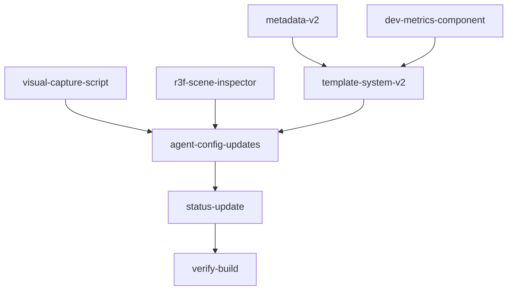

# P1: Visual Feedback Bridge + Experiment Architecture V2

Covers V2 plan Sections 3 (A, B, C) and 4 (metadata + templates). After this phase, all P0 and P1 items from the master plan will be complete.

## Current State

- **Section 1 (AI Config)**: DONE -- 29 agent config files, layered architecture
- **Section 2 (Toolkit)**: DONE -- Lenis, Tempus, Hamo, @gsap/react installed; `src/lib/toolkit/` integration layer built
- **Section 3 (Visual Feedback)**: Pending -- 3 todos
- **Section 4 (Experiment Architecture)**: Pending -- 2 todos

## Scope: 5 V2 Plan Todos


| Todo ID                 | Section | What                                               |
| ----------------------- | ------- | -------------------------------------------------- |
| `visual-capture-script` | 3A      | Playwright capture script for AI agents            |
| `dev-metrics-component` | 3B      | Console-piped dev metrics at layout level          |
| `r3f-scene-inspector`   | 3C      | Scene graph text serializer                        |
| `metadata-v2`           | 4       | Enriched experiment.json + getExperiments() update |
| `template-system-v2`    | 4       | 7 profile-based templates with working demos       |


---

## Part 1: Metadata V2

### 1a. Expand the Experiment interface

`[src/lib/experiments.ts](src/lib/experiments.ts)` -- add V2 fields to the `Experiment` interface:

```typescript
export interface Experiment {
  // ... existing fields ...
  profile?: 'r3f-scene' | 'r3f-shader' | 'scrollytelling' | 'interaction' | 'dom-effect' | 'web-audio' | 'blank';
  status?: 'wip' | 'shipped' | 'archived';
  tags?: string[];
  tech?: string[];
  complexity?: 'beginner' | 'intermediate' | 'advanced';
  inspiration?: { title: string; url: string }[];
  related?: string[];
  publishable?: boolean;
  legacy?: boolean;
  updated?: string;
}
```

The existing spread in `getExperiments()` (`{ ...config, href, poster }`) already passes through unknown fields, so the function itself needs minimal changes beyond filtering out `archived` experiments and typing.

### 1b. Update getExperiments() with filtering

Add an optional filter parameter and exclude archived by default:

```typescript
interface ExperimentFilter {
  status?: string[];
  tags?: string[];
  tech?: string[];
  profile?: string;
}
export async function getExperiments(filter?: ExperimentFilter): Promise<Experiment[]>
```

### 1c. Homepage filtering UI

Add a minimal filter bar to `[src/components/ui/ExperimentDrawerList.tsx](src/components/ui/ExperimentDrawerList.tsx)`:

- Tag pills derived from all experiment tags (client-side filter)
- Status filter: "All" / "Shipped" / "WIP" (client-side toggle)
- No new dependencies needed; use existing shadcn Badge/Button components

### 1d. Update Plop inline template

`[plopfile.js](plopfile.js)` line 46-55 -- the experiment.json template gets V2 fields:

```json
{
  "title": "...",
  "description": "...",
  "slug": "...",
  "created": "...",
  "profile": "{{profile}}",
  "status": "wip",
  "tags": [],
  "tech": [],
  "isPlaceholder": true
}
```

### 1e. Backfill existing experiments

Add `"status": "shipped"` and `"legacy": true` to all 18 existing `experiment.json` files. Write a small batch script (`scripts/backfill-metadata.mjs`) to do this cleanly, or update them manually. Tags and tech can be added opportunistically since the agent config files already reference these fields.

### 1f. Update tests

`[src/lib/experiments.test.ts](src/lib/experiments.test.ts)` -- add test cases for:

- V2 fields pass through correctly
- Archived experiments are filtered out
- Filter by tags/status works

---

## Part 2: Visual Capture Script (Section 3A)

### Create `scripts/capture.mjs`

Uses Playwright (already in devDependencies as `playwright@^1.57.0`):

```
node scripts/capture.mjs <slug>                   # Screenshot at load
node scripts/capture.mjs <slug> --delay 2000       # Wait for animations
node scripts/capture.mjs <slug> --scroll 50        # At 50% scroll
node scripts/capture.mjs <slug> --viewport 1920x1080  # Custom viewport
```

Implementation approach:

1. Launch Chromium via `playwright`
2. Navigate to `http://localhost:3000/experiments/<slug>`
3. Wait for network idle + optional delay
4. Optionally scroll to percentage
5. Screenshot to `output/captures/<slug>.png` (or `<slug>-scroll50.png` for scroll variants)
6. Print the output path to stdout so AI agents can reference it

Key: simple CLI with `process.argv` parsing (no extra deps). Add `output/captures/` to `.gitignore`.

### Add npm script

```json
"capture": "node scripts/capture.mjs"
```

---

## Part 3: Dev Metrics Component (Section 3B)

### Create `src/components/dev/ExperimentDevMetrics.tsx`

A `'use client'` component that logs metrics to the console every 2 seconds:

- **FPS**: requestAnimationFrame-based sampling over 2-second windows (avg + min)
- **JS Heap**: `performance.memory.usedJSHeapSize` (Chrome only, graceful fallback)
- **Layout shifts**: PerformanceObserver for CLS
- **Console format**: structured, machine-readable lines that AI agents can grep for

```
[DevMetrics] fps=58.3 fps_min=52 heap=23.4MB cls=0.001
```

For R3F experiments, a separate `R3FDevMetrics` component (uses `useThree()` to access renderer info):

- Draw calls, triangles, textures, programs, geometries from `gl.info`

### Layout injection

Update `[plop-templates/experiment/route-layout.tsx.hbs](plop-templates/experiment/route-layout.tsx.hbs)` to conditionally include:

```tsx
{process.env.NODE_ENV === 'development' && <ExperimentDevMetrics />}
```

Existing experiment layouts are NOT modified (legacy principle). Only new experiments get this automatically.

---

## Part 4: R3F Scene Inspector (Section 3C)

### Create `src/components/dev/R3FSceneInspector.tsx`

A component that uses `useThree()` to serialize the scene graph to a text tree and log it to the console:

```
[SceneInspector] Scene (3 children)
  ├── AmbientLight (intensity: 0.5)
  ├── DirectionalLight (position: [10, 10, 5])
  └── Group "main" (2 children)
      ├── Mesh "hero" (BoxGeometry 1x1x1, MeshStandardMaterial color:#ff6600)
      └── Mesh "floor" (PlaneGeometry 10x10, MeshStandardMaterial color:#333333)
Camera: PerspectiveCamera (fov:50, position:[0,0,5])
Stats: 2 meshes, 2 geometries, 2 materials, 24 triangles
```

Implementation:

- Recursive tree walker on `scene.children`
- Extracts object type, name, geometry type/dimensions, material type/color
- Camera info from `useThree().camera`
- Logs on mount and optionally on a 10-second interval
- Exported as a drop-in component: `<R3FSceneInspector />` inside a Canvas

### Create barrel export

`src/components/dev/index.ts` -- exports `ExperimentDevMetrics`, `R3FDevMetrics`, `R3FSceneInspector`

---

## Part 5: Template System V2

### Plopfile overhaul

`[plopfile.js](plopfile.js)` -- add a `profile` list prompt:

```javascript
{
  type: 'list',
  name: 'profile',
  message: 'Experiment profile:',
  choices: [
    { name: 'Blank (minimal shell)', value: 'blank' },
    { name: 'R3F Scene (3D with Three.js)', value: 'r3f-scene' },
    { name: 'R3F Shader (custom shaders)', value: 'r3f-shader' },
    { name: 'Scrollytelling (Lenis + GSAP ScrollTrigger)', value: 'scrollytelling' },
    { name: 'Interaction (Motion + gestures)', value: 'interaction' },
    { name: 'Web Audio (AudioContext + synthesis)', value: 'web-audio' },
    { name: 'DOM Effect (CSS/shader effects on DOM)', value: 'dom-effect' },
  ],
  default: 'blank'
}
```

### Template file structure

```
plop-templates/experiment/
  route-layout.tsx.hbs           # Shared (updated with dev metrics)
  route-error.tsx.hbs            # Shared
  component.stories.tsx.hbs      # Shared
  component.test.tsx.hbs         # Shared (updated: profile-aware test text)
  profiles/
    blank/
      route-page.tsx.hbs         # Current default
      component.tsx.hbs          # Current default
    r3f-scene/
      route-page.tsx.hbs         # Full-viewport Canvas page
      component.tsx.hbs          # Rotating box + OrbitControls + lighting
    r3f-shader/
      route-page.tsx.hbs         # Full-viewport Canvas page
      component.tsx.hbs          # Fullscreen quad with animated gradient ShaderMaterial
    scrollytelling/
      route-page.tsx.hbs         # No fixed height, ReactLenis wrapper
      component.tsx.hbs          # 3-section scroll with pin + fade transitions
    interaction/
      route-page.tsx.hbs         # Centered flex wrapper
      component.tsx.hbs          # Draggable card with spring-back (Motion + useGesture)
    web-audio/
      route-page.tsx.hbs         # Centered wrapper
      component.tsx.hbs          # Click-triggered oscillator with gain envelope
    dom-effect/
      route-page.tsx.hbs         # Centered wrapper
      component.tsx.hbs          # Text with shimmer/glitch CSS effect using Motion
```

### Plopfile action routing

The actions function checks `answers.profile` and selects the correct template files:

```javascript
actions: function(answers) {
  const profileDir = `plop-templates/experiment/profiles/${answers.profile}`;
  return [
    { type: 'add', path: 'layout.tsx', templateFile: 'route-layout.tsx.hbs' },
    { type: 'add', path: 'page.tsx', templateFile: `${profileDir}/route-page.tsx.hbs` },
    { type: 'add', path: 'error.tsx', templateFile: 'route-error.tsx.hbs' },
    // experiment.json with profile field
    // component from profileDir
    // shared story + test
    // public assets dir
  ];
}
```

### Working demo quality bar

Each profile component must render something real and immediately visible:

- **r3f-scene**: A lit, textured box with orbit controls and environment map -- not just a wireframe
- **r3f-shader**: A fullscreen quad with animated color gradient (uniforms: time, resolution)
- **scrollytelling**: Three sections with ScrollTrigger pin and opacity/translate animations
- **interaction**: A card with drag gesture, spring physics, and hover scale
- **web-audio**: A button that plays a synthesized tone with gain envelope (attack/release)
- **dom-effect**: Text with a CSS shimmer animation and Motion entrance

---

## Part 6: Agent Config Updates

Remove all remaining forward-dependency markers from agent config files. Files that reference Section 3/4 pending items:

- `.agent/skills/visual-qa.md` -- remove "NOT BUILT" markers for capture script, dev metrics, scene inspector
- `.agent/workflows/visual-qa.md` -- update all tool references from "once built" to actual usage
- `.agent/workflows/new-experiment.md` -- remove Template System V2 "NOT YET BUILT" note
- `.agent/workflows/develop-experiment.md` -- remove "once ExperimentDevMetrics is built" note
- `.agent/contexts/architecture.md` -- remove "NOT YET ACTIVE" from V2 metadata section
- `.agent/contexts/toolkit.md` -- remove pending items for capture script, dev metrics, scene inspector, metadata-v2, template-system-v2
- `.agent/rules/performance.md` -- update dev metrics references
- `.agent/STATUS.md` -- mark Sections 3 and 4 as DONE, update progress table, shift priority to P2

---

## Part 7: Verification

- `tsc --noEmit` -- clean type check
- `npm run build` -- full build passes
- `npm run test` -- existing + new tests pass
- Run capture script on one existing experiment to verify it works
- Plop a new experiment with each profile to verify templates generate correctly

---

## Sequencing




Metadata V2 first (templates depend on the enriched schema). Capture script and dev metrics can be built in parallel. Templates depend on dev metrics (layout injection). Agent config updates last. Everything converges at verification.

---

## Placeholders for P2

These items will need to be addressed in a future phase:

- `publish-experiment.md` workflow (still a stub, depends on Section 5 MDX architecture)
- Homepage UI enhancements for tag/status filtering (basic version done here, rich filtering is P2)
- Backfilling tags/tech on all 18 legacy experiments (basic `legacy: true` + `status: shipped` done here)
- `r3f-perf` dev overlay integration into `ExperimentCanvas` (deferred to when Template System is validated)

