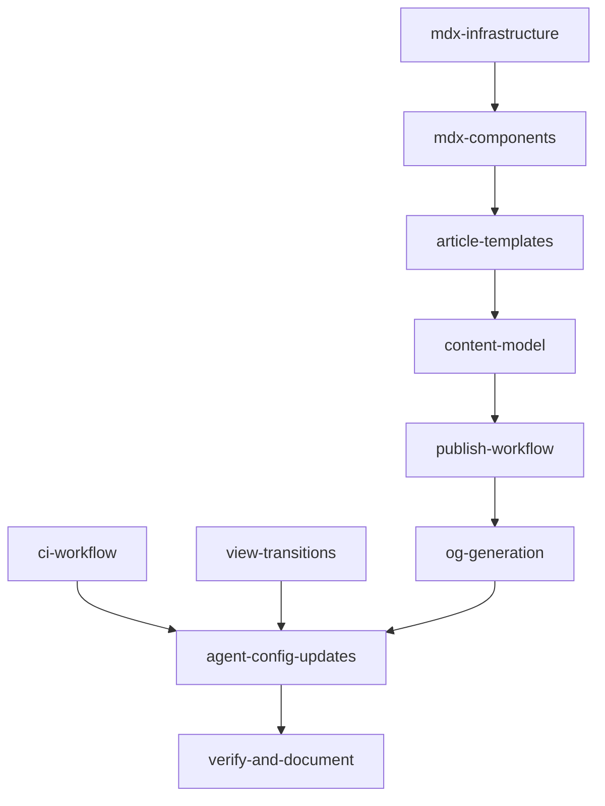

# P2: Publishing Pipeline + Quality Infrastructure + View Transitions

Covers V2 plan Sections 5 and 6. After this phase, all P0-P2 items are complete.

**Reference implementations**:

- [Sylph](https://github.com/raphaelsalaja/sylph) by Raphael Salaja -- MDX articles, dynamic OG, reading time, TOC, view transitions
- [RNDR Realm Gooey Dropdown](https://blog.rndrealm.com/gooey-dropdown) -- the target writing voice and article structure

## Current State

- **Sections 1-4**: DONE
- **Section 5 (Publishing)**: Stub only -- zero MDX infrastructure, `publish-experiment.md` is a placeholder
- **Section 6 (Quality)**: No `.github/` dir, no pre-commit hooks, no view transitions
- **Existing infrastructure**: `scripts/capture.mjs`, `scripts/generate-registry.mjs`, route group isolation, enriched `experiment.json`

---

## Part 1: MDX Article Infrastructure (Section 5)

### 1a. Install MDX dependencies

```bash
npm install next-mdx-remote remark-gfm rehype-pretty-code shiki rehype-slug gray-matter reading-time-estimator
npm install -D @tailwindcss/typography @types/mdx
```

Using `next-mdx-remote/rsc` (Sylph's actual rendering approach):

- `next-mdx-remote`: RSC-compatible MDX rendering, plugins per-render, no global config changes
- `remark-gfm` + `rehype-pretty-code` + `shiki` + `rehype-slug`: GFM, syntax highlighting, heading IDs
- `gray-matter`: Frontmatter parsing (enables article listing without MDX compilation)
- `reading-time-estimator`: Reading time in article headers
- `@tailwindcss/typography`: Prose styling base

### 1b. No Next.js config changes needed

`next-mdx-remote` requires zero `next.config.ts` modifications. No `pageExtensions`, no `withMDX()`, no `.mjs` conversion, no `mdx-components.tsx`. Plugins configured per-render via `MDXRemote` options.

### 1c. MDX components (`src/components/mdx/`)

`**components.tsx**` -- articleComponents map passed to `MDXRemote`:

- Headings with anchor IDs, external link detection, code block wrapper with copy button, scrollable table wrapper, styled blockquotes
- Custom components available in MDX: `Callout`, `LiveDemo`, `CodeStep`

**Component files**:

- `CodeBlock.tsx` -- syntax-highlighted code with copy button and filename display
- `Callout.tsx` -- info/warning/tip blocks with variant icons
- `LiveDemo.tsx` -- inline experiment embed in a bordered frame with "View experiment" link (equivalent of Sylph's `Preview`)
- `CodeStep.tsx` -- step-by-step code progression (numbered steps with code + explanation)
- `TableOfContents.tsx` -- client-side IntersectionObserver TOC adapted from [Sylph's on-this-page](https://github.com/raphaelsalaja/sylph/blob/main/components/on-this-page/index.tsx)

### 1d. Article layout (`src/components/ui/ArticleLayout.tsx`)

Adapted from [Sylph's post layout](https://github.com/raphaelsalaja/sylph/blob/main/components/screens/posts/index.tsx):

- Article header: title, published/updated dates, reading time, tags, tech badges
- Two-column: prose content (max-width ~720px) + sticky TOC sidebar on desktop
- Typography via `@tailwindcss/typography`, customized with existing design tokens
- "View experiment" link to parent experiment
- Article-specific CSS in `experiments.css`

### 1e. Article content utility (`src/lib/articles.ts`)

Adapted from [Sylph's lib/mdx](https://github.com/raphaelsalaja/sylph/blob/main/lib/mdx/index.ts):

```typescript
export function getArticles(): Article[] {
  // Scan experiment dirs for article/content.mdx
  // Parse frontmatter with gray-matter
  // Return metadata (title, description, slug, dates)
}
```

Enables article listings, OG metadata, future RSS feed.

### 1f. Article route structure

```
src/app/experiments/(send-button)/
  layout.tsx                    # Existing HTML shell
  send-button/
    page.tsx                    # Experiment page
    article/
      page.tsx                  # TSX wrapper: reads content.mdx, renders via MDXRemote
      content.mdx               # Raw MDX with YAML frontmatter (RNDR Realm voice)
      components.tsx             # Article-specific live demos
    docs/                       # AI-generated content (not rendered as pages)
      lab-note.md               # Internal: learnings, dead ends, decisions
      architecture.md           # Short technical overview
      snippet.md                # Reusable extract with install instructions
      social.md                 # X threads, launch posts, captions
      changelog.md              # Idea lineage, iteration history
```

URL: `/experiments/send-button/article`

The `article/page.tsx` reads `content.mdx`, parses frontmatter with `gray-matter`, computes reading time, renders via `MDXRemote` with `articleComponents` and plugins, wraps in `ArticleLayout`.

---

## Part 2: Content Model + Writing Voice

### 2a. Experiment content tracking

Expand `experiment.json` with a `content` field:

```json
{
  "title": "Send Button",
  "slug": "send-button",
  "status": "shipped",
  "publishable": true,
  "content": {
    "article": true,
    "labNote": true,
    "architecture": true,
    "snippet": true,
    "social": true,
    "changelog": true
  }
}
```

Update `Experiment` interface in `[src/lib/experiments.ts](src/lib/experiments.ts)` with `content?: Record<string, boolean>`.

### 2b. Writing voice document (`.agent/contexts/writing-voice.md`)

Codifies the [RNDR Realm Gooey Dropdown](https://blog.rndrealm.com/gooey-dropdown) voice for AI agents:

**Voice characteristics**:

- First-person, conversational: "I posted this on Twitter" / "I figured I'd write about it"
- Process-oriented: walks through building step-by-step, not just the final result
- Casual confidence: "Nothing fancy here" / "That's it" / "It already looks pretty good"
- Short paragraphs: rarely more than 3 sentences
- Code-forward: every section shows real code, then explains what it does and *why*
- Progressive disclosure: basic version first, then layer complexity
- Live demos at decision points: "Here's the full thing running live"
- Trade-off explanations: "If you animate all the properties at the same time it feels stiff"
- No filler: every sentence earns its place
- No AI fingerprints: no "let's dive in," no "in this article we'll explore"

**Structure template for articles**:

1. Hook: what it is and why it's interesting (1-2 paragraphs)
2. Basic version: simplest working implementation with code
3. Enhancement: layer on the interesting technique
4. The key insight: the non-obvious part that makes it work
5. Full thing: live demo with toggle/comparison
6. Context: where it's used in a real product (optional)

**Structure for each content format**: lab-note, snippet, social, architecture, changelog -- each with a concise template.

### 2c. Docs directory structure

Each experiment's `docs/` contains:

- `**lab-note.md`**: What was learned, what didn't work, decisions made. Internal voice.
- `**architecture.md`**: Short technical overview. Component tree, data flow, key patterns. For other engineers (or future you).
- `**snippet.md`**: The reusable extract. Install command, minimal code example, dependencies. Ready to copy-paste.
- `**social.md`**: X thread (5-8 tweets), launch post, Discord/Slack caption. Multiple formats, same core message.
- `**changelog.md`**: Idea lineage. Where the idea came from, how it evolved, version notes.

### 2d. Plop scaffolding

The `article` plop generator creates both `article/` and `docs/` in one command:

```bash
npm run new:article  # prompts for experiment slug
```

Creates:

- `article/page.tsx` -- MDXRemote wrapper
- `article/content.mdx` -- starter MDX with RNDR Realm voice template
- `article/components.tsx` -- demo starters
- `docs/lab-note.md` -- template with sections (Context, What I Tried, What Worked, What I'd Do Differently)
- `docs/architecture.md` -- template with sections (Overview, Component Tree, Key Patterns, Dependencies)
- `docs/snippet.md` -- template with sections (Install, Usage, Props/API, Notes)
- `docs/social.md` -- template with sections (X Thread, Launch Post, One-Liner)
- `docs/changelog.md` -- template with sections (Origin, Iterations, Current State)

Plop templates in `plop-templates/article/`.

---

## Part 3: Multi-Format Publish Workflow

### 3a. Replace publish-experiment.md

The new `[.agent/workflows/publish-experiment.md](.agent/workflows/publish-experiment.md)` is a comprehensive multi-format content generation guide:

**Phase 1: Preparation**

1. Verify experiment is `status: "shipped"`, code is clean
2. Read all source files, identify 2-3 most interesting techniques
3. Run `npm run new:article` to scaffold article + docs structure

**Phase 2: Article (public)**
4. Write `content.mdx` following the RNDR Realm voice (reference `.agent/contexts/writing-voice.md`)
5. Structure: hook -> basic version -> enhancement -> key insight -> live demo -> context
6. Create `components.tsx` with simplified demo versions for progressive disclosure
7. Verify article renders at `/experiments/<slug>/article`

**Phase 3: Documentation (internal + shareable)**
8. Write `lab-note.md`: what was learned, decisions, dead ends
9. Write `architecture.md`: component tree, data flow, key patterns
10. Write `snippet.md`: install command, minimal code, dependencies
11. Write `changelog.md`: idea origin, iterations, current state

**Phase 4: Social content**
12. Write `social.md`: X thread (5-8 tweets, progressive reveal), launch post, one-liner caption
13. Each format references the public article URL

**Phase 5: Finalization**
14. Generate OG image: `npm run capture <slug> -- --og` or use `/api/og`
15. Update `experiment.json`: set `publishable: true`, populate `content` field
16. Verify all generated content

---

## Part 4: OG Image Generation

**A. Extend `scripts/capture.mjs` with `--og` flag:**

```bash
npm run capture <slug> -- --og   # 1200x630 -> public/experiments/<slug>/og.png
```

**B. Dynamic OG API route** at `src/app/api/og/route.tsx`:

- `ImageResponse` from `next/og`, edge runtime
- Accepts `?title` and `?tags` params
- Branded card with design tokens
- Fallback for experiments without screenshot-based OG

---

## Part 5: GitHub Actions CI (Section 6)

### 5a. Scripts and workflow

Add `"typecheck": "tsc --noEmit"` and `"validate:experiments": "node scripts/validate-experiments.mjs"` to package.json.

`.github/workflows/ci.yml`: lint -> typecheck -> unit tests (`--run --project unit`) -> build. Node 22 with npm cache. Unit tests only (no storybook browser tests).

### 5b. Experiment validation script

`scripts/validate-experiments.mjs`: loads all `experiment.json`, validates required fields, enum values, no duplicate slugs.

### 5c. Pre-commit hooks

```bash
npm install -D lefthook && npx lefthook install
```

`lefthook.yml`: parallel lint + typecheck + validate-experiments on staged files.

---

## Part 6: View Transitions (Section 6)

### 6a. CSS opt-in

Add `@view-transition { navigation: auto; }` to both `globals.css` and `experiments.css`.

### 6b. Transition names

`view-transition-name` on experiment card media + experiment page container (matching by slug). `view-transition-name` on ExperimentBackButton.

### 6c. Navigation model

Change "Open Full Page" from `window.open(href, '_blank')` to `window.location.href = href`. Cmd/Ctrl+click opens new tab. Update plop layout template with `view-transition-name`.

---

## Part 7: Agent Config Updates

- Replace `publish-experiment.md` stub with real multi-format workflow
- Create `.agent/contexts/writing-voice.md`
- Update `.agent/contexts/toolkit.md` with new deps
- Update `.agent/STATUS.md`: Sections 5+6 DONE, priority shifts to P3
- Update V2 plan todos to completed

---

## Part 8: Verification

- `tsc --noEmit` + `npm run lint` + `npm run build` + `npm run test -- --run --project unit`
- `node scripts/validate-experiments.mjs`
- Create a minimal test article for one experiment to validate end-to-end
- Verify `/api/og?title=Test`
- Verify view transitions CSS compiles

---

## Placeholders for P3

- **Lighthouse CI**: Separate workflow triggered on deployment
- **Package extraction**: Documented in workflow, not automated
- **RSS/Atom feed**: `getArticles()` infrastructure built, just needs feed route
- **Social asset generation**: OG API route is the foundation
- `**next-view-transitions`**: For same-document transitions in `(main)` route group
- **Registry V2**: Interactive docs pages
- **MCP capture server**: Full MCP tool (currently CLI)
- **Storybook browser tests in CI**: Needs Playwright setup
- **Tag/tech backfill**: 18 experiments with empty `tags`/`tech`
- **Article-aware homepage**: Surface publishable experiments using `getArticles()`
- **Content dashboard**: Overview of which experiments have which content formats

---

## Sequencing




MDX infrastructure -> components -> article layout -> content model -> publish workflow -> OG generation (sequential chain for the publishing pipeline). CI and view transitions are independent, built in parallel. Agent config updates last. Everything converges at verification.