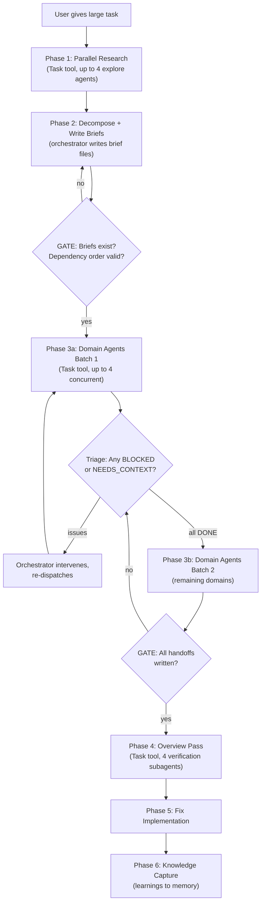

# Parallel Domain Orchestration System

## Background

Previously (transcript `152608fd`), you ran a 7-domain parallel agent effort for the agent docs gap analysis. It was manually orchestrated -- you used one planning chat to decompose the work, clicked "new agent" 7 times in Cursor to dispatch each domain, collected handoffs by hand, then started another chat for the overview pass.

That workflow produced 44 files changed, +4,662/-494 lines, caught 5 broken cross-domain dependencies, 3 naming conflicts -- but none of the templates or process were ever formalized. The only trace is a one-line entry in `memory.md` line 29.

## Reference Systems

Two open-source projects validate and extend this pattern:

**[obra/superpowers](https://github.com/obra/superpowers)** (76k stars) -- Agentic skills framework for Claude Code/Cursor. Key patterns adopted:

- **Subagent-driven development**: fresh subagent per task + two-stage review (spec compliance, then code quality)
- **Structured status protocol**: implementers report DONE / DONE_WITH_CONCERNS / NEEDS_CONTEXT / BLOCKED -- orchestrator handles each differently
- **Model selection**: use cheapest model that can handle the task (fast for mechanical, default for integration, capable for architecture)
- **Prompt templates as separate files**: `implementer-prompt.md`, `spec-reviewer-prompt.md`, etc.
- **Plan review loop**: dispatch reviewer subagent to check the plan before executing it

**[Compound Engineering](https://cursor.com/marketplace/every)** (Cursor-verified plugin, Every Inc) -- 29 agents, 22 commands, 19 skills. Key patterns adopted:

- **File-as-interface**: everything communicates through files -- plans, todos, handoffs, inboxes. No inline data.
- **Pipeline gating**: explicit GATE checkpoints ("STOP. Verify X exists. Do NOT proceed until...")
- **Compounding knowledge**: capture learnings into `docs/solutions/` with YAML frontmatter for future recall
- **"deepen-plan"**: run every matched skill agent in parallel against a plan to add depth and best practices
- **Configurable agent roster**: review agents read from per-project config, not hardcoded

## Goal

Build a reusable Cursor skill that **fully automates** the entire pipeline from a single orchestrator conversation using the Task tool. No manual "new agent" clicks, no copy-pasting briefs, no collecting handoffs by hand.

## How It Works in Cursor




### The Task tool is the execution engine

Cursor's Task tool launches subagents within the same conversation:

- Up to **4 concurrent** subagents per message (send multiple Task calls in one response)
- Each subagent gets its own context but **shares the filesystem**
- Subagent output returns to the orchestrator
- Available subagent types: `generalPurpose` (for domain work), `explore` (for research), `shell` (for git/build ops)
- `model: "fast"` parameter for mechanical tasks; omit for default model on complex work

### File-based communication

Validated by both Superpowers (prompt templates as files) and Compound Engineering (file-as-interface for everything). Subagents have limited context windows. Files are the universal bus:

```
.agents/temp/orchestration/
  plan.md                    # The decomposed plan with all domain briefs
  briefs/
    domain-1-name.md         # Individual brief for Domain 1
    domain-2-name.md         # Individual brief for Domain 2
    ...
  handoffs/
    domain-1-name.md         # Handoff summary from Domain 1
    domain-2-name.md         # Handoff summary from Domain 2
    ...
  overview-report.md         # Final verification report
```

Each domain subagent's prompt is just: "Read your instructions at `[domain-agent-prompt.md]`. Your brief: `[path]`. Write handoff to: `[path]`." This keeps prompts tiny.

The entire `temp/orchestration/` directory is ephemeral -- deleted after the work is done.

### Batching + dependency ordering

For N domains:

- N <= 4: one batch, all concurrent
- N <= 8: two batches (4 + remainder)
- N > 8: three+ batches, or split into separate orchestrations

If Domain 5 depends on Domain 2's output, they go in different batches (2 in Batch 1, 5 in Batch 2). The orchestrator determines this from the "Depends on" field in each brief.

### Model selection (from Superpowers)

Not all domains need the most capable model:

- **Mechanical domains** (docs housekeeping, template updates, config changes): `model: "fast"` -- saves cost and latency
- **Integration domains** (cross-cutting patterns, aggregator domains): default model
- **Architecture domains** (new skill creation, system design): default model

The orchestrator annotates each brief with a suggested model. The `domain-brief.md` template includes a `Complexity` field (`mechanical` / `integration` / `architecture`) that maps to model selection.

## File Structure

```
.agents/skills/parallel-orchestration/
  SKILL.md                  # Core skill doc -- phases, gating, scaling, model selection
  domain-brief.md           # Template for domain brief files
  domain-agent-prompt.md    # Prompt template each subagent receives (reads brief, executes, writes handoff)
  handoff-summary.md        # 9-section exit template with status field
  overview-pass.md          # Verification agent prompt with 4 subagent specs
  examples.md               # Agent docs gap analysis as worked example

.agents/workflows/parallel-domain-orchestration.md  # Short step-by-step
```

New compared to previous plan: `domain-agent-prompt.md` as a separate file (following Superpowers' pattern of prompt templates as files). This is the reusable prompt that every domain subagent reads, separate from the domain-specific brief.

## Skill Document (`SKILL.md`)

Written as instructions the orchestrator agent follows. Sections:

### When to use

- Tasks spanning 5+ files across 3+ conceptual areas with independent work streams
- NOT for single-domain work, tightly coupled changes, or tasks under ~10 files
- **Trigger phrases**: "parallelize", "decompose", "run in parallel", "multi-agent", "orchestrate"

### The 6 phases (fully automated)

**Phase 1: Research** (optional)

- Launch up to 4 `explore` subagents in parallel via Task
- Each returns a structured research summary
- Skip if orchestrator already has sufficient context
- Inspired by Compound Engineering's `ce:plan` which runs `repo-research-analyst`, `learnings-researcher`, `best-practices-researcher`, `framework-docs-researcher` in parallel

**Phase 2: Decomposition**

- Orchestrator produces a plan and slices it into N self-contained domains
- Writes each brief to `.agents/temp/orchestration/briefs/domain-N-name.md` using the [domain-brief.md](domain-brief.md) template
- Determines batch order based on "Depends on" fields
- Assigns complexity level per domain for model selection
- **Heuristics**: group by file ownership, create aggregator domains for cross-cutting concerns, maximize parallel independence

**GATE**: Verify all brief files exist. Verify dependency graph has no cycles. Verify "What NOT to Touch" boundaries don't overlap with "Changes to Make" across domains. (From Compound Engineering's gating pattern.)

**Phase 3: Parallel Execution**

- Orchestrator sends up to 4 Task calls in a single message
- Each Task prompt references [domain-agent-prompt.md](domain-agent-prompt.md) + the specific brief path
- Model selection based on domain complexity
- After each batch: **triage** (from Superpowers' status protocol)

**Triage between batches:**
Each domain agent reports a status in its handoff:

- **DONE**: Proceed
- **DONE_WITH_CONCERNS**: Read concerns. If correctness issues, address before overview. If observations, note and proceed.
- **NEEDS_CONTEXT**: Orchestrator provides missing context and re-dispatches that domain
- **BLOCKED**: Assess -- is it a context problem (re-dispatch with more context), a complexity problem (re-dispatch with better model), or a plan problem (surface to user)?

This replaces the previous "hope they all succeed" approach with explicit failure handling.

**Phase 4: Overview Pass**

- Orchestrator reads all handoff files, extracts cross-domain dependencies, identifies multi-touch files
- For 3-4 domains: single `generalPurpose` Task subagent
- For 5+ domains: 4 parallel Task subagents:
  - **A: Cross-Domain Dependency Verifier**
  - **B: Multi-Touch File Conflict Checker**
  - **C: Consistency Checker**
  - **D: Completeness + Quality Guard**
- All verification subagents are **read-only**
- Orchestrator synthesizes into `overview-report.md`

**Phase 5: Fix Implementation**

- Orchestrator (or Task subagent) implements fixes from the overview report
- Only touches files flagged as broken/inconsistent

**Phase 6: Knowledge Capture** (from Compound Engineering's compounding pattern)

- Capture notable discoveries and learnings from this orchestration
- Write a brief retrospective to the handoff directory before cleanup
- Update `memory.md` if any durable workspace facts emerged
- Delete `temp/orchestration/` directory

### Domain Agent Instructions (within SKILL.md)

The section domain subagents read (via `domain-agent-prompt.md`). Tells them:

1. Read your brief file at the path provided
2. Read AGENTS.md for project context + any skill docs referenced in the brief
3. Execute all items in "Changes to Make" -- follow TDD where applicable
4. Stay within your file boundaries -- do NOT touch files listed in "What NOT to Touch"
5. If you discover something outside your domain, note it in "Extra Discoveries" and "Cross-Domain Dependencies"
6. When done, write your handoff summary to the specified path using the [handoff-summary.md](handoff-summary.md) template
7. Set your Status field (DONE / DONE_WITH_CONCERNS / NEEDS_CONTEXT / BLOCKED)
8. Return a one-line summary + status to the orchestrator

## Domain Brief Template (`domain-brief.md`)

```markdown
## Domain N: [Name]

**Scope**: [One sentence -- what this domain owns]
**Complexity**: mechanical | integration | architecture

### Context to Read First
- `path/to/file` -- [why]

### Changes to Make
1. [Specific, actionable, with file paths]

### What NOT to Touch
- `path/to/file` -- owned by Domain N ([Name])

### Cross-Domain Notes
- Depends on: [domains, if any -- implies batch ordering]
- Produces: [what other domains might need]
```

New: `Complexity` field drives model selection.

## Domain Agent Prompt Template (`domain-agent-prompt.md`)

A standalone prompt file (following Superpowers' pattern). The orchestrator references this in every Task call. Contains:

- Instructions to read the brief file
- Instructions to read AGENTS.md + referenced docs
- The execution protocol (TDD, file boundaries, discovery reporting)
- The handoff writing instructions
- The status protocol (DONE / DONE_WITH_CONCERNS / NEEDS_CONTEXT / BLOCKED)

Kept as a separate file so the orchestrator's Task prompt stays one line: "Read `.agents/skills/parallel-orchestration/domain-agent-prompt.md`. Brief: `[path]`. Handoff: `[path]`."

## Handoff Summary Template (`handoff-summary.md`)

Now 9 sections (added Status):

```markdown
## Domain [N]: [Name] -- Handoff Summary

**Status**: DONE | DONE_WITH_CONCERNS | NEEDS_CONTEXT | BLOCKED

### Completed (plan items done)
### Extra Discoveries (things found not in the plan)
### Extra Changes (files modified beyond the plan)
### Intentional Skips (plan items NOT done, with reasoning)
### Judgment Calls (deviations from the plan)
### Cross-Domain Dependencies (things another domain needs to verify)
### Open Concerns (unresolved issues)
### Files Touched (complete list)
### Learnings (reusable insights for future work)
```

New: `Status` field at the top for machine-readable triage. `Learnings` section at the bottom for Phase 6 knowledge capture.

## Overview Pass Template (`overview-pass.md`)

Parameterized prompt for the verification phase. Contains:

- The 4 subagent specifications (A-D) with exact prompts
- Instructions to extract the dependency matrix from handoffs
- The structured output format for the final report
- Guidance on when to use 1 vs 4 verification subagents
- Read-only constraint ("You are a verifier. Do NOT modify any files.")

## Worked Example (`examples.md`)

The agent docs gap analysis (transcript `152608fd`) as a concrete reference:

- 8 domains, 7 parallel + 1 overview
- How the task was decomposed (the heuristics applied)
- Sample domain brief
- Sample handoff summary
- Overview pass findings (5 broken deps, 3 naming conflicts)
- Final stats: 44 files, +4,662/-494 lines, zero completeness gaps
- What would be different using the automated system vs manual clicks

## Integration

- [AGENTS.md](AGENTS.md): Add `parallel-orchestration` to the Reference Docs skills table
- [memory.md](memory.md): Replace the one-line bullet (line 29) with a pointer to the skill
- Add to `.cursor/rules/` or the skill's own trigger description so it auto-activates

## Key Design Decisions

1. **Task tool as execution engine** -- fully automated within a single Cursor conversation, no manual "new agent" clicks
2. **File-based communication** -- validated by both Superpowers and Compound Engineering as the universal bus pattern
3. **Structured status protocol** (from Superpowers) -- DONE/DONE_WITH_CONCERNS/NEEDS_CONTEXT/BLOCKED replaces "hope they all succeed"
4. **Pipeline gating** (from Compound Engineering) -- explicit checkpoints prevent cascading failures
5. **Model selection per domain** (from Superpowers) -- `fast` for mechanical work, default for complex, saves cost
6. **Knowledge capture phase** (from Compound Engineering) -- learnings feed back into memory.md for future orchestrations
7. **Prompt templates as files** (from Superpowers) -- `domain-agent-prompt.md` is reusable across all domains, keeping Task prompts tiny
8. **Handoff summaries remain non-negotiable** -- the critical innovation from the original workflow that makes everything downstream cheap
9. **Ephemeral temp directory** -- `.agents/temp/orchestration/` created at start, deleted at end (after knowledge capture)
10. **Read-only overview pass** -- verification and implementation are always separate phases

## What We Did NOT Adopt

- **Superpowers' two-stage review per task** (spec compliance + code quality) -- too heavyweight for domain-based orchestration where the overview pass serves this role. Could be added as an optional enhancement for high-stakes domains.
- **Compound Engineering's TeammateTool / inbox system** -- persistent teams with JSON message queues. Over-engineered for Cursor's Task model where subagents are ephemeral.
- **Compound Engineering's "spawn ALL, let them decide"** -- our domains are curated during decomposition, not open-ended. Pre-filtering is the right call for domain work.
- **Superpowers' git worktrees** -- not relevant to this codebase's workflow.
- **Superpowers' plan-document-reviewer subagent** -- good idea but adds a round-trip before execution. Could be an optional gate for very large orchestrations (10+ domains).

