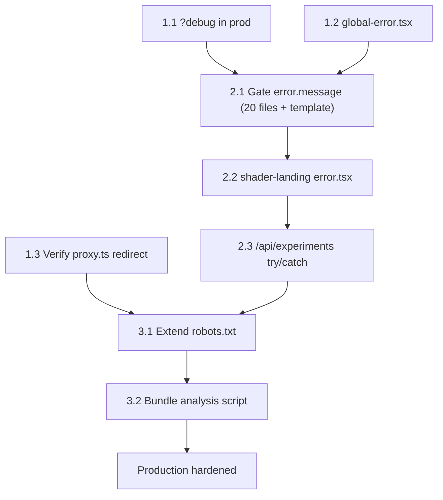

# Production Hardening

## Current State -- What's Already Solid

The codebase is ahead of most creative labs on several fronts:

- **Console stripping**: `removeConsole: { exclude: ["error"] }` in `[next.config.ts](next.config.ts)` strips all console methods except `error` at build time. Terminal experiments (e.g. `terminal-cat`) already survive this via `const c = window.console` aliasing -- SWC's AST transform only strips direct `console.X()` calls.
- **Source maps**: `productionBrowserSourceMaps: false` -- not served publicly
- **Security headers**: Full suite (HSTS, CSP, X-Frame-Options, X-Content-Type-Options, Referrer-Policy, Permissions-Policy) applied to all routes
- **Debug UI**: Two-layer defense (`NODE_ENV` tree-shaking + `?debug` runtime check) covers Leva, r3f-perf, GSDevTools, grid/gizmo helpers, scene inspector. Currently `?debug` only works in dev builds -- Tier 1 below upgrades this to work in production too.
- **OG fallback image**: `public/og-image.png` exists and is referenced by experiment layouts and the main layout as the default OG image when no video/poster is available.
- **Dev routes**: `/dev` and `/mdx-preview` properly 404 in production via `showDevContent` guard
- **noindex**: WIP/dev/registry experiments all get `robots: { index: false, follow: false }`
- **Canonical URLs**: Set on all experiment layouts
- **No secrets**: Zero `NEXT_PUBLIC_` env vars, no `.env` files committed
- **Clean source**: Zero `TODO`/`FIXME`/`HACK` comments in `src/`

The existing [dev route lockdown plan](.cursor/plans/dev_route_lockdown_8aff820a.plan.md) covers gating `llms.mdx` behind status checks, gating `mdx-preview`, and adding `/dev`, `/mdx-preview`, `/u/` to `robots.txt`. That plan is complementary -- this one addresses everything else.

---

## Tier 1 -- Critical (production blindspots)

### 1.1 Enable `?debug` in production builds

**Problem**: Currently, `DevToolsInjector` and `R3FDevToolsInjector` tree-shake all debug UI to `() => null` in production via `process.env.NODE_ENV === "development"` checks. The `?debug` URL param only works in dev builds. You want to be able to append `?debug` to any production URL to get Leva panels, r3f-perf, GSDevTools, device info overlay, scene inspector, and experiment metrics.

**Why this is safe**: The architecture is 90% there. Both injectors already define `DebugOverlayProd` / `R3FDevToolsProd` / `ExperimentDevMetricsProd` as unconditional `dynamic()` imports at module scope (`[DevToolsInjector.tsx](src/components/dev/DevToolsInjector.tsx)` lines 25-37, `[R3FDevToolsInjector.tsx](src/components/dev/R3FDevToolsInjector.tsx)` lines 12-14). These exist as lazy chunks in the production build but are never rendered because the `if (production)` branch requires an explicit prop. `DebugOverlay` internally checks `useDebug()` and returns null without `?debug`, so there's zero visual leak.

**Fix**: Add a runtime `?debug` check to both injectors using `useState` + `useEffect`. This avoids adding a Suspense boundary at the layout-level injector while still enabling chunk loading on demand (follows the Vercel `bundle-conditional` pattern -- load modules only when a feature is activated):

```tsx
// In DevToolsInjector
export function DevToolsInjector({ production }: DevToolsInjectorProps = {}) {
  const [isDebug, setIsDebug] = useState(false);

  useEffect(() => {
    if (new URLSearchParams(window.location.search).has("debug")) {
      setIsDebug(true);
    }
  }, []);

  if (production || isDebug) {
    return (
      <>
        <ExperimentDevMetricsProd />
        <DebugOverlayProd />
      </>
    );
  }

  return (
    <>
      <ExperimentDevMetrics />
      <DebugOverlay />
    </>
  );
}
```

Same pattern for `R3FDevToolsInjector`.

**Intentional design: one-time vs reactive split.** The injector's `useState`/`useEffect` is a one-time mount check that controls *which lazy chunks to load*. The downstream `DebugOverlay` wraps its contents in `<Suspense>` and uses `useDebug()` → `useSearchParams()` for *reactive* visibility. This is correct -- the injector decides chunk loading once, the overlay reacts to URL changes. A `popstate` listener isn't needed at the injector level because `DebugOverlayInner` already re-evaluates `useDebug()` on navigation.

**Highest-risk sub-item: `ExperimentDevMetrics` guard.** Add `useDebug()` guard to `ExperimentDevMetrics` so it's inert without `?debug`. This is critical -- without the guard, `ExperimentDevMetricsProd` would run a permanent `requestAnimationFrame` loop, CLS `PerformanceObserver`, GSAP tween counting, and `window.__experimentMetrics` writes every 2 seconds on every production page load. The `console.warn` calls are stripped by `removeConsole`, but the RAF loop and metric computation still execute and burn CPU. Guard the entire effect behind `useDebug()`.

**Cost in prod without `?debug`**: Zero. The Prod dynamic import chunks exist in the build but are never fetched. `isDebug` stays `false`, the tree-shaken `() => null` components render.

**Cost in prod with `?debug`**: One extra chunk fetch per injector (DebugOverlay ~15KB gzipped, R3FDevTools ~8KB gzipped). Full debug experience activates.

**Files to change**:

- `[src/components/dev/DevToolsInjector.tsx](src/components/dev/DevToolsInjector.tsx)` -- add `useState`/`useEffect` debug check
- `[src/components/dev/R3FDevToolsInjector.tsx](src/components/dev/R3FDevToolsInjector.tsx)` -- same pattern
- `[src/components/dev/ExperimentDevMetrics.tsx](src/components/dev/ExperimentDevMetrics.tsx)` -- add `useDebug()` guard so it's inert without `?debug`

### 1.2 Add `global-error.tsx`

**Problem**: No `[src/app/global-error.tsx](src/app/)` exists. If the root layout throws, users see Next.js's built-in generic error HTML with no styling or recovery path.

**Fix**: Create `src/app/global-error.tsx` with its own `<html>`/`<body>` (required since the layout is broken). Render a minimal branded recovery UI with a "Try again" button. No `error.message` in production. Display `error.digest` -- it's a server-generated hash (not the message) that's safe to show and gives users a traceable ID to report.

Use inline styles since Tailwind CSS may not be loaded when the root layout crashes.

```tsx
"use client";
export default function GlobalError({
  error,
  reset,
}: {
  error: Error & { digest?: string };
  reset: () => void;
}) {
  return (
    <html lang="en">
      <body>
        <div style={{ display: "flex", minHeight: "100vh", alignItems: "center", justifyContent: "center", flexDirection: "column", fontFamily: "system-ui, sans-serif", gap: 12 }}>
          <h2 style={{ margin: 0 }}>Something went wrong</h2>
          <button onClick={reset} style={{ padding: "8px 16px", cursor: "pointer" }}>
            Try again
          </button>
          {error.digest && (
            <p style={{ fontSize: 12, color: "#666", margin: 0 }}>
              Error ID: {error.digest}
            </p>
          )}
        </div>
      </body>
    </html>
  );
}
```

### 1.3 Verify `proxy.ts` canonical redirect is active

**Status**: `[src/proxy.ts](src/proxy.ts)` already uses the correct Next.js 16 `proxy.ts` convention (not the deprecated `middleware.ts`). It exports a named `proxy()` function and `config` with a matcher. The canonical host redirect to `www.razisyed.cv`, trailing slash stripping, and `?debug` query param passthrough should already be working.

**Action**: Verify in production or a preview deploy that:

- `razisyed.cv/experiments/foo` redirects 308 to `www.razisyed.cv/experiments/foo`
- `www.razisyed.cv/experiments/foo/` (trailing slash) redirects 308 to `www.razisyed.cv/experiments/foo`
- `www.razisyed.cv/experiments/foo?debug` works without redirect (canonical host, no trailing slash)
- Vercel preview deploys are not redirected (`.vercel.app` is excluded)

No code changes needed -- just verification.

---

## Tier 2 -- Important (error hygiene)

### 2.1 Gate `error.message` in experiment error boundaries

**Problem**: All 20 experiment `error.tsx` files render `{error.message}` directly in the DOM. While Next.js sanitizes server-side errors, client-side errors preserve the original message, which can leak library names, internal paths, or data details.

**Fix**: Update the plop template at `[plop-templates/experiment/route-error.tsx.hbs](plop-templates/experiment/route-error.tsx.hbs)` and all 20 existing `error.tsx` files. Show a generic message in production, full message only in dev. Display `error.digest` in production -- it's a server-generated hash that's safe to show and gives users a traceable error ID:

```tsx
<p className="text-muted-foreground">
  {process.env.NODE_ENV === "development" ? error.message : "An unexpected error occurred."}
</p>
{error.digest && (
  <p className="text-xs text-muted-foreground/60">Error ID: {error.digest}</p>
)}
```

**Files to update** (20 experiment error boundaries + 1 template):

- `plop-templates/experiment/route-error.tsx.hbs`
- All `src/app/experiments/(*)/*/error.tsx` files

### 2.2 Add error boundary to `shader-landing`

**Problem**: `shader-landing` is the only experiment missing an `error.tsx`. A runtime crash will bubble up to the nearest parent boundary.

**Fix**: Copy the standard error boundary into `src/app/experiments/(shader-landing)/shader-landing/error.tsx` (using the updated template from 2.1).

### 2.3 Wrap `/api/experiments` in try/catch

**Problem**: `[src/app/api/experiments/route.ts](src/app/api/experiments/route.ts)` has no error handling. If `getExperiments()` throws, Next.js returns a default 500 which in development includes stack traces.

**Fix**: Use `unstable_rethrow` from `next/navigation` in the catch block. This is a Next.js best practice for all server-side try/catch -- it re-throws internal Next.js errors (`redirect()`, `notFound()`, etc.) that should never be swallowed. While `getExperiments()` doesn't call navigation APIs today, this is defensive and future-proof:

```tsx
import { unstable_rethrow } from "next/navigation";

export async function GET() {
  try {
    const experiments = await getExperiments();
    return NextResponse.json(experiments);
  } catch (error) {
    unstable_rethrow(error);
    return NextResponse.json({ error: "Internal server error" }, { status: 500 });
  }
}
```

---

## Tier 3 -- Nice-to-have (polish and observability)

### 3.1 Extend `robots.txt` disallow list

**Problem**: `/api/experiments` and `/api/registry-search` are crawlable. These are internal data endpoints with no value for search engines. (Keep `/api/og` crawlable -- social crawlers need it for OG image generation.)

**Fix**: In `[src/app/robots.ts](src/app/robots.ts)`, add `/api/experiments` and `/api/registry-search` to the `DISALLOWED` array.

### 3.2 Add bundle analysis script

**Problem**: No bundle analysis workflow is documented. There's no easy way to verify what's actually shipping in client bundles.

**Fix**: Next.js 16.1+ includes a built-in bundle analyzer via `next experimental-analyze`. No third-party package needed. Add an npm script:

```json
"analyze": "next experimental-analyze"
```

This opens an interactive UI with route filtering, client/server environment toggling, module size inspection, and treemap visualization. Save output for CI comparison:

```bash
next experimental-analyze --output
# Output saved to .next/diagnostics/analyze
```

No dependency installation, no `next.config.ts` changes, Turbopack-compatible.

### 3.3 Error tracking (Sentry / Vercel integration)

**Problem**: Zero error tracking. Production errors are completely invisible -- no visibility into what crashes for real users.

**Assessment**: This is the highest-impact observability gap but also the largest integration effort. Sentry has first-class Next.js support (`@sentry/nextjs`) with automatic source map upload, error boundaries, and server-side error capture. Vercel's built-in Web Analytics + Speed Insights is lighter-weight but less detailed.

**Recommendation**: Flag for a separate effort. The `global-error.tsx` and error boundary improvements above provide immediate defense. Sentry integration is a follow-up project.

---

## Execution Order




Tier 1: 1.1 and 1.2 are code changes (parallelizable). 1.3 is verification only -- no code changes since `proxy.ts` already uses the correct Next.js 16 convention. Tier 2 items (2.1, 2.2) are related and should be done together. Tier 3 items are independent.

---

## Verified Safe -- No Changes Needed

- **Terminal experiments** (`terminal-cat`): Uses `const c = window.console` aliasing which survives SWC's `removeConsole` AST transform. Production console output works correctly.
- **Console stripping**: `removeConsole: { exclude: ["error"] }` is correctly configured. The `window.console` alias pattern is the documented escape hatch for experiments that intentionally use console output.
- **OG fallback image**: `public/og-image.png` exists and is correctly referenced.
- **Security headers**: Already comprehensive.
- **Dev route lockdown**: Covered by the [existing plan](.cursor/plans/dev_route_lockdown_8aff820a.plan.md).

## Out of Scope

- **Sentry integration** -- flagged as separate project (highest-impact observability gap but largest integration effort)
- **DevTools detection / right-click blocking** -- intentionally not doing this (hostile to users, easily bypassed)
- **Dynamic imports for three/gsap in announcing-v2** -- route-level isolation already prevents cross-contamination; `optimizePackageImports` provides tree-shaking

