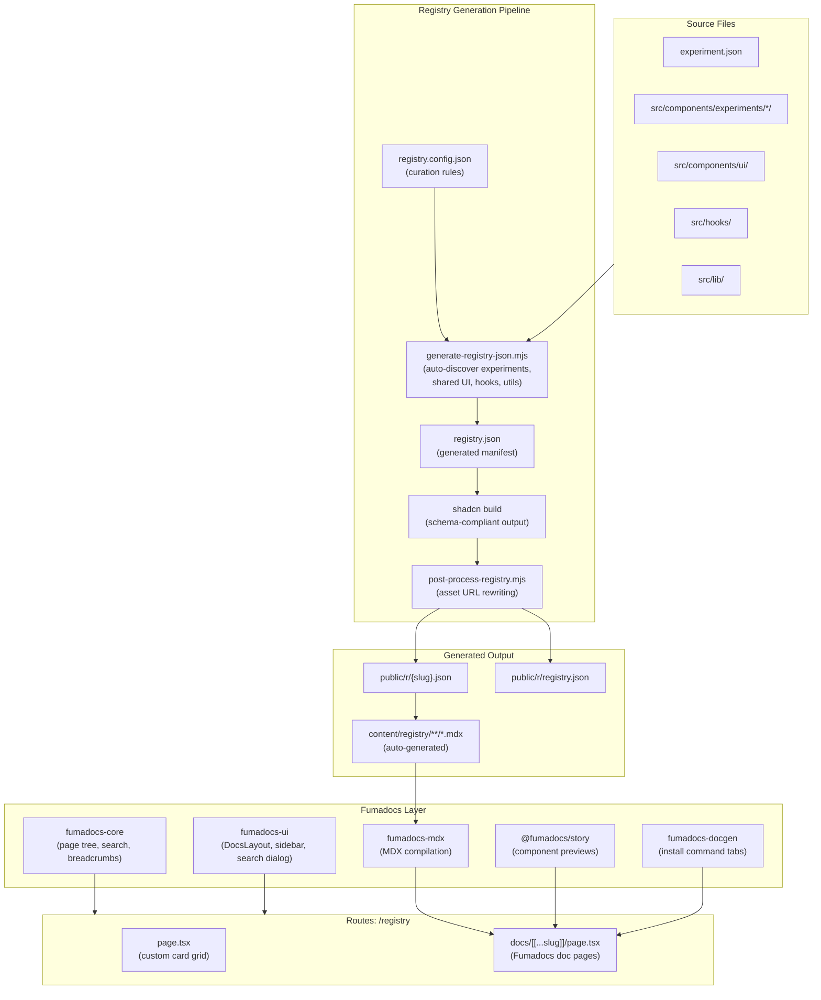

# Registry V2: Interactive Docs Explorer (Fumadocs-Powered)

## Enhancement Summary

**Deepened on:** 2026-03-10
**Research agents used:** Fumadocs docs, shadcn registry schema, component registry best practices, architecture strategy, performance analysis, security audit, simplicity review, pattern recognition
**Sections enhanced:** All 7 phases + architecture + adjacent notes

### Implementation Log

**2026-03-11 -- Lean Foundation shipped** (parallel-orchestration, 4 domain agents, 1 batch, all DONE):

- Script overhaul: 7 bug fixes/improvements to `generate-registry.mjs` (dedup, shared razi-style.json, file type semantics, index-slim.json 9KB, parallel fs.stat, $schema, registry:block types)
- Route structure: `(registry)` route group with own `<html>/<body>`, dark-only, grid overview (18 items), detail page with Shiki source code, OG images
- Components: RegistryCard (hover-to-play video), InstallCommand (clipboard copy), ExperimentPreview (sandboxed iframe), RegistryMeta (badges/pills)
- Config: noindex headers, outputFileTracingIncludes, shiki optimizePackageImports
- Results: 0 new deps, 0 type errors, 0 lint errors, index.json 890KB→17KB, both pages return 200

**2026-03-11 -- Registry Pipeline shipped** (parallel-orchestration, 4 domain agents, 1 batch, 3 DONE + 1 aborted-but-complete):

- Pipeline split: monolithic `generate-registry.mjs` (541 lines) → 3-step pipeline (`generate-registry-json.mjs` 734 lines → `build-registry.mjs` 162 lines → `post-process-registry.mjs` 183 lines)
- Discovery: extended scanning beyond experiments to shared UI (28 components), hooks (11), and selected utilities
- Curation: `registry.config.json` with featured/hidden/overrides/scan scope controls
- Build: reads `registry.json` manifest, inlines content, rewrites asset URLs, outputs per-item JSON to `public/registry/`
- Post-process: generates `index.json` (content-stripped) + `index-slim.json` (lightweight grid index) with schema validation, featured-first sorting
- Integration: `package.json` updated (`generate:registry` chains all 3 scripts), legacy script kept as `generate:registry:legacy`
- Artifacts: `.agents/artifacts/registry-2/` (plan, 4 briefs, 4 handoffs, README)
- Note: Domain 1 agent aborted before writing handoff but script was fully created; handoff reconstructed manually. Verification pass + pipeline integration testing still needed.

### Critical Findings

1. ~~**Tailwind v3/v4 incompatibility**~~ **RESOLVED**: Project migrated to Tailwind v4.2.1 with `@tailwindcss/postcss`, `@import 'tailwindcss'`, `@theme` blocks, `@custom-variant dark`, and `@plugin`. Fumadocs' CSS imports are directly compatible.
2. **Significant over-engineering risk**: 5 dependencies + 20 files + 7 phases to display 19 items. A simpler approach (3-4 server components, 0 new deps) delivers the core value.
3. **MDX generation is a wasteful round-trip**: Generating MDX files so Fumadocs can compile them back to pages when the data already exists in JSON. A custom page tree from JSON eliminates this entirely.
4. **Plan text contradicts code**: Says "NOT an isolated HTML root" but the layout code renders `<html>/<body>`. The code is correct (matches project convention). Text needs fixing.
5. **MDX dual-compilation conflict (HIGH)**: `fumadocs-mdx` plugin wraps `next.config.ts` globally. Could conflict with the existing `next-mdx-remote` article system.
6. **iframe security**: Experiments need `sandbox` attribute. Same-origin iframes without sandbox have full parent DOM access.

### Key Decisions Required Before Implementation


| #   | Decision                   | Options                                                                                  | Recommendation                                 |
| --- | -------------------------- | ---------------------------------------------------------------------------------------- | ---------------------------------------------- |
| 1   | **Architecture approach**  | Full Fumadocs (original plan) vs Lean (0 deps, 3-4 files) vs Hybrid (Fumadocs core only) | Start Lean, add Fumadocs when scale demands it |
| 2   | ~~**Tailwind version**~~   | ~~v3.4 vs v4~~                                                                           | **RESOLVED** -- v4.2.1 is live                 |
| 3   | **MDX strategy**           | `fumadocs-mdx` (build-time) vs custom JSON source vs no MDX at all                       | No MDX -- read JSON directly                   |
| 4   | **Fumadocs version**       | Latest (TW4 compatible) vs none                                                          | Latest is now viable; decide based on approach |
| 5   | **Registry URL migration** | `public/registry/` -> `public/r/`                                                        | Yes, align with convention                     |


---

## Current State

> **Updated 2026-03-11** after Registry Pipeline implementation.

The registry now has a data layer (3-step pipeline), a UI layer, and a curation layer:

**Data layer (3-step pipeline):**

- `scripts/generate-registry-json.mjs` (734 lines) -- discovers experiments (18), shared UI (28 components), hooks (11), selected utilities; reads `registry.config.json` for curation; outputs `registry.json` manifest
- `scripts/build-registry.mjs` (162 lines) -- reads manifest, inlines file content, rewrites asset URLs, outputs per-item JSON to `public/registry/`
- `scripts/post-process-registry.mjs` (183 lines) -- generates `index.json` (content-stripped) + `index-slim.json` (lightweight grid index) with schema validation, featured-first sorting
- `scripts/generate-registry.mjs` (541 lines) -- legacy monolithic script, kept as `generate:registry:legacy` fallback
- `registry.json` (project root) -- generated manifest consumed by build step
- 18+ registry items in `public/registry/` with `registryDependencies: ["razi-style"]`
- `public/registry/razi-style.json` -- shared style item referenced by all items
- `public/registry/index-slim.json` -- lightweight index for grid page
- `public/registry/index.json` -- full index with content stripped
- `next.config.ts` rewrites `/r/:slug` to `/registry/:slug.json`, noindex headers, outputFileTracingIncludes
- `npx shadcn add https://www.razisyed.cv/r/send-button` works

**Curation layer (new):**

- `registry.config.json` -- featured (5 items), hidden (`test`), overrides (3 shared UI descriptions), scan scope (experiments + sharedUI + hooks + selected utilities)

**UI layer (new -- Lean, no Fumadocs):**

- `src/app/(registry)/layout.tsx` -- own `<html>/<body>`, dark-only, fonts, analytics, minimal header
- `src/app/(registry)/registry.css` -- shared-tokens + tailwind + shared-theme + Shiki styles
- `src/app/(registry)/registry/page.tsx` -- 3-col responsive grid reading index-slim.json
- `src/app/(registry)/registry/[slug]/page.tsx` -- detail page with Shiki syntax-highlighted source, generateStaticParams
- `src/app/(registry)/registry/[slug]/opengraph-image.tsx` -- dynamic OG images (Node.js runtime)
- `src/components/registry/RegistryCard.tsx` -- hover-to-play video, poster fallback, tech pills
- `src/components/registry/InstallCommand.tsx` -- terminal-style copy block
- `src/components/registry/ExperimentPreview.tsx` -- lazy sandboxed iframe with skeleton + error state
- `src/components/registry/RegistryMeta.tsx` -- file count, dep count, tech pills, tag badges

### ~~Known bugs in current generation script~~ FIXED (2026-03-11)

- ~~**Duplicate files**: dedup comparison is broken~~ Fixed: uses `Set` of `path.resolve()` values
- ~~**Hardcoded tailwind/cssVars**: 120 lines of identical config duplicated~~ Fixed: extracted to `razi-style.json` shared `registryDependency`
- **Non-standard output path**: `public/registry/` kept as-is (rewrite handles `/r/` URL mapping)
- ~~**No file type semantics**: everything is `registry:file`~~ Fixed: `inferFileType()` classifies as `registry:component`, `registry:hook`, `registry:lib`, `registry:file`

### ~~Research Insights: Current Generation Script~~ IMPLEMENTED

~~**Performance bug**: The import resolver uses sequential `fs.stat` calls.~~ Fixed: `resolveImportPath()` uses `Promise.all` for parallel stat checks.

**shadcn registry schema insights** (from official docs):

- Valid `type` values: `registry:component`, `registry:hook`, `registry:lib`, `registry:ui`, `registry:file`, `registry:page`, `registry:block`, `registry:style`, `registry:theme`
- `target` is required for `registry:file` and `registry:page` types
- `$schema` should point to `https://ui.shadcn.com/schema/registry.json` (manifest) or `https://ui.shadcn.com/schema/registry-item.json` (individual items)
- Shared CSS can use `registry:style` type as a `registryDependency` to avoid per-item duplication (solves the hardcoded tailwind/cssVars bug)
- `registryDependencies` support three formats: `"button"` (same registry), `"@namespace/item"` (namespaced), `"https://url"` (direct URL)

---

## Alternative Architecture: Lean Approach ~~(Recommended Start)~~ IMPLEMENTED (2026-03-11)

~~Before detailing the Fumadocs plan, here's the simplified approach recommended by the simplicity and architecture reviews.~~ **Implemented via parallel-orchestration skill (4 domain agents, 1 batch). This is the live foundation -- Fumadocs phases below build on top of it.**

### Why Lean


| Metric                 | Fumadocs Plan      | Lean Plan                    |
| ---------------------- | ------------------ | ---------------------------- |
| New files              | ~20                | 3-4                          |
| New dependencies       | 5                  | 0                            |
| Build pipeline changes | 3-step restructure | Bug fixes to existing script |
| Phases                 | 7                  | 1 + polish                   |
| Estimated LOC          | 2,000-3,000        | 400-600                      |
| Time to ship           | 2-3 weeks          | 2-3 days                     |


### Lean Architecture

```
src/app/(registry)/
  layout.tsx                    -- Minimal layout, own <html>/<body>, dark theme
  registry/
    page.tsx                    -- Server component: reads index.json, renders card grid
    [slug]/
      page.tsx                  -- Server component: reads {slug}.json, renders detail page
      opengraph-image.tsx       -- Dynamic OG image per item

src/components/registry/
  InstallCommand.tsx            -- Terminal-style copy block (optional extraction)
```

The overview `page.tsx` reads `public/r/index.json`, renders a filterable card grid with poster images and hover-to-play video. The detail `[slug]/page.tsx` reads `public/r/{slug}.json`, renders title, description, iframe preview, install command, deps, and collapsible source code (Shiki syntax highlighting -- already in the project).

**No Fumadocs, no MDX, no content/ directory, no source.config.ts, no search API route, no story files, no meta.json files.**

### When to Graduate to Fumadocs

Add Fumadocs infrastructure when ANY of these are true:

- Registry exceeds ~40-50 items and sidebar navigation becomes essential
- You want Cmd+K full-text search across docs prose
- You start hand-authoring substantial documentation per item (not just metadata)
- You need `@fumadocs/story` for shared UI component previews with prop controls

### ~~Bug Fixes for Existing Script~~ ALL FIXED (2026-03-11)

1. ~~**Fix dedup**~~ DONE: Uses `Set` of `path.resolve()` values
2. ~~**Extract shared tailwind/cssVars**~~ DONE: `razi-style.json` as `registryDependency`
3. **Move output**: Deferred -- `public/registry/` kept, rewrite handles `/r/` URL mapping
4. ~~**Add file type semantics**~~ DONE: `inferFileType()` function
5. ~~**Generate lightweight index**~~ DONE: `index-slim.json` (9KB) + content-stripped `index.json` (17KB)

---

## Key Decisions

- **Framework**: Fumadocs (core + UI + story + docgen) for docs infrastructure
- **Route group**: `src/app/(registry)/registry/` -- Fumadocs DocsLayout with sidebar, search, breadcrumbs
- **Renders own `<html>/<body>`** -- follows project convention for isolated route groups. Shares visual theme via `shared-tokens.css` or equivalent CSS variable mapping.
- **Preview strategy**: iframe for full experiments, `@fumadocs/story` for shared UI components (inline with prop controls), code-only for hooks/utilities
- **Code display**: `fumadocs-docgen` for install command tabs (npm/pnpm/yarn/bun) + Fumadocs built-in Shiki syntax highlighting
- **Registry generation**: hybrid pipeline (auto-discover -> `shadcn build` -> post-process)
- **Data curation**: `registry.config.json` controls featured, hidden, category overrides

### Research Insights: Key Decision Risks

**Tailwind v3/v4 incompatibility -- RESOLVED**:

- Project now runs Tailwind v4.2.1 with `@tailwindcss/postcss`, `@import 'tailwindcss'`, `@theme` blocks, and `@custom-variant dark (&:is(.dark *))`
- Fumadocs' CSS imports (`@import 'fumadocs-ui/css/shadcn.css'`) are directly compatible with TW4's CSS-first config
- The existing `shared-tokens.css` (CSS custom properties) + `shared-theme.css` (`@theme` block) pattern extends naturally to a registry CSS file that adds Fumadocs `--color-fd-`* overrides
- No version pinning or migration needed -- use latest Fumadocs

**MDX dual-compilation conflict (HIGH)**:

- The project uses `next-mdx-remote/rsc` for article runtime MDX compilation
- `fumadocs-mdx` wraps `next.config.ts` with `createMDX()` which adds global MDX loaders
- These could conflict if Fumadocs loaders intercept article MDX files
- **Mitigations**: (a) Skip `fumadocs-mdx` entirely -- use `fumadocs-core` with a custom JSON source, (b) Scope Fumadocs MDX plugin to `content/registry/` only via `include` config, (c) Keep article MDX files out of `content/` entirely

---

## Architecture




### Research Insights: Architecture Risks


| Risk                                          | Severity              | Mitigation                                                                    |
| --------------------------------------------- | --------------------- | ----------------------------------------------------------------------------- |
| ~~Tailwind v3/v4 incompatibility~~            | ~~HIGH~~ **RESOLVED** | Project on TW v4.2.1; latest Fumadocs is compatible                           |
| MDX dual-compilation conflict                 | **HIGH**              | Skip `fumadocs-mdx`, use custom JSON source or go dependency-free             |
| Plan text contradicts code (layout isolation) | **HIGH**              | Layout renders own `<html>/<body>` (project convention). Fix plan text.       |
| `shadcn build` CLI coupling                   | **MEDIUM**            | Pin exact version, add contract test on output, keep fallback script          |
| Generated MDX file management                 | **MEDIUM**            | Gitignore generated files, or skip MDX generation entirely                    |
| iframe preview memory                         | **MEDIUM**            | `loading="lazy"`, IntersectionObserver, poster fallback, mobile static images |
| `next.config.ts` plugin wrapping              | **MEDIUM**            | Avoid if possible; custom JSON source eliminates this need                    |
| Bundle size on non-registry pages             | **LOW**               | Route group isolation handles this; add to `optimizePackageImports`           |
| Orama search index exposure                   | **LOW**               | Client-side only at this scale; index is ~30-50KB                             |


### Research Insights: Alternative Architecture (Skip MDX Generation)

The strongest mitigation for risks 2, 5, and 7 is to **skip MDX generation entirely** and use Fumadocs with a custom content source:

```typescript
// src/lib/registry-source.ts -- custom JSON source, no fumadocs-mdx needed
import { loader } from 'fumadocs-core/source';
import registryIndex from '../../public/r/registry.json';

export const registrySource = loader({
  baseUrl: '/registry',
  source: {
    files: registryIndex.map(item => ({
      type: 'page',
      path: `${item.category}/${item.slug}`,
      data: { title: item.title, description: item.description, ...item },
    })),
  },
});
```

**Trade-offs**: (+) No `fumadocs-mdx` package, no `next.config.ts` plugin, no generated files, no MDX compilation conflict. (-) Lose MDX prose authoring per item, lose Fumadocs' built-in MDX component system.

---

## Fumadocs Packages Used


| Package           | Purpose                                                                                  | What it replaces (custom)                                            |
| ----------------- | ---------------------------------------------------------------------------------------- | -------------------------------------------------------------------- |
| `fumadocs-core`   | Page tree, search index (Orama), breadcrumbs, content source                             | Custom sidebar, custom search                                        |
| `fumadocs-ui`     | DocsLayout (sidebar + content), search dialog (Cmd+K), TOC, responsive mobile nav, theme | Custom RegistrySidebar, SearchFilter, breadcrumbs, responsive layout |
| `fumadocs-mdx`    | MDX content source, file-system routing, frontmatter                                     | Custom data loading from JSON                                        |
| `@fumadocs/story` | Inline component previews with auto-generated TypeScript prop controls                   | Custom ComponentPreview                                              |
| `fumadocs-docgen` | Install command tabs (npm/pnpm/yarn/bun)                                                 | Custom InstallCommand (partially)                                    |


### Research Insights: Fumadocs Compatibility

**Next.js 16 / React 19**: Fumadocs uses modern RSC patterns (async params, server components). Compatible with Next.js 15+ / React 19. No explicit Next.js 16 mention, but architecture aligns.

**Multiple content sources**: Use `multiple()` from `fumadocs-core/source` if you later need both registry and article sources:

```typescript
import { loader, multiple } from 'fumadocs-core/source';

export const source = loader(
  multiple({
    registry: registryDocs.toFumadocsSource(),
    articles: articleDocs.toFumadocsSource(),
  }),
  { baseUrl: '/docs' },
);
```

**Scoped search**: Filter `source.getPages()` before building the Orama index to scope search to only registry pages:

```typescript
import { createSearchAPI } from 'fumadocs-core/search/server';

export const { GET } = createSearchAPI('advanced', {
  indexes: source.getPages()
    .filter(page => page.url.startsWith('/registry'))
    .map(page => ({
      title: page.data.title,
      description: page.data.description,
      url: page.url,
      id: page.url,
      structuredData: page.data.structuredData,
    })),
});
```

**CSS variable prefix**: When using Fumadocs with existing shadcn/UI styles, use `createPreset({ cssPrefix: 'fuma-' })` to avoid CSS class collisions.

### What Fumadocs gives us for free

- Sidebar navigation (auto-generated from content filesystem)
- Cmd+K search dialog (Orama full-text search)
- Syntax highlighting (Shiki -- already in our project)
- Responsive mobile layout (sidebar -> sheet)
- TOC with scroll spy
- Breadcrumbs
- Dark/light mode toggle
- MDX component overrides

### What we still build custom

- Grid overview page (card layout, category browsing)
- Experiment iframe previews (experiments have isolated HTML roots)
- InstallCommand component (shadcn-specific `npx shadcn add` with URL)
- Registry metadata display (deps, tags, tech stack, file count)
- RegistryCard component (hover previews, video/poster)

### Research Insights: Phasing Dependencies

**Phase dependencies to reduce initial commitment:**


| Phase            | Dependencies needed                            | Defer until                                              |
| ---------------- | ---------------------------------------------- | -------------------------------------------------------- |
| Phase 1-3 (core) | `fumadocs-core`, `fumadocs-ui`, `fumadocs-mdx` | --                                                       |
| Phase 5 (story)  | `@fumadocs/story`                              | When shared UI components are actually registered        |
| Phase 5 (docgen) | `fumadocs-docgen`                              | Custom `InstallCommand.tsx` handles the primary use case |


This reduces initial dependency count from 5 to 3.

---

## Phase 1: Hybrid Registry Generation Pipeline ~~(Pending)~~ IMPLEMENTED (2026-03-11)

~~Replace current monolithic `generate-registry.mjs` with a 3-step pipeline:~~ **Implemented via parallel-orchestration skill (4 domain agents, 1 batch). Monolithic script split into 3-step pipeline. `registry.config.json` added. Scanning extended to shared UI, hooks, utilities. Artifacts at `.agents/artifacts/registry-2/`.**

### ~~Step 1: Auto-discover -> `registry.json`~~ DONE

~~New~~ Created script `scripts/generate-registry-json.mjs` (734 lines):

- Scans `src/app/experiments/` for experiments (existing logic)
- Scans `src/components/ui/` for shared components (new)
- Scans `src/hooks/` for hooks (new)
- Scans `src/lib/` for selected utilities (new)
- Reads `experiment.json` for metadata + WIP filtering
- Reads `registry.config.json` for curation (featured, hidden, overrides)
- Extracts npm dependencies + registry dependencies from imports (reuse existing `categorizeImport`)
- Lists files with proper semantic types (`registry:component`, `registry:hook`, `registry:lib`)
- Outputs `registry.json` in official shadcn schema format

### Research Insights: shadcn `registry.json` Schema

The official schema for `registry.json` (consumed by `shadcn build`):

```json
{
  "$schema": "https://ui.shadcn.com/schema/registry.json",
  "name": "razi-experiments",
  "homepage": "https://www.razisyed.cv",
  "items": [
    {
      "name": "send-button",
      "type": "registry:block",
      "title": "Send Button",
      "description": "A cool animated send button animation",
      "registryDependencies": ["razi-style"],
      "dependencies": ["motion", "lucide-react", "@radix-ui/react-switch"],
      "devDependencies": [],
      "files": [
        {
          "path": "registry/send-button/SendButton.tsx",
          "type": "registry:component"
        }
      ],
      "cssVars": {}
    },
    {
      "name": "razi-style",
      "type": "registry:style",
      "cssVars": {
        "theme": {},
        "light": { "background": "35 50% 95.29%", "foreground": "240 10% 3.9%" },
        "dark": { "background": "240 8.25% 6.84%", "foreground": "0 0% 98%" }
      }
    }
  ]
}
```

**Key improvements over current script:**

- Use `registry:style` item as shared `registryDependency` to eliminate the 120-line hardcoded `tailwind`/`cssVars` per item
- Use proper `type` values: `registry:block` for multi-file experiments, `registry:component` for single components, `registry:hook` for hooks
- `$schema` field enables IDE validation
- `registryDependencies` support the three formats: name, @namespace/name, or full URL

### ~~Step 2: `shadcn build`~~ DONE (custom build script instead of shadcn CLI)

~~- Reads auto-generated `registry.json`~~ Created `scripts/build-registry.mjs` (162 lines) -- reads `registry.json` manifest, inlines file content, rewrites asset URLs, outputs per-item JSON to `public/registry/`. Used custom build script instead of `shadcn build` CLI because our script handles import resolution and URL rewriting that the CLI doesn't support.

~~- Inlines file content, resolves dependencies~~
~~- Generates schema-compliant JSON in `public/r/`~~
~~- Handles `$schema` references, proper types, target paths~~

### Research Insights: `shadcn build` Details

- CLI package is `shadcn` (not `shadcn-ui`). Use `npx shadcn@latest build`.
- Pin exact version in `devDependencies` to avoid breakage.
- `--output` flag specifies output directory (default: `public/r`).
- The command inlines file contents (reads from disk, embeds as `content` field in output JSON).
- File `path` values must be relative to project root and must exist on disk.
- Add a **contract test** after `shadcn build`: validate output JSON against expected schema before post-processing.

### ~~Step 3: Post-process~~ DONE

~~New~~ Created script `scripts/post-process-registry.mjs` (183 lines):

- ~~Rewrites asset URLs (`/experiments/` -> `https://www.razisyed.cv/experiments/`)~~ URL rewriting moved to build step (Domain 2)
- ~~Generates enriched index with category, tags, preview type metadata~~ Done: reads `registry.json` meta for enrichment
- ~~Generates a **lightweight index** (title, slug, description, tags, poster URL) for the grid page~~ Done: `index-slim.json` with featured-first sorting + schema validation

### Research Insights: Pipeline Robustness

- Split step 3 into two scripts for single-responsibility: `post-process-registry.mjs` (JSON post-processing only) and `generate-registry-docs.mjs` (MDX stub generation). This follows the existing "one script, one job" pattern.
- Add `set -e` equivalent error propagation: if step 2 fails, step 3 must not run on stale data.
- Keep the current `generate-registry.mjs` as a **fallback** during migration. Don't delete until the new pipeline is proven.
- Pin `shadcn` CLI to exact version: `"shadcn": "2.x.x"` in `devDependencies`.

### ~~Build pipeline~~ DONE

```json
{
  "generate:registry": "node scripts/generate-registry-json.mjs && node scripts/build-registry.mjs && node scripts/post-process-registry.mjs",
  "generate:registry:legacy": "node scripts/generate-registry.mjs"
}
```

### ~~registry.config.json~~ DONE

```json
{
  "categories": ["experiments", "components", "hooks", "utilities", "styles"],
  "featured": ["send-button", "404-not-found", "keyboard-keys"],
  "hidden": ["test"],
  "overrides": {
    "ExperimentDrawerList": { "category": "components", "description": "macOS-style drawer list with grid/list toggle" }
  },
  "scan": {
    "experiments": true,
    "sharedUI": true,
    "hooks": true,
    "utilities": ["src/lib/utils.ts", "src/lib/fonts.ts"]
  }
}
```

### Research Insights: Simplification Option

With 19 items, `registry.config.json` is arguably YAGNI. The `featured`/`hidden` metadata could live in `experiment.json` (which already has `status`, `tags`, `tech`). A separate curation config is a second source of truth. Consider deferring `registry.config.json` and using `experiment.json` fields:

```json
{
  "title": "Send Button",
  "status": "shipped",
  "registryFeatured": true,
  "registryCategory": "experiments"
}
```

---

## Phase 2: Fumadocs Setup

### Install packages

```bash
npm i fumadocs-core fumadocs-ui fumadocs-mdx @fumadocs/story fumadocs-docgen
```

### Research Insights: Version & Compatibility

**Tailwind v4.2.1 is live** -- latest Fumadocs is fully compatible. The project's CSS-first config (`@import 'tailwindcss'`, `@theme` blocks, `@custom-variant dark`, `@plugin`) aligns with Fumadocs' expected import pattern. Install latest versions directly.

The registry layout CSS file should follow the existing pattern established by `globals.css`:

```css
/* src/app/(registry)/registry.css */
@import '../../shared-tokens.css' layer(base);

@import 'tailwindcss';
@import 'fumadocs-ui/css/shadcn.css';
@import 'fumadocs-ui/css/preset.css';
@import '../../shared-theme.css';

/* Map Fumadocs --color-fd-* variables to site tokens */
@theme {
  --color-fd-background: hsl(var(--background));
  --color-fd-foreground: hsl(var(--foreground));
  --color-fd-muted: hsl(var(--muted));
  --color-fd-muted-foreground: hsl(var(--muted-foreground));
  --color-fd-popover: hsl(var(--popover));
  --color-fd-popover-foreground: hsl(var(--popover-foreground));
  --color-fd-card: hsl(var(--card));
  --color-fd-card-foreground: hsl(var(--card-foreground));
  --color-fd-border: hsl(var(--border));
  --color-fd-primary: hsl(var(--primary));
  --color-fd-primary-foreground: hsl(var(--primary-foreground));
  --color-fd-secondary: hsl(var(--secondary));
  --color-fd-secondary-foreground: hsl(var(--secondary-foreground));
  --color-fd-accent: hsl(var(--accent));
  --color-fd-accent-foreground: hsl(var(--accent-foreground));
  --color-fd-ring: hsl(var(--ring));
}
```

This reuses the existing `shared-tokens.css` (CSS custom properties for light/dark) and `shared-theme.css` (`@theme` block for Tailwind color mapping), then adds Fumadocs variable overrides pointing to the same design tokens.

### Content source configuration

```ts
// source.config.ts
import { defineDocs, defineConfig } from 'fumadocs-mdx/config';

export const registryDocs = defineDocs({
  dir: 'content/registry',
});

export default defineConfig({});
```

```ts
// src/lib/registry-source.ts
import { loader } from 'fumadocs-core/source';
import { createMDXSource } from 'fumadocs-mdx';
import { registryDocs } from '@/.source';

export const registrySource = loader({
  baseUrl: '/registry',
  source: createMDXSource(registryDocs),
});
```

### Research Insights: Content Source API

**Fumadocs `defineDocs` API:**

- `dir` -- the content directory (e.g., `'content/registry'`)
- Returns a collection object compiled by the Vite plugin
- Files follow filesystem routing: `./dir/page.mdx` -> slug `['dir', 'page']`

`**meta.json` navigation structure:**

```json
{
  "title": "Experiments",
  "defaultOpen": true,
  "pages": ["send-button", "404-not-found", "---", "..."]
}
```

- `---Label---` creates separators
- `...` includes remaining pages alphabetically
- `!item` excludes from rest operator
- `"root": true` creates sidebar tab sections

`**loader()` output methods:**

- `source.getPage(['slug'])` -- single page
- `source.getPages()` -- all pages
- `source.pageTree` / `source.getPageTree()` -- for sidebar
- `source.generateParams()` -- for `generateStaticParams`

### Theme: shadcn CSS preset with Tailwind v4 integration

The registry layout CSS follows the same pattern as the site's `globals.css`, importing `shared-tokens.css` + `shared-theme.css` and adding Fumadocs CSS layers:

```css
/* src/app/(registry)/registry.css */
@import '../../shared-tokens.css' layer(base);

@import 'tailwindcss';
@import 'fumadocs-ui/css/shadcn.css';
@import 'fumadocs-ui/css/preset.css';
@import '../../shared-theme.css';

@custom-variant dark (&:is(.dark *));

/* Override --color-fd-* to map to existing site design tokens */
@theme {
  --color-fd-background: hsl(var(--background));
  --color-fd-foreground: hsl(var(--foreground));
  --color-fd-muted: hsl(var(--muted));
  --color-fd-muted-foreground: hsl(var(--muted-foreground));
  --color-fd-border: hsl(var(--border));
  --color-fd-primary: hsl(var(--primary));
  --color-fd-primary-foreground: hsl(var(--primary-foreground));
  --color-fd-ring: hsl(var(--ring));
  /* ... remaining fd-* mappings ... */
}
```

This leverages the existing `shared-tokens.css` (light/dark CSS variables) and `shared-theme.css` (`@theme` color registration) so the registry inherits the site's zinc dark palette without duplication.

### Research Insights: Full CSS Variable Map

*Fumadocs `--color-fd-` variables to map to site's zinc palette:**


| Fumadocs Variable                 | Map to Site Value                                  |
| --------------------------------- | -------------------------------------------------- |
| `--color-fd-background`           | `hsl(240, 8.25%, 6.84%)` -- matches `--background` |
| `--color-fd-foreground`           | `hsl(0, 0%, 92%)`                                  |
| `--color-fd-muted`                | `hsl(0, 0%, 12.9%)` -- matches `--muted`           |
| `--color-fd-muted-foreground`     | `hsla(0, 0%, 70%, 0.8)`                            |
| `--color-fd-popover`              | `hsl(0, 0%, 11.6%)`                                |
| `--color-fd-popover-foreground`   | `hsl(0, 0%, 86.9%)`                                |
| `--color-fd-card`                 | `hsl(0, 0%, 9.8%)`                                 |
| `--color-fd-card-foreground`      | `hsl(0, 0%, 98%)`                                  |
| `--color-fd-border`               | `hsla(0, 0%, 40%, 20%)`                            |
| `--color-fd-primary`              | `hsl(0, 0%, 98%)`                                  |
| `--color-fd-primary-foreground`   | `hsl(0, 0%, 9%)`                                   |
| `--color-fd-secondary`            | `hsl(0, 0%, 12.9%)`                                |
| `--color-fd-secondary-foreground` | `hsl(0, 0%, 92%)`                                  |
| `--color-fd-accent`               | `hsla(0, 0%, 40.9%, 30%)`                          |
| `--color-fd-accent-foreground`    | `hsl(0, 0%, 90%)`                                  |
| `--color-fd-ring`                 | `hsl(0, 0%, 54.9%)`                                |


**Layout CSS variables:**


| Variable             | Default             |
| -------------------- | ------------------- |
| `--fd-layout-width`  | `97rem`             |
| `--fd-sidebar-width` | (framework default) |
| `--fd-toc-width`     | (framework default) |
| `--fd-header-height` | (framework default) |


**CSS prefix for collision avoidance**: Use `createPreset({ cssPrefix: 'fuma-' })` if Fumadocs utility classes clash with existing Tailwind classes.

---

## Phase 3: Route Structure

```
src/app/(registry)/
  layout.tsx                    -- Own <html>/<body>, Fumadocs DocsLayout wrapper
  registry/
    page.tsx                    -- Custom grid overview (NOT Fumadocs)
    [[...slug]]/
      page.tsx                  -- Fumadocs doc page (sidebar, TOC, MDX)
      opengraph-image.tsx       -- Dynamic OG per item

content/registry/               -- MDX content (auto-generated + hand-authored)
  meta.json                     -- Navigation structure
  experiments/
    meta.json
    send-button.mdx
    404-not-found.mdx
    ...
  components/
    meta.json
    experiment-drawer-list.mdx
    grain-overlay.mdx
    ...
  hooks/
    meta.json
    ...

src/components/registry/        -- Custom components
  RegistryGrid.tsx              -- Card grid for overview page
  RegistryCard.tsx              -- Individual card
  InstallCommand.tsx            -- shadcn install command with copy
  ExperimentPreview.tsx         -- iframe for full experiments
  RegistryMeta.tsx              -- deps, tags, tech display
```

### Research Insights: Route Architecture

**Pattern alignment**: `(registry)` with own `<html>/<body>` follows the established project convention. Every route group renders its own HTML root. This means the registry layout must independently load:

- Custom fonts (replica, test die grotesk)
- Analytics (Umami script, Vercel Analytics/Speed Insights)
- Theme variables (shared-tokens.css or Fumadocs CSS variable overrides)
- Metadata/structured data

`**src/components/registry/`**: This establishes a new "feature-scoped component directory" pattern alongside `ui/` and `experiments/`. Justified -- registry components aren't reusable UI primitives and aren't experiment-specific. Document in AGENTS.md.

`**content/registry/`**: New top-level convention forced by Fumadocs. The project has no existing `content/` directory. Gitignore auto-generated MDX files and mark the directory as a build artifact.

### Layout

```tsx
// src/app/(registry)/layout.tsx
import { registrySource } from '@/lib/registry-source';
import { DocsLayout } from 'fumadocs-ui/layouts/docs';
import { RootProvider } from 'fumadocs-ui/provider';

export default function RegistryLayout({ children }) {
  return (
    <html lang="en" className="dark">
      <body>
        <RootProvider theme={{ defaultTheme: 'dark' }}>
          <DocsLayout
            tree={registrySource.getPageTree()}
            nav={{ title: "razi's registry", url: '/registry' }}
            sidebar={{ defaultOpenLevel: 1 }}
          >
            {children}
          </DocsLayout>
        </RootProvider>
      </body>
    </html>
  );
}
```

### Research Insights: DocsLayout API

**Full DocsLayout props:**


| Prop           | Type             | Description                                                    |
| -------------- | ---------------- | -------------------------------------------------------------- |
| `tree`         | `PageTree.Root`  | **Required.** Page tree for sidebar                            |
| `sidebar`      | `object`         | `{ enabled, collapsible, tabs, banner, prefetch, components }` |
| `nav`          | `Partial         | undefined`                                                     |
| `links`        | `LinkItemType[]` | Navigation links                                               |
| `githubUrl`    | `string`         | GitHub repo URL                                                |
| `themeSwitch`  | `object`         | `{ enabled, mode: 'light-dark'                                 |
| `searchToggle` | `object`         | `{ enabled, components }`                                      |


**Sidebar tabs** (for category grouping):

```tsx
<DocsLayout
  sidebar={{
    tabs: [
      { title: 'Experiments', url: '/registry/experiments' },
      { title: 'Components', url: '/registry/components' },
      { title: 'Hooks', url: '/registry/hooks' },
    ],
  }}
/>
```

**RootProvider** imports from `fumadocs-ui/provider/next` for Next.js. Key props: `search.enabled`, `theme.enabled`, `dir` (for RTL).

---

## Phase 4: MDX Auto-Generation

Script in post-processing step generates MDX stubs per registry item:

```mdx
---
title: Send Button
description: A cool animated send button animation
---

import { InstallCommand } from '@/components/registry/InstallCommand';
import { ExperimentPreview } from '@/components/registry/ExperimentPreview';
import { RegistryMeta } from '@/components/registry/RegistryMeta';

<RegistryMeta
  dependencies={["motion", "lucide-react", "@radix-ui/react-switch"]}
  tags={["animation", "ui", "button"]}
  tech={["motion"]}
  fileCount={5}
/>

## Preview

<ExperimentPreview slug="send-button" />

## Install

<InstallCommand slug="send-button" />

## Source

{/* Auto-generated code blocks with all files */}
```

Hand-authored MDX can override or extend auto-generated content.

### Research Insights: MDX Generation Strategy

**Preserving hand-authored content**: The generation script should check if the MDX file already exists before overwriting. If it exists, only update frontmatter metadata -- preserve the body. This prevents clobbering manual edits.

**Better pattern**: Separate auto-generated from hand-authored:

- `content/registry/.generated/` for auto-generated files
- `content/registry/` root for hand-authored overrides
- Hand-authored takes precedence (Fumadocs source config merges both)

**Section order for detail pages** (from animate-ui, shadcn, Radix best practices):

1. Title + description (H1 + one-liner)
2. Metadata bar (dependencies, tags, tech, file count, complexity)
3. Live preview (iframe for experiments, @fumadocs/story for shared UI)
4. Install command (tabbed: shadcn URL + npm/pnpm/yarn/bun)
5. Usage (minimal code example)
6. API Reference / Props table (for shared UI)
7. Source code (collapsible file-by-file)
8. Credits / attribution (for ported components)

**fumadocs-docgen `remarkInstall` plugin**: Use in MDX with fenced code blocks:

`

```mdx
```package-install
motion lucide-react
```

`

```

Requires `Tab` and `Tabs` components from `fumadocs-ui/components/tabs` registered in `mdx-components.tsx`.

---

## Phase 5: Preview System


| Item type            | Preview approach                            | Component                        |
| -------------------- | ------------------------------------------- | -------------------------------- |
| Experiments          | iframe pointing to `/experiments/{slug}`    | `ExperimentPreview.tsx` (custom) |
| Shared UI components | `@fumadocs/story` inline with prop controls | `*.story.tsx` files              |
| Hooks                | Code-only (no visual preview)               | Fumadocs built-in code blocks    |
| Utilities            | Code-only                                   | Fumadocs built-in code blocks    |


### ExperimentPreview (custom)

```tsx
// iframe wrapper with loading skeleton, aspect-ratio container, "Open Full Page" link
<div className="aspect-video rounded-lg border overflow-hidden">
  <iframe src={`/experiments/${slug}`} className="w-full h-full" />
</div>
```

### Research Insights: iframe Preview Best Practices

**Security**: Add `sandbox` attribute. Minimum: `sandbox="allow-scripts allow-same-origin allow-popups"`. This blocks top-navigation (iframe can't redirect parent), form submission to external targets, pointer-lock, and orientation-lock.

```tsx
function ExperimentPreview({ slug, title }: { slug: string; title: string }) {
  const [inView, ref] = useInView({ triggerOnce: true, rootMargin: '200px' });
  const [loaded, setLoaded] = useState(false);

  return (
    <div ref={ref} className="relative rounded-lg border overflow-hidden">
      <div className="aspect-video">
        {!loaded && <Skeleton className="absolute inset-0" />}
        {inView && (
          <iframe
            src={`/experiments/${slug}`}
            title={title}
            loading="lazy"
            sandbox="allow-scripts allow-same-origin allow-popups"
            className="w-full h-full border-0"
            onLoad={() => setLoaded(true)}
          />
        )}
      </div>
      <div className="flex items-center justify-between px-3 py-2 border-t">
        <span className="text-sm text-muted-foreground">{title}</span>
        <a href={`/experiments/${slug}`} target="_blank" rel="noopener">
          Open Full Page ↗
        </a>
      </div>
    </div>
  );
}
```

**Performance concerns** (from performance analysis):

- Three.js experiment iframes can consume **80-200 MB** of memory each
- GSAP scroll animations: **20-50 MB** per iframe
- DOM-only animations: **10-30 MB** per iframe
- **Never auto-load iframes on the grid overview page** -- use poster images + hover video
- On mobile, show static poster with explicit "Launch Preview" button instead of iframe
- Consider creating a lightweight preview route (`/experiments/{slug}?preview=true`) that strips DevTools, analytics, nav, and forces `prefers-reduced-motion`

**Viewport toggle** (from shadcn blocks page): Add device-size buttons (Desktop 1200px, Tablet 768px, Mobile 375px) that resize the preview container with smooth width transitions.

**Error boundary**: Wrap iframe in React error boundary. Fallback shows poster image + "Preview unavailable" overlay + "Open Full Page" link.

### Shared UI via @fumadocs/story

```tsx
// src/components/ui/GrainOverlay.story.tsx
import { defineStory } from '@/lib/story';
import { GrainOverlay } from './GrainOverlay';

export const story = defineStory(import.meta.url, {
  Component: GrainOverlay,
  args: { initial: { opacity: 0.4 } },
});
```

Used in MDX: `<story.WithControl />` -- renders inline with auto-generated prop controls.

### Research Insights: @fumadocs/story Setup

**Story factory configuration:**

```typescript
// src/lib/story.ts
import { createFileSystemCache, defineStoryFactory } from '@fumadocs/story';

export const { defineStory } = defineStoryFactory({
  cache: process.env.NODE_ENV === 'production'
    ? createFileSystemCache('.next/fumadocs-story')
    : undefined,
});
```

**Rules:**

- Story files must export as `story` (or set `name` to match export)
- Story files must be server component files
- The `Component` referenced must be a client component
- TypeScript auto-generates controls from component prop types
- Variants supported for multiple states: `args: [{ variant: 'Default', initial: {...} }, { variant: 'Warning', initial: {...}, fixed: { type: 'warning' } }]`

**Simplicity note**: With ~5-10 shared UI components, this dependency may not be worth it initially. A simple iframe or dynamic import preview is sufficient. Add `@fumadocs/story` when you have 10+ shared UI components with meaningful prop surfaces.

---

## Phase 6: Custom Components

Components in `src/components/registry/` that Fumadocs doesn't provide:

- **RegistryGrid.tsx** -- responsive card grid with hover video/poster previews, title, description, category badge, tech tag pills. Used on the overview page (not a Fumadocs doc page).
- **RegistryCard.tsx** -- individual card linking to the doc page. Shows preview media, item name, description snippet, dependency count.
- **InstallCommand.tsx** -- terminal-style block showing `npx shadcn add https://www.razisyed.cv/r/{slug}` with one-click copy. Extends `fumadocs-docgen`'s install tabs with the shadcn-specific URL format.
- **ExperimentPreview.tsx** -- iframe wrapper for experiment previews with loading skeleton, aspect-ratio container, error boundary, "Open Full Page" link.
- **RegistryMeta.tsx** -- metadata display block showing dependencies, tags, tech stack, file count, complexity badge.

### Research Insights: Card Grid Best Practices

**Card anatomy** (from animate-ui, magic-ui, shadcn, motion-primitives):

- **Preview media area** (top ~60%): poster image on load, hover-to-play `<video>` (muted, loop, playsInline, `preload="none"`)
- **Title + description** (2 lines max, truncated)
- **Category badge** or tag pills
- **Tech tag pills** (e.g., "motion", "gsap", "r3f")
- **Dependency count** or file count as subtle metadata

**Hover-to-play video pattern:**

```tsx
function RegistryCard({ slug, poster, title, description }) {
  const videoRef = useRef<HTMLVideoElement>(null);
  return (
    <div
      onMouseEnter={() => videoRef.current?.play()}
      onMouseLeave={() => { videoRef.current?.pause(); videoRef.current!.currentTime = 0; }}
    >
      <video ref={videoRef} poster={poster} preload="none" muted loop playsInline>
        <source src={`/experiments/${slug}/preview.mp4`} type="video/mp4" />
      </video>
      <h3>{title}</h3>
      <p>{description}</p>
    </div>
  );
}
```

**Responsive grid**: 3-col desktop, 2-col tablet, 1-col mobile.

**InstallCommand simplification**: The `fumadocs-docgen` dependency can be replaced by a single custom component:

```tsx
function InstallCommand({ slug }: { slug: string }) {
  const command = `npx shadcn add https://www.razisyed.cv/r/${slug}`;
  return (
    <pre className="relative rounded-lg bg-zinc-900 p-4 font-mono text-sm">
      <code>{command}</code>
      <CopyButton text={command} />
    </pre>
  );
}
```

---

## Phase 7: Polish

- Theme tuning: map all `--color-fd-*` variables to site's zinc palette
- Custom fonts: load replica + test die grotesk in the registry layout
- Grain overlay (subtle, matching site)
- Responsive QA across breakpoints
- Loading skeletons for iframe previews
- Umami analytics events (page views, copy events, install commands)
- Link from main site nav to `/registry`
- OG images for registry pages (use existing OG API route pattern)
- Consider `next-view-transitions` for page transitions within registry (T7 backlog item)

### Research Insights: OG Image Generation

**Use Edge Runtime** for per-page `opengraph-image.tsx`:

```tsx
// src/app/(registry)/registry/[[...slug]]/opengraph-image.tsx
import { ImageResponse } from 'next/og';

export const runtime = 'edge';
export const size = { width: 1200, height: 630 };
export const contentType = 'image/png';

export default async function OGImage({ params }: { params: { slug?: string[] } }) {
  const slug = params.slug?.join('/') || 'registry';
  const font = fetch(new URL('./fonts/replica.woff2', import.meta.url))
    .then(r => r.arrayBuffer());

  return new ImageResponse(
    <div style={{
      display: 'flex', flexDirection: 'column',
      width: '100%', height: '100%',
      background: 'hsl(240, 8.25%, 6.84%)',
      padding: 80, fontFamily: 'Replica',
    }}>
      <div style={{ fontSize: 64, fontWeight: 700, color: '#fafafa' }}>
        {item.title}
      </div>
      <div style={{ fontSize: 28, color: '#a1a1aa', marginTop: 16 }}>
        {item.description}
      </div>
      <div style={{ fontSize: 20, color: '#71717a', marginTop: 'auto' }}>
        razisyed.cv/registry/{slug}
      </div>
    </div>,
    { ...size, fonts: [{ name: 'Replica', data: await font }] }
  );
}
```

**Performance**: Edge Runtime OG generation is ~160x cheaper than Node.js. Cold start ~50ms, generation ~100-300ms. Font fetches are cached across invocations.

### Research Insights: Security Hardening

**Content-Security-Policy** (add to registry layout or next.config.ts):

```typescript
{
  source: "/registry/:path*",
  headers: [
    {
      key: "Content-Security-Policy",
      value: [
        "default-src 'self'",
        "script-src 'self' 'unsafe-inline' 'unsafe-eval'",
        "style-src 'self' 'unsafe-inline'",
        "img-src 'self' data: https://www.razisyed.cv",
        "font-src 'self'",
        "frame-src 'self'",
        "connect-src 'self' https://cloud.umami.is",
        "frame-ancestors 'self'",
      ].join("; ")
    }
  ]
}
```

**Access control recommendation**: Start with **unlisted + noindex** (zero code). Add later if needed:

```typescript
// next.config.ts headers for noindex
{
  source: "/registry/:path*",
  headers: [
    { key: "X-Robots-Tag", value: "noindex, nofollow" }
  ]
}
```

### Research Insights: Performance Budget


| Metric                        | Budget       | Measured by           |
| ----------------------------- | ------------ | --------------------- |
| First Load JS (registry page) | <150 KB gzip | `next build` output   |
| Largest Contentful Paint      | <2.5s        | Vercel Speed Insights |
| Time to Interactive           | <3.5s        | Lighthouse            |
| Cumulative Layout Shift       | <0.1         | Web Vitals            |
| Build time increase           | <25s         | CI pipeline           |
| Iframe memory (detail page)   | <250 MB      | Chrome DevTools       |
| Search response time          | <10ms        | Client-side Orama     |


### Research Insights: Asset Optimization (Pre-Launch)

Large outliers in `public/experiments/` that the registry grid will expose:


| File                                             | Size   | Action                        |
| ------------------------------------------------ | ------ | ----------------------------- |
| `cursor-depth-explorer/wandererabovethesea.jpeg` | 30 MB  | Resize/compress to WebP       |
| `basketball-replay-center/preview.mp4`           | 30 MB  | Run `npm run optimize:videos` |
| `mountain-transition/green.png`                  | 9.2 MB | Convert to WebP               |
| `mountain-transition/painting2.png`              | 8.4 MB | Convert to WebP               |
| `mountain-transition/snowy.png`                  | 8.1 MB | Convert to WebP               |


Run `npm run optimize:videos` and batch-convert large images before launching the registry grid.

---

## Related Backlog Items

These items from other tiers overlap with or are partially addressed by this work:

- **T2: Content Dashboard** -- registry overview page partially serves this (shows all items with metadata)
- **T2: Social Asset Automation** -- registry detail pages auto-generate OG images
- **T5: Package Extraction Automation** -- registry is the consumption side; visible install commands motivate completing extraction
- **T7: `next-view-transitions`** -- good candidate for registry page transitions

---

## Files to Create/Modify

**New files (~20) -- tracking:**

- `registry.config.json` -- curation rules ✅ (registry-2)
- `source.config.ts` -- Fumadocs content source config
- `src/lib/registry-source.ts` -- Fumadocs source loader
- `src/lib/story.ts` -- Fumadocs story factory
- `scripts/generate-registry-json.mjs` -- auto-discover -> registry.json ✅ (registry-2, 734 lines)
- `scripts/build-registry.mjs` -- manifest -> per-item JSON ✅ (registry-2, 162 lines)
- `scripts/post-process-registry.mjs` -- indices + validation ✅ (registry-2, 183 lines)
- `src/app/(registry)/layout.tsx` -- ~~Fumadocs DocsLayout~~ Lean layout ✅ (registry-1)
- `src/app/(registry)/registry/page.tsx` -- custom grid overview ✅ (registry-1)
- `src/app/(registry)/registry/[[...slug]]/page.tsx` -- Fumadocs doc pages (replaces current `[slug]`)
- `src/app/(registry)/registry/[[...slug]]/opengraph-image.tsx` -- per-page OG (current `[slug]` version exists ✅)
- `src/components/registry/RegistryCard.tsx` ✅ (registry-1)
- `src/components/registry/InstallCommand.tsx` ✅ (registry-1)
- `src/components/registry/ExperimentPreview.tsx` ✅ (registry-1)
- `src/components/registry/RegistryMeta.tsx` ✅ (registry-1)
- `content/registry/meta.json` -- nav structure
- `content/registry/experiments/meta.json`
- `content/registry/components/meta.json`
- `content/registry/hooks/meta.json`
- Various `*.story.tsx` files for shared UI components

**Modified files (~4) -- tracking:**

- `scripts/generate-registry.mjs` -- ~~replaced by pipeline (can delete)~~ kept as `generate:registry:legacy` fallback ✅ (registry-2)
- `package.json` -- ~~add fumadocs deps +~~ update build script ✅ (registry-2, pipeline wired)
- `next.config.ts` -- ~~add fumadocs MDX plugin +~~ update rewrite (`/r/` path) + CSP header + noindex ✅ (registry-1)
- `src/app/(main)/page.tsx` or shared nav -- add "Registry" link

### ~~Research Insights: Lean Alternative File Count~~ IMPLEMENTED (2026-03-11)

**New files (10) -- CREATED:**

- `src/app/(registry)/layout.tsx` ✅
- `src/app/(registry)/registry.css` ✅
- `src/app/(registry)/registry/page.tsx` ✅
- `src/app/(registry)/registry/[slug]/page.tsx` ✅
- `src/app/(registry)/registry/[slug]/opengraph-image.tsx` ✅
- `src/components/registry/RegistryCard.tsx` ✅
- `src/components/registry/InstallCommand.tsx` ✅
- `src/components/registry/ExperimentPreview.tsx` ✅
- `src/components/registry/RegistryMeta.tsx` ✅
- `public/registry/razi-style.json` ✅ (generated)

**Modified files (2) -- DONE:**

- `scripts/generate-registry.mjs` -- complete overhaul (dedup, shared style, file types, slim index, parallel stat, $schema) ✅
- `next.config.ts` -- noindex headers, outputFileTracingIncludes, shiki optimizePackageImports ✅

### Registry Pipeline Files -- CREATED (2026-03-11)

**New files (4):**

- `scripts/generate-registry-json.mjs` ✅ (734 lines -- discovery + scanning + manifest output)
- `scripts/build-registry.mjs` ✅ (162 lines -- manifest → per-item JSON with inlined content)
- `scripts/post-process-registry.mjs` ✅ (183 lines -- indices + schema validation)
- `registry.config.json` ✅ (featured/hidden/overrides/scan config)

**Modified files (1):**

- `package.json` -- `generate:registry` now chains 3-step pipeline, added `generate:registry:legacy` ✅

---

## Adjacent Notes & Future Opportunities

These are things to keep in mind during implementation, and opportunities that open up once the registry is live.

### Porting Skill Integration

The current porting skill (`.agents/skills/porting-demos/SKILL.md`) ends at Phase 10 (validation). Once the registry exists, add a **Phase 11: Registry Registration**:

- After a port is complete and validated, the porting skill should prompt: "Register this experiment in the registry?"
- Auto-run `npm run generate:registry` to pick up the new experiment
- If the port extracted reusable sub-components (e.g., a preloader, a scroll effect, a shader), suggest extracting them into `src/components/ui/` or `src/hooks/` and adding them as standalone registry items
- Update `registry.config.json` to set appropriate category, tags, and featured status
- Generate/update the MDX doc page for the new item

The porting skill's Phase 1 (classify) already identifies "Component" as a source type -- this path should flow directly into registry registration rather than full experiment scaffolding when the source is a small, reusable piece.

### New Skill: Quick Component Collector

A new skill at `.agents/skills/component-collector/SKILL.md` for rapidly adding discovered components, snippets, and effects into the registry without the full experiment scaffolding ceremony:

**Use cases:**

- You find a cool hover effect on CodePen -- want to save it
- A library has a nice component you want to fork and customize
- You write a one-off utility hook and want it cataloged
- You see a CSS technique worth preserving

**Workflow:**

1. Source input: URL, code snippet, or file path
2. Classify: component, hook, utility, style, or snippet
3. Minimal scaffolding: create the file in the right location (`src/components/ui/`, `src/hooks/`, `src/lib/`)
4. Auto-generate registry entry (add to `registry.config.json` overrides if needed)
5. Auto-generate MDX doc stub with source attribution, preview, and install command
6. Run `npm run generate:registry` to update output

This is lighter than the full porting skill -- no experiment scaffolding, no layout, no route group. Just: "save this thing to my collection."

### Personal Library / Bookmarking System

The registry can double as a **curated personal library** of cool things you find online. Not just things you've built, but things you've collected:

- Add a `source` or `origin` field to registry items: `{ "origin": "codepen", "url": "https://codepen.io/...", "author": "..." }`
- Add a `status` field beyond wip/shipped: `"collected"` (bookmarked, not yet adapted), `"adapted"` (ported into your stack), `"original"` (built from scratch)
- The MDX doc page for collected items can show: original source link, what you'd change, why it caught your eye, adaptation notes
- Over time this becomes a personal design reference library -- searchable, categorized, with working previews
- The `registry.config.json` scan config could add a `collections/` directory for items that aren't experiments or shared UI but are curated external references

This flips the registry from "things I distribute" to "things I know about" -- a personal component encyclopedia.

### Access Control / Gating

Several approaches from lightest to heaviest:

**1. Unlisted (easiest, no code)**

- Don't link to `/registry` from the main site nav
- Don't submit to registry.directory or any public listing
- The URL works if you share it directly -- friends-only via URL knowledge
- Search engines will still index it unless you add `noindex`

**2. Noindex + unlisted**

- Add `<meta name="robots" content="noindex, nofollow">` to the registry layout
- Remove from `sitemap.xml` generation
- Not findable via Google, but accessible to anyone with the URL
- Also add `X-Robots-Tag: noindex` header in `next.config.ts` for the `/registry` path

**3. Basic password gate**

- Middleware-based password check on `/registry/`* routes
- Simple shared password you give to friends
- Can use Next.js middleware + a cookie: enter password once, cookie persists
- No user accounts needed -- just a single shared secret
- The registry JSON at `/r/*.json` can remain public (for `npx shadcn add` to work) while the browsing UI is gated

### Research Insights: Secure Password Gate Implementation

```typescript
// middleware.ts
export function middleware(request: NextRequest) {
  if (!request.nextUrl.pathname.startsWith('/registry')) return NextResponse.next();
  if (request.nextUrl.pathname.startsWith('/r/')) return NextResponse.next(); // allow JSON endpoints

  const authCookie = request.cookies.get('registry-auth');
  if (authCookie?.value === expectedHash) return NextResponse.next();

  return NextResponse.redirect(new URL('/registry/login', request.url));
}
```

**Cookie attributes (all required):**


| Attribute  | Value       | Why                                        |
| ---------- | ----------- | ------------------------------------------ |
| `HttpOnly` | `true`      | Prevents JavaScript access                 |
| `Secure`   | `true`      | HTTPS only (HSTS enforced)                 |
| `SameSite` | `Lax`       | Prevents CSRF, allows top-level navigation |
| `Path`     | `/registry` | Scoped to registry routes                  |
| `Max-Age`  | `86400`     | 1 day, force periodic re-auth              |


Hash the password (never store raw): use `createHash('sha256').update(password + salt).digest('hex')`.

**4. Vercel authentication**

- Vercel has built-in password protection for preview deployments
- For production: Vercel's `vercel.json` `password` feature gates the entire deploy
- Or use Vercel's Edge Middleware with `@vercel/edge` for path-specific auth

**5. Namespace auth (shadcn native)**

- shadcn registries support authentication via `registry.json` `auth` field
- This gates the `npx shadcn add` install command, not the browsing UI
- Useful if you want people to browse but not install without permission

Recommendation: start with **unlisted + noindex** (zero code), add the basic password gate later if you want. The JSON endpoints for `npx shadcn add` should stay public so the install flow isn't broken.

### Development Workflow Changes

Once the registry exists, experiment development gains new steps:

**During development:**

- `npm run generate:registry` becomes part of the dev loop (already in build pipeline)
- New experiments auto-appear in the registry after generation
- The registry page serves as a QA dashboard -- you can browse all your work in one place with previews

**Component extraction pattern:**

- When an experiment has a reusable piece (e.g., `AnimatedPlaceholder` from send-button), extract it to `src/components/ui/` and register it separately
- The experiment's registry entry keeps the full bundle; the extracted component gets its own standalone entry
- Both show up in the registry, cross-referenced

**Content pipeline synergy:**

- Articles (T2 backlog) can embed registry component previews via MDX imports
- Lab notes can reference specific registry items
- The registry becomes the canonical "what exists" index, articles become "how it works"

### Experiment-to-Registry Quality Bar

Not every experiment needs to be in the registry. Consider quality tiers:

- **Featured**: High-quality, well-documented, actively maintained. Shows on the overview grid. Has full MDX docs, preview, install command.
- **Listed**: Working, installable, but minimal docs. Shows in sidebar but not featured grid.
- **Unlisted**: In the registry JSON (installable via URL) but not browsable. For experiments that work but aren't portfolio-worthy.
- **Draft**: `status: "wip"` -- excluded from generation entirely (current behavior).

The `registry.config.json` `featured` and `hidden` arrays already support this. Could add a `tier` field for finer control.

### T7 Synergy: animate-ui / motion-primitives

The T7 backlog mentions Tier 2/3 library adoption (animate-ui, motion-primitives, Cambio). Once the registry exists:

- Install these libraries' components into the project via their own registries
- Fork and customize them
- Re-register your customized versions in your own registry
- You become a curator: "here's animate-ui's magnetic button, but with my spring config and my color system"

This is the shadcn model applied recursively -- consume from upstream registries, adapt, redistribute through your own.

### Future: MDX Doc Quality Levels

Auto-generated MDX stubs will be minimal (preview, install, source). Over time, hand-author richer docs for featured items:

- **Level 0 (auto)**: Preview, install command, source code blocks
- **Level 1 (light edit)**: Add a one-paragraph description, usage example
- **Level 2 (article-lite)**: Props API table, multiple examples, customization guide
- **Level 3 (full article)**: Architecture explanation, design decisions, related experiments -- this is what the existing article system already does

The Fumadocs MDX system supports all levels. Auto-generation covers Level 0; human authoring upgrades individual items as they deserve attention.

---

## Research References

### Fumadocs Documentation

- Source API: [https://fumadocs.dev/docs/headless/source-api](https://fumadocs.dev/docs/headless/source-api)
- Page conventions (meta.json): [https://fumadocs.dev/docs/headless/page-conventions](https://fumadocs.dev/docs/headless/page-conventions)
- DocsLayout: [https://fumadocs.dev/docs/ui/layouts/docs](https://fumadocs.dev/docs/ui/layouts/docs)
- Themes/CSS: [https://fumadocs.dev/docs/ui/theme](https://fumadocs.dev/docs/ui/theme)
- Search (Orama): [https://fumadocs.dev/docs/headless/search/orama](https://fumadocs.dev/docs/headless/search/orama)
- Story: [https://fumadocs.dev/docs/integrations/story](https://fumadocs.dev/docs/integrations/story)
- MDX setup: [https://fumadocs.dev/docs/mdx](https://fumadocs.dev/docs/mdx)

### shadcn Registry

- Registry Getting Started: [https://ui.shadcn.com/docs/registry/getting-started](https://ui.shadcn.com/docs/registry/getting-started)
- Registry Item JSON: [https://ui.shadcn.com/docs/registry/registry-item-json](https://ui.shadcn.com/docs/registry/registry-item-json)
- Registry FAQ: [https://ui.shadcn.com/docs/registry/faq](https://ui.shadcn.com/docs/registry/faq)
- Namespace docs: [https://ui.shadcn.com/docs/registry/namespace](https://ui.shadcn.com/docs/registry/namespace)

### Component Registry Sites Studied

- shadcn/ui: ui.shadcn.com
- animate-ui: animate-ui.com (562 components, gold standard for animation registries)
- magic-ui: magicui.design
- motion-primitives: motion-primitives.com
- Radix Themes: radix-ui.com
- Storybook Showcase: storybook.js.org/showcase

