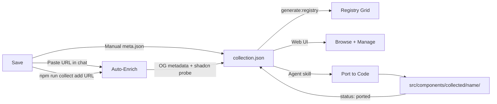
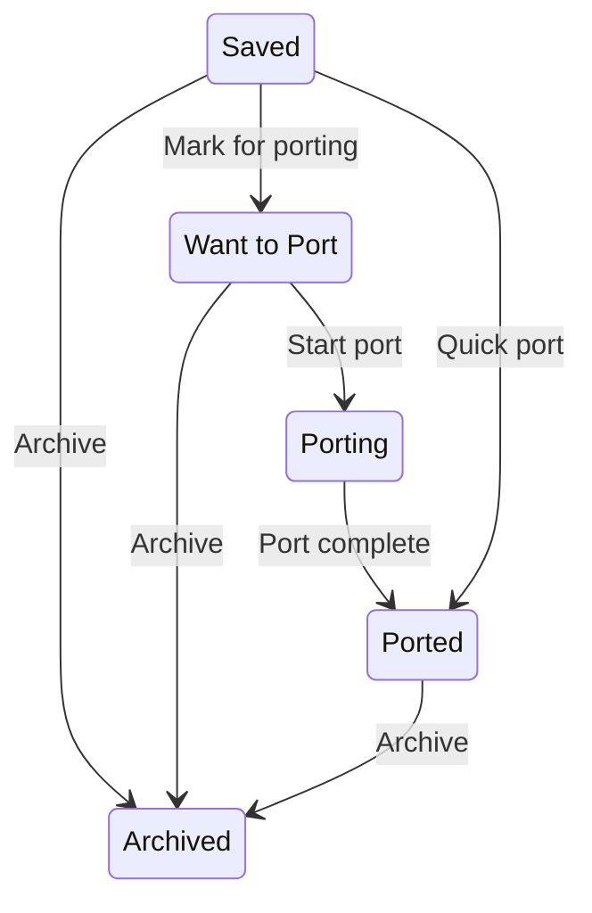

# Curated Component Collection

A personal, intentionally curated component library -- not a bulk aggregator. Every item is something you chose to save because you liked it, want to reference it, or plan to port it. Think Are.na for components.

---

## Mental Model




This is NOT about indexing every shadcn registry. It is about:

- You find a component you like somewhere on the web
- You save it with one command or one chat message
- It gets auto-enriched with metadata (title, description, thumbnail, tech stack)
- It lives in your collection with your personal notes, tags, rating, and board assignment
- When ready, you port it into actual code -- or just keep it as a reference

---

## A. Data Model: `collection.json`

Single manifest file at `src/components/collected/collection.json` -- the "database" of the entire collection. Ported items also get code folders alongside.

### Schema

```json
{
  "$schema": "./collection.schema.json",
  "boards": [
    {
      "id": "scroll-animations",
      "title": "Scroll Animations",
      "description": "Scroll-driven effects and parallax patterns",
      "color": "#3b82f6"
    },
    {
      "id": "hover-effects",
      "title": "Hover Effects",
      "color": "#8b5cf6"
    }
  ],
  "items": [
    {
      "id": "magic-card",
      "title": "Magic Card",
      "description": "A card with a spotlight hover effect that follows the cursor",
      "url": "https://magicui.design/docs/components/magic-card",
      "thumbnail": "https://magicui.design/og/magic-card.png",
      "source": {
        "type": "library",
        "name": "Magic UI",
        "url": "https://magicui.design",
        "registryUrl": "https://magicui.design/r/{name}.json"
      },
      "status": "saved",
      "rating": 4,
      "boards": ["hover-effects"],
      "tags": ["card", "spotlight", "hover", "motion"],
      "tech": ["motion", "react", "tailwind"],
      "notes": "Love the spotlight tracking. Could adapt for project cards on the portfolio.",
      "installCommand": "npx shadcn add @magicui/magic-card",
      "savedAt": "2026-03-11T00:00:00Z",
      "updatedAt": "2026-03-11T00:00:00Z"
    },
    {
      "id": "magnetic-button",
      "title": "Magnetic Button",
      "description": "Button that magnetically follows cursor on hover",
      "url": "https://some-codepen.io/...",
      "thumbnail": null,
      "source": {
        "type": "codepen",
        "name": "CodePen",
        "url": "https://codepen.io/author/pen/abc"
      },
      "status": "ported",
      "rating": 5,
      "boards": ["hover-effects"],
      "tags": ["button", "magnetic", "gsap"],
      "tech": ["gsap", "react"],
      "notes": "Ported and adapted. Using it in the send-button experiment.",
      "portedPath": "src/components/collected/magnetic-button/",
      "savedAt": "2026-03-10T00:00:00Z",
      "updatedAt": "2026-03-11T12:00:00Z"
    }
  ]
}
```

### Status Lifecycle




- **saved** -- bookmarked, just keeping it for reference
- **want-to-port** -- queued up, plan to bring the code into the repo
- **porting** -- actively being ported (agent working on it)
- **ported** -- has actual code at `portedPath`, fully usable
- **archived** -- kept for history but not actively interesting

### Key Design Decisions

- **Single JSON file, not per-item folders** for references -- adding a saved item is just appending to an array, not creating directories. Fast and lightweight.
- **Folders only for ported items** -- `src/components/collected/<name>/` with actual `.tsx` files, `meta.json` for registry compatibility.
- **Personal metadata is first-class** -- notes, rating, boards are not afterthoughts. They are the point.
- **Source enrichment is automatic but optional** -- the CLI/agent tries to enrich, but you can save a bare URL and add details later.

---

## B. CLI Tool: `scripts/collect.mjs`

Wired as `npm run collect` in [package.json](package.json). Uses subcommands:

```bash
# --- Adding items ---
npm run collect add <url>                          # Save URL, auto-enrich
npm run collect add <url> -- --board hover-effects # Save to specific board
npm run collect add <url> -- --tags "hover,gsap" --rating 5 --notes "amazing easing"

# --- Browsing ---
npm run collect list                               # List all items
npm run collect list -- --board scroll-animations  # Filter by board
npm run collect list -- --status want-to-port      # Filter by status
npm run collect list -- --tag gsap                 # Filter by tag
npm run collect list -- --rating 4                 # Min rating filter

# --- Editing ---
npm run collect tag <id> animation gsap            # Add tags
npm run collect rate <id> 5                        # Set rating (1-5)
npm run collect note <id> "Great for hero section" # Set/update notes
npm run collect status <id> want-to-port           # Change status

# --- Boards ---
npm run collect board create "Client X" --color "#f59e0b"
npm run collect board add <id> "client-x"          # Add item to board
npm run collect board remove <id> "client-x"       # Remove from board
npm run collect board list                         # List all boards

# --- Maintenance ---
npm run collect remove <id>                        # Remove item
npm run collect stats                              # Show collection stats
```

### Auto-Enrichment Pipeline (on `add`)

When you run `npm run collect add <url>`, the script:

1. **Fetch the URL** -- get the HTML page
2. **Extract OG metadata** -- `og:title`, `og:description`, `og:image` for thumbnail
3. **Probe for shadcn registry** -- try `<origin>/r/registry.json` to see if this is a shadcn-compatible library
4. **If shadcn-compatible** -- extract component name, dependencies, install command from the registry JSON
5. **Tech stack detection** -- scan the page/registry for keywords (motion, gsap, three, tailwind, etc.)
6. **Generate item** -- create the collection.json entry with all enriched data
7. **Print summary** -- show what was saved with the enriched metadata

If enrichment fails (URL is down, private, etc.), it still saves the bare URL with whatever the user provided via flags.

### Relevant Files

- **New**: [scripts/collect.mjs](scripts/collect.mjs) -- the CLI tool
- **Modify**: [package.json](package.json) -- add `"collect": "node scripts/collect.mjs"` script
- **New**: [src/components/collected/collection.json](src/components/collected/collection.json) -- initial empty collection

---

## C. Registry Integration

### Scanner: [scripts/generate-registry-json.mjs](scripts/generate-registry-json.mjs)

The existing `scanCollected()` function (lines 664-774) needs to be updated to read from `collection.json` instead of (or in addition to) scanning for `library.json` / `meta.json` files:

**For reference items** (status: saved, want-to-port):

- Create registry items with `files: []`, `meta.reference: true`
- Pass through boards, tags, rating, notes, source, installCommand into `meta`
- These show in the grid but link to external URLs or lightweight detail pages

**For ported items** (status: ported):

- Scan the `portedPath` folder for actual `.tsx` files (existing logic)
- Full file resolution, dependency analysis, etc.
- Merge personal metadata (notes, rating, boards) into `meta`

**Key**: items with `status: "archived"` are excluded from the registry output.

### MDX Generation: [scripts/generate-registry-mdx.mjs](scripts/generate-registry-mdx.mjs)

The existing `buildCollectedReferenceMdx()` (line 314) and `buildCollectedPortedMdx()` (line 361) already handle both cases. They need enrichment:

**Reference pages** get:

- Personal notes callout (if notes exist)
- Rating display
- Board badges
- Source attribution with link
- Install command (if `installCommand` exists from shadcn probe)
- "View Original" button

**Ported pages** get:

- Everything above, plus full source code and install command

---

## D. Web UI: `/registry/collected`

A dedicated management page, distinct from the main registry grid. This is the Raindrop.io-style experience.

### Page Structure

```
/registry/collected
  +-- Board tabs (horizontal, filterable)
  +-- Toolbar: search, status filter, tag filter, rating filter, view toggle
  +-- Grid of collected items
       +-- Each card: thumbnail, title, source badge, status badge, rating stars, tags
       +-- Click: expand to detail view or navigate to detail page
```

### Components to Build

**CollectedPage** (`src/app/(registry)/registry/collected/page.tsx`)

- Server component that reads `collection.json` (or the processed registry output)
- Passes data to the client-side management UI

**CollectedGrid** (`src/components/registry/CollectedGrid.tsx`)

- Board tabs across the top (All, Scroll Animations, Hover Effects, etc.) with color accents
- Status filter chips: All, Saved, Want to Port, Ported, Archived
- Rating filter: minimum star rating
- Tag-based faceted search
- Text search across title, description, notes, tags
- Grid/list view toggle

**CollectedCard** (`src/components/registry/CollectedCard.tsx`)

- Thumbnail (from OG image or placeholder based on source type)
- Title + brief description
- Source badge ("Magic UI", "CodePen", "GitHub", etc.)
- Status badge with color coding (green=ported, blue=saved, orange=want-to-port)
- Star rating (1-5, compact display)
- Tag pills
- Hover: show notes preview

**CollectedDetail** (either inline expand or separate page)

- Full notes with markdown rendering
- All metadata: source, tech stack, dependencies
- Action buttons:
  - Change status (dropdown)
  - Edit rating (star selector)
  - Edit tags (inline chips with add/remove)
  - Edit notes (inline textarea)
  - Add to board (dropdown)
  - View original (external link)
  - Install command (copy button, if available)
  - Port this (triggers agent workflow)

### Dev-Mode Management

When running `npm run dev`, the UI can write back to `collection.json` via Next.js Server Actions:

- `**src/app/(registry)/registry/collected/actions.ts`** -- server actions that read/write `collection.json`
- Status changes, tag edits, rating changes, note updates all write immediately
- Production build: these actions are disabled (read-only)
- This gives you a proper management UI without needing a separate backend

### Integration with Existing Registry Grid

[RegistryGrid.tsx](src/components/registry/RegistryGrid.tsx):

- Add "Collected" to `CATEGORY_ORDER` and `CATEGORY_LABELS` (lines 26-40)
- When "Collected" tab is active, link to `/registry/collected` instead of showing items inline (the dedicated page has better management UX)
- Or: show a summary card that says "42 items in your collection" with a link to the full management view

[RegistryCard.tsx](src/components/registry/RegistryCard.tsx):

- For collected items that appear in the main grid (ported ones), show source attribution badge

---

## E. Agent Skill: `quick-component`

Located at `.agents/skills/quick-component/SKILL.md`. Three modes:

### Mode 1: Save

User says "save this" or provides a URL.

1. Run `npm run collect add <url>` with any flags the user specifies
2. Auto-enrichment happens automatically
3. Report what was saved, with enriched metadata
4. Optionally ask: "Want to add it to a board or set a rating?"

### Mode 2: Port

User says "port magic-card" or "port this from my collection".

1. Read `collection.json` to find the item
2. If source has `registryUrl` (shadcn-compatible): fetch `<registryUrl>/<name>.json` for full source code -- already React, skip transformation
3. If source is non-standard (CodePen, vanilla JS, etc.): use the full analyze-transform pipeline from the porting-demos skill
4. Place code in `src/components/collected/<name>/`
5. Update `collection.json`: set `status: "ported"`, add `portedPath`
6. Run `npm run generate:registry` + `tsc --noEmit`

### Mode 3: Manage

User says "tag all my gsap items as animation" or "show my port queue" or "rate magic-card 5".

- Translates natural language into `npm run collect` subcommands
- Supports bulk operations
- Can suggest items to port based on rating and status

### Escalation

If the source requires a full experiment (scroll-driven animation, multi-section, its own route), redirect to the `porting-demos` skill + `new-experiment` workflow. The collected item stays as a reference with a note linking to the experiment.

---

## F. What Makes This S-Tier

1. **Intentional curation** -- every item is hand-picked, not bulk-imported. Your collection reflects your taste.
2. **One-command save** -- paste a URL, everything else is automatic. OG metadata, shadcn registry probe, tech detection.
3. **Personal metadata is first-class** -- notes, ratings, boards, status. Not an afterthought bolted onto a scraper.
4. **Real management UI** -- boards, filters, search, status tracking. Not just a flat list of JSON files.
5. **Dev-mode write-back** -- manage your collection from the browser when running `npm run dev`. No need to edit JSON by hand.
6. **Smart porting** -- shadcn-compatible sources give you the React code for free. Non-standard sources go through the full transformation pipeline.
7. **Everything in the repo** -- `collection.json` is version controlled. Your collection is portable, diffable, and won't disappear if a service shuts down.
8. **Agent-native** -- save, port, and manage via natural language. The skill understands your collection and can make suggestions.

---

## G. Implementation Phases

**Phase 1 -- Data + CLI** (core foundation):

- `collection.json` schema and initial file
- `scripts/collect.mjs` with add, list, tag, rate, note, status, board, remove, stats
- Auto-enrichment pipeline (OG metadata + shadcn probe)
- Update `scanCollected()` to read from `collection.json`

**Phase 2 -- Web UI** (browsing + management):

- `/registry/collected` page with CollectedGrid, CollectedCard
- Board tabs, status/tag/rating filters, search
- Dev-mode server actions for write-back
- Detail view with all metadata and action buttons

**Phase 3 -- Agent Skill + Polish** (intelligence layer):

- `quick-component` skill with save/port/manage modes
- "Collected" tab in main RegistryGrid linking to the management page
- MDX generation enrichment for collected items
- AGENTS.md + memory.md updates

