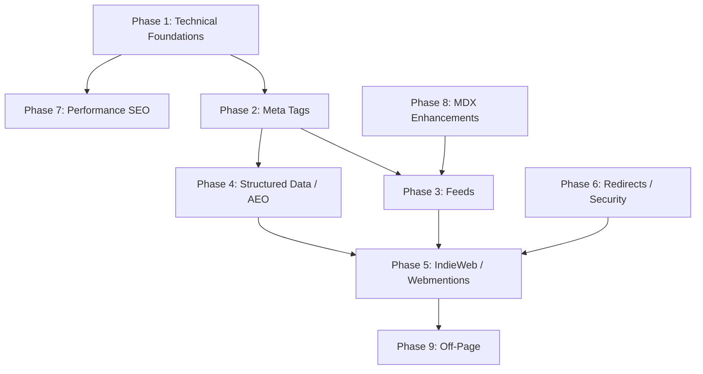

# SEO, AEO, and IndieWeb Ultimate Elevation

## Current State Assessment

The site already has solid foundations: dynamic sitemap, AI-friendly robots.txt, JSON-LD structured data (WebSite, Person, TechArticle, SoftwareApplication, BreadcrumbList), RSS 2.0 feed with full content, comprehensive OG/Twitter cards, and llms.txt for AI discoverability. However, there are significant gaps and elevation opportunities across every layer.

## Critical Gaps Found

- **Favicon exists but incomplete** -- `src/app/icon.png` exists, but no `favicon.ico` or `apple-icon.png` variants
- **No web manifest** -- no PWA metadata at all
- ~~**Missing OG image asset**~~ -- `public/og-image.png` confirmed to exist
- **RSS feed not discoverable** -- no `<link rel="alternate">` autodiscovery tag in any `<head>`
- **No Atom or JSON Feed** -- only RSS 2.0
- **No XSL stylesheet for feeds** -- raw XML shown to users who click feed links
- **No webmentions or IndieWeb markup** -- no h-card, h-entry, h-feed, rel="me", or webmention endpoints
- **No microdata/microformats** on any page
- **Phantom `/experiments` URL** in sitemap -- no such standalone page exists
- **Article title rendered as `<p>` not `<h1>`** in `ArticleLayout.tsx` -- bad for SEO semantics
- **No 301 redirects** -- zero redirect rules
- **No middleware** -- no canonical enforcement, no trailing-slash normalization
- **No Content-Security-Policy on main site** -- CSP only on registry
- **No `.well-known/` directory** -- missing security.txt, webfinger, etc.
- **Sitemap missing hreflang, image, and video extensions**
- **No FAQ, HowTo, or ItemList structured data** for AEO
- **No global `prefers-reduced-motion`** handling

---

## Phase 1: Technical SEO Foundations

### 1.1 Favicon and Icons

`src/app/icon.png` already exists (Next.js auto-generates `<link rel="icon">` from this). Augment with:

- `src/app/favicon.ico` -- derived/converted from existing `icon.png` (32x32, for legacy browser compatibility)
- `src/app/apple-icon.png` -- copy/resize from existing `icon.png` (180x180, for iOS home screen)

The existing `icon.png` handles the primary favicon via Next.js file conventions.

### 1.2 Web App Manifest

Create `[src/app/manifest.ts](src/app/manifest.ts)` exporting a `MetadataRoute.Manifest`:

```typescript
export default function manifest(): MetadataRoute.Manifest {
  return {
    name: "Razi's Experiments Lab",
    short_name: "Experiments",
    description: SITE_DESCRIPTION,
    start_url: "/",
    display: "standalone",
    background_color: "#111115",
    theme_color: "#111115",
    icons: [
      { src: "/icon-192.png", sizes: "192x192", type: "image/png" },
      { src: "/icon-512.png", sizes: "512x512", type: "image/png" },
    ],
  };
}
```

### 1.3 OG Image (Already Exists)

`public/og-image.png` is confirmed to exist. Verify that `layout.tsx` metadata references it correctly at `/og-image.png`. No action needed unless the image needs updating.

### 1.4 Fix Article Title Semantics

In `[src/components/ui/ArticleLayout.tsx](src/components/ui/ArticleLayout.tsx)`, change the article title from `<p className="font-semibold">` to a proper `<h1>` element. This is critical for SEO heading hierarchy.

### 1.5 Fix Phantom Sitemap Entry

In `[src/app/sitemap.ts](src/app/sitemap.ts)`, either:

- Remove the `/experiments` entry (since it is a tab on homepage, not a standalone page), OR
- Create a proper `/experiments` page that redirects or renders the experiments listing

### 1.6 Sitemap Enhancements

Enhance the sitemap in `[src/app/sitemap.ts](src/app/sitemap.ts)`:

- Add `images` array for experiments that have poster/preview images
- Add `videos` for experiments that have preview.mp4
- Include `/feed.xml`, `/llms.txt` as additional URLs
- Consider splitting into sitemap index if experiment count grows (via `generateSitemaps()`)

---

## Phase 2: Meta Tags and Metadata Elevation

### 2.1 Enhanced Main Layout Metadata

In `[src/app/(main)/layout.tsx](src/app/(main)`/layout.tsx), add:

- `category: "technology"` 
- `classification: "creative coding portfolio"`
- `other` metadata for `theme-color` with media queries (light/dark)
- Feed autodiscovery link via `alternates.types`:

```typescript
alternates: {
  canonical: "/",
  types: {
    "application/rss+xml": "/feed.xml",
    "application/atom+xml": "/atom.xml",
    "application/feed+json": "/feed.json",
  },
},
```

### 2.2 Per-Experiment Metadata Improvements

For each experiment layout, ensure:

- `keywords` array derived from `experiment.json` `tags` + `tech`
- `category` set from `profile` field
- Canonical URL is full absolute URL (not relative)
- Video metadata if `video` field exists in experiment.json

### 2.3 Article Metadata Improvements

For article pages:

- Add `article:published_time`, `article:modified_time`, `article:author`, `article:tag` OG properties
- Add `article:section` for categorization
- Ensure `updatedAt` is reflected in both OG and JSON-LD

---

## Phase 3: Feeds Ecosystem

### 3.1 Atom Feed

Create `src/app/atom.xml/route.ts` serving Atom 1.0 alongside the existing RSS:

- Full article content in `<content type="html">`
- Author info with `<name>`, `<uri>`
- Categories from tags
- Proper `<updated>` timestamps

### 3.2 JSON Feed

Create `src/app/feed.json/route.ts` serving [JSON Feed 1.1](https://jsonfeed.org/version/1.1):

- Simple JSON format, easy for modern consumers
- Include `content_html` for full text
- Include `tags`, `date_published`, `date_modified`

### 3.3 XSL Stylesheet for RSS/Atom

Create `public/feed-styles.xsl` -- an XSLT stylesheet that transforms feed XML into human-readable HTML when opened in a browser. Include:

- Explanation of what RSS/Atom is
- Link to [About Feeds](https://aboutfeeds.com/)
- Styled feed preview matching site design
- Subscribe instructions

Reference it in RSS/Atom output via `<?xml-stylesheet type="text/xsl" href="/feed-styles.xsl"?>`.

### 3.4 Feed Autodiscovery

Add `<link rel="alternate">` tags for all three feeds. In Next.js this is done via `metadata.alternates.types` in the main layout (covered in 2.1 above). This enables feed readers to auto-detect feeds.

---

## Phase 4: Structured Data and AEO

### 4.1 Enhanced JSON-LD Graph

Expand `[src/lib/structured-data.ts](src/lib/structured-data.ts)`:

- **Homepage**: Add `ItemList` schema for the experiments listing (name, description, URL, position for each experiment)
- **Articles**: Add `FAQPage` schema where articles contain Q&A sections; add `speakable` property for voice search
- **Experiments**: Consider `CreativeWork` instead of or in addition to `SoftwareApplication` -- more semantically accurate for creative coding experiments
- **Site-wide**: Add `Organization` or `ProfilePage` schema per Google's guidance
- **Breadcrumbs**: Ensure every page has breadcrumb structured data (homepage currently missing it)

### 4.2 AEO-Specific Enhancements

- **llms.txt improvements**: Ensure `public/llms.txt` follows the emerging spec closely -- structured sections, clear descriptions, canonical URLs
- **robots.txt**: Already excellent for AI bots. Consider adding explicit `llms.txt` reference
- **Content structure**: Articles should use question-based H2 headings where natural, with direct answer-first paragraphs
- **Speakable markup**: Add `speakable` property to article JSON-LD for voice assistant optimization

### 4.3 Microdata (Schema.org HTML attributes)

Add `itemscope`, `itemtype`, `itemprop` HTML attributes to key elements:

- Homepage header: `Person` microdata
- Experiment cards: `SoftwareApplication` or `CreativeWork` microdata
- Article content: `TechArticle` microdata

This complements JSON-LD (belt and suspenders approach for maximum crawler compatibility).

---

## Phase 5: IndieWeb and Webmentions

### 5.1 h-card (Author Identity)

Add microformats2 classes to the site footer/header for author identity:

```html
<div class="h-card">
  <a class="p-name u-url" rel="me" href="https://www.razisyed.cv">Razi Syed</a>
  <span class="p-job-title">Design Engineer</span>
  <a class="u-url" rel="me" href="https://github.com/raztronaut">GitHub</a>
  <a class="u-url" rel="me" href="https://twitter.com/razisyed">Twitter</a>
</div>
```

The `rel="me"` attributes are also required for IndieLogin verification with webmention.io.

### 5.2 h-entry (Article Markup)

Wrap articles in `[ArticleLayout.tsx](src/components/ui/ArticleLayout.tsx)` with microformats:

```html
<article class="h-entry">
  <h1 class="p-name">Article Title</h1>
  <time class="dt-published" datetime="...">...</time>
  <a class="p-author h-card" href="...">Razi Syed</a>
  <div class="e-content">...article body...</div>
  <a class="u-url" href="...">permalink</a>
  <span class="p-category">tag1</span>
</article>
```

### 5.3 h-feed (Article Listing)

Wrap the Writing tab content in an `h-feed` container with `p-name` and child `h-entry` items.

### 5.4 Webmention Endpoints

Register with [webmention.io](https://webmention.io) and add to main layout `<head>`:

```html
<link rel="webmention" href="https://webmention.io/www.razisyed.cv/webmention" />
<link rel="pingback" href="https://webmention.io/www.razisyed.cv/xmlrpc" />
```

### 5.5 Bridgy Integration

Connect Mastodon/Twitter/GitHub accounts via [Bridgy](https://brid.gy/) to convert social interactions into webmentions.

### 5.6 Webmention Display (Optional)

Create a component to fetch and display webmentions (likes, reposts, replies) on article pages using the webmention.io API. This is optional and can be deferred.

---

## Phase 6: Redirects, Canonical Enforcement, and Security

### 6.1 Middleware for Canonical URLs

Create `src/middleware.ts` to enforce:

- `www` prefix consistency (redirect non-www to www, or vice versa)
- Trailing slash normalization (strip or enforce consistently)
- HTTPS enforcement (though Vercel handles this)

### 6.2 301 Redirects

Add `async redirects()` to `[next.config.ts](next.config.ts)` for any known URL changes. Currently none needed, but establish the pattern:

```typescript
async redirects() {
  return [
    // Example: if experiment slugs ever change
    // { source: '/old-path', destination: '/new-path', permanent: true },
  ];
},
```

### 6.3 Content-Security-Policy on Main Site

Add CSP headers to the main site in `next.config.ts` headers config (currently only registry has CSP).

### 6.4 `.well-known/` Directory

Create:

- `public/.well-known/security.txt` -- security contact info
- Consider `public/.well-known/webfinger` if adding ActivityPub/fediverse support

---

## Phase 7: Performance SEO (Core Web Vitals)

### 7.1 Preconnect/DNS-Prefetch

Add to main layout for any external origins used:

- `dns-prefetch` for `cloud.umami.is` (already proxied, but the rewrite still resolves)
- `preconnect` for fonts.googleapis.com if any experiment loads Google Fonts

### 7.2 Global `prefers-reduced-motion`

Add to `globals.css` and `experiments.css`:

```css
@media (prefers-reduced-motion: reduce) {
  *, *::before, *::after {
    animation-duration: 0.01ms !important;
    animation-iteration-count: 1 !important;
    transition-duration: 0.01ms !important;
    scroll-behavior: auto !important;
  }
}
```

### 7.3 Font Loading Optimization

Already using `display: "swap"` and local fonts -- good. Verify no FOIT (Flash of Invisible Text) issues in production.

---

## Phase 8: Content/MDX Enhancements [DEFERRED -- Do Not Execute]

> Kept for future reference. Skip during this pass.

### 8.1 Remark/Rehype Plugin Additions

Add to the shared MDX pipeline (extract from duplicated article configs first):

- **remark-math** + **rehype-katex** -- render LaTeX math in articles
- **remark-gemoji** -- render :emoji: shortcodes
- **rehype-autolink-headings** -- add anchor links to headings (pairs with existing rehype-slug)
- Consider **remark-oembed** for embedded content (YouTube, CodePen, etc.)

### 8.2 Extract Shared MDX Config

Create `src/lib/mdx-config.ts` to centralize the remark/rehype plugin configuration currently duplicated across 4 article page.tsx files.

---

## Phase 9: Off-Page SEO Foundations

### 9.1 Social Link `rel="me"` Verification

Add `rel="me"` to all social links (GitHub, Twitter) in the site footer. This enables IndieLogin and Mastodon verification.

### 9.2 Backlink/Citation Strategy (Non-Code)

Not a code change, but worth noting:

- Submit site to Google Search Console
- Submit sitemap to Bing Webmaster Tools
- Register with relevant directories (IndieWeb wiki, creative coding directories)
- Cross-link between articles and experiments

---

## Implementation Priority




Phases 1-2 are highest priority (fix broken/missing basics). Phase 3-4 add significant discoverability. Phase 5 is the IndieWeb play. Phases 6-9 are polish and hardening.

---

## Key Files to Modify

- `[src/app/(main)/layout.tsx](src/app/(main)`/layout.tsx) -- metadata, feed links, h-card, webmention links
- `[src/app/sitemap.ts](src/app/sitemap.ts)` -- fix phantom URL, add images/videos
- `[src/app/robots.ts](src/app/robots.ts)` -- add llms.txt reference
- `[src/app/feed.xml/route.ts](src/app/feed.xml/route.ts)` -- add XSL stylesheet reference
- `[src/components/ui/ArticleLayout.tsx](src/components/ui/ArticleLayout.tsx)` -- fix h1, add h-entry microformats
- `[src/lib/structured-data.ts](src/lib/structured-data.ts)` -- add ItemList, CreativeWork, speakable
- `[next.config.ts](next.config.ts)` -- add redirects pattern, CSP headers
- `[src/lib/constants.ts](src/lib/constants.ts)` -- add feed URLs, webmention endpoints

## New Files to Create

- `src/app/favicon.ico` (derived from existing icon.png) + `src/app/apple-icon.png` (resized from existing icon.png)
- `src/app/manifest.ts`
- `src/app/atom.xml/route.ts`
- `src/app/feed.json/route.ts`
- `public/feed-styles.xsl`
- `src/middleware.ts`
- `public/.well-known/security.txt`
- ~~`src/lib/mdx-config.ts`~~ (deferred)
- ~~`src/app/(main)/opengraph-image.tsx`~~ (not needed, static OG image exists)

