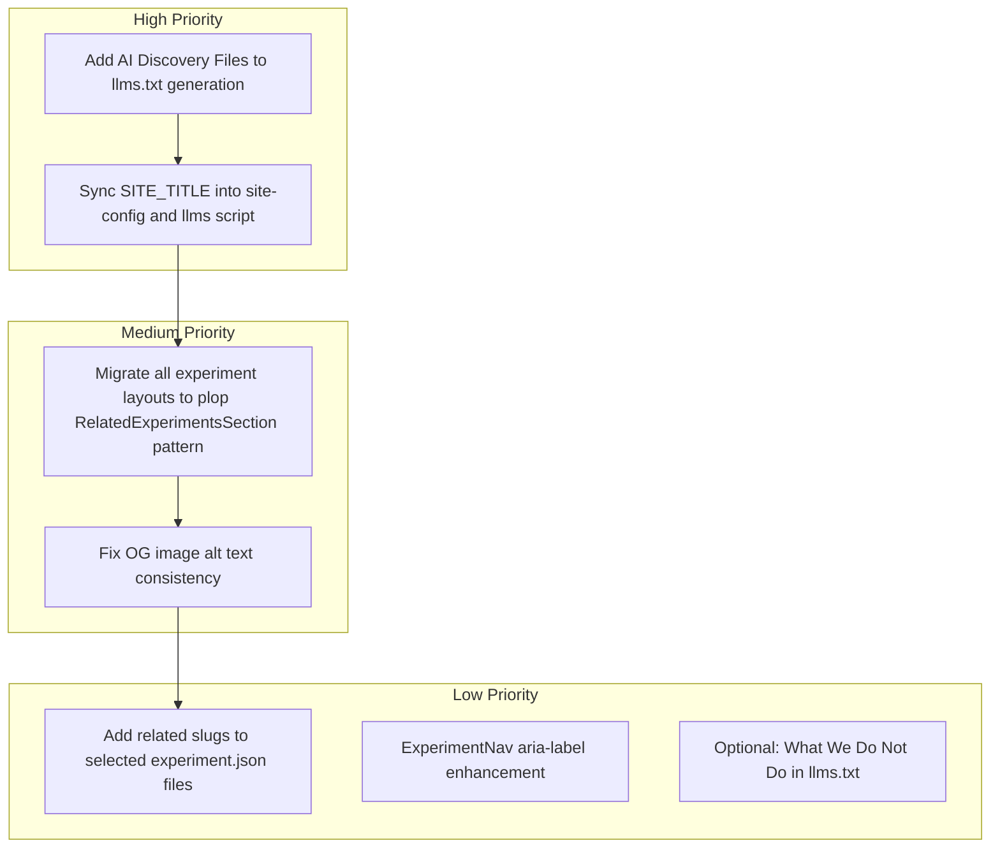

# SEO Implementation Audit and Remediation Plan

## Part 1: Audit Findings — What Was Done Correctly

### Plan 1 (SEO Comprehensive Guide) — Verified

| Item                                    | Status  | Evidence                                                                                                             |
| --------------------------------------- | ------- | -------------------------------------------------------------------------------------------------------------------- |
| SocialPills `rel="me"`                  | Correct | [SocialPills.tsx](src/components/ui/location/SocialPills.tsx): all three links use `rel="me noopener noreferrer"`    |
| Sitemap feed.json                       | Correct | [sitemap.ts](src/app/sitemap.ts): feed.json included in URLs                                                         |
| h-feed on Writing tab                   | Correct | [WritingSection.tsx](src/components/ui/WritingSection.tsx): `className="h-feed"` and `role="feed"` on grid           |
| llms.txt Twitter URL                    | Correct | [generate-llms-txt.mjs](scripts/generate-llms-txt.mjs) uses `x.com/raztronaut` (Contact hardcodes correct URLs)      |
| Person schema naming                    | Correct | [structured-data.ts](src/lib/structured-data.ts): `alternateName: ["Razi", "raztronaut"]`, `givenName`, `familyName` |
| constants.ts AUTHOR_DISPLAY             | Correct | [constants.ts](src/lib/constants.ts): `AUTHOR_DISPLAY = "Razi"` present                                              |
| ai.txt, identity.json, developer-ai.txt | Present | Static files in `public/` with consistent identity                                                                   |

### Plan 2 (Article–Experiment Linking) — Verified

| Item                                   | Status  | Evidence                                                                                                                                                                                      |
| -------------------------------------- | ------- | --------------------------------------------------------------------------------------------------------------------------------------------------------------------------------------------- |
| site-config.mjs                        | Correct | [site-config.mjs](scripts/lib/site-config.mjs): SITE_URL, AUTHOR_NAME, GITHUB_URL, TWITTER_URL                                                                                                |
| Plop template constants                | Correct | [route-layout.tsx.hbs](plop-templates/experiment/route-layout.tsx.hbs): uses `AUTHOR_NAME`, `SITE_URL` from constants                                                                         |
| Scripts use site-config                | Correct | generate-llms-txt, build-registry, generate-registry-json import SITE_URL from site-config                                                                                                    |
| articleHref in getExperiments          | Correct | [experiments.ts](src/lib/experiments.ts): fs.access for content.mdx, sets articleHref when present                                                                                            |
| getExperimentsBySlugs, getRelatedSlugs | Correct | Implemented in experiments.ts                                                                                                                                                                 |
| Experiment cards "Read article"        | Correct | [ExperimentGridCard.tsx](src/components/ui/experiments/ExperimentGridCard.tsx), [ExperimentListItem.tsx](src/components/ui/experiments/ExperimentListItem.tsx): Article link when articleHref |
| ArticleLayout CTA                      | Correct | [ArticleLayout.tsx](src/components/ui/ArticleLayout.tsx): "Try the {experimentTitle} experiment" CTA                                                                                          |
| RelatedExperimentsSection              | Correct | [RelatedExperimentsSection.tsx](src/components/ui/RelatedExperimentsSection.tsx): links to experiment + article                                                                               |
| TechArticle about                      | Correct | [structured-data.ts](src/lib/structured-data.ts): `about: { "@type": "CreativeWork", url: experimentUrl }`                                                                                    |
| Article pages pass related             | Correct | All 4 article pages pass `related={getRelatedSlugs(experiment)}`                                                                                                                              |
| validate-experiments related           | Correct | [validate-experiments.mjs](scripts/validate-experiments.mjs): validates related is array of strings                                                                                           |

### Architecture Notes

- **Canonical host:** Plan correctly recommends Vercel Domain redirect, not middleware. No proxy/middleware changes needed.
- **No deprecated patterns:** Implementation uses Next.js App Router conventions; no middleware for host redirect.
- **site-config vs constants:** site-config.mjs is the scripts’ source of truth; constants.ts is the app source. They are manually kept in sync (comment in site-config).

---

## Part 2: Incomplete or Inconsistent Items

### 2.1 Experiment layouts — partial rollout of RelatedExperimentsSection

**Finding:** Only 4 experiment layouts render RelatedExperimentsSection: test, rabbithole-chat-preloader, cursor-depth-explorer, mountain-transition. The plop template includes it, but many existing layouts (e.g. luma-morphing, basketball-replay-center, velocity-responsive-design, non-euclidean-hyperbolic-workspace, 404-not-found, airplanes, etc.) were not updated.

**Impact:** Experiments with `related` in experiment.json will only show the section if their layout imports and renders RelatedExperimentsSection. New experiments from plop get it; older layouts do not.

**Fix:** Either (a) update all experiment layouts to the plop pattern (RelatedExperimentsSection + `experiment.related`), or (b) keep current state and document that only new experiments get the section until layouts are migrated. Recommendation: **migrate all layouts** to the plop pattern for consistency. Use the plop template as the canonical structure.

### 2.2 globals.css — `prefers-reduced-motion` — **DONE**

**Status:** Already complete. [globals.css](src/app/(main)/globals.css) includes `@media (prefers-reduced-motion: reduce)` with animation/transition overrides. No action needed.

### 2.3 Title / OG alt consistency

**Finding:** Main layout uses `SITE_TITLE = "Razi's Experiments Lab"`. OG image alt says "Razi's Experiments Preview".

**Context:** Intentional naming strategy. User prefers mononym "Razi" where possible but wants S-tier SEO for "Razi Syed", "Razi", and "raztronaut". The choice of "Razi's Experiments Lab" for public/visible branding was the recommended approach; keep it as-is.

**Fix:** Optional. OG alt can stay "Razi's Experiments Preview" or align to "Razi's Experiments Lab" — low priority.

### 2.4 llms.txt spec alignment (AI Visibility v1.1.1)

**Finding:** llms.txt satisfies core requirements (H1, blockquote, Contact). Gaps vs plan:

- No `## AI Discovery Files` section (links to sitemap, feed, registry)
- No `## What We Do Not Do` (optional)
- Contact has no email; spec says "real contact info" — add `syed.raziulhaque@gmail.com`

**Fix:** Update [generate-llms-txt.mjs](scripts/generate-llms-txt.mjs) to:

- Add `syed.raziulhaque@gmail.com` to Contact section
- `## AI Discovery Files` with links to sitemap.xml, feed.xml, feed.json, llms.txt, registry/docs
- Optionally add `## What We Do Not Do` with a brief exclusion statement (e.g. no commercial APIs, no support for production systems)

### 2.5 site-config vs constants sync

**Finding:** site-config.mjs has SITE_URL, AUTHOR_NAME, GITHUB_URL, TWITTER_URL. constants.ts also has SITE_TITLE, SITE_DESCRIPTION, AUTHOR_DISPLAY. Scripts hardcode "Razi's Experiments Lab" in llms.txt generation. No automation to keep them in sync.

**Fix:** Add SITE_TITLE to site-config.mjs and use it in generate-llms-txt.mjs instead of hardcoding. Document in site-config: "Keep in sync with src/lib/constants.ts". Add a **validation script** (`scripts/validate-site-config.mjs`) that compares overlapping keys; add one lefthook pre-commit command (no glob — runs every commit; script is O(1) and negligible cost). No CI for this check.

### 2.6 ExperimentNav aria-label (optional)

**Finding:** Plan 2.4 suggested an optional enhancement: pass experiment/article title for aria-label on "View Article". Not implemented.

**Fix:** Low priority. Add `aria-label` to ExperimentNav "View Article" link when `experimentTitle` is available (e.g. from layout props).

### 2.7 No experiments have `related` populated

**Finding:** No experiment.json files include a `related` array. The feature is implemented but unused.

**Fix:** Add `related` to a few high-value experiments (e.g. luma-morphing, basketball-replay-center, velocity-responsive-design) to validate the flow and improve cross-linking. Manual curation; not part of automation.

---

## Part 3: Remediation Checklist

---

## Part 4: Implementation Order

1. **generate-llms-txt.mjs** — Add `## AI Discovery Files`, add `syed.raziulhaque@gmail.com` to Contact.
2. **site-config.mjs** — Add SITE_TITLE; update generate-llms-txt to use it.
3. **scripts/validate-site-config.mjs** — New validation script comparing site-config vs constants; add `npm run validate:site-config`; add one lefthook pre-commit command (no glob).
4. **Main layout** — Optional: align OG image alt to chosen brand.
5. **Experiment layouts** — Update remaining layouts to include RelatedExperimentsSection using the plop template pattern. Layouts to update: luma-morphing, basketball-replay-center, velocity-responsive-design, non-euclidean-hyperbolic-workspace, 404-not-found, airplanes, keyboard-keys, announcing-v2, send-button, and any others without it.
6. **experiment.json** — Add `related` arrays to 2–3 experiments for validation.
7. **ExperimentNav** — Optional: add `aria-label` with experiment title when available.

---

## Part 5: Out of Scope / Optional

- **llm.txt redirect** — Plan says "301 redirect to llms.txt". Implement via Next.js redirects in `next.config.ts` (not middleware).
- **llms.html** — Optional; add HTML variant of llms.txt if desired (human-readable, same content).
- **AI Visibility Directory** — Manual submit; no code change.
- **Middleware/proxy** — Correctly avoided; use Vercel domain redirect for canonical host.

