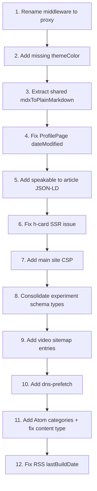

# SEO/AEO Elevation: Audit and Remediation

## Audit Summary

The previous session ([SEO/AEO elevation](6c461da2-c897-4bfb-a69d-1d77de6d81b8)) executed 8 of 9 phases from the plan (Phase 8 MDX was intentionally deferred). The overall quality is **solid but uneven** -- feeds, microformats, and structured data are well-implemented, but several planned items were silently skipped, one pattern is now deprecated in Next.js 16, and there are code quality issues.

---

## 1. CRITICAL: Middleware Deprecation (the terminal warning)

The warning in the terminal:

```
The "middleware" file convention is deprecated. Please use "proxy" instead.
```

**Root cause**: `src/middleware.ts` uses the old `middleware` file convention. Next.js 16.1 renamed it to `proxy`.

**Fix**: Rename `src/middleware.ts` to `src/proxy.ts` and rename the exported function from `middleware` to `proxy`. The `config` export and all `NextRequest`/`NextResponse` APIs remain identical -- this is purely a naming change.

```diff
// src/middleware.ts -> src/proxy.ts
- export function middleware(request: NextRequest) {
+ export function proxy(request: NextRequest) {
```

Can also run `npx @next/codemod@canary middleware-to-proxy .` to automate.

---

## 2. Items Planned but Silently Skipped

These were explicitly described in the plan but never implemented:

- `**themeColor` in metadata** (Phase 2.1) -- The plan called for `themeColor` with media queries for light/dark. Not present in [layout.tsx](src/app/(main)/layout.tsx). Should be:

```typescript
themeColor: [
  { media: "(prefers-color-scheme: light)", color: "#fafafa" },
  { media: "(prefers-color-scheme: dark)", color: "#111115" },
],
```

- **CSP on main site** (Phase 6.3) -- The plan called for Content-Security-Policy headers on the main site in [next.config.ts](next.config.ts). CSP only exists on `/registry/:path`* (line 81). The main `/(.*)`  route only has security headers without CSP.
- `**speakable` property on articles** (Phase 4.2) -- Plan called for `speakable` in article JSON-LD for voice search / AEO. Not implemented in [structured-data.ts](src/lib/structured-data.ts). Example:

```typescript
speakable: {
  "@type": "SpeakableSpecification",
  cssSelector: [".p-name", ".e-content"],
},
```

- `**dns-prefetch` / `preconnect**` (Phase 7.1) -- Plan mentioned adding `dns-prefetch` for `cloud.umami.is`. Not implemented in the layout `<head>`.
- **Video entries in sitemap** (Phase 1.6) -- Plan said to add `videos` for experiments with preview.mp4. Only poster images were added to [sitemap.ts](src/app/sitemap.ts). Video sitemap entries are absent.
- **Atom `<category>` elements** (Phase 3.1) -- Plan mentioned "categories from tags" in Atom entries. The [atom.xml route](src/app/atom.xml/route.ts) doesn't include `<category>` elements for article tags.

---

## 3. Suboptimal Patterns

### 3a. Triple code duplication of `mdxToPlainMarkdown`

The identical function (with the same 5 regex constants) is duplicated in:

- `src/app/feed.xml/route.ts` (lines 6-27)
- `src/app/atom.xml/route.ts` (lines 11-32)
- `src/app/feed.json/route.ts` (lines 11-32)

**Fix**: Extract to `src/lib/mdx-utils.ts` and import from all three routes.

### 3b. `ProfilePage.dateModified` is non-deterministic

In [structured-data.ts](src/lib/structured-data.ts) line 75:

```typescript
dateModified: new Date().toISOString().split("T")[0],
```

This produces a different value on every request, which: (a) is semantically wrong (the profile page isn't modified every second), (b) defeats caching, (c) sends noise to search engines. Should be a hardcoded or build-time date.

### 3c. h-card in client component

[SiteFooter.tsx](src/components/ui/SiteFooter.tsx) is a `'use client'` component. The h-card microformat content is only available after client-side hydration. While Googlebot does execute JS, many IndieWeb tools (webmention.io verification, indie-login, Bridgy) parse server-rendered HTML only. The h-card markup should either be in a server component or pre-rendered.

### 3d. Dual `SoftwareApplication` + `CreativeWork` schemas per experiment

[ExperimentJsonLd.tsx](src/components/seo/ExperimentJsonLd.tsx) emits **both** `SoftwareApplication` and `CreativeWork` as separate `<script>` blocks for the same entity. Google's structured data guidelines recommend picking one primary type per entity. Having both can confuse the parser about which is the canonical type.

**Recommendation**: Use `CreativeWork` as the primary type (more accurate for creative coding experiments) and drop `SoftwareApplication` unless there's a specific reason to keep it.

### 3e. Atom feed content type mismatch

The Atom feed uses `<content type="text">` but the content is MDX-stripped markdown, not plain text. Per Atom spec, `type="text"` means the content should be displayed as-is with no markup processing. If the intent is to include markdown, it should use a custom MIME type or render to HTML and use `type="html"`.

### 3f. RSS `lastBuildDate` assumption

In [feed.xml/route.ts](src/app/feed.xml/route.ts) line 50:

```typescript
const lastBuildDate = articles.length > 0
  ? new Date(articles[0].publishedAt).toUTCString()
  : new Date().toUTCString();
```

This assumes `articles[0]` is the most recent, which depends on `getArticles()` sort order. Should explicitly compute `Math.max()` over all dates.

### 3g. Webmention links as manual HTML rather than Next.js metadata

The webmention/pingback `<link>` tags in [layout.tsx](src/app/(main)/layout.tsx) lines 108-115 are hardcoded in JSX `<head>`. While functional, Next.js metadata API's `other` field or `icons`/`alternates` extensions would be more idiomatic and maintainable.

---

## 4. Modern Best Practices Check (2026)

- **JSON-LD injection pattern**: Using `dangerouslySetInnerHTML` with `<script type="application/ld+json">` is still the standard pattern. Next.js does not yet have a built-in JSON-LD metadata API. The `safeJsonLdStringify` XSS protection is a good practice. **OK.**
- **Feed format coverage**: RSS 2.0 + Atom 1.0 + JSON Feed 1.1 with XSL stylesheet is comprehensive. The XSL is well-designed with dark/light theme support. **Excellent.**
- **Microformats2**: h-entry on articles, h-card on footer, rel="me" on social links -- all correct patterns. The h-feed is missing (plan's Phase 5.3 -- wrapping the Writing tab in an `h-feed` container). **h-feed was skipped.**
- `**prefers-reduced-motion`**: Global CSS in both `globals.css` and `experiments.css` is the correct approach. **Good.**
- **Security headers**: HSTS, X-Frame-Options, X-Content-Type-Options, Referrer-Policy, Permissions-Policy all present. Good baseline. **Missing CSP on main site** as noted above.
- `**security.txt`**: Follows RFC 9116 format. The `Expires` date (2027-01-01) is reasonable. Could add a `Policy` field. **Acceptable.**

---

## Implementation Priority




Item 1 is a one-line rename that eliminates the deprecation warning. Items 2-6 are quick wins. Items 7-12 are deeper improvements.