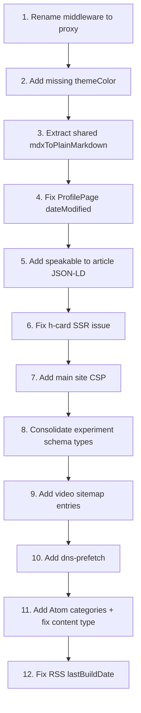

# SEO/AEO Elevation: Audit and Remediation

## Audit Summary

The previous session ([SEO/AEO elevation](6c461da2-c897-4bfb-a69d-1d77de6d81b8)) executed 8 of 9 phases from the plan (Phase 8 MDX was intentionally deferred). The overall quality is **solid but uneven** -- feeds, microformats, and structured data are well-implemented, but several planned items were silently skipped, one pattern is now deprecated in Next.js 16, and there are code quality issues.

---

## 1. CRITICAL: Middleware Deprecation (the terminal warning)

The warning in the terminal:

```
The "middleware" file convention is deprecated. Please use "proxy" instead.
```

**Root cause**: `src/middleware.ts` uses the old `middleware` file convention. Next.js 16.1 renamed it to `proxy`.

**Fix**: Rename `src/middleware.ts` to `src/proxy.ts` and rename the exported function from `middleware` to `proxy`. The `config` export and all `NextRequest`/`NextResponse` APIs remain identical -- this is purely a naming change.

```diff
// src/middleware.ts -> src/proxy.ts
- export function middleware(request: NextRequest) {
+ export function proxy(request: NextRequest) {
```

Can also run `npx @next/codemod@canary middleware-to-proxy .` to automate.

---

## 2. Items Planned but Silently Skipped

These were explicitly described in the plan but never implemented:

- `**themeColor` in metadata** (Phase 2.1) -- The plan called for `themeColor` with media queries for light/dark. Not present in [layout.tsx](src/app/(main)/layout.tsx). Should be:

```typescript
themeColor: [
  { media: "(prefers-color-scheme: light)", color: "#fafafa" },
  { media: "(prefers-color-scheme: dark)", color: "#111115" },
],
```

- **CSP on main site** (Phase 6.3) -- The plan called for Content-Security-Policy headers on the main site in [next.config.ts](next.config.ts). CSP only exists on `/registry/:path`* (line 81). The main `/(.*)`  route only has security headers without CSP.
- `**speakable` property on articles** (Phase 4.2) -- Plan called for `speakable` in article JSON-LD for voice search / AEO. Not implemented in [structured-data.ts](src/lib/structured-data.ts). Example:

```typescript
speakable: {
  "@type": "SpeakableSpecification",
  cssSelector: [".p-name", ".e-content"],
},
```

- `**dns-prefetch` / `preconnect**` (Phase 7.1) -- Plan mentioned adding `dns-prefetch` for `cloud.umami.is`. Not implemented in the layout `<head>`.
- **Video entries in sitemap** (Phase 1.6) -- Plan said to add `videos` for experiments with preview.mp4. Only poster images were added to [sitemap.ts](src/app/sitemap.ts). Video sitemap entries are absent.
- **Atom `<category>` elements** (Phase 3.1) -- Plan mentioned "categories from tags" in Atom entries. The [atom.xml route](src/app/atom.xml/route.ts) doesn't include `<category>` elements for article tags.

---

## 3. Suboptimal Patterns

### 3a. Triple code duplication of `mdxToPlainMarkdown`

The identical function (with the same 5 regex constants) is duplicated in:

- `src/app/feed.xml/route.ts` (lines 6-27)
- `src/app/atom.xml/route.ts` (lines 11-32)
- `src/app/feed.json/route.ts` (lines 11-32)

**Fix**: Extract to `src/lib/mdx-utils.ts` and import from all three routes.

### 3b. `ProfilePage.dateModified` is non-deterministic

In [structured-data.ts](src/lib/structured-data.ts) line 75:

```typescript
dateModified: new Date().toISOString().split("T")[0],
```

This produces a different value on every request, which: (a) is semantically wrong (the profile page isn't modified every second), (b) defeats caching, (c) sends noise to search engines. Should be a hardcoded or build-time date.

### 3c. h-card in client component

[SiteFooter.tsx](src/components/ui/SiteFooter.tsx) is a `'use client'` component. The h-card microformat content is only available after client-side hydration. While Googlebot does execute JS, many IndieWeb tools (webmention.io verification, indie-login, Bridgy) parse server-rendered HTML only. The h-card markup should either be in a server component or pre-rendered.

### 3d. Dual `SoftwareApplication` + `CreativeWork` schemas per experiment

[ExperimentJsonLd.tsx](src/components/seo/ExperimentJsonLd.tsx) emits **both** `SoftwareApplication` and `CreativeWork` as separate `<script>` blocks for the same entity. Google's structured data guidelines recommend picking one primary type per entity. Having both can confuse the parser about which is the canonical type.

**Recommendation**: Use `CreativeWork` as the primary type (more accurate for creative coding experiments) and drop `SoftwareApplication` unless there's a specific reason to keep it.

### 3e. Atom feed content type mismatch

The Atom feed uses `<content type="text">` but the content is MDX-stripped markdown, not plain text. Per Atom spec, `type="text"` means the content should be displayed as-is with no markup processing. If the intent is to include markdown, it should use a custom MIME type or render to HTML and use `type="html"`.

### 3f. RSS `lastBuildDate` assumption

In [feed.xml/route.ts](src/app/feed.xml/route.ts) line 50:

```typescript
const lastBuildDate = articles.length > 0
  ? new Date(articles[0].publishedAt).toUTCString()
  : new Date().toUTCString();
```

This assumes `articles[0]` is the most recent, which depends on `getArticles()` sort order. Should explicitly compute `Math.max()` over all dates.

### 3g. Webmention links as manual HTML rather than Next.js metadata

The webmention/pingback `<link>` tags in [layout.tsx](src/app/(main)/layout.tsx) lines 108-115 are hardcoded in JSX `<head>`. While functional, Next.js metadata API's `other` field or `icons`/`alternates` extensions would be more idiomatic and maintainable.

---

## 4. Modern Best Practices Check (2026)

- **JSON-LD injection pattern**: Using `dangerouslySetInnerHTML` with `<script type="application/ld+json">` is still the standard pattern. Next.js does not yet have a built-in JSON-LD metadata API. The `safeJsonLdStringify` XSS protection is a good practice. **OK.**
- **Feed format coverage**: RSS 2.0 + Atom 1.0 + JSON Feed 1.1 with XSL stylesheet is comprehensive. The XSL is well-designed with dark/light theme support. **Excellent.**
- **Microformats2**: h-entry on articles, h-card on footer, rel="me" on social links -- all correct patterns. The h-feed is missing (plan's Phase 5.3 -- wrapping the Writing tab in an `h-feed` container). **h-feed was skipped.**
- `**prefers-reduced-motion`**: Global CSS in both `globals.css` and `experiments.css` is the correct approach. **Good.**
- **Security headers**: HSTS, X-Frame-Options, X-Content-Type-Options, Referrer-Policy, Permissions-Policy all present. Good baseline. **Missing CSP on main site** as noted above.
- `**security.txt`**: Follows RFC 9116 format. The `Expires` date (2027-01-01) is reasonable. Could add a `Policy` field. **Acceptable.**

---

## Implementation Priority




Item 1 is a one-line rename that eliminates the deprecation warning. Items 2-6 are quick wins. Items 7-12 are deeper improvements.

---

# Part 6: Six Upgrades — Exhaustive Investigation and Implementation Guide

These six upgrades bring the SEO system closer to "reference-tier" quality. Each is investigated exhaustively below.

---

## 6.1 Single Source of Truth for Identity/URLs

### Current State
- **constants.ts** (app): SITE_URL, SITE_TITLE, SITE_DESCRIPTION, AUTHOR_NAME, AUTHOR_DISPLAY, GITHUB_URL, TWITTER_URL
- **site-config.mjs** (scripts): SITE_URL, AUTHOR_NAME, GITHUB_URL, TWITTER_URL — manually synced via comment
- **Hardcoded values**: generate-llms-txt.mjs lines 90, 156 use `"Razi's Experiments Lab"`; lines 144-145 use `"https://github.com/raztronaut"` and `"https://x.com/raztronaut"`; next.config.ts line 100 has `https://www.razisyed.cv` in registry CSP

### Implementation Options
**Option A — JSON config (recommended):** Create `site-config.json` at project root. Both app and scripts import it.
- App: `import siteConfig from './site-config.json'` (Next.js resolves JSON)
- Scripts: `import { createRequire } from 'module'; const { SITE_URL } = createRequire(import.meta.url)('./site-config.json')`
- Single file; no TypeScript/ESM bridge; easy to validate

**Option B — site-config.mjs as source, app re-exports:** Scripts stay as-is. Create `src/lib/site-config.ts` that `fetch`es or `import`s the MJS at build time. Complex; not recommended.

**Option C — Expand site-config.mjs, derive constants.ts:** Add SITE_TITLE, SITE_DESCRIPTION, AUTHOR_DISPLAY to site-config. In constants.ts, use dynamic import at build or a codegen script that writes constants from site-config. Scripts already use site-config; app would need a build step.

**Recommended: Option A** — `site-config.json` with:
```json
{
  "SITE_URL": "https://www.razisyed.cv",
  "SITE_TITLE": "Razi's Experiments Lab",
  "SITE_DESCRIPTION": "Creative coding experiments — shaders, 3D, animation, and interaction design.",
  "AUTHOR_NAME": "Razi Syed",
  "AUTHOR_DISPLAY": "Razi",
  "GITHUB_URL": "https://github.com/raztronaut",
  "TWITTER_URL": "https://x.com/raztronaut"
}
```

### Files to Update
- Create `site-config.json`
- Rewrite `src/lib/constants.ts` to import from `site-config.json` (or re-export)
- Rewrite `scripts/lib/site-config.mjs` to read and export from `site-config.json`
- Update `scripts/generate-llms-txt.mjs`: import SITE_TITLE, GITHUB_URL, TWITTER_URL from site-config; remove hardcodes
- Update `next.config.ts`: use `process.env.SITE_URL` or read site-config for registry CSP `img-src` (or keep SITE_URL in env; add to generate step)

### Testing
- `npm run generate:llms-txt` — output uses SITE_TITLE, correct Contact URLs
- `npm run build` — app builds; no import errors
- `npm run validate:experiments` — passes
- Grep for hardcoded `razisyed.cv`, `raztronaut`, `Razi's Experiments` — none outside site-config

### Validation
- Add `scripts/validate-site-config.mjs` that checks site-config.json has all required keys and valid URLs; run in CI/pre-commit

---

## 6.2 prefers-reduced-motion (Already Done)

### Status
[src/app/(main)/globals.css](src/app/(main)/globals.css) lines 82-90 already include:
```css
@media (prefers-reduced-motion: reduce) {
  *, *::before, *::after {
    animation-duration: 0.01ms !important;
    animation-iteration-count: 1 !important;
    transition-duration: 0.01ms !important;
    scroll-behavior: auto !important;
  }
}
```
**No action needed.** Optional: add `@media (prefers-reduced-motion: reduce)` to `src/app/experiments.css` if experiment layouts have their own animations outside globals.

---

## 6.3 FAQPage Schema

### Current State
- Articles use TechArticle schema with speakable
- MDX has `Details` component (details/summary) — can map to FAQ Q&A
- schema-dts has `FAQPage` type
- No FAQPage schema emitted

### Implementation
**Where it applies:** Only when an article has FAQ-like content. Options:
- **A) Per-article frontmatter:** Add `faq: [{ question, answer }]` to article frontmatter; emit FAQPage JSON-LD when present
- **B) Parse MDX for Details:** At build/render, extract `<details><summary>Q</summary>...A...</details>` from compiled content — fragile
- **C) Site-wide FAQ page:** Create `/faq` with common Q&A; add single FAQPage on that page

**Recommended: A** — explicit frontmatter. Add to article page (e.g. 404-not-found, velocity-responsive-design) where FAQ makes sense.

### Files to Update
- Extend article page to read `faq` from frontmatter
- Add `generateFAQPageJsonLd(accords: { name: string; text: string }[]): WithContext<FAQPage>` in [structured-data.ts](src/lib/structured-data.ts)
- In article page, conditionally render `<script type="application/ld+json">` with FAQPage when `frontmatter.faq?.length > 0`
- Add FAQPage to schema-dts imports (schema-dts exports it)

### Testing
- Add `faq` to one article frontmatter; verify JSON-LD in page source
- Google Rich Results Test: paste article URL, confirm FAQPage detected
- Validate: no FAQPage when faq is empty/absent

---

## 6.4 llms.txt Spec Alignment (AI Visibility v1.1.1)

### Current State
- H1, blockquote, Contact present
- Missing: `## AI Discovery Files`, optional `## What We Do Not Do`
- llm.txt → llms.txt redirect exists in next.config.ts (lines 119-125)

### Implementation
Update [scripts/generate-llms-txt.mjs](scripts/generate-llms-txt.mjs) `generateLlmsTxt()`:
- After `## Contact`, before `return`, add:
```
## AI Discovery Files
- Sitemap: ${SITE_URL}/sitemap.xml
- RSS: ${SITE_URL}/feed.xml
- Atom: ${SITE_URL}/atom.xml
- JSON Feed: ${SITE_URL}/feed.json
- llms.txt: ${SITE_URL}/llms.txt
- Registry docs: ${SITE_URL}/registry/docs
- Registry llms: ${SITE_URL}/registry/llms.txt
```
- Optionally add:
```
## What We Do Not Do
- No commercial APIs or production support. Creative coding experiments only.
```

### Testing
- Run `npm run generate:llms-txt`; inspect `public/llms.txt`
- Submit to [AI Visibility Checker](https://www.ai-visibility.org.uk/) — verify improved score
- Ensure file stays under ~50KB and ~100 lines (spec recommendation)

---

## 6.5 Layout Rollout — RelatedExperimentsSection

### Current State
- **With RelatedExperimentsSection (4):** test, rabbithole-chat-preloader, cursor-depth-explorer, mountain-transition
- **Without (18):** luma-morphing, basketball-replay-center, velocity-responsive-design, non-euclidean-hyperbolic-workspace, 404-not-found, airplanes, keyboard-keys, gravity-physics-ui-layout, shader-landing, life-3d, terminal-cat, transit-airport-split-flap-display, game-of-life-shader, bugged-out-game-of-life-shader-experiment, rabbithole-chat-gallery-explore, announcing-v2, send-button, 3d-crt-display
- Plop template includes RelatedExperimentsSection; uses `experiment.related?.length > 0`

### Implementation
For each layout missing RelatedExperimentsSection, add (using plop pattern):
1. Import: `import { RelatedExperimentsSection } from "@/components/ui/RelatedExperimentsSection";`
2. Import: `import { getRelatedSlugs } from "@/lib/experiments";` (for layouts using static `experiment` object)
3. Block: `{getRelatedSlugs(experiment)?.length > 0 && ( <Suspense fallback={null}><RelatedExperimentsSection slugs={getRelatedSlugs(experiment)} variant="experiment" /></Suspense> )}`

**Layouts vary:** Some use `experiment` from `./experiment.json`; plop uses `experiment.related`. Prefer `getRelatedSlugs(experiment)` for consistency (works with both `experiment` from JSON and plop's `experiment`).

### Files to Update (18 layouts)
luma-morphing, basketball-replay-center, velocity-responsive-design, non-euclidean-hyperbolic-workspace, 404-not-found, airplanes, keyboard-keys, gravity-physics-ui-layout, shader-landing, life-3d, terminal-cat, transit-airport-split-flap-display, game-of-life-shader, bugged-out-game-of-life-shader-experiment, rabbithole-chat-gallery-explore, announcing-v2, send-button, 3d-crt-display

### Testing
- Add `"related": ["other-slug"]` to one experiment.json; verify RelatedExperimentsSection appears on both experiment and article pages
- `npm run build` — no errors
- Spot-check 2–3 updated layouts in dev

---

## 6.6 Organization Schema

### Current State
- WebSite graph: Person, WebSite, ProfilePage
- No Organization; WebSite has `author: personRef()`

### Implementation
For a solo creative lab, Organization can represent the "Razi's Experiments Lab" entity. Schema.org: Organization has `name`, `url`, `description`; can have `founder` or `member` pointing to Person.

Add to [structured-data.ts](src/lib/structured-data.ts) `generateWebSiteJsonLd()`:
```typescript
{
  "@type": "Organization",
  "@id": `${SITE_URL}/#organization`,
  name: SITE_TITLE,
  url: SITE_URL,
  description: SITE_DESCRIPTION,
  founder: personRef(),
}
```
Include in `@graph`; add `publisher: { "@id": `${SITE_URL}/#organization` }` to WebSite if desired. ProfilePage already has `mainEntity: personRef()` — keep Person as primary for personal brand; Organization adds entity clarity for Google.

### schema-dts
Check `import type { Organization } from "schema-dts"` — schema-dts exports it.

### Testing
- View page source; validate JSON-LD with Google Rich Results Test
- Ensure no duplicate or conflicting `@id` values

---

## 6.7 Summary: Implementation Order and Tests

| # | Upgrade | Effort | Files | Key Tests |
|---|---------|--------|-------|-----------|
| 1 | Single source (site-config.json) | Medium | site-config.json, constants.ts, site-config.mjs, generate-llms-txt.mjs | generate:llms-txt, build, validate |
| 2 | prefers-reduced-motion | Done | — | — |
| 3 | FAQPage schema | Low | structured-data.ts, article pages | Rich Results Test |
| 4 | llms.txt AI Discovery Files | Low | generate-llms-txt.mjs | AI Visibility Checker |
| 5 | Layout rollout (18 layouts) | Medium | 18 layout.tsx files | build, related section visible |
| 6 | Organization schema | Low | structured-data.ts | Rich Results Test |