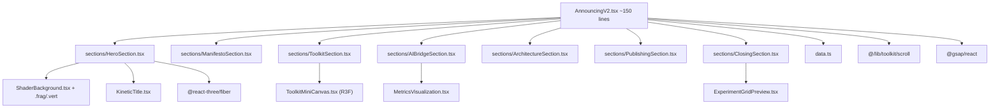

# V2 Announcement Showcase Experiment

## Concept: "Built by Machines, for Machines, Loved by Humans"

A scroll-driven announcement experience where **each section demonstrates the v2 feature it describes**. The experiment is itself the proof of the platform -- Lenis drives the scroll, GSAP choreographs the reveals, R3F renders the 3D hero, custom shaders paint the transitions, and the whole thing was scaffolded by the AI-native tooling it's showcasing. The tone is confident, editorial, slightly irreverent -- like a studio announcing their best work.

## Architecture




## Sections (Scroll Narrative)

### 1. Hero -- "Announcing V2" (full viewport, pinned)

- **Fullscreen shader background**: A custom fragment shader with FBM noise, flowing gradient mesh in the warm/dark theme palette. Scroll-driven uniform (`uProgress`) slowly morphs the pattern as the user enters.
- **Kinetic typography**: "razi's experiments" title splits into individual characters, each staggered with GSAP `fromTo` on y/opacity/rotation. On scroll, characters scatter and reassemble into "v2".
- **Subtitle**: Fades in with a scramble-text effect (leveraging existing `ScrambleTicker` component from `src/components/ui/ScrambleTicker.tsx`).
- Inspired by: darkroom.engineering's bold typographic hero with flowing background.

### 2. Manifesto -- "Built Different" (editorial text section)

- **Split layout**: Large editorial text on left, animated code snippets on right.
- **Scroll-triggered text reveals**: Each line of the manifesto fades/slides in using GSAP `ScrollTrigger.batch()` with stagger. Text lines describe the v2 philosophy: AI-native, stand on giants, publishable by default.
- **Code block**: A styled pseudo-terminal showing `npm run new:experiment:auto -- --name "anything" --profile scrollytelling` with typing animation synced to scroll.
- Inspired by: darkroom.engineering/about's clean two-column editorial layout.

### 3. Toolkit -- "Stand on Giants" (interactive showcase)

- **Horizontally scrolling cards** (GSAP horizontal scroll pin pattern): Each card represents a toolkit tier (Lenis, Tempus, GSAP, R3F, Motion).
- **Mini R3F canvas** embedded in one card: A small spinning geometry with `ExperimentCanvas` proving R3F works inline.
- **Smooth scroll demo**: One card contains a nested scroll area driven by Lenis, demonstrating the `createUnifiedScroll` system.
- **Logo/wordmark parade**: Toolkit library logos scroll past in an infinite marquee.
- Inspired by: basement.studio's interactive sections and darkroom.engineering's open-source section.

### 4. AI Bridge -- "Teaching Machines to See" (data visualization)

- **Metrics dashboard**: Animated counters (FPS, heap, CLS) mimicking the `ExperimentDevMetrics` output, driven by GSAP number scrubbing.
- **Scene graph tree**: A visual tree diagram that builds itself on scroll, showing how `R3FSceneInspector` serializes a 3D scene to text.
- **Before/after split**: Left side shows a 3D scene, right side shows the text representation an AI agent "sees" -- the split line moves with scroll.
- Inspired by: The concept of making the invisible visible, darkroom.engineering's technical detail sections.

### 5. Architecture -- "Seven Templates, Infinite Experiments" (grid reveal)

- **Staggered grid**: 7 profile cards (r3f-scene, r3f-shader, scrollytelling, interaction, web-audio, dom-effect, blank) revealed with GSAP `ScrollTrigger.batch()` and scale/opacity stagger.
- **Each card animates its own mini-demo**: The scrollytelling card has a tiny scroll indicator, the R3F card has a rotating cube, the interaction card has a draggable element, etc.
- **Route isolation diagram**: Animated diagram showing how each experiment gets its own `<html>` sandbox.
- Inspired by: basement.studio's capabilities grid section.

### 6. Publishing -- "From Experiment to Article" (morphing transition)

- **Experiment-to-article morph**: A card showing experiment code on the left morphs (GSAP `morphSVG` or clip-path animation) into a formatted MDX article on the right.
- **Content pipeline visualization**: Animated flowchart (experiment -> MDX -> article -> OG image -> RSS -> registry) with each node lighting up sequentially.
- **Live code preview**: Sandpack-style embedded code block showing a real experiment snippet.

### 7. Closing -- "Explore the Lab" (CTA with experiment grid)

- **Experiment grid preview**: A subset of experiment cards (using existing `ExperimentGridCard` patterns) arranged in a staggered reveal.
- **Final CTA**: Large "Enter the Lab" button with magnetic hover effect (from motion-primitives) that links to the home page.
- **Grain overlay**: The existing `GrainOverlay` component wraps the entire closing for cinematic texture.

## Technical Implementation

### Scaffold

- Profile: `scrollytelling` (use `npm run new:experiment:auto -- --name "announcing-v2" --profile scrollytelling --toolkit`)
- This gives us Lenis + GSAP + Tempus wired up out of the box

### Key Files

```
src/app/experiments/(announcing-v2)/
  experiment.json
  layout.tsx
  announcing-v2/page.tsx

src/components/experiments/announcing-v2/
  AnnouncingV2.tsx              -- Orchestrator (~120 lines)
  data.ts                       -- Section content, copy, config
  sections/
    HeroSection.tsx             -- Shader BG + kinetic title
    ManifestoSection.tsx        -- Editorial text reveals
    ToolkitSection.tsx          -- Horizontal scroll cards + mini R3F
    AIBridgeSection.tsx         -- Metrics viz + scene graph
    ArchitectureSection.tsx     -- Template grid reveal
    PublishingSection.tsx       -- Experiment-to-article morph
    ClosingSection.tsx          -- CTA + experiment grid
  shaders/
    hero.vert                   -- Passthrough vertex
    hero.frag                   -- FBM gradient mesh
  components/
    KineticTitle.tsx            -- Character-split GSAP animation
    ToolkitMiniCanvas.tsx       -- Inline R3F demo
    MetricsVisualization.tsx    -- Animated counters
    ExperimentGridPreview.tsx   -- Closing experiment cards
```

### experiment.json

```json
{
  "title": "Announcing V2",
  "description": "A showcase of the v2 platform: AI-native creative coding, rebuilt from the ground up.",
  "slug": "announcing-v2",
  "profile": "scrollytelling",
  "status": "wip",
  "complexity": "advanced",
  "legacy": false,
  "publishable": true,
  "tags": ["scrollytelling", "showcase", "3d", "shaders", "animation"],
  "tech": ["lenis", "gsap", "r3f", "glsl", "motion"]
}
```

### Scroll Architecture

Using `createUnifiedScroll` from `[src/lib/toolkit/scroll.ts](src/lib/toolkit/scroll.ts)`:

- Lenis at priority -1 (smooth input)
- GSAP at priority 0 (animations)
- R3F at priority 1 (3D rendering in hero/toolkit sections)

Each section owns its own `useGSAP` scope with `ScrollTrigger` instances. The orchestrator creates one unified scroll and passes `containerRef` down. Sections are structured as `min-h-screen` blocks (some pinned for multi-phase reveals).

### Shader (Hero Background)

A fullscreen quad with FBM noise + gradient:

- Uniforms: `uTime`, `uProgress` (scroll), `uResolution`, `uColorA`/`uColorB` (theme palette)
- Technique: 4-octave FBM with domain warping, IQ color palette function
- Scroll drives `uProgress` which shifts the color palette and warp intensity
- Rendered via `ExperimentCanvas` with `<shaderMaterial>` on a viewport-filling plane

### Typography

- Primary: Test Die Grotesk (variable weight, already available as `font-canvas`)
- Sizes: Hero title at `clamp(3rem, 8vw, 8rem)`, section headers at `clamp(2rem, 5vw, 4rem)`
- Color: Foreground/primary from theme tokens for text, accent colors for highlights

### Existing Components to Reuse

- `[ScrambleTicker](src/components/ui/ScrambleTicker.tsx)` -- subtitle text effect
- `[GrainOverlay](src/components/ui/GrainOverlay.tsx)` -- cinematic grain on closing section
- `[ExperimentCanvas](src/lib/toolkit/r3f.tsx)` -- R3F wrapper for hero + toolkit sections
- `[ExperimentNav](src/components/ui/ExperimentNav.tsx)` -- already injected by layout
- `useDevControls` hook -- Leva controls for scrub/lerp tuning in dev

### Performance Targets

- 60fps on M1 MacBook (primary target)
- Shader complexity: keep FBM to 4 octaves, use `lowp`/`mediump` where possible
- Lazy-load R3F canvas sections with dynamic import
- Total JS budget: target under 200KB gzipped for experiment-specific code
- Images: WebP/AVIF, lazy-loaded below fold

### Reduced Motion

- All GSAP animations check `prefers-reduced-motion` and fall back to instant state
- Shader background degrades to static gradient
- Horizontal scroll section falls back to vertical stack

