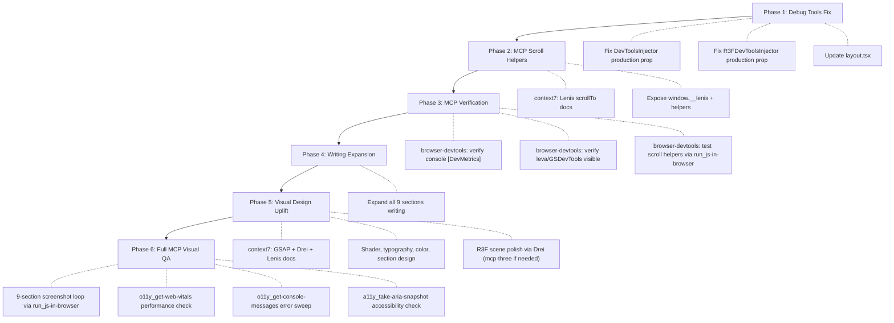

# V2 Experiment Comprehensive Improvement Plan

## Context

The `kinetic-typography-scroll` experiment is a 9-section scrollytelling piece that introduces the V2 platform. It was built across two sessions ([V2 experiment creation](7bf74b2d-9319-46d4-8198-195011d19177) and [V2 experiment polish](fab069f4-d2ad-46aa-bc20-30a16f32dddc)) but remains visually underbaked, content-thin, and has two systemic bugs (debug tools stripped in production, MCP can't scroll through Lenis).

Key files:

- `[KineticTypographyScroll.tsx](src/components/experiments/kinetic-typography-scroll/KineticTypographyScroll.tsx)` -- main 794-line component
- `[HeroShaderCanvas.tsx](src/components/experiments/kinetic-typography-scroll/HeroShaderCanvas.tsx)` -- WebGL shader background
- `[ArchitectureScene.tsx](src/components/experiments/kinetic-typography-scroll/ArchitectureScene.tsx)` -- R3F floating cubes scene
- `[DevToolsInjector.tsx](src/components/dev/DevToolsInjector.tsx)` -- layout-level debug tool loader
- `[R3FDevToolsInjector.tsx](src/components/dev/R3FDevToolsInjector.tsx)` -- canvas-level R3F debug tools
- `[layout.tsx](src/app/experiments/(kinetic-typography-scroll)`/layout.tsx) -- experiment layout

### MCP Tools Available


| MCP Server           | Key Tools                                                                                                                                                                       | Role in this Plan                                                                             |
| -------------------- | ------------------------------------------------------------------------------------------------------------------------------------------------------------------------------- | --------------------------------------------------------------------------------------------- |
| **browser-devtools** | `navigation_go-to`, `run_js-in-browser`, `content_take-screenshot`, `o11y_get-console-messages`, `o11y_get-web-vitals`, `a11y_take-aria-snapshot`, `sync_wait-for-network-idle` | Primary visual QA, debug verification, performance audit, scroll testing via JS eval          |
| **pinchtab**         | `pinchtab_navigate`, `pinchtab_eval`, `pinchtab_screenshot`, `pinchtab_scroll`, `pinchtab_snapshot`                                                                             | Secondary browser automation, eval-based Lenis scroll bypass                                  |
| **context7**         | `resolve-library-id`, `query-docs`                                                                                                                                              | Look up GSAP ScrollTrigger, Lenis, and R3F/Drei docs for best practices before making changes |
| **mcp-three**        | `gltfjsx`, `get-model-structure`                                                                                                                                                | Potential 3D model import for Architecture scene enrichment                                   |


---

## Part 1: Debug Tools Not Showing (Root Cause + Fix)

### Root Cause

The `DevToolsInjector` hard-gates **both** `ExperimentDevMetrics` and `DebugOverlay` behind `process.env.NODE_ENV === "development"`:

```6:12:src/components/dev/DevToolsInjector.tsx
const ExperimentDevMetrics =
  process.env.NODE_ENV === "development"
    ? dynamic(() =>
        import("./ExperimentDevMetrics").then((m) => ({
          default: m.ExperimentDevMetrics,
        }))
      )
    : () => null;
```

The `DebugOverlay` (which renders `<Leva>`, GSDevTools, and device info) is **completely eliminated in production**. Same for `R3FDevToolsInjector` -- it gates `R3FDevTools` identically:

```5:11:src/components/dev/R3FDevToolsInjector.tsx
const R3FDevTools =
  process.env.NODE_ENV === "development"
    ? dynamic(...)
    : () => null;
```

Meanwhile, the experiment deliberately calls `useDevControls("Scroll", {...}, { production: true })` to keep leva controls active in production. But there is no `<Leva>` component rendered to show the panel since `DebugOverlay` is dead-code-eliminated.

This is a **design mismatch**: `useDevControls` has a `production` escape hatch, but the injectors that render the actual UI for those controls do not.

### Fix

Add a `production` prop to `DevToolsInjector` and `R3FDevToolsInjector`. When `production={true}`, dynamically import the debug components even in production (still gated behind `?debug` at runtime via `useDebug()`). Update the kinetic-typography-scroll layout to pass `<DevToolsInjector production />`.

This mirrors the exact pattern `useDevControls` already uses.

### Verification via browser-devtools MCP

After the fix, verify debug tools work:

1. `**navigation_go-to`** -> `http://localhost:3000/experiments/kinetic-typography-scroll?debug`
2. `**sync_wait-for-network-idle`** -> wait for page to settle
3. `**o11y_get-console-messages`** with `search: "DevMetrics"` -> confirm `[DevMetrics] fps=... heap=...` warnings are appearing in the console
4. `**run_js-in-browser`** with script `return JSON.stringify(window.__experimentMetrics)` -> confirm the global metrics object is populated (fps, heap, cls, gsapTweens)
5. `**a11y_take-aria-snapshot`** -> verify leva panel elements are present in the accessibility tree
6. `**content_take-screenshot`** with `includeBase64: true` -> visual confirmation of leva panel, GSDevTools bar, and device info overlay

For R3F debug tools, also check:

- `**o11y_get-console-messages**` with `search: "R3FMetrics"` -> confirm `[R3FMetrics] calls=... triangles=...`
- `**o11y_get-console-messages**` with `search: "SceneInspector"` -> confirm scene graph tree is being logged

---

## Part 2: MCP Cannot Verify Scroll Animations (Root Cause + Fix)

### Root Cause

Lenis takes over the scroll mechanism. When MCP tools (`interaction_scroll` from browser-devtools, `pinchtab_scroll` from pinchtab) issue scroll commands, Lenis either:

- Intercepts and applies smooth interpolation that does not fire ScrollTrigger events at the right pace
- Gets bypassed entirely (e.g., pressing `End` jumps instantly, skipping scroll events)

The previous session tried `pinchtab_scroll`, `browser_scroll`, `PageDown`, `End`, and `Space` -- all failed to properly drive scroll-scrubbed animations.

### Fix: Two-pronged approach

**Prong 1 -- Expose Lenis on window for MCP eval access**

In the experiment's `useLayoutEffect` (where `createUnifiedScroll()` is called), expose the Lenis instance and helper functions globally:

```typescript
if (window.location.search.includes("debug")) {
  (window as any).__lenis = handle.lenis;
  (window as any).__scrollToSection = (index: number) => {
    const sections = document.querySelectorAll("section[aria-label]");
    if (sections[index]) handle.lenis.scrollTo(sections[index] as HTMLElement, { immediate: true });
  };
  (window as any).__scrollToProgress = (progress: number) => {
    const maxScroll = document.documentElement.scrollHeight - window.innerHeight;
    handle.lenis.scrollTo(maxScroll * progress, { immediate: true });
  };
}
```

Then MCP agents can drive scrolling reliably:

- **browser-devtools** `run_js-in-browser`: `window.__scrollToSection(3); return 'scrolled to architecture';`
- **pinchtab** `pinchtab_eval`: `window.__scrollToSection(3)`
- Wait 500-800ms for ScrollTrigger animations to settle
- **browser-devtools** `content_take-screenshot` to capture the result

**Prong 2 -- Use context7 to verify Lenis API**

Before implementing, use context7 to look up the proper API:

1. `**resolve-library-id`** with `libraryName: "lenis"` to get the Context7 library ID
2. `**query-docs`** with the library ID, querying `"scrollTo method immediate option API"` to confirm the `scrollTo(target, { immediate: true })` syntax and any caveats

### MCP-Driven Scroll Verification Protocol

After implementing the helpers, run a full 9-section visual QA loop using **browser-devtools**:

```
For each section index 0-8:
  1. run_js-in-browser: "window.__scrollToSection(INDEX); return 'ok';"
  2. sync_wait-for-network-idle (300ms idle)
  3. content_take-screenshot: capture viewport
  4. a11y_take-aria-snapshot: verify section content is visible
  5. o11y_get-console-messages: check for errors since last check
```

This replaces the broken approach of using `interaction_scroll` or `pinchtab_scroll` directly.

---

## Part 3: Significantly Expanded Writing

Current content is thin -- most sections have a single heading and 1-2 sentences. For a showcase piece about the V2 platform, each section needs to tell a story.

### Section-by-section content expansion:

**Section 1 -- Hero**: No change needed (typographic impact is the point).

**Section 2 -- Philosophy** (currently 4 lines): Expand to 6-8 lines. Add the "why" behind the philosophy -- not just platitudes but specific convictions about creative engineering:

- "Ship means production-grade. No 'just a demo' disclaimers."
- "Every dependency earns its place. Bundle size is a design constraint."
- "AI writes the scaffolding. Humans write the soul."
- "Friction in the setup is friction in the idea. Automate the boring parts ruthlessly."

**Section 3 -- Stats**: Add a subheading/brief intro paragraph above the counters. Something like: "What 6 months of building in the open looks like."

**Section 4 -- Architecture**: Expand the copy below the heading. Currently just 2 sentences about route group isolation. Add:

- Why isolation matters (CSS bleed, JS conflicts, bundle independence)
- What the floating cubes represent (each is a real experiment, running independently)
- How this is uncommon -- most experiment platforms use shared layouts

**Section 5 -- Toolkit**: Add an intro paragraph above the tier cards explaining the tiered dependency strategy. Also add brief commentary under each tier card.

**Section 6 -- AI-Native Config**: Add a prose intro explaining the 6-layer progressive context system -- how each layer builds on the previous one, why this matters for AI-assisted development, and how the agent never starts from zero.

**Section 7 -- Dev Tools**: Expand significantly. This is the showcase section. Add:

- Explanation of what each tool does (leva, GSDevTools, r3f-perf, scene inspector)
- Why debug tools are shipped to production (transparency, education, open creative engineering)
- Keyboard shortcuts list (D = device info, L = leva panel, H = hide GSDevTools)

**Section 8 -- Marquee**: No text change needed (visual flair section).

**Section 9 -- Credits**: Add a "What's Next" paragraph before the credits list. Mention upcoming experiments, the article system, open-source plans.

---

## Part 4: Visual Design Uplift

The experiment is currently almost entirely monospace white text on `#050505`. It needs more visual depth, color, and typographic variety.

### Pre-work: Context7 docs lookup

Before making visual changes, use **context7** MCP to look up current best practices:

1. **GSAP ScrollTrigger**: `resolve-library-id` for `"gsap"` -> `query-docs` for `"ScrollTrigger pinned sections nested ScrollTriggers scrub best practices"` -- ensure pinned config-section + nested layer ScrollTriggers are done correctly (this was broken in the last session)
2. **@react-three/drei**: `resolve-library-id` for `"@react-three/drei"` -> `query-docs` for `"Environment ContactShadows fog OrbitControls"` -- get API for scene enrichment
3. **Lenis**: `resolve-library-id` for `"lenis"` -> `query-docs` for `"scrollTo immediate option"` -- confirm API for the scroll helper implementation

### Global improvements:

- **Color accents**: Introduce a limited accent palette (emerald for code/tech, indigo for creative, amber for data). Use these for section headings, stat values, tier badges, and subtle gradient borders.
- **Section dividers**: Add subtle gradient lines or spacing elements between sections.
- **Background variation**: Use very subtle dark gradient shifts (`#050505` -> `#080812` -> `#050805`) to create depth.
- **Typography variety**: Replica (display) for headings and statements. Test Die Grotesk (body) for descriptive paragraphs. Monospace reserved for code, labels, and data.

### Per-section visual improvements:

**Hero**: Boost shader colors in the GLSL fragment shader (currently `vec3(0.02, 0.02, 0.04)` is nearly invisible). Increase voronoise contrast so the background has visible texture.

**Philosophy**: Add a subtle vertical line accent on the left side. Consider a slow fade gradient background.

**Stats**: Gradient text effect on stat values (white to emerald). Subtle glow on counter completion.

**Architecture**: Use **context7** Drei docs to add `<Environment>`, `<ContactShadows>`, and fog. Add `<OrbitControls>` gated behind `?debug` (via `useDebug()` hook). Add semi-transparent dark backdrop for copy readability. Optionally use **mcp-three** `gltfjsx` to convert a GLTF model into an R3F component if we want richer 3D assets beyond simple RoundedBox primitives.

**Toolkit**: Add subtle card borders, left accent color per tier, background differentiation.

**Config Layers**: Staggered indentation for visual "stack" effect. Color-code each layer type.

**Dev Tools**: Make the `?debug` box feel like a terminal prompt with a blinking cursor.

**Credits**: Add subtle horizontal rules between entries. Make "FIN" more dramatic.

### Visual verification via browser-devtools MCP

After each batch of visual changes:

1. `**navigation_go-to`** -> experiment URL with `?debug`
2. `**run_js-in-browser`** -> `window.__scrollToSection(N)` for the section just changed
3. `**content_take-screenshot`** with `includeBase64: true` -> review the visual result directly
4. `**o11y_get-web-vitals`** with `waitMs: 3000, includeDebug: true` -> confirm no performance regression (LCP, CLS, FCP)

For the R3F Architecture section specifically:

1. `**run_js-in-browser`** -> `window.__scrollToSection(3)`
2. `**content_take-screenshot`** -> verify 3D scene rendering with new environment/lighting
3. `**o11y_get-console-messages**` with `search: "SceneInspector"` -> verify scene graph (mesh count, materials, triangles)

---

## Execution Order




1. **Phase 1: Debug tools production fix** -- Unblocks all MCP-based verification. Fix `DevToolsInjector` and `R3FDevToolsInjector` production prop.
2. **Phase 2: MCP scroll helpers** -- Use **context7** to look up Lenis `scrollTo` API, then expose `window.__lenis`, `__scrollToSection`, `__scrollToProgress` for eval-based scroll driving via `run_js-in-browser` / `pinchtab_eval`.
3. **Phase 3: MCP verification pass** -- Use **browser-devtools** to navigate, verify `o11y_get-console-messages` shows `[DevMetrics]` and `[R3FMetrics]`, `content_take-screenshot` shows debug panels, `run_js-in-browser` confirms scroll helpers work.
4. **Phase 4: Writing expansion** -- Content before design (design to fit content, not the reverse).
5. **Phase 5: Visual design uplift** -- Use **context7** for GSAP/Drei/Lenis docs, **mcp-three** for potential 3D model import. Shader colors, typography, color system, section design. Verify each change with `content_take-screenshot`.
6. **Phase 6: Full MCP visual QA** -- 9-section screenshot loop via `run_js-in-browser` + `content_take-screenshot`, `o11y_get-web-vitals` performance check, `o11y_get-console-messages` error sweep, `a11y_take-aria-snapshot` accessibility verification.

