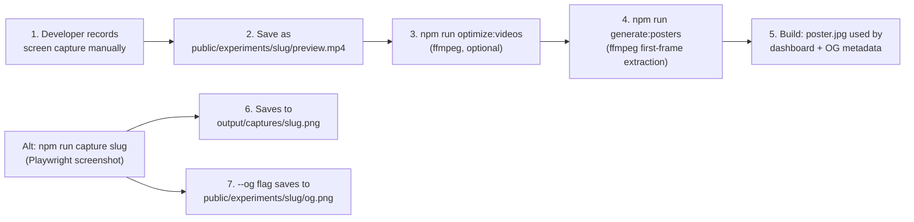

# V2 Platform Audit via kinetic-typography-scroll

Your "finish this experiment" test surfaced issues at three levels: the experiment code itself, the V2 template/scaffolding layer, and the publish pipeline. Here is everything found, organized by level.

---

## Level 1: Experiment Code Issues

These are bugs and compliance violations in `[KineticTypographyScroll.tsx](src/components/experiments/kinetic-typography-scroll/KineticTypographyScroll.tsx)`.

### Critical

- **Hero reveal never plays.** `start: "top 80%"` on `.hero-section` means the trigger is already past on page load (hero top is at viewport 0%, which is above the 80% mark). The scrub resolves to progress=1 instantly, so `gsap.set(opacity:0)` is immediately overridden to `opacity:1`. The char-by-char 3D flip reveal -- the marquee feature of the experiment -- is invisible to users.
- **FOUC on hero chars.** The initial invisible state is set via `gsap.set()` inside `useGSAP` (runs in `useLayoutEffect`). Between first paint and that effect, chars are visible at default opacity. The scrollytelling profile gotchas table explicitly warns about this: "Content flashes before scroll -> Set initial state in CSS or gsap.set." Fix: add `opacity-0` class to `.hero-char` in JSX.

### High

- `**clipPath` animation violates compositor-only rule** (manifesto section, line 248). Performance rules say "Animate `transform` and `opacity` exclusively." `clipPath` triggers paint on every frame. Should use an `overflow-hidden` + `translateX` mask pattern instead.
- `**setState` during scroll in scramble section** (line 119). Scroll rules explicitly say "Avoid scroll-linked `setState` -- use refs or GSAP/Motion scroll utilities." Every scroll frame triggers a React reconciliation. Fix: use a ref + direct `textContent` mutation.
- **GSAP statically imported** (lines 3-5). Animation rules say "Always dynamic import." GSAP, ScrollTrigger, and `@gsap/react` are all static imports in the initial chunk.
- **Leva imported unconditionally** (line 6). `useControls` runs during render (SSR-unsafe). Leva is ~40KB gzipped dev tooling shipping to production. Should be behind `process.env.NODE_ENV` guard or `next/dynamic` with `ssr: false`.

### Medium

- **Effect ordering gap.** `useGSAP` (layout effect, synchronous) runs before the `useEffect` creating Lenis (async). ScrollTriggers are created before Lenis exists -- briefly using native scroll events before Lenis takes over.
- `**useReducedMotion` SSR flash.** Initial state is `false`. Users with `prefers-reduced-motion: reduce` get a brief flash of full animation setup before the effect fires and tears it down.
- **Manifesto/credits/outro FOUC.** `gsap.from()` calls animate FROM invisible, but elements are visible in HTML until GSAP initializes. `.manifesto-line`, `.credit-row`, `.outro-text` all flash visible on first paint.
- `**gsap.quickTo` cleanup.** Lenis scroll listener in the effect is never explicitly unbound (relies on `handle.destroy()` cascade). The `gsap.killTweensOf` cleanup is a shotgun approach; should use `skewTo.tween.kill()`.
- **Test doesn't mock `window.matchMedia`.** The `useReducedMotion` hook calls `matchMedia` which may not exist in jsdom. Tests are smoke-only -- zero animation/scroll logic tested.

### Low

- **Color contrast.** `text-neutral-600` on `#050505` ("Scroll to decode") is ~3.3:1, failing WCAG AA 4.5:1.
- **No section landmarks.** 7 `<section>` elements have no `aria-label`. No skip links or scroll navigation dots (scrollytelling profile recommends "clear section markers or navigation dots").
- **Missing preview assets.** `image: ""` and `video: ""` in experiment.json. OG metadata resolves to a nonexistent `poster.jpg` (404).

---

## Level 2: Template / Scaffolding Issues

Problems that exist in the V2 templates and would affect ALL future experiments scaffolded from them.

- **Plop template uses static GSAP imports.** The scrollytelling template (`plop-templates/experiment/profiles/scrollytelling/component.tsx.hbs`) does `import gsap from "gsap"` statically. Every experiment generated from it inherits the animation rule violation.
- **Plop template doesn't set CSS initial states.** No `opacity-0` classes on elements that will be GSAP-animated. Every scrollytelling experiment will FOUC.
- **Leva imported unconditionally in templates.** The `{{#if includeLeva}}` conditional in templates adds `import { useControls } from "leva"` but doesn't wrap it in a dev-only guard. Production bundles get leva.
- `**viewTransitionName` hydration mismatch was in template.** (Already fixed in this session -- the plop template had `style=\{{ viewTransitionName: "..." }}` which caused SSR hydration errors. Fixed to use a `<style>` tag.)
- **No `matchMedia` polyfill guidance.** If any experiment uses `useReducedMotion` or similar, tests need a matchMedia mock. No shared test utility or setup file provides this.

---

## Level 3: Preview Media Pipeline Gap

This is the biggest workflow gap exposed by the experiment. The dashboard screenshot shows "NO PREVIEW YET" for kinetic-typography-scroll. Here is how the pipeline works and where it breaks down:

### How preview media works in V2

### The gap

**Step 1 is entirely manual.** There is no automated screen recording pipeline. The developer must:

1. Run the dev server
2. Open the experiment in a browser
3. Record a screen capture externally (QuickTime, OBS, browser extension)
4. Save/convert to `.mp4`
5. Place in `public/experiments/<slug>/`
6. Update `experiment.json` with the video path

The `capture.mjs` script only takes **static screenshots** (Playwright), not video recordings. It's useful for OG images and visual QA, but not for the animated preview cards that make the dashboard compelling.

### What shipped experiments have vs. kinetic-typography-scroll

| Experiment                    | Video                             | Poster                              | Image                            |
| ----------------------------- | --------------------------------- | ----------------------------------- | -------------------------------- |
| send-button                   | `preview-send-button.mp4` (321KB) | `poster.jpg` (14KB, auto-generated) | `preview-send-button.png` (28KB) |
| basketball-replay-center      | `preview.mp4` (31MB!)             | `poster.jpg` (11KB)                 | --                               |
| 404-not-found                 | `preview.mp4` (2.2MB)             | `poster.jpg` (150KB)                | --                               |
| **kinetic-typography-scroll** | **none**                          | **none (404)**                      | **none**                         |

### What `generate-posters.mjs` does

At build time (`npm run build`), it scans all non-WIP experiments. For any with a `video` field, it uses ffmpeg to extract the first frame as `poster.jpg`. But it **skips WIP experiments** (line filtering in the script), and kinetic-typography-scroll has `status: "wip"`. So even if a video existed, the poster wouldn't be generated until the status changes.

### The runtime poster override

In `[src/lib/experiments.ts](src/lib/experiments.ts)` (line 148-156), `getExperiments()` overrides the poster field: if `video` exists, poster is forced to `/experiments/<slug>/poster.jpg`. If no video, poster is `undefined`. This means the `poster` field in experiment.json is effectively ignored at runtime.

---

## Level 4: What Would Need to Happen to Ship This Experiment

Based on the [publish-experiment workflow](`.agent/workflows/publish-experiment.md`), here is the gap between current state and "shipped":

1. **Fix the critical code issues** (hero trigger, FOUC)
2. **Fix high-severity issues** (clipPath, setState-on-scroll, leva production, static imports)
3. **Record a preview video** (manual step -- scroll through all 7 sections, capture as .mp4)
4. **Place video in `public/experiments/kinetic-typography-scroll/preview.mp4`**
5. **Update `experiment.json`**: set `video` field, flip `status: "shipped"`
6. **Run `npm run generate:posters`** (or full `npm run build`) to auto-generate poster.jpg
7. **Run `npm run capture kinetic-typography-scroll -- --og`** for OG screenshot
8. **Visual QA** via `?debug` and the visual-qa workflow
9. *(Deferred per your request)* Article/content generation via publish workflow

---

## Level 5: Broader V2 Platform Gaps Surfaced

These are systemic issues that go beyond this one experiment:

- **No automated video capture.** The manual recording step is the #1 friction point for shipping. Every experiment requires external tooling. A Playwright-based video recorder (e.g., `page.video()` API) could automate this.
- **VFB testing never completed.** The [VFB Testing Guide](`.cursor/plans/vfb_testing_guide_e378a064.plan.md`) has all 6 tests still pending. The Visual Feedback Bridge (dev tools, debug overlay, metrics, scene inspector) has never been systematically validated.
- **Template compliance issues propagate.** Static GSAP imports, missing CSS initial states, and unconditional leva imports in templates mean every newly scaffolded experiment inherits these problems.
- `**generate-posters.mjs` skips WIP.** This means you can't preview how an experiment will look on the dashboard until you flip it to shipped -- a chicken-and-egg problem for iterating on preview quality.
- `**validate-experiments.mjs` doesn't check asset existence.** The validation script checks JSON structure but doesn't verify that referenced video/image/poster files actually exist in `public/`.
- **Pending items inventory** ([plan](`.cursor/plans/pending_items_inventory_bd3e2842.plan.md`)) has 5 pending categories: quick infra wins, medium infra (Lighthouse CI, MCP capture server, E2E tests), content pipeline (16 articles), architecture (Registry V2, toolkit-template wiring), and nice-to-haves.

