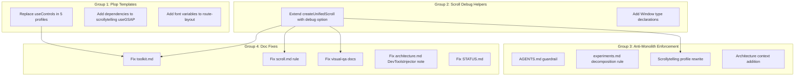

# V2 Platform Foundational Fixes

Based on `[.agent/v2-updates-needed.md](.agent/v2-updates-needed.md)` and lessons from the [V2 Experiment Decomposition](.cursor/plans/v2_experiment_decomposition_e158b028.plan.md) plan. Focus: infrastructure-only changes. Experiment-specific fixes (HDRI self-hosting, kinetic-typography-scroll refactoring) are tracked separately.

---

## Group 1: Fix All Plop Templates

Every future experiment inherits these bugs. Fixing them prevents the same issues from recurring.

### 1a. Replace `useControls` with `useDevControls` in all 5 profiles

**All five** component templates import raw `leva` instead of the project's `[useDevControls](src/hooks/useDevControls.ts)` wrapper. This means every experiment generated from these templates ships ~40KB of leva to production.

Files to change (same pattern in each):

- `[plop-templates/experiment/profiles/scrollytelling/component.tsx.hbs](plop-templates/experiment/profiles/scrollytelling/component.tsx.hbs)` -- lines 12-13, 51
- `[plop-templates/experiment/profiles/dom-effect/component.tsx.hbs](plop-templates/experiment/profiles/dom-effect/component.tsx.hbs)` -- import + call
- `[plop-templates/experiment/profiles/interaction/component.tsx.hbs](plop-templates/experiment/profiles/interaction/component.tsx.hbs)` -- import + call
- `[plop-templates/experiment/profiles/r3f-scene/component.tsx.hbs](plop-templates/experiment/profiles/r3f-scene/component.tsx.hbs)` -- import + call
- `[plop-templates/experiment/profiles/r3f-shader/component.tsx.hbs](plop-templates/experiment/profiles/r3f-shader/component.tsx.hbs)` -- import + call

In each file, the transformation is:

```handlebars
// BEFORE
\{{#if includeLeva}}
import { useControls } from "leva";
\{{/if}}
...
const { scrub } = useControls("Scroll", { ... });

// AFTER
\{{#if includeLeva}}
import { useDevControls } from "@/hooks/useDevControls";
\{{/if}}
...
const { scrub } = useDevControls("Scroll", { ... });
```

### 1b. Add `dependencies` array to scrollytelling template's `useGSAP`

In `[scrollytelling/component.tsx.hbs` line 90](plop-templates/experiment/profiles/scrollytelling/component.tsx.hbs), `useGSAP` closes over `scrub` from leva but has no `dependencies` array, so changing the scrub slider at runtime is a no-op.

```handlebars
// BEFORE
  }, { scope: containerRef });

// AFTER (when includeLeva is true)
\{{#if includeLeva}}
  }, { scope: containerRef, dependencies: [scrub] });
\{{else}}
  }, { scope: containerRef });
\{{/if}}
```

### 1c. Add font variable support to route-layout template

`[plop-templates/experiment/route-layout.tsx.hbs](plop-templates/experiment/route-layout.tsx.hbs)` generates isolated `<html>/<body>` with no font variables. Every experiment hits this gap.

**Approach**: Import `activeFont` from `@/lib/fonts` and apply its `variable` class to `<body>`, mirroring the main layout pattern. This gives every experiment the `--font-app` CSS variable by default.

```handlebars
// Add import
import { activeFont } from "@/lib/fonts";
import { cn } from "@/lib/utils";

// Update <body>
<body className={cn(activeFont.variable)}>
```

Experiments needing additional fonts (like `replica`) can add them in their own layout override -- the template provides the sensible default.

---

## Group 2: Promote Debug Scroll Helpers to Toolkit

**Problem (issue 4A)**: Every Lenis experiment faces the same MCP scroll problem -- `pinchtab_scroll` and browser devtools scroll commands don't work with Lenis. The kinetic-typography-scroll experiment wired up bespoke `window.__scrollToSection` / `window.__scrollToProgress` helpers, but this needs to be a platform-level solution.

### Changes to `[src/lib/toolkit/scroll.ts](src/lib/toolkit/scroll.ts)`

Extend `createUnifiedScroll` with an optional `debug` parameter:

```typescript
export interface UnifiedScrollOptions {
  lenisOptions?: ConstructorParameters<typeof Lenis>[0];
  debug?: boolean;
}

export interface UnifiedScrollHandle {
  destroy: () => void;
  lenis: Lenis;
}
```

When `debug` is true (typically gated by `?debug` at the call site), the function attaches helpers to `window`:

- `window.__lenis` -- direct Lenis instance access
- `window.__scrollToSection(index)` -- scroll to nth `section[aria-label]` element via `lenis.scrollTo(el, { immediate: true })`
- `window.__scrollToProgress(progress)` -- scroll to a 0-1 progress value

These are cleaned up in `destroy()`. This means any experiment using `createUnifiedScroll({ debug: true })` gets MCP-compatible scroll helpers for free.

### Add TypeScript declarations for window globals

Add a `src/lib/toolkit/scroll-debug.d.ts` (or extend an existing `.d.ts`) with:

```typescript
interface Window {
  __lenis?: import("lenis").default;
  __scrollToSection?: (index: number) => void;
  __scrollToProgress?: (progress: number) => void;
}
```

---

## Group 3: Anti-Monolith Architecture Enforcement

AI agents consistently produce monolithic files -- KineticTypographyScroll.tsx grew to 926 lines with 9 data blocks, 9 animation blocks, and 9 JSX sections in one file. This is a systemic pattern that needs guardrails at every layer of the agent config.

### 3a. AGENTS.md -- Add "Component Size Discipline" guardrail

Add to the Guardrails section of `[.agent/AGENTS.md](.agent/AGENTS.md)`:

```markdown
### Component Size Discipline
No single component file should exceed **200 lines**. When approaching this limit, decompose:
1. Extract data constants to `data.ts`
2. Extract reusable hooks to dedicated files
3. Split visual sections into `sections/SectionName.tsx` -- each owns its own `useGSAP`/animation scope
4. The main component becomes a thin orchestrator: lifecycle setup, shared state, section composition

**Hard limit**: 300 lines triggers mandatory decomposition before continuing. Stop and split.
```

This lives in AGENTS.md because it applies to all agents (Cursor, Claude Code, Codex, etc.) and all experiment types.

### 3b. experiments.md rule -- Add "Component Decomposition" section

Add to `[.agent/rules/experiments.md](.agent/rules/experiments.md)` (always-on rule):

```markdown
## Component Decomposition

### File Budget (lines)
| File Type | Target | Hard Limit |
|-----------|--------|------------|
| Orchestrator component | ~120 | 200 |
| Section component | ~60-90 | 150 |
| Data constants | ~100 | 150 |
| Hook | ~30-50 | 80 |

### When to Decompose
When the main component exceeds ~200 lines or contains 3+ distinct visual sections, split into:

```

src/components/experiments/experiment-name/
  ExperimentName.tsx          Orchestrator (lifecycle, shared state, composition)
  data.ts                     All constants and configuration
  sections/
    SectionName.tsx           Each visual section owns its own animation scope
  [hooks, shaders, etc.]

```

### Section Pattern
Each section is a self-contained component:
- Own `useRef` for root element
- Own `useGSAP({ scope: sectionRef, dependencies: [...] })` or equivalent animation hook
- Own `prefers-reduced-motion` handling (never leave `opacity-0` elements invisible)
- Receives shared config via props (not global state)

### Orchestrator Pattern
The main component stays thin:
- Lenis/scroll setup and cleanup
- Shared controls (`useDevControls`)
- Shared refs (scroll progress, debug state)
- Composes `<Section />` components with props
- No direct DOM animation code
```

### 3c. Scrollytelling profile -- Add decomposition architecture + fix stale patterns

The current `[.agent/profiles/scrollytelling.md](.agent/profiles/scrollytelling.md)` has two problems:

1. No guidance on component decomposition (the most common profile to produce monoliths)
2. Shows stale Lenis+GSAP ticker wiring instead of `createUnifiedScroll`

**Replace** the "Toolkit Setup" section with `createUnifiedScroll` as canonical:

```markdown
## Toolkit Setup: createUnifiedScroll (Canonical)
```tsx
import { createUnifiedScroll } from "@/lib/toolkit/scroll";
import type { UnifiedScrollHandle } from "@/lib/toolkit/scroll";

// In orchestrator's useLayoutEffect:
const handle = createUnifiedScroll({ debug: isDebug });
// handle.lenis for direct access, handle.destroy() in cleanup
```

Drives Lenis from Tempus (priority -1), GSAP from Tempus (priority 0). Do NOT use the old gsap.ticker pattern.

```

**Add** a new "Decomposition Architecture" section between "Behavioral Mode" and "Toolkit Setup":

```markdown
## Decomposition Architecture

Scrollytelling experiments grow fast. Decompose early -- when the main component reaches ~200 lines or 3+ sections.

**Target structure:**
```

  ExperimentName.tsx     ~120 lines  Orchestrator (Lenis, controls, progress bar, section composition)
  data.ts                ~100 lines  Section content, config constants
  sections/
    HeroSection.tsx      Each section owns its own useGSAP with scope + dependencies
    ...

```

**Each section:**
- Has its own `useRef` for scoping
- Runs its own `useGSAP({ scope: ref, dependencies: [...] })`
- Handles its own `prefers-reduced-motion` fallback (gsap.set to reveal, not early return)
- Receives `reducedMotion`, `scrub`, and any shared refs as props

**The orchestrator:**
- `createUnifiedScroll` lifecycle
- `useDevControls` for shared parameters
- Scroll progress bar animation
- Composes sections -- no direct ScrollTrigger/gsap animation code
```

### 3d. Architecture context -- Add decomposition reference

Add a "Component Decomposition" section to `[.agent/contexts/architecture.md](.agent/contexts/architecture.md)` after the existing "File Naming" section:

```markdown
## Component Decomposition

When an experiment component exceeds ~200 lines, split into focused modules:

```

src/components/experiments/experiment-name/
  ExperimentName.tsx          ~120 lines  Thin orchestrator
  data.ts                     Constants, section content
  sections/                   One file per visual section
    SectionName.tsx           Own animation scope (useGSAP + scope ref)
  [hooks/, shaders/, etc.]    Extracted utilities

```

Each section component owns its own `useGSAP({ scope: ref, dependencies: [...] })`. The orchestrator handles lifecycle (Lenis, controls) and composes sections via props. See `.agent/profiles/scrollytelling.md` for the canonical pattern.
```

---

## Group 4: Fix Stale Agent Documentation

These are not just doc accuracy issues -- they cause agents to write wrong code (stale wiring patterns) and waste debugging cycles (Lenis scroll limitation).

### 4a. `[toolkit.md](.agent/contexts/toolkit.md)` fixes:

- **Line 19**: Replace stale "drive from GSAP ticker" with `createUnifiedScroll()` as canonical pattern
- **Line 37**: Add note that `DevToolsInjector` accepts `production` prop to bypass tree-shaking
- **Line 40**: Same for `R3FDevToolsInjector`
- **Lines 48-51**: Add `context7` to MCP tools list (`resolve-library-id` + `query-docs`)
- **Line 26**: Document the new `debug` option on `createUnifiedScroll`

### 4b. `[scroll.md](.agent/rules/scroll.md)` fix:

- **Lines 10-26**: Replace the "Lenis + GSAP ScrollTrigger (Canonical Wiring)" section. The current code shows the old `gsap.ticker.add` pattern which is superseded by `createUnifiedScroll`. Keep the old pattern as a "Legacy (pre-V2)" note but make `createUnifiedScroll` the primary recommendation.
- Add a "Lenis + MCP Scroll" section noting that `pinchtab_scroll` doesn't work with Lenis and `createUnifiedScroll({ debug: true })` provides `window.__scrollToSection` / `window.__scrollToProgress` as workarounds.

### 4c. `[workflows/visual-qa.md](.agent/workflows/visual-qa.md)` + `[skills/visual-qa.md](.agent/skills/visual-qa.md)` fixes:

- Add "Known Limitation: Lenis Scroll Interception" section documenting that `pinchtab_scroll` / `interaction_scroll` don't work with Lenis, and the workaround is `createUnifiedScroll({ debug: true })`
- Clarify that `ExperimentDevMetrics` is absent in production unless `production` prop is passed

### 4d. `[architecture.md](.agent/contexts/architecture.md)` fix:

- **Line 28**: Add note about `production` prop on `DevToolsInjector`

### 4e. `[STATUS.md](.agent/STATUS.md)` fix:

- **Line 20**: Add "(status: wip)" after `kinetic-typography-scroll`

---

## Execution Order




Groups 1, 2, and 3 are independent at the code level. Group 4 docs reference Group 2 changes and should be done last. Group 3c (scrollytelling profile) references `createUnifiedScroll({ debug })` from Group 2.

---

## Post-Execution: Experiment-Specific Changes Needed Elsewhere

After this plan completes, the following experiment-specific changes should be tracked separately:

- **kinetic-typography-scroll**: Remove bespoke scroll debug helpers, use `createUnifiedScroll({ debug: true })`. Self-host `night.hdr` HDRI asset. Apply full decomposition per the [V2 Experiment Decomposition plan](.cursor/plans/v2_experiment_decomposition_e158b028.plan.md).
- **Any future experiments**: Will automatically benefit from fixed plop templates, font variables, and anti-monolith guidance.

