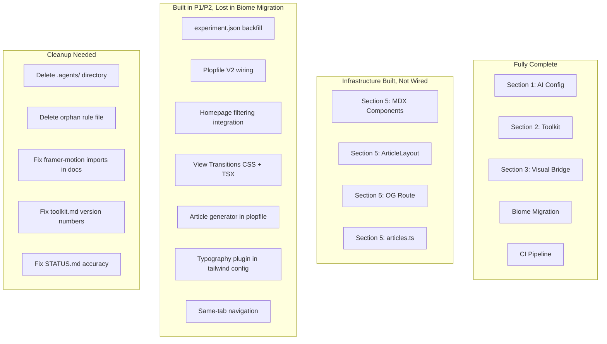

# V2 Platform Comprehensive Audit

## Verification Suite Results

| Check                                   | Result                                    |
| --------------------------------------- | ----------------------------------------- |
| `npx ultracite check`                   | PASS -- 493 files, 0 errors               |
| `npm run typecheck`                     | PASS -- clean                             |
| `npm run build`                         | PASS -- 25 static pages, 2 dynamic routes |
| `node scripts/validate-experiments.mjs` | PASS -- 18 experiments valid              |
| `npx vitest --run --project unit`       | **4 FAILURES** / 14 passed (18 total)     |

Failing tests: `BasketballReplayCenter`, `CursorDepthExplorer`, `MountainTransition`, `VelocityResponsiveDesign` -- all fail with "useCursor must be used within a CursorProvider" (missing test wrapper, not V2-related).

---

## Root Cause: Biome Migration Clobbered Uncommitted P1/P2 Work

**This is the single most important finding.** Reviewing the [P2 execution chat](41f1fcd8) reveals that `npx ultracite init` during the Biome migration **reverted `package.json` to a pre-P2 state**, stripping all P0-P2 dependencies. The agent reinstalled the packages, but `npx ultracite fix` also damaged source files by removing "unused" imports and type exports. The agent caught and restored some files (`experiments.ts`, MDX `components.tsx`), but several other P1/P2 changes were lost:

**Confirmed lost during Biome migration:**

- `plopfile.js` -- V2 profile prompt + article generator (reverted to V1)
- `tailwind.config.ts` -- typography plugin wiring
- `globals.css` / `experiments.css` -- view transitions CSS rules
- ExperimentGridCard / ExperimentBackButton -- view-transition-name styles
- ExperimentDrawerList -- homepage filtering integration
- 18 `experiment.json` files -- V2 field backfill (status, legacy)
- Navigation model -- same-tab with view transitions (reverted to `_blank`)

**Confirmed restored after Biome migration:**

- `package.json` dependencies (reinstalled manually)
- `src/lib/experiments.ts` (restored from git stash -- V2 types intact)
- `src/components/mdx/components.tsx` (re-added stripped imports)
- `src/lib/experiments.test.ts` (fixed mock path for node: protocol)

**Survived the migration intact (never touched by Biome):**

- All `.agent/` config files (30 files)
- `src/lib/toolkit/` integration layer (4 files)
- `src/components/dev/` (4 files)
- `src/components/mdx/` individual components (6 files)
- `src/components/ui/ArticleLayout.tsx`
- `src/lib/articles.ts`
- `src/app/api/og/route.tsx`
- `scripts/capture.mjs`, `scripts/validate-experiments.mjs`
- `plop-templates/` (all 22 template files)
- `src/components/ui/experiments/ExperimentFilters.tsx` (exists on disk but not wired into ExperimentDrawerList)

The items flagged as "not done" in this audit were actually **implemented during P1/P2 sessions but lost during the Biome migration**. The fix is to restore them, not implement from scratch.

---

## Section-by-Section Audit

### Section 1: AI Coding Config -- DONE (minor issues)

**Claimed**: 30 agent config files, layered architecture.
**Actual**: 111+ files in `.agent/` (includes large vendored skill directories). The core 30 files (1 AGENTS.md + 6 rules + 5 profiles + 8 skills + 7 workflows + 3 contexts) all exist and are real, well-written content.

**Issues found:**

1. **Old `.agents/` directory still exists** (79 files). The migration plan said to consolidate into `.agent/` and remove `.agents/`. The old directory with 8 symlinked/vendored skills (frontend-design, gsap-react, gsap-scrolltrigger, r3f-best-practices, r3f-fundamentals, threejs-3d-graphics, threejs-pro, vercel-react-best-practices) was never deleted.
2. **Orphan rule file**: `.agent/rules/new-experiment-process-and-rules.md` -- the old rule that was supposed to be *replaced* by `rules/experiments.md`. Still present, not listed in STATUS.md's inventory.
3. `**framer-motion` imports in agent docs**: 3 workflow files reference `import { motion } from "motion/react"` while `toolkit.md` documents the modern path as `motion/react`. Files: `workflows/develop-experiment.md`, `workflows/add-experiment-component.md`, `workflows/new-experiment.md`.
4. **STATUS.md claims 6 rules** but 7 exist (counts the orphan).

---

### Section 2: Creative Toolkit Foundation -- DONE (solid)

**Claimed**: Lenis, Tempus, Hamo, @gsap/react installed; integration layer at `src/lib/toolkit/`.
**Actual**: All confirmed. All 4 packages in `package.json` at correct versions. Integration layer has 4 real files (`scroll.ts`, `raf.ts`, `r3f.tsx`, `index.ts`) with genuine implementations.

**No issues.**

---

### Section 3: Visual Feedback Bridge -- DONE (solid)

**Claimed**: Playwright capture script, dev metrics components, scene inspector.
**Actual**: All confirmed.

- `scripts/capture.mjs` -- 150-line real Playwright implementation with --delay, --scroll, --viewport, --full-page, --og flags
- `src/components/dev/ExperimentDevMetrics.tsx` -- 87 lines, FPS/heap/CLS logging
- `src/components/dev/R3FDevMetrics.tsx` -- 38 lines, draw calls/triangles/textures
- `src/components/dev/R3FSceneInspector.tsx` -- 194 lines, full scene graph serializer

**No issues.**

---

### Section 4: Experiment Architecture V2 -- PARTIALLY DONE (major gaps)

**4a. Enriched metadata schema in code**: DONE

- `src/lib/experiments.ts` has full V2 `Experiment` interface (profile, status, tags, tech, complexity, content, inspiration, related, publishable, legacy)
- `getExperiments()` has real filtering by status/tags/tech/profile
- Type definitions are correct

**4b. Experiment.json backfill**: LOST (was done in P1, reverted by Biome migration)

- All 18 existing `experiment.json` files currently use V1 schema only (title, description, slug, created, image/video/poster, isPlaceholder)
- None have `profile`, `status`, `tags`, `tech`, or `legacy` fields
- The [P1 session](3b07d8a1) confirms all 18 were backfilled with `"status": "shipped"` and `"legacy": true` (no tags/tech -- those were deferred)
- The Biome migration's format pass likely reverted these files to their git-tracked (pre-backfill) state

**4c. Template System V2 (plopfile)**: LOST (was done in P1/P2, reverted by Biome migration)

- The `plopfile.js` currently has only the V1 experiment generator (name + description prompts only)
- The [P1 session](3b07d8a1) confirms the profile prompt and 7-profile template routing were built
- The [P2 session](41f1fcd8) confirms the article generator was added
- The Biome migration's `npx ultracite init` or format pass reverted `plopfile.js`
- All template files survived: 7 profile directories (14 files) + 8 article templates exist in `plop-templates/` -- just need to re-wire the plopfile

**4d. Homepage filtering UI**: PARTIALLY LOST

- `ExperimentFilters.tsx` EXISTS at `src/components/ui/experiments/ExperimentFilters.tsx` (66 lines, real component with status toggles and tag pills)
- But it's NOT imported or used in `ExperimentDrawerList.tsx` -- the integration was lost during the Biome migration
- The [P1 session](3b07d8a1) confirms filtering was built and integrated

---

### Section 5: Content Publishing Pipeline -- PARTIALLY DONE (infrastructure exists, not wired)

**What exists and is real:**

- `src/components/mdx/` -- 7 files, all real implementations (CodeBlock, Callout, LiveDemo, CodeStep, TableOfContents, components map, barrel export)
- `src/components/ui/ArticleLayout.tsx` -- real two-column layout with header/dates/reading-time/tags and sticky TOC
- `src/lib/articles.ts` -- real getArticles() scanning for content.mdx with gray-matter frontmatter parsing
- `src/app/api/og/route.tsx` -- real edge runtime OG image generator with ImageResponse
- `.agent/contexts/writing-voice.md` -- real, well-written voice guide
- `.agent/workflows/publish-experiment.md` -- real multi-phase workflow (not a stub)
- `plop-templates/article/` -- 8 Handlebars templates, all with real content

**What's broken/missing:**

1. **Article plop generator not wired**: Templates exist, but `plopfile.js` was reverted by Biome migration. `npm run new:article` doesn't work.
2. **No article routes exist**: Zero `article/page.tsx` files in the codebase. The MDX rendering path has never been tested end-to-end.
3. `**@tailwindcss/typography` not wired**: Package installed (`^0.5.19` in devDependencies) but NOT in `tailwind.config.ts` plugins array. Was added during P2 but lost when Biome migration reformatted the file. The `prose` class used by ArticleLayout will have no effect.
4. **toolkit.md version mismatches**: Lists `next-mdx-remote` as `^5.0.0` but `package.json` has `^6.0.0`. Lists `shiki` as `^3.21.0` but `package.json` has `^4.0.1`. Lists `rehype-pretty-code` as `^0.14.1` but `package.json` has `^0.14.3`. Lists `reading-time-estimator` as `^2.0.4` but `package.json` has `^2.1.1`.
5. **Decision from P2 chat**: `@next/mdx` was explicitly dropped in favor of `next-mdx-remote/rsc` only (Sylph pattern). Zero `next.config.ts` changes needed. This is correct and intentional.

---

### Section 6: Quality Infrastructure -- PARTIALLY DONE (CI and lint done, view transitions not done)

**What works:**

- Biome/Ultracite: fully migrated. `npm run lint` = `ultracite check`, `npm run fix` = `ultracite fix`. `biome.jsonc` configured correctly. ESLint fully removed (config deleted, packages uninstalled, no eslint packages in deps).
- CI: `.github/workflows/ci.yml` exists with lint -> typecheck -> validate -> test -> build pipeline. Node 22, npm caching.
- Lefthook: `lefthook.yml` with parallel ultracite fix + typecheck + validate-experiments.
- `scripts/validate-experiments.mjs`: real implementation, validates all 18 experiments cleanly.

**What's LOST (was done in P2, reverted by Biome migration):**

1. **View Transitions**: IMPLEMENTED IN P2, THEN LOST
  - The [P2 session](41f1fcd8) confirms view transition CSS was added to both `globals.css` and `experiments.css`, `view-transition-name` was added to ExperimentGridCard and ExperimentBackButton, navigation was changed to same-tab, and the plop layout template was updated
  - All of this was reverted by the Biome migration's format pass (CSS files were reformatted, losing the `@view-transition` rules; TSX files lost inline styles)
  - Current state: no `@view-transition` in any CSS, no `view-transition-name` in any TSX, navigation still uses `window.open(_blank)`

---

### Section 7: Tech Stack Decisions -- MOSTLY DONE

- Biome replaces ESLint: DONE
- Hamo replaces custom hooks: DONE (useElementSize deprecated, useResizeObserver in use)
- Tempus replaces scattered rAF: DONE (integration layer built)
- Lenis for smooth scroll: DONE (installed, integration layer built)
- Skills overhauled: DONE (8 focused skills, old verbose ones still in `.agents/` though)

**Issue**: All 23+ source files in `src/` import from `framer-motion` not `motion/react`. The toolkit documents `motion/react` as the standard. Both paths work (framer-motion v12+ exports from both), but it's inconsistent.

---

### Section 8: Migration Strategy -- PARTIALLY DONE

- "Do NOT refactor existing experiments": Honored
- "All new experiments use new template system": CANNOT -- plopfile still uses V1 templates
- "Skills migration": New skills created, but old `.agents/` directory not cleaned up

---

## Dependency Check: ALL PRESENT

All 20 checked packages are in `package.json`:

| Package                 | Present | Version       |
| ----------------------- | ------- | ------------- |
| @gsap/react             | Yes     | ^2.1.2        |
| lenis                   | Yes     | ^1.3.18       |
| tempus                  | Yes     | ^1.0.0-dev.17 |
| hamo                    | Yes     | ^1.0.0-dev.10 |
| next-mdx-remote         | Yes     | ^6.0.0        |
| gray-matter             | Yes     | ^4.0.3        |
| reading-time-estimator  | Yes     | ^2.1.1        |
| rehype-pretty-code      | Yes     | ^0.14.3       |
| shiki                   | Yes     | ^4.0.1        |
| rehype-slug             | Yes     | ^6.0.0        |
| remark-gfm              | Yes     | ^4.0.1        |
| @tailwindcss/typography | Yes     | ^0.5.19 (dev) |
| ultracite               | Yes     | ^7.2.5 (dev)  |
| @biomejs/biome          | Yes     | ^2.4.5 (dev)  |
| lefthook                | Yes     | ^2.1.2 (dev)  |

---

## Summary: What's Actually Complete vs. What's Claimed

**Key insight**: The "lost in migration" items are NOT new implementation work. The templates, components, and designs already exist. This is a **re-wiring** task -- reconnecting pieces that were disconnected by the Biome migration.

---

## Recommended Fixes (Priority Order)

### Restore Lost P1/P2 Work (the Biome migration damage)

These items were all built but lost. The templates, components, and designs exist -- just need re-wiring.

1. **Re-wire `plopfile.js`**: Add profile prompt (7 choices) routing to existing `plop-templates/experiment/profiles/` templates, add V2 fields to experiment.json template, register article generator using existing `plop-templates/article/` templates. Reference the [P2 session](41f1fcd8) line 36 for the original implementation.
2. **Re-wire `@tailwindcss/typography`** into `tailwind.config.ts` plugins array (import + add to plugins). One-liner fix.
3. **Restore View Transitions**: Add `@view-transition { navigation: auto; }` to `globals.css` and `experiments.css`, add `view-transition-name` to ExperimentGridCard, ExperimentBackButton, and plop layout template. Change ExperimentDrawerList navigation from `window.open(_blank)` to `window.location.href`. Reference the [P2 session](41f1fcd8) lines 47-51 for the original implementation.
4. **Re-backfill experiment.json V2 fields**: Add `"status": "shipped"`, `"legacy": true` to all 18 experiments. Simple script.
5. **Re-integrate ExperimentFilters**: The component EXISTS at `src/components/ui/experiments/ExperimentFilters.tsx` (66 lines, fully built). Just needs to be imported and wired into `ExperimentDrawerList.tsx` with state management.

### Cleanup

1. **Delete `.agents/` directory**: 79 files of duplicate/outdated skills that were supposed to be removed when `.agent/` was built
2. **Delete `.agent/rules/new-experiment-process-and-rules.md`**: Orphaned old rule replaced by `experiments.md`
3. **Fix `framer-motion` references in 3 workflow files**: Change to `motion/react` (develop-experiment, add-experiment-component, new-experiment)
4. **Fix version numbers in `toolkit.md`**: next-mdx-remote ^5 -> ^6, shiki ^3 -> ^4, rehype-pretty-code ^0.14.1 -> ^0.14.3, reading-time-estimator ^2.0.4 -> ^2.1.1
5. **Fix STATUS.md accuracy**: Update to reflect the actual state (view transitions, plopfile, backfill, filtering are NOT done)

### Validation

1. **End-to-end test article rendering**: Create one real article for an existing experiment to validate the MDX pipeline
2. **Fix 4 failing unit tests**: Add CursorProvider wrapper (pre-existing issue, not V2-related)

### Nice-to-have Improvements

1. `**next.config.ts` has `typescript.ignoreBuildErrors: true`**: This silently hides type errors at build time. Consider removing since `tsc --noEmit` already runs in CI.
2. **Build warning**: "metadataBase property in metadata export is not set" -- should set this in the root layout
3. **Empty `catch {}` blocks in `articles.ts`**: Consider at least `console.warn` in dev

### Decisions Confirmed in Transcripts (NOT issues)

- `**@next/mdx` not installed**: Intentional. P2 chat explicitly decided to use `next-mdx-remote/rsc` only (Sylph pattern). No `next.config.ts` MDX changes needed.
- **No `page.mdx` files**: Intentional. Articles use `content.mdx` read by a `page.tsx` wrapper via `MDXRemote`.
- **Tags/tech not backfilled on existing experiments**: Intentional deferral. Only `status` and `legacy` were planned for the backfill. Tags/tech is a P3 item.
- **Lighthouse CI not built**: The V2 plan listed it, but it was implicitly deferred during P2 execution. Listed as P3.
- `**framer-motion` vs `motion/react` in source files**: All 23+ source files use `framer-motion` (the npm package name). Agent config recommends `motion/react` (the modern import path). Both work with framer-motion v12+. Not a bug, but inconsistent with documented standard.

