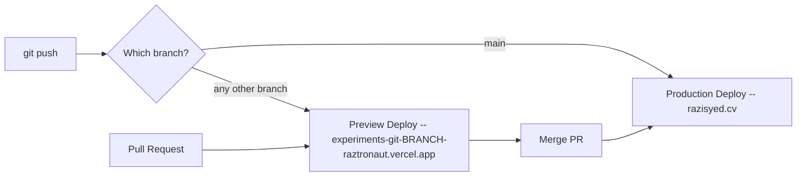
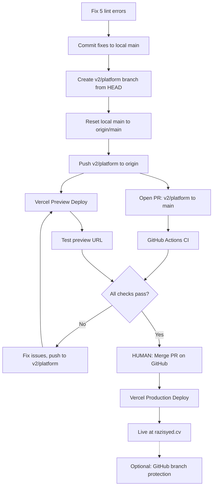

# Vercel Deployment Workflow for v2 Launch (Updated)

## How Vercel Deployments Work




- **Production** (`main` branch): Live site at razisyed.cv. Every push to `main` triggers a production build.
- **Preview** (any other branch / PR): Unique URL per commit. Same build process, same Vercel infrastructure. Each PR gets a stable preview URL that updates with every push.
- **CI checks** ([.github/workflows/ci.yml](.github/workflows/ci.yml)): Two parallel jobs on push to `main` and PRs targeting `main` -- `checks` (lint, typecheck, validate, unit tests) and `build` (full build with `.next` cache).

## The Problem Right Now

Local `main` is **57 commits ahead** of `origin/main`. If pushed directly, all 57 commits deploy to production instantly with zero preview testing. The v2 work includes:

- V2 platform infrastructure (toolkit, dev tools, config, templates)
- Homepage redesign + UI polish
- Announcing-v2 experiment (14 files, 7 sections, CRT shader, unified scroll)
- Landing-page-reveal-animation-port experiment
- **Registry V2** (Fumadocs-powered interactive docs, 58+ items, 4-step generation pipeline, `(registry)` route group with `noindex`)
- Tailwind CSS v3.4 to v4.2 migration
- CI parallelization (Storybook removed, 2-job pipeline)
- Agent docs overhaul, continual-learning hook
- Multiple bug fixes (Inversa section, GPU resource cleanup, articleSlug)

## Pre-Flight: Fix Lint Errors

The `checks` CI job will fail if lint errors aren't fixed first. Current state:

- **typecheck**: passes (clean)
- **unit tests**: 8/8 pass
- **validate:experiments**: passes (1 warning, no errors)
- **lint**: **5 errors, 9 warnings** -- must fix before pushing

Errors to fix:

1. `src/components/mdx/components.tsx:17` -- unused biome suppression comment (remove it)
2. `src/app/(registry)/registry/docs/[[...slug]]/page.tsx` -- format error + unorganized imports + unsorted attributes (run `npm run fix`)
3. `src/app/(registry)/registry/docs/layout.tsx:44` -- unsorted attributes (run `npm run fix`)

Warnings (non-blocking but should fix):

1. `src/components/ui/wave-background.tsx:266` -- `useExhaustiveDependencies` on `buildLines` (8 duplicate warnings for the same location). This is a pre-existing shared UI issue -- suppress with biome-ignore or add to deps.

All fixable with `npm run fix` + one manual suppression comment removal.

## The Plan

### Phase 1: Fix Lint Errors (commit locally)

Fix the 5 lint errors so CI passes:

```bash
npm run fix                          # auto-fix format, imports, attributes
# Manually remove the unused biome-ignore on components.tsx:17
# Suppress or fix wave-background.tsx useExhaustiveDependencies
npm run lint                         # verify clean
```

Commit the fixes to local `main` before branching.

### Phase 2: Branch Strategy -- Protect Production

Move all unpushed v2 work off `main` onto a feature branch:

```bash
git branch v2/platform               # create branch at HEAD (57+ commits)
git reset --hard origin/main          # reset local main to production state
git push -u origin v2/platform        # push branch, triggers Vercel preview
```

After this:

- `main` (local) = `origin/main` = current production (safe)
- `v2/platform` (remote) = all v2 work (gets preview URL)

### Phase 3: Open PR + Preview Deployment

Pushing `v2/platform` triggers Vercel preview build automatically. Open a PR to get the full workflow:

```bash
git checkout v2/platform
gh pr create --title "feat: v2 platform launch" --body "..."
```

The PR gives you:

- Vercel bot comment with preview URL
- GitHub Actions CI status checks (both `checks` and `build` jobs)
- A diff review of everything going to production
- Ability to push follow-up fixes (each push updates the preview)

**Build pipeline on Vercel**: `generate:posters` -> `generate:registry` (4-step: discover -> shadcn build -> post-process -> generate MDX) -> `generate:llms-txt` -> `next build`

### Phase 4: Test Preview Deployment

Test the preview URL across these areas:

- **Homepage v2** -- layout, hero, writing section, experiment grid, responsive
- **Experiments** -- all 20 experiment routes load, preview drawer works, GPU cleanup on close
- **Registry V2** -- `/registry` overview grid, `/registry/docs/`* detail pages, iframe previews for experiments, code previews for hooks/utils, install commands, search. Confirm `noindex` meta tag renders.
- **Announcing-v2** -- full scroll experience, CRT shader, all 7 sections, Lenis smooth scroll
- **Landing-page-reveal-animation-port** -- scroll animation, all phases
- **Articles** -- `/experiments/send-button/article` and `/experiments/basketball-replay-center/article` render correctly
- **Mobile** -- share preview URL to phone, test responsive layouts
- **Performance** -- Vercel Speed Insights will collect data; check for obvious regressions

### Phase 5: Fix Issues

Fix any issues found during preview testing (push to `v2/platform`). Iterate until preview is clean and CI passes.

### Phase 6: Merge to Production (HUMAN ONLY)

**The agent must NOT merge the PR or run `gh pr merge`.** This is a production deployment to razisyed.cv -- only you should pull the trigger.

Once you've personally verified the preview and CI is green:

1. Go to the PR on GitHub
2. Merge (squash or merge commit, your preference)
3. Vercel auto-deploys `main` to production at razisyed.cv
4. Verify the live site

### Phase 7: Post-Launch Guardrails (Optional)

After v2 ships:

- **GitHub branch protection** on `main`: require PR + require CI status checks to pass. Prevents future direct-to-production pushes.
- **Vercel environment variables**: configure separate Preview vs Production values if needed (Vercel dashboard > Settings > Environment Variables)

## Key Files

- [next.config.ts](next.config.ts) -- routing, headers, rewrites, build config (no `vercel.json` needed)
- [.github/workflows/ci.yml](.github/workflows/ci.yml) -- 2-job CI pipeline: `checks` + `build`
- [lefthook.yml](lefthook.yml) -- pre-commit hooks: lint-fix, typecheck, validate-experiments (parallel)
- [package.json](package.json) -- `build` runs 4 generation scripts then `next build`
- [src/app/(registry)/layout.tsx](src/app/(registry)/layout.tsx) -- registry root with `noindex` robots meta
- `.env.local` -- empty, no secrets to configure on Vercel

## Current Health Check (2026-03-11)


| Check                                  | Status                          |
| -------------------------------------- | ------------------------------- |
| `tsc --noEmit`                         | Pass                            |
| `npm run test -- --run --project unit` | 8/8 pass                        |
| `npm run validate:experiments`         | Pass (1 warning)                |
| `npm run lint`                         | **5 errors** (all auto-fixable) |
| Node version                           | 22 (`.nvmrc`)                   |
| Env vars needed on Vercel              | None                            |


## Flow Diagram




## What Changed From the Previous Plan

- Commit count: 33 -> **57**
- Added **Registry V2** to testing scope (Fumadocs docs explorer, 58+ items, `noindex` access control)
- Added **Tailwind v4 migration** to scope
- Added **pre-flight lint fix** phase (5 errors that would fail CI)
- Removed Storybook CI references (Storybook was removed in commit `87b5c14`)
- Updated CI description to reflect current 2-job parallel setup
- Added health check table with current pass/fail status
- Confirmed no env vars needed on Vercel (`.env.local` is empty)
- Noted `.nvmrc` specifies Node 22 for CI

