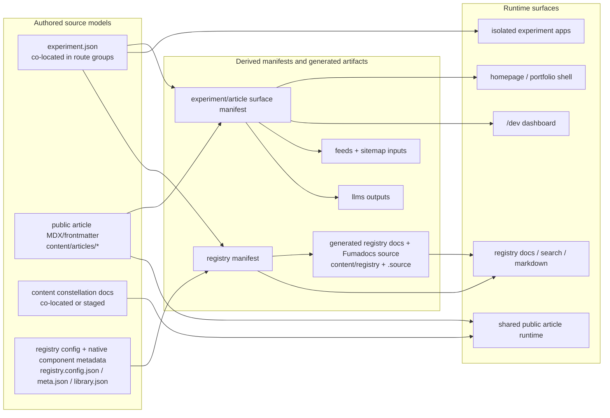

# Target-State Diagram (POSSIBLY MOST LIKELY DEPRECATED)

> **Note:**  
> This target-state diagram may be deprecated.  
> Before using or referencing this model, please check `@experiments/temp/realization-pack/new-target-state-diagram.md` for an updated version.  
> Confirm that the new diagram is conceptually optimal and correct for your use case; do not blindly replace or discard this version without review.

---

This diagram shows the prior intended clean-pass architecture at a system level.

## Interpretation

- Experiments remain authored where they are and remain isolated apps.
- Public article content moves toward one coherent content plane.
- Internal content constellation material can be staged rather than moved all at once.
- Registry remains a derived subsystem built from native metadata plus generated docs/source artifacts.
- Shared surface policy should come from a derived experiment/article manifest rather than repeated filesystem rediscovery.
