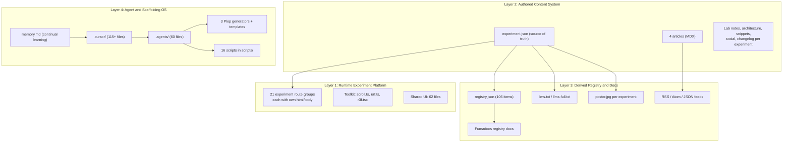
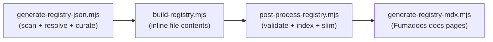
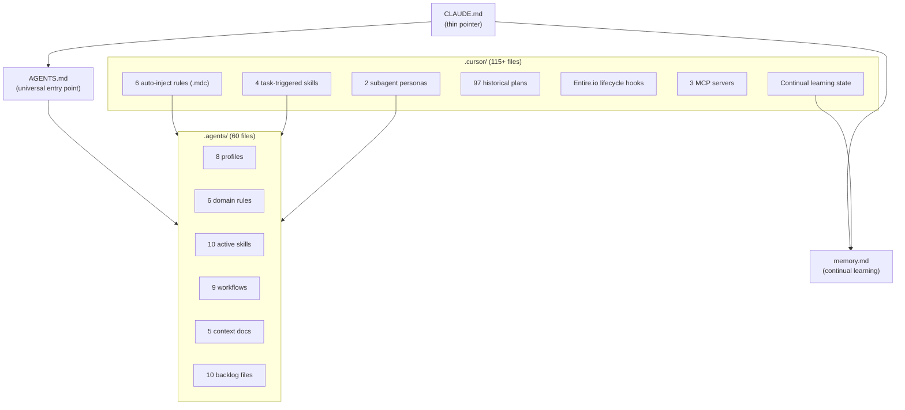
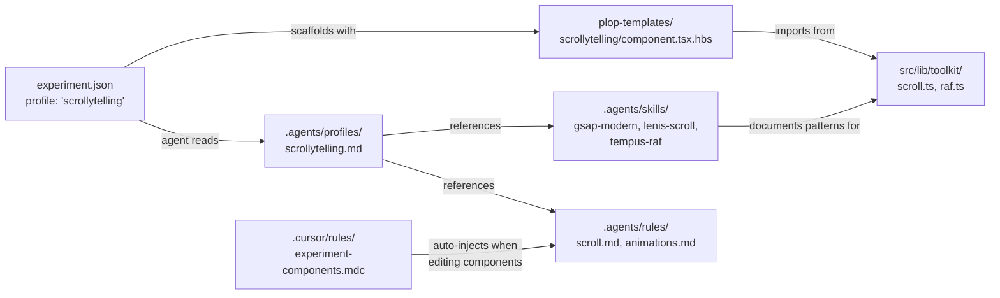
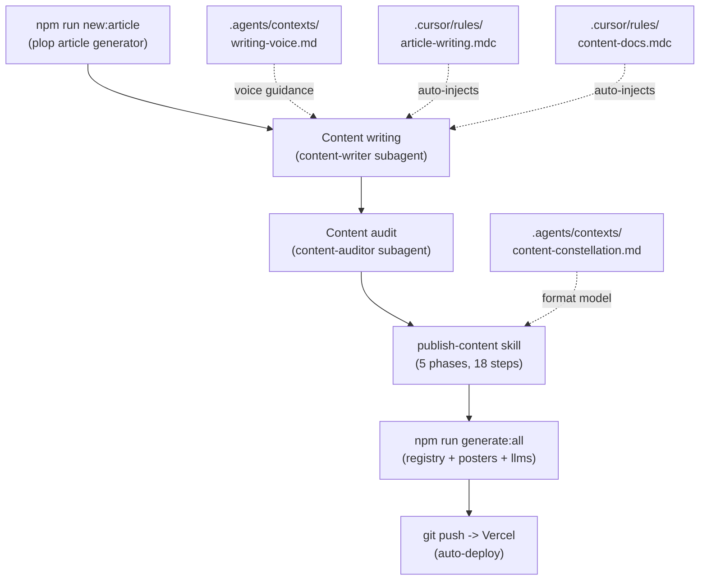
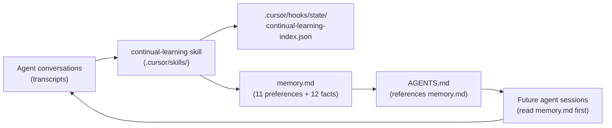

# Comprehensive System Map: Razi's AI-Native Experiments Lab

> Generated 2026-03-12. Verified against filesystem in a second pass.

## What This System Is

A creative coding portfolio at [razisyed.cv](https://www.razisyed.cv) that has evolved into a **multi-surface portfolio operating system** with deep AI-agent integration. It serves three jobs simultaneously:

1. **Public portfolio** -- showcasing 21 experiments (shaders, 3D, scroll, interaction)
2. **Internal compounding engine** -- agent-assisted development, content generation, and quality maintenance
3. **Selective publishing system** -- registry, articles, social, and documentation derived from a single experiment catalog

---

## The Four Stacked Systems

The repo is best understood as four stacked layers. Changes to one layer ripple into the others -- the central design challenge documented in the [realization pack](./README.md).

---

## Layer 1: Runtime Experiment Platform

### Experiment Isolation Model

Every experiment is a **completely isolated Next.js route group** with its own `<html>` and `<body>`. Three locations, no cross-experiment imports:

- **Route**: `src/app/experiments/(<slug>)/` -- layout.tsx, page.tsx, error.tsx, experiment.json
- **Components**: `src/components/experiments/<slug>/` -- main component + sub-components
- **Assets**: `public/experiments/<slug>/` -- videos, images, models, textures

### The 21 Experiments

| Status | Listing | Legacy | Count | Experiments |
| --- | --- | --- | --- | --- |
| shipped | public | yes | 16 | 404-not-found, basketball-replay-center, bugged-out-game-of-life-shader-experiment, cursor-depth-explorer, game-of-life-shader, gravity-physics-ui-layout, keyboard-keys, life-3d, mountain-transition, non-euclidean-hyperbolic-workspace, rabbithole-chat-gallery-explore, rabbithole-chat-preloader, send-button, shader-landing, terminal-cat, transit-airport-split-flap-display |
| shipped | public | no | 1 | velocity-responsive-design (the V2 poster child) |
| shipped | dev | no | 1 | airplanes |
| wip | dev | no | 2 | announcing-v2, 3d-crt-display |
| shipped | registry | yes | 1 | test (stub) |

**Totals**: 21 experiments. 17 have `legacy: true`. 17 are shipped+public. 19 are shipped. 2 are WIP.

**Profile distribution**: r3f-shader (6), interaction (4), dom-effect (3), mixed (3), r3f-scene (2), scrollytelling (1), web-audio (1), blank (1).

### Toolkit Integration Layer (`src/lib/toolkit/`)

5 files forming the unified animation infrastructure that wires Lenis, GSAP, Tempus, and R3F into a single RAF loop:

- **`scroll.ts`** -- `createUnifiedScroll()`: Lenis (priority -1) + GSAP (priority 0) on Tempus RAF. Reference-counted GSAP binding. Patches `ScrollTrigger.create` for auto-cleanup. Debug mode exposes `window.__lenis`, `window.__scrollToSection`, `window.__scrollToProgress`.
- **`raf.ts`** -- Tempus re-export (unified RAF manager with priority system).
- **`r3f.tsx`** -- `ExperimentCanvas`: Canvas wrapper with optional Tempus render at priority 1, adaptive DPR, error boundary.
- **`index.ts`** -- Barrel export (Tempus, createUnifiedScroll). ExperimentCanvas intentionally excluded to avoid pulling R3F into non-3D bundles.
- **`scroll-debug.d.ts`** -- Ambient type declarations for debug globals.

**Tempus priority chain** (verified in source):
- -1: Lenis (scroll input processing, runs first)
- 0: GSAP (animation updates, default priority)
- 1: Three.js rendering (if applicable, runs last)

### Shared UI Components (`src/components/ui/`)

62 files including: shadcn primitives (badge, button, card, drawer, tabs, tooltip), custom cursor system (`cursor/`), location/weather widgets (`location/`), experiment display (grid cards, list items, preview drawer, swipe tutorial), site-level (AIWidget, ArticleLayout, ContentSection, GrainOverlay, ThemeAwareWaves, SiteFooter, ExperimentNav), and analytics.

### Main App Routes

| Route | Purpose |
| --- | --- |
| `(main)/` | Homepage -- hero + ContentSection (experiments + writing) + SiteFooter + AIWidget |
| `(main)/dev/` | Dev dashboard (dev/preview only, 404 in production) -- experiment status, surfaces, completeness |
| `(registry)/registry/docs/` | Fumadocs-powered registry documentation |
| `(collected-preview)/collected/[slug]` | Preview pages for 14 collected (ported Codegrid) components |
| `(mdx-preview)/mdx-preview/[slug]` | MDX component preview |
| Each `experiments/(slug)/` | Isolated experiment runtime |

---

## Layer 2: Authored Content System

### experiment.json (Source of Truth)

Lives inside each experiment's route group. Fields:

- **Identity**: title, slug, description, created
- **Classification**: profile (8 values), complexity (beginner/intermediate/advanced), tags[], tech[]
- **Visibility**: status (wip/shipped), listing (public/dev/registry), legacy (boolean)
- **Media**: video, image
- **Content**: updated, articleLenses[], inspiration[], related[]

### The Visibility Truth Table

| status | listing | Homepage | Registry | llms.txt | Posters | Articles | Sitemap | SEO |
| --- | --- | --- | --- | --- | --- | --- | --- | --- |
| shipped | public | yes | yes | yes | yes (if video) | yes | yes | indexed |
| shipped | dev | dev/preview only | yes | yes | no | hidden publicly | no | noindex |
| shipped | registry | no | yes | no | no | no | no | noindex |
| wip | any | dev/preview only | no | no | no | no | no | noindex |

### Articles (4 exist)

Dual MDX system: **Fumadocs** for registry docs, **next-mdx-remote** for articles.

- **basketball-replay-center** -- gold-standard reference implementation
- **404-not-found**
- **non-euclidean-hyperbolic-workspace** -- 5 interactive demos
- **velocity-responsive-design**

### Content Constellation (6-format model)

Each experiment can have: article (content.mdx), lab note, architecture doc, snippet, social content (X thread + launch post), and changelog. Scaffolded via `npm run new:article`. Currently only 4 experiments have articles; schema fields `inspiration` and `related` are empty across all experiments. Only 1 experiment has an `updated` field (velocity-responsive-design).

### MDX Component Library (`src/components/mdx/`)

18 files at top level: InteractiveWidget, LiveDemo, SandpackDemo, Slideshow, BeforeAfterImage, Callout, CodeBlock, CodeStep, Details, Fullbleed, controls (Range, Checkbox, Switch, Radio), and more. Plus `controls/` and `previews/` subdirectories.

---

## Layer 3: Derived Registry and Docs

### Registry Pipeline (4-step, `scripts/`)

- **Step 1**: Scans 6 source categories (experiments, shared UI, collected, hooks, MDX, utilities). Resolves all local imports via BFS. Applies curation from `registry.config.json`. Outputs `registry.json`.
- **Step 2**: Reads registry.json, inlines file contents, writes per-item JSON to `public/registry/<name>.json`.
- **Step 3**: Validates, generates `index.json` and `index-slim.json` (lightweight grid with tags, tech, poster, video).
- **Step 4**: Generates MDX documentation pages into `content/registry/` using Fumadocs components. Preserves hand-authored MDX.

### Registry Output (106 items across 7 categories)

| Category | Type | Count |
| --- | --- | --- |
| components | registry:component | 43 |
| experiments | registry:block | 18 |
| mdx | registry:component/block | 16 |
| collected | registry:block | 14 |
| hooks | registry:hook | 12 |
| utilities | registry:lib | 2 |
| styles | registry:style | 1 |

5 featured experiments: send-button, 404-not-found, keyboard-keys, transit-airport-split-flap-display, gravity-physics-ui-layout.

### Other Generation Scripts

- **`generate-posters.mjs`** -- ffmpeg first-frame extraction for shipped+public experiments with video
- **`generate-llms-txt.mjs`** -- llms.txt v1.1.1 spec for AI consumption (skips wip and registry-only)
- **`validate-experiments.mjs`** -- schema validation for all experiment.json (pre-commit hook)
- **`capture.mjs`** -- Playwright screenshot capture, OG image generation
- **`optimize-videos.mjs`** -- ffmpeg video compression (>2MB, crf 26)

Supporting scripts: `create-experiment.mjs`, `create-article.mjs`, `create-collected.mjs` (non-interactive plop wrappers), `delete-experiment.mjs`, `delete-article.mjs`, `generate-registry.mjs` (legacy monolithic generator), `patch-r3f-perf.mjs` (postinstall Turbopack fix). **16 scripts total** in `scripts/`.

### Build Pipeline

`npm run build` = `generate:posters && generate:registry && generate:llms-txt && next build`

Same pipeline runs identically in preview and production. Vercel auto-deploys every merge to `main`.

---

## Layer 4: Agent and Scaffolding Operating System

This is the AI-native layer that makes the system self-documenting and agent-operable. It's distributed across three locations: `.agents/` (universal, tool-agnostic), `.cursor/` (Cursor IDE-specific), and root files (AGENTS.md, CLAUDE.md, memory.md).

### How Agent Context Flows

### .agents/ Directory (60 files) -- Universal Agent Knowledge Base

**Profiles** (8 files in `.agents/profiles/`) -- Activated by the `"profile"` field in experiment.json:

| Profile | Signature Pattern |
| --- | --- |
| blank | Clean slate, no opinions |
| r3f-scene | Performance-obsessed 3D scenes, ExperimentCanvas, useFrame, adaptive DPR |
| r3f-shader | Fullscreen quad, ShaderMaterial, GLSL utilities, mouse interaction |
| scrollytelling | Lenis + GSAP, createUnifiedScroll, pinned sections, timeline sequencing, FOUC prevention |
| interaction | Motion + @use-gesture, spring physics, drag/magnetic/squeeze effects |
| dom-effect | VFX.js, Motion layout, CSS-only effects, content readability first |
| web-audio | AudioContext on gesture, DynamicsCompressor, synthesis patterns, concurrency limiting |
| mixed | Layer-cake pattern (fixed Canvas + scrolling DOM), Zustand bridge, Tempus priority chain, device adaptation |

**Rules** (6 files in `.agents/rules/`) -- Domain coding standards:

- `animations.md` -- GSAP/Motion timing, easing, motion vocabulary diversity (10 techniques), FOUC prevention
- `experiments.md` -- Isolation, component decomposition (120/60-90/300 line limits), section pattern
- `performance.md` -- Frame budget (16.67ms), compositor-only animation, bundle optimization, disposal
- `r3f.md` -- useFrame best practices, disposal, instancing, DPR, external frame loop
- `scroll.md` -- createUnifiedScroll canonical pattern, MCP scroll workarounds, performance
- `shaders.md` -- ShaderMaterial pattern, GLSL performance, always dither, visual honesty

**Skills** (10 active in `.agents/skills/`) -- Library-specific patterns and procedures:

| Skill | Maps To |
| --- | --- |
| gsap-modern | GSAP 3.14 + @gsap/react + ScrollTrigger + Tempus |
| lenis-scroll | Lenis 1.3 + Tempus + createUnifiedScroll |
| motion-react | Motion 12.x (Framer Motion) |
| r3f-core | R3F 9.4 + Drei 10.7 + Zustand + postprocessing |
| shader-authoring | GLSL utilities, ShaderMaterial, onBeforeCompile, fullscreen quad |
| tempus-raf | Tempus 1.0-dev.17, priority system, TempusFrameDriver |
| visual-qa | 8-category visual review for AI agents who can't see output |
| porting-demos | 10-phase port pipeline: source analysis -> scaffold -> transform -> CSS fidelity -> validate |
| quick-component | Lightweight port to collected registry (Mode A: single component, Mode B: index entire library) |
| vercel-react-best-practices | 57 rules across 8 categories from Vercel engineering |

_Disabled_: `parallel-orchestration` -- Multi-agent decomposition with domain briefs, handoff summaries, 4 verification agents. Built but not in active use.

**Workflows** (9 files in `.agents/workflows/`) -- Step-by-step procedures:

| Workflow | Maps To |
| --- | --- |
| new-experiment | Plop generator (experiment) |
| develop-experiment | Day-to-day experiment work |
| publish-experiment | Content constellation generation (5 phases, 18 steps) |
| deploy | Vercel auto-deploy pipeline |
| cleanup-experiment | delete-experiment script |
| add-experiment-component | Adding components within experiments |
| add-experiment-assets | Adding static assets |
| visual-qa | Full visual QA procedure |
| automation-ops | Codex automation review/merge flow |

**Contexts** (5 files in `.agents/contexts/`):

- `architecture.md` -- Route group pattern, experiment.json schema, truth table, template system
- `toolkit.md` -- Complete library inventory (Tier 1/2/3), dev tools suite, publishing pipeline
- `content-constellation.md` -- 6-format content model, lifecycle, tooling inventory
- `writing-voice.md` -- RNDR Realm + Maxime Heckel voice, lenses, section building blocks
- `automation-system.md` -- Codex automation categories, prompt templates, quality bar

**Backlog** (10 files in `.agents/backlog/`) -- 8 priority tiers with ~69 pending items:

- T1: Infrastructure (5 items -- CI, tests, Lighthouse)
- T2: Content/Registry (11 items -- articles for 15 experiments, schema backfill, component collection)
- T3: Agent Docs (3 items -- cross-ref, consistency, report)
- T4: Announcing V2 (10 items -- the showcase experiment)
- T5: Toolkit/Platform (11 items -- legacy upgrades, MCP capture, scroll docs)
- T6: Deferred (5 items -- known bugs, intentionally deprioritized)
- T7: Nice-to-Have (10 items -- Tailwind v4, view transitions)
- T8: Architecture Restructuring (14 items across 4 phases -- the realization pack subject)

### .cursor/ Directory (115+ files) -- Cursor IDE Integration

**Auto-inject rules** (6 .mdc files in `.cursor/rules/`):

| Rule | Glob Trigger | Injects |
| --- | --- | --- |
| experiment-metadata | `**/experiment.json` | Schema, truth table, enum values |
| article-writing | `**/article/content.mdx` | Voice, lenses, MDX wiring rules |
| experiment-components | `src/components/experiments/**/*.tsx` | Size limits, decomposition triggers, animation standards |
| content-docs | `src/app/experiments/**/docs/*.md` | Format templates (lab note, architecture, snippet, social, changelog) |
| generation-scripts | `scripts/generate-*.mjs` | Pipeline architecture, skip logic, curation layer |
| registry-curation | `**/registry.config.json` | Config schema, downstream impact |

**Task-triggered skills** (4 in `.cursor/skills/`):

- publish-content -- 5-phase content constellation workflow
- audit-content -- 6-step content health scanner
- run-generation -- Pipeline operations guide
- continual-learning -- Incremental knowledge extraction from transcripts to memory.md

**Subagent personas** (2 in `.cursor/agents/`):

- content-writer -- Voice-first writing persona (RNDR Realm + Maxime Heckel blend)
- content-auditor -- Scanning/reporting persona for content health

**Plans archive** (97 .plan.md files in `.cursor/plans/`) -- Full evolutionary history categorized as: Platform V2 (~15), Agent Config (~5), Experiment-Specific (~15), Performance (~4), Registry (~8), Content/SEO (~8), Metadata System (~5), Infrastructure/Tooling (~10), Testing (~5), Article/MDX (~5), Other (~10).

**Infrastructure**:

- `hooks.json` -- 7 Entire.io lifecycle hooks (beforeSubmitPrompt, preCompact, sessionEnd, sessionStart, stop, subagentStart, subagentStop) for session checkpointing
- `mcp.json` -- 3 MCP servers: pinchtab (accessibility-tree browser), browser-devtools (Playwright), mcp-three (Three.js tooling)
- `hooks/state/` -- Continual learning incremental state (90+ transcript index entries)

### Plop Scaffolding System (`plopfile.js`)

Three generators with interactive + non-interactive (AI agent) modes:

| Generator | npm Script | Non-Interactive | Creates |
| --- | --- | --- | --- |
| experiment | `new:experiment` | `new:experiment:auto -- --name --profile --toolkit --leva` | 7 files across 3 locations (profile-specific templates with conditional toolkit/leva) |
| article | `new:article` | `new:article:auto -- --name` | 8 files (content.mdx, page.tsx, components/index.ts, 5 doc templates) |
| collected | `new:collected` | `new:collected:auto -- --name --source --author --license` | 3 files (component.tsx, meta.json, styles.css) |

**Deletion**: `delete:experiment` (all 4 locations), `delete:article` (article + docs only).

**8 profile templates** generate different boilerplate: blank, r3f-scene, r3f-shader, scrollytelling, interaction, dom-effect, web-audio, mixed. Each has conditional Handlebars for toolkit and leva integration.

---

## How Everything Cross-References

### Profile -> Template -> Skill -> Rule Chain

Every profile in experiment.json maps to:

1. A **plop template** that scaffolds the initial code
2. A **profile doc** in `.agents/profiles/` that agents read before working
3. Specific **skills** for the libraries that profile uses
4. Specific **rules** for the domain (animations, R3F, scroll, shaders)
5. **Cursor rules** that auto-inject context when editing relevant files
6. **Toolkit modules** that the generated code imports

### Content Lifecycle Chain

### Continual Learning Loop

---

## Current State Assessment

### What's Working Well

- **Experiment isolation model** is solid -- per-experiment HTML/body, three-location rule, no cross-imports
- **Toolkit layer** (scroll.ts, raf.ts, r3f.tsx) successfully unifies Lenis + GSAP + Tempus + R3F under one priority chain
- **Agent documentation** is comprehensive -- 60 files in `.agents/`, 8 profiles, 10 skills, 9 workflows, 5 contexts
- **Plop scaffolding** generates correct boilerplate for all 8 profiles with toolkit/leva conditionals
- **Registry pipeline** (4-step) generates shadcn-compatible registry with 106 items across 7 categories
- **Visibility truth table** (status x listing) cleanly governs all surface visibility
- **Continual learning** loop maintains persistent memory across sessions (11 preferences + 12 facts in memory.md)
- **Pre-commit hooks** (lefthook) enforce lint, typecheck, and experiment validation
- **97 plan files** provide full evolutionary history for context

### What's In Progress / Known Gaps

- **Articles**: Only 4 of 21 experiments have articles. 15 experiments need content generation (T2 backlog).
- **Schema completeness**: `inspiration` and `related` fields are empty across ALL experiments. `updated` only on 1.
- **Dual MDX system**: Articles use next-mdx-remote while registry docs use Fumadocs. The realization pack recommends unifying on Fumadocs.
- **Legacy boundary**: 17 experiments are `legacy: true` and frozen. Only 4 experiments are V2-era non-legacy (velocity-responsive-design, airplanes, announcing-v2, 3d-crt-display).
- **Announcing V2** (the showcase experiment): WIP, 10 items in T4 backlog.
- **Architecture restructuring** (T8): 14 items across 4 phases. The realization pack has completed investigation (14+ docs, two passes) but code restructuring has not started.
- **Build warnings**: 63 warnings in `next build` (classified but not triaged).
- **No E2E tests**: Playwright exists for capture only, not test automation. Lighthouse CI and integration tests are T1 backlog items.
- **Parallel orchestration**: Disabled skill -- was built but not in active use.

### The Architecture Restructuring Vision (Realization Pack)

The [realization pack](./) documents the planned restructuring in 14+ docs across two passes. Key decisions:

**Adopted**: Per-experiment isolation stays. `experiment.json` stays in route groups. Status x listing stays. Fumadocs for articles (eventually). Registry consolidation.

**Rejected**: Universal `WorkEntry` model. Legacy-wide modernization sweep. Wholesale content relocation.

**Target architecture** (from `14-target-state-diagram.md`): experiment.json + article MDX feed into a **derived experiment/article surface manifest**, which feeds homepage, /dev, feeds, and llms. Registry config feeds registry manifest and generated docs. Native sources stay canonical; interpretation gets centralized.

**Execution state**: Investigation complete (Gates 0-1 of 4). Foundation work (Gate 2), content migration (Gate 3), and registry consolidation (Gate 4) have not started. The restructuring work is sequenced in 8 slices in `12-execution-board.md`.

### Automation and Deep-Pass System

`docs/automation-deep-pass-prompts.md` provides 11 copy-paste prompts for systematic reviews: automation audit, publish readiness, registry drift, file diet, architectural docs, performance, test gaps, backlog shaping, quality spotlight, repo assist synthesis, and changelog consolidation. Plus a GPT-5.4 mega-prompt (`docs/gpt-5.4-deep-repo-audit-prompt.md`) for whole-repo structural audits.

The automation-ops workflow (`.agents/workflows/automation-ops.md`) and automation-system context (`.agents/contexts/automation-system.md`) define how automated agent runs are reviewed, merged, and improved.

---

## Cross-Reference Index

### Script -> Workflow -> Skill Mapping

| npm Script | Workflow Doc | Related Skill(s) |
| --- | --- | --- |
| `new:experiment` | new-experiment.md | (profile-specific skills) |
| `new:experiment:auto` | new-experiment.md | (profile-specific skills) |
| `new:article` | publish-experiment.md | publish-content |
| `delete:experiment` | cleanup-experiment.md | -- |
| `generate:registry` | deploy.md | run-generation |
| `generate:posters` | deploy.md | run-generation |
| `generate:llms-txt` | deploy.md | run-generation |
| `validate:experiments` | deploy.md | -- |
| `capture` | visual-qa.md | visual-qa |
| `optimize:videos` | add-experiment-assets.md | -- |
| `dev` | develop-experiment.md | (all library skills) |
| `build` | deploy.md | run-generation |

### Library -> Skill -> Rule -> Profile Mapping

| Library | Version | Skill | Rule | Profiles Using It |
| --- | --- | --- | --- | --- |
| GSAP | 3.14 | gsap-modern | animations.md | scrollytelling, mixed |
| Lenis | 1.3 | lenis-scroll | scroll.md | scrollytelling, mixed |
| Tempus | 1.0-dev.17 | tempus-raf | (in scroll.md) | scrollytelling, mixed, r3f-scene, r3f-shader |
| Motion | 12.x | motion-react | animations.md | interaction, dom-effect |
| R3F | 9.4 | r3f-core | r3f.md | r3f-scene, r3f-shader, mixed |
| Three.js | 0.182 | r3f-core | r3f.md, shaders.md | r3f-scene, r3f-shader, mixed |
| GLSL | -- | shader-authoring | shaders.md | r3f-shader, mixed |
| Web Audio | native | -- | -- | web-audio |

### MCP Server -> Use Case Mapping

| MCP Server | Primary Use | Used By |
| --- | --- | --- |
| pinchtab | Accessibility-tree browser automation, visual QA | visual-qa skill/workflow |
| browser-devtools | Playwright debugging, ARIA snapshots, profiling | visual-qa skill/workflow, develop-experiment |
| mcp-three | Three.js scene inspection | R3F experiments |
| context7 | Library documentation lookup | Any library integration |

### .cursor/ Rule -> .agents/ Doc Mapping

| Cursor Rule (auto-inject) | Agents Doc (referenced) |
| --- | --- |
| experiment-metadata.mdc | contexts/architecture.md |
| article-writing.mdc | contexts/writing-voice.md, contexts/content-constellation.md |
| experiment-components.mdc | rules/experiments.md, rules/animations.md, profiles/*.md |
| content-docs.mdc | contexts/content-constellation.md |
| generation-scripts.mdc | contexts/toolkit.md |
| registry-curation.mdc | contexts/architecture.md |

---

## Summary Statistics

| Dimension | Count |
| --- | --- |
| Total experiments | 21 |
| Shipped experiments | 19 |
| Legacy (frozen) | 17 |
| V2-era experiments (non-legacy) | 4 |
| Articles written | 4 |
| Registry items | 106 across 7 categories |
| Collected components | 14 |
| Shared UI files | 62 |
| MDX components | 18 |
| Plop generators | 3 |
| Profile templates | 8 |
| Scripts in scripts/ | 16 |
| .agents/ files | 60 |
| .cursor/ files | 115+ |
| Historical plans | 97 |
| Backlog items | ~69 across 8 tiers |
| Agent skills (active) | 10 |
| Agent workflows | 9 |
| Agent profiles | 8 |
| Agent context docs | 5 |
| Cursor auto-inject rules | 6 |
| Cursor skills | 4 |
| Cursor subagents | 2 |
| MCP servers | 3 |
| Memory entries | 23 (11 preferences + 12 facts) |
| npm dependencies | 61 production + 28 dev |
| Deep-pass prompts | 12 |
| Realization pack docs | 14+ (two passes) |
