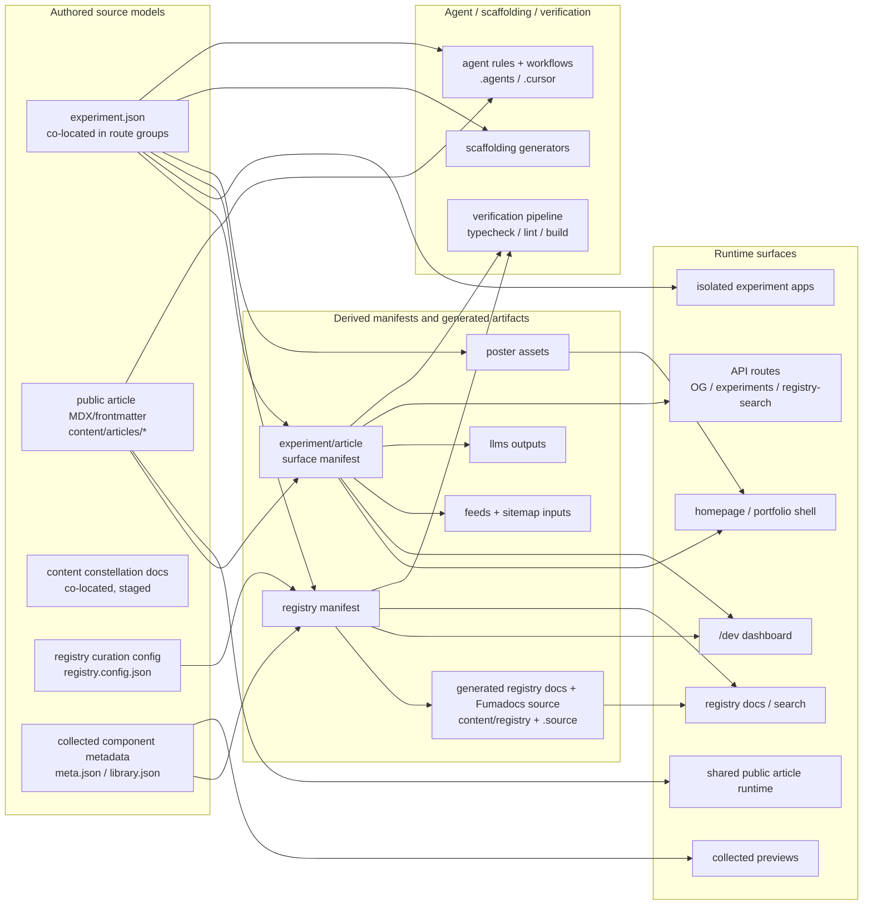

# Target-State Diagram

This diagram shows the intended clean-pass architecture at a system level, grounded in the realization-pack findings.

## Reading the diagram

**Four layers, left to right:**

1. **Authored** -- domain-native source models that humans and agents write. Each stays in its own canonical location. They are never merged into one universal authored type (doc 03, 05).
2. **Derived** -- manifests and generated artifacts produced from authored sources. The surface manifest `S` is the central hub that replaces today's ad-hoc rediscovery of experiment/article eligibility (doc 03).
3. **Runtime** -- the surfaces visitors, crawlers, agents, and developers actually hit.
4. **Tooling** -- scaffolding, agent knowledge, and verification. Shown as a first-class layer because path changes that skip it are incomplete migrations (doc 07).

## Key design decisions reflected

### Experiments remain apps (doc 00, doc 10)

`E --> X` is a direct edge. Experiments do not pass through derived manifests to reach their own runtime. Each experiment is an isolated Next.js route group with its own `<html>/<body>`, CSS/JS containment, and optional custom scroll/WebGL.

### Surface manifest is the derivation hub (doc 03)

`S` joins `experiment.json` and article metadata to produce the shared eligibility facts that homepage, `/dev`, feeds, sitemap, llms, and API routes all need. This replaces the current pattern where each consumer rediscovers experiment/article presence independently.

### Articles are the sole first-pass content migration target (doc 06)

`A --> W` is the only authored-content-to-runtime edge. Content constellation docs (`C`) have no runtime edge in this diagram because doc 06 decides they stay co-located in the first pass. Public articles move to `content/articles/*` and a shared Fumadocs-backed article runtime.

### Constellation docs are staged, not abandoned (doc 06)

`C` appears as an authored source model to acknowledge the 20 existing constellation markdown files across 4 experiments. They are real and valuable. They just don't migrate in the first pass.

### Registry curation and collected metadata are separate source models (doc 03)

`RC` (editorial policy: featured, hidden, overrides) and `CC` (structural component truth: meta.json, library.json) feed the registry manifest independently. They have different authoring workflows and change frequencies.

### Registry docs need both manifest and generated source (doc 08)

`M --> Y` provides metadata and search data. `G --> Y` provides rendered Fumadocs page content. Both edges are needed because registry docs consume the raw manifest for navigation/search and the generated MDX for page rendering.

### Dev dashboard consumes both pipelines

`S --> D` gives the dev dashboard experiment/article eligibility. `M --> D` gives it registry health. Together they let `/dev` be the single truth surface without recomputing truth itself (doc 03).

### Poster generation is a derived artifact (doc 08)

`E --> P --> H` captures the ffmpeg-based poster pipeline that extracts first frames from experiment preview videos. Posters are tracked generated artifacts with stale-artifact risk.

### Collected previews are a distinct runtime surface (doc 10)

`CC --> CP` reflects the iframe-isolated preview routes at `/collected/:slug` that exist outside the experiment runtime tree.

### Tooling migrates with the architecture (doc 07)

Scaffolding generators (`SC`), agent rules/workflows (`AG`), and the verification pipeline (`VR`) all depend on authored source models and derived manifests. The migration rule from doc 07: no path migration is complete until runtime code, scaffolding, agent tooling, and human docs are all updated together.

## What the diagram intentionally omits

- **Experiment source code and assets** (`src/components/experiments/`, `public/experiments/` media). These are part of X but are runtime implementation, not metadata/content flow.
- **Proxy layer** (`src/proxy.ts`). Handles canonical host redirect, trailing-slash removal, and Accept: text/markdown content negotiation (doc 04). Architecturally important but operates as transparent infrastructure between derived and runtime, not a data-flow node.
- **Telemetry split** (doc 10). Main shell uses Vercel Analytics + Speed Insights + Umami; experiments use Umami only. Important to preserve during layout standardization but not a data-flow concern.
- **CSS dependency from article runtime to experiment styles** (doc 13 risk register). Articles currently depend on `experiments.css` for typography/TOC styling. This implicit coupling must be resolved during migration but is a migration risk, not target architecture.
- **MDX component library** (doc 02). The 15+ reusable MDX components (BeforeAfterImage, Slideshow, LiveDemo, control primitives, etc.) must survive article migration. They bridge `A` and `W` but are implementation detail of the article runtime.
- **Search unification** (doc 05). Extending Fumadocs search to cover both registry docs and public articles is a documented future goal, not first-pass scope.
- **Legacy vs v2 boundary** (doc 09). The 17 legacy experiments and 4 v2 experiments are all represented as X. The v2/legacy distinction is a governance policy, not a separate runtime surface.

## Relationship to the execution board

This diagram represents the exit state of the full execution sequence (doc 12 slices 0-7):

- Slices 0-2 (foundation): establish the worktree, verify baseline, apply hygiene fixes
- Slice 3: build the surface manifest `S`
- Slice 4: migrate public articles, establishing `A --> W`
- Slice 5: consolidate the registry pipeline (`RC`/`CC --> M --> G --> Y`)
- Slice 6: update scaffolding and agent tooling (`SC`, `AG`)
- Slice 7: finalize verification pipeline (`VR`)
